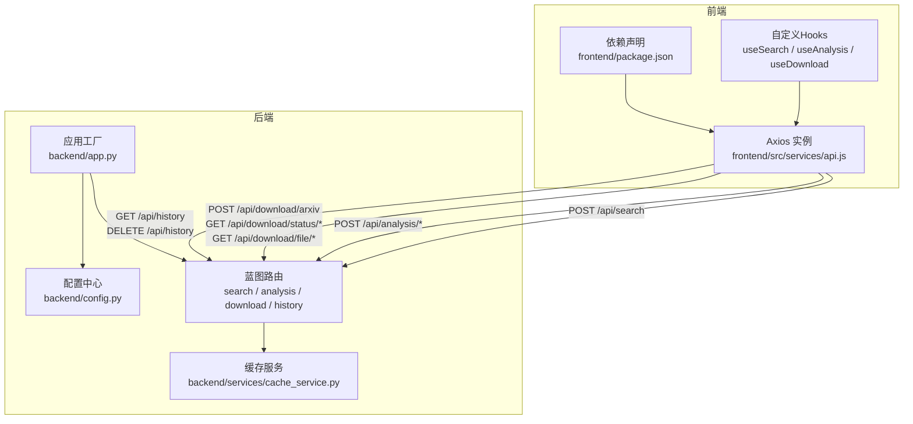
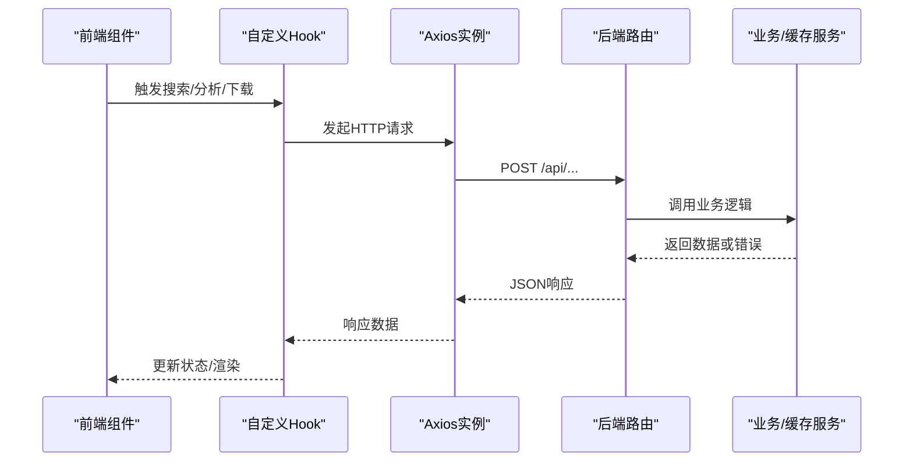
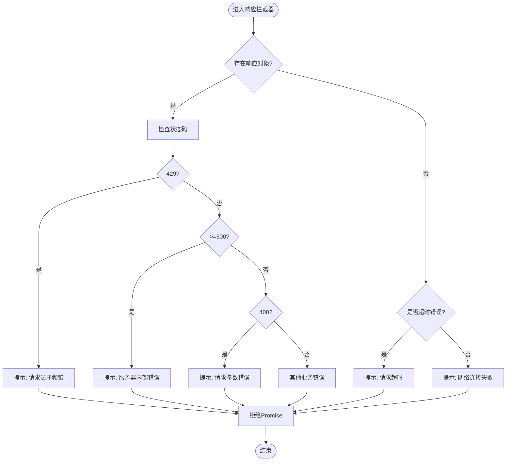
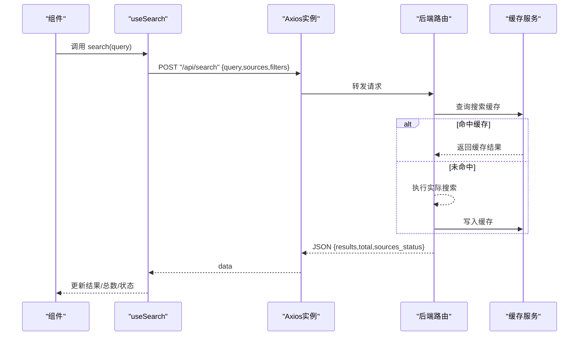
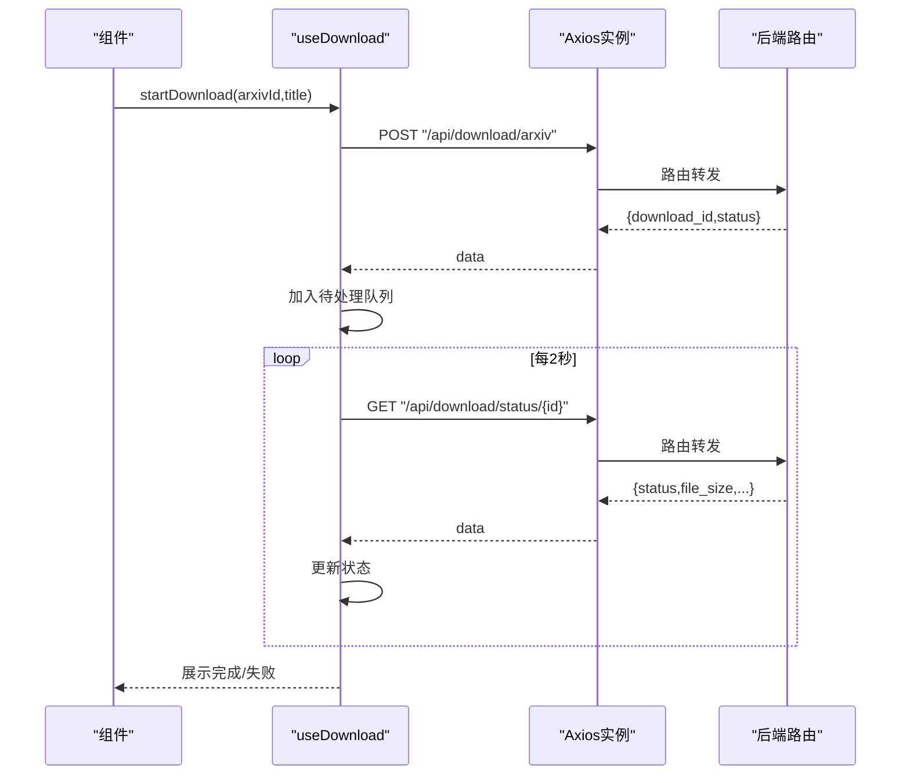
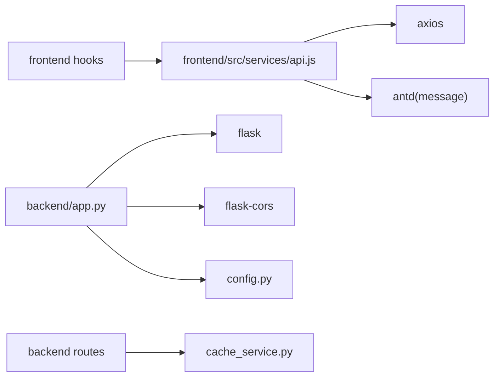

# API集成层

<cite>
**本文引用的文件**
- [frontend/src/services/api.js](file://frontend/src/services/api.js)
- [frontend/src/hooks/useSearch.js](file://frontend/src/hooks/useSearch.js)
- [frontend/src/hooks/useAnalysis.js](file://frontend/src/hooks/useAnalysis.js)
- [frontend/src/hooks/useDownload.js](file://frontend/src/hooks/useDownload.js)
- [backend/app.py](file://backend/app.py)
- [backend/config.py](file://backend/config.py)
- [backend/routes/search.py](file://backend/routes/search.py)
- [backend/routes/analysis.py](file://backend/routes/analysis.py)
- [backend/routes/download.py](file://backend/routes/download.py)
- [backend/routes/history.py](file://backend/routes/history.py)
- [backend/services/cache_service.py](file://backend/services/cache_service.py)
- [frontend/package.json](file://frontend/package.json)
- [README.md](file://README.md)
- [run.sh](file://run.sh)
- [.env.example](file://.env.example)
</cite>

## 目录
1. [简介](#简介)
2. [项目结构](#项目结构)
3. [核心组件](#核心组件)
4. [架构总览](#架构总览)
5. [详细组件分析](#详细组件分析)
6. [依赖关系分析](#依赖关系分析)
7. [性能考量](#性能考量)
8. [故障排查指南](#故障排查指南)
9. [结论](#结论)
10. [附录](#附录)

## 简介
本文件面向前端与后端开发者，系统化梳理本项目的API集成层设计与实现，重点覆盖：
- HTTP客户端封装与Axios实例配置
- 请求/响应拦截器与错误处理策略
- 超时控制与重试机制现状
- 认证与请求头管理、CORS处理
- API调用流程、错误处理流程与网络请求状态流转
- API版本管理、缓存策略与离线处理思路
- 测试策略、Mock数据与开发环境配置

## 项目结构
前端采用React + Vite + Ant Design + Axios；后端采用Flask，统一通过“/api”前缀暴露REST接口，并在开发环境下允许Vite本地服务跨域。

图表来源
- [frontend/src/services/api.js](file://frontend/src/services/api.js#L1-L32)
- [frontend/src/hooks/useSearch.js](file://frontend/src/hooks/useSearch.js#L1-L74)
- [frontend/src/hooks/useAnalysis.js](file://frontend/src/hooks/useAnalysis.js#L1-L86)
- [frontend/src/hooks/useDownload.js](file://frontend/src/hooks/useDownload.js#L1-L78)
- [backend/app.py](file://backend/app.py#L21-L67)
- [backend/config.py](file://backend/config.py#L15-L84)
- [backend/routes/search.py](file://backend/routes/search.py#L10-L27)
- [backend/routes/analysis.py](file://backend/routes/analysis.py#L10-L65)
- [backend/routes/download.py](file://backend/routes/download.py#L14-L97)
- [backend/routes/history.py](file://backend/routes/history.py#L10-L32)
- [backend/services/cache_service.py](file://backend/services/cache_service.py#L30-L86)

章节来源
- [README.md](file://README.md#L1-L409)
- [frontend/package.json](file://frontend/package.json#L1-L24)
- [backend/app.py](file://backend/app.py#L21-L67)

## 核心组件
- Axios实例封装：统一基础URL、超时、默认请求头，集中处理响应数据与错误提示。
- 自定义Hooks：对各API进行语义化封装，负责状态管理、错误收集与轮询刷新。
- 后端路由：以Blueprint组织，统一前缀“/api”，提供搜索、分析、下载、历史等接口。
- 缓存服务：基于SQLite的查询结果与分析结果缓存，带过期清理逻辑。
- 配置中心：读取环境变量与运行时配置，统一管理端口、密钥、速率限制、默认行为等。

章节来源
- [frontend/src/services/api.js](file://frontend/src/services/api.js#L4-L29)
- [frontend/src/hooks/useSearch.js](file://frontend/src/hooks/useSearch.js#L19-L50)
- [frontend/src/hooks/useAnalysis.js](file://frontend/src/hooks/useAnalysis.js#L11-L57)
- [frontend/src/hooks/useDownload.js](file://frontend/src/hooks/useDownload.js#L9-L64)
- [backend/routes/search.py](file://backend/routes/search.py#L10-L27)
- [backend/routes/analysis.py](file://backend/routes/analysis.py#L10-L65)
- [backend/routes/download.py](file://backend/routes/download.py#L14-L97)
- [backend/routes/history.py](file://backend/routes/history.py#L10-L32)
- [backend/services/cache_service.py](file://backend/services/cache_service.py#L30-L86)
- [backend/config.py](file://backend/config.py#L15-L84)

## 架构总览
前后端通过REST API交互，前端通过Axios实例发起请求，后端路由根据请求路径分发至对应服务层，必要时调用缓存服务与数据库。

图表来源
- [frontend/src/hooks/useSearch.js](file://frontend/src/hooks/useSearch.js#L19-L50)
- [frontend/src/hooks/useAnalysis.js](file://frontend/src/hooks/useAnalysis.js#L11-L57)
- [frontend/src/hooks/useDownload.js](file://frontend/src/hooks/useDownload.js#L9-L48)
- [frontend/src/services/api.js](file://frontend/src/services/api.js#L10-L29)
- [backend/routes/search.py](file://backend/routes/search.py#L10-L27)
- [backend/routes/analysis.py](file://backend/routes/analysis.py#L10-L65)
- [backend/routes/download.py](file://backend/routes/download.py#L14-L97)

## 详细组件分析

### Axios实例与拦截器
- 基础配置
  - 基础URL：统一指向“/api”，便于开发与反向代理场景。
  - 超时：60秒，避免长时间阻塞。
  - 默认请求头：JSON格式。
- 响应拦截器
  - 成功时提取响应体中的数据字段，简化调用方处理。
  - 错误处理：
    - 429：频率过高，提示稍后再试。
    - 5xx：服务器内部错误，展示错误信息。
    - 400：参数错误，提示错误信息。
    - 超时：ECONNABORTED，提示超时。
    - 其他：网络连接失败。
  - 统一错误提示：通过Ant Design的消息组件展示，便于用户感知。
- 未实现功能
  - 未内置重试策略与指数退避。
  - 未实现请求头注入（如鉴权Token）。

章节来源
- [frontend/src/services/api.js](file://frontend/src/services/api.js#L4-L29)

### 请求/响应转换与错误处理流程

图表来源
- [frontend/src/services/api.js](file://frontend/src/services/api.js#L10-L29)

### API调用流程（以搜索为例）

图表来源
- [frontend/src/hooks/useSearch.js](file://frontend/src/hooks/useSearch.js#L19-L50)
- [backend/routes/search.py](file://backend/routes/search.py#L10-L27)
- [backend/services/cache_service.py](file://backend/services/cache_service.py#L30-L53)

### 下载轮询状态流程

图表来源
- [frontend/src/hooks/useDownload.js](file://frontend/src/hooks/useDownload.js#L9-L64)
- [backend/routes/download.py](file://backend/routes/download.py#L14-L56)

### 认证机制、请求头与CORS
- 认证机制
  - 当前未在Axios实例中注入鉴权头，也未在后端路由中强制校验。
  - 若需鉴权，可在Axios请求拦截器中注入Token，并在后端路由中增加鉴权中间件。
- 请求头管理
  - 默认Content-Type为application/json。
  - 如需携带Cookie或自定义头，可在请求拦截器中统一设置。
- CORS处理
  - 后端在开发环境允许Vite本地服务域名访问。
  - 生产环境静态资源由Flask托管，避免跨域问题。

章节来源
- [frontend/src/services/api.js](file://frontend/src/services/api.js#L4-L8)
- [backend/app.py](file://backend/app.py#L32-L33)

### API版本管理
- 当前未显式使用URL版本号（如/v1/），所有接口均位于“/api”前缀下。
- 建议策略
  - 在URL中加入版本段（如“/api/v1/...”），以保证向后兼容。
  - 对不兼容变更采用新端点或参数升级策略，并在变更说明中明确迁移路径。

章节来源
- [backend/routes/search.py](file://backend/routes/search.py#L10-L27)
- [backend/routes/analysis.py](file://backend/routes/analysis.py#L10-L65)
- [backend/routes/download.py](file://backend/routes/download.py#L14-L97)
- [backend/routes/history.py](file://backend/routes/history.py#L10-L32)

### 缓存策略与离线处理
- 搜索缓存
  - 以查询参数组合生成哈希键，结果序列化存储，带过期时间。
  - 命中则直接返回缓存，未命中则写入缓存。
- 分析缓存
  - 以内容片段与分析类型生成哈希键，7天有效期。
  - 过期自动清理。
- 离线处理
  - 前端未实现Service Worker或浏览器离线缓存策略。
  - 建议：对静态资源启用Service Worker，对关键搜索结果与分析结果做IndexedDB缓存，结合在线/离线状态切换。

章节来源
- [backend/services/cache_service.py](file://backend/services/cache_service.py#L16-L86)

### 重试策略与超时控制
- 超时控制
  - Axios实例设置了60秒超时，避免长时间等待。
- 重试策略
  - 前端未实现自动重试。
  - 建议：对幂等GET/HEAD请求与特定错误（如502/503/ETIMEDOUT）进行指数退避重试，避免雪崩效应。

章节来源
- [frontend/src/services/api.js](file://frontend/src/services/api.js#L6)
- [backend/routes/search.py](file://backend/routes/search.py#L22-L27)

### API测试策略、Mock数据与开发环境
- 测试策略
  - 建议：为每个路由编写单元测试，覆盖正常/异常/边界场景；对Axios实例进行适配，注入Mock实现。
- Mock数据
  - 建议：在前端引入Mock拦截器或使用测试框架的Mock能力，模拟不同状态码与延迟。
- 开发环境
  - 前端：Vite本地开发服务器端口5173。
  - 后端：Flask开发服务器端口5000，允许Vite跨域。
  - 环境变量：通过.env文件配置，示例文件提供模板。

章节来源
- [README.md](file://README.md#L156-L183)
- [run.sh](file://run.sh#L24-L37)
- [.env.example](file://.env.example#L1-L21)
- [backend/app.py](file://backend/app.py#L32-L33)

## 依赖关系分析
- 前端依赖
  - Axios作为HTTP客户端，Ant Design提供UI与消息提示。
- 后端依赖
  - Flask提供Web框架与蓝图路由；Flask-CORS处理跨域；SQLite存储与缓存。
- 配置耦合
  - 后端配置中心统一读取环境变量与运行时配置，影响路由行为与缓存策略。

图表来源
- [frontend/src/services/api.js](file://frontend/src/services/api.js#L1-L3)
- [frontend/package.json](file://frontend/package.json#L11-L21)
- [backend/app.py](file://backend/app.py#L8-L33)
- [backend/config.py](file://backend/config.py#L15-L84)
- [backend/services/cache_service.py](file://backend/services/cache_service.py#L1-L104)

章节来源
- [frontend/package.json](file://frontend/package.json#L11-L21)
- [backend/app.py](file://backend/app.py#L8-L33)

## 性能考量
- 并发与节流
  - 建议：对高频接口（如下载状态轮询）采用去抖/限频策略，避免过度请求。
- 缓存命中率
  - 建议：对搜索与分析结果增加更细粒度的键空间（如来源、语言、时间窗口），提升命中率。
- 超时与重试
  - 建议：针对外部服务（arXiv/Bing等）设置独立超时与重试策略，避免拖垮整体响应。
- 前端渲染
  - 建议：对长列表使用虚拟滚动，减少DOM压力。

## 故障排查指南
- 常见错误定位
  - 429：后端/上游服务限流，检查速率限制配置与重试策略。
  - 500：后端异常，查看全局错误处理器日志。
  - 400：请求参数缺失或非法，检查前端表单与后端校验。
  - ECONNABORTED：请求超时，检查网络与后端处理耗时。
  - 网络失败：检查CORS配置与代理设置。
- 日志与监控
  - 建议：在后端路由层增加请求日志与错误追踪；在前端拦截器中记录关键错误上下文。
- 环境问题
  - 确认Vite与Flask端口未被占用；检查.env配置是否正确加载。

章节来源
- [frontend/src/services/api.js](file://frontend/src/services/api.js#L10-L29)
- [backend/app.py](file://backend/app.py#L61-L65)
- [backend/routes/search.py](file://backend/routes/search.py#L16-L17)
- [backend/routes/analysis.py](file://backend/routes/analysis.py#L16-L17)
- [backend/routes/download.py](file://backend/routes/download.py#L22-L23)

## 结论
本项目的API集成层以Axios为中心，配合Flask蓝图路由与SQLite缓存，实现了清晰的前后端交互结构。当前在错误提示、超时与重试方面具备基础能力，但在鉴权、版本化、自动重试与离线缓存等方面仍有优化空间。建议逐步引入鉴权中间件、API版本化、指数退避重试与Service Worker离线策略，以进一步提升稳定性与用户体验。

## 附录
- API接口清单（来自文档）
  - 搜索：POST /api/search
  - 分析：POST /api/analysis/summarize、POST /api/analysis/translate、POST /api/analysis/paper
  - 下载：POST /api/download/arxiv、GET /api/download/status/{id}、GET /api/download/file/{id}、GET /api/download/history
  - 历史：GET /api/history、DELETE /api/history

章节来源
- [README.md](file://README.md#L229-L274)