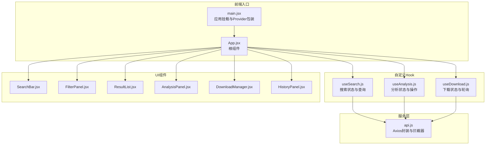
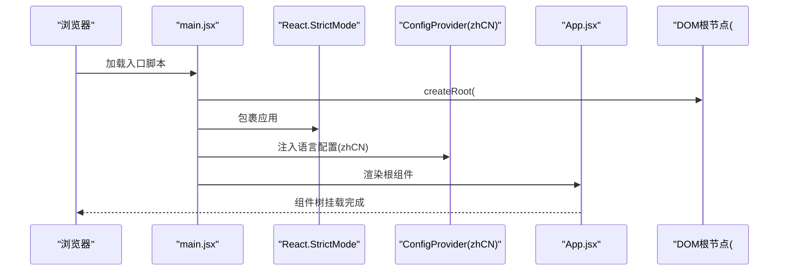
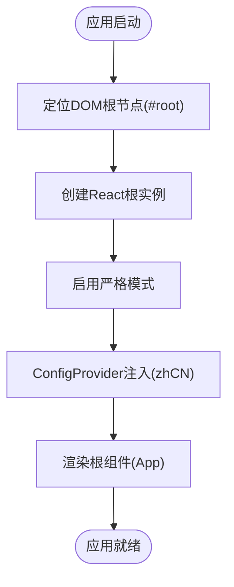
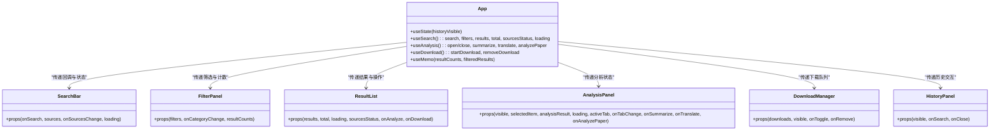
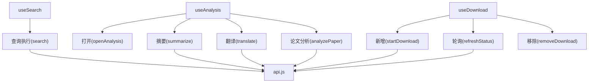
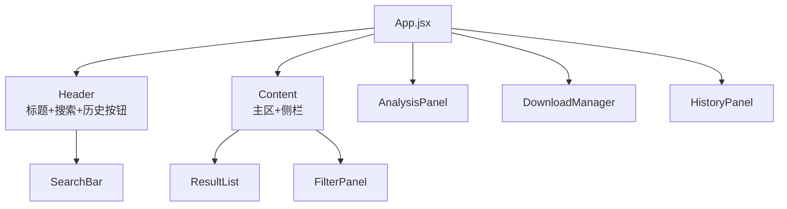
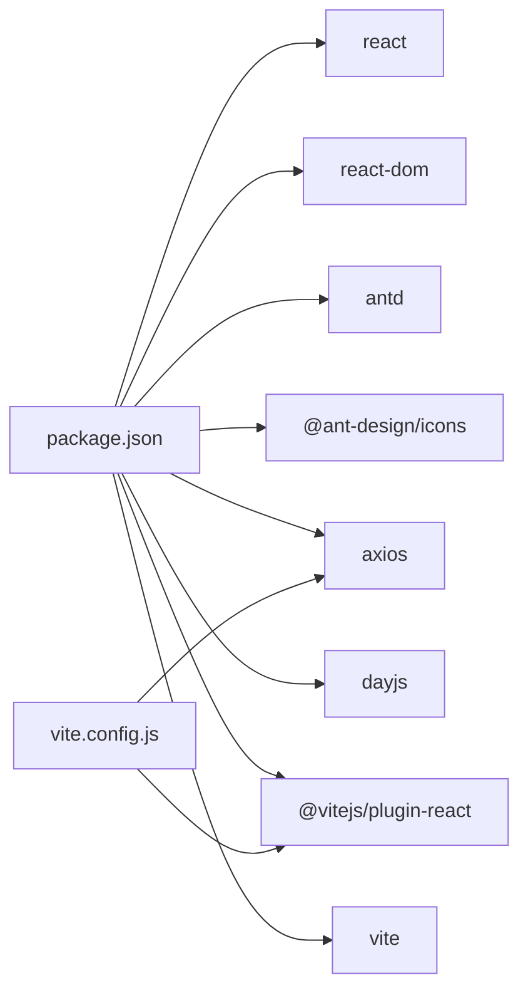

# React应用入口

<cite>
**本文档引用的文件**
- [frontend/src/main.jsx](file://frontend/src/main.jsx)
- [frontend/src/App.jsx](file://frontend/src/App.jsx)
- [frontend/package.json](file://frontend/package.json)
- [frontend/vite.config.js](file://frontend/vite.config.js)
- [frontend/src/styles/global.css](file://frontend/src/styles/global.css)
- [frontend/src/hooks/useSearch.js](file://frontend/src/hooks/useSearch.js)
- [frontend/src/hooks/useAnalysis.js](file://frontend/src/hooks/useAnalysis.js)
- [frontend/src/hooks/useDownload.js](file://frontend/src/hooks/useDownload.js)
- [frontend/src/services/api.js](file://frontend/src/services/api.js)
- [frontend/src/components/SearchBar.jsx](file://frontend/src/components/SearchBar.jsx)
- [frontend/src/components/FilterPanel.jsx](file://frontend/src/components/FilterPanel.jsx)
- [frontend/src/components/ResultList.jsx](file://frontend/src/components/ResultList.jsx)
- [frontend/src/components/AnalysisPanel.jsx](file://frontend/src/components/AnalysisPanel.jsx)
- [frontend/src/components/DownloadManager.jsx](file://frontend/src/components/DownloadManager.jsx)
- [frontend/src/components/HistoryPanel.jsx](file://frontend/src/components/HistoryPanel.jsx)
</cite>

## 目录
1. [简介](#简介)
2. [项目结构](#项目结构)
3. [核心组件](#核心组件)
4. [架构总览](#架构总览)
5. [详细组件分析](#详细组件分析)
6. [依赖分析](#依赖分析)
7. [性能考虑](#性能考虑)
8. [故障排除指南](#故障排除指南)
9. [结论](#结论)

## 简介
本文件面向开发者，系统化阐述该React应用的入口初始化流程、组件树结构、状态管理模式、Ant Design集成与主题配置、图标使用规范，并提供应用启动流程图、组件层级关系图与状态管理架构图。文档同时覆盖前端路由配置、懒加载策略与性能优化建议，帮助读者快速建立对应用架构的完整认知。

## 项目结构
前端采用Vite构建工具，入口位于src/main.jsx，根组件为App.jsx。样式通过全局CSS进行统一管理，业务逻辑通过自定义Hook拆分到独立模块，UI组件按功能划分在components目录下。后端接口通过axios封装，统一拦截处理错误与超时。

**图表来源**
- [frontend/src/main.jsx](file://frontend/src/main.jsx#L1-L15)
- [frontend/src/App.jsx](file://frontend/src/App.jsx#L1-L149)
- [frontend/src/hooks/useSearch.js](file://frontend/src/hooks/useSearch.js#L1-L74)
- [frontend/src/hooks/useAnalysis.js](file://frontend/src/hooks/useAnalysis.js#L1-L86)
- [frontend/src/hooks/useDownload.js](file://frontend/src/hooks/useDownload.js#L1-L78)
- [frontend/src/services/api.js](file://frontend/src/services/api.js#L1-L32)
- [frontend/src/components/SearchBar.jsx](file://frontend/src/components/SearchBar.jsx#L1-L42)
- [frontend/src/components/FilterPanel.jsx](file://frontend/src/components/FilterPanel.jsx#L1-L52)
- [frontend/src/components/ResultList.jsx](file://frontend/src/components/ResultList.jsx#L1-L58)
- [frontend/src/components/AnalysisPanel.jsx](file://frontend/src/components/AnalysisPanel.jsx#L1-L171)
- [frontend/src/components/DownloadManager.jsx](file://frontend/src/components/DownloadManager.jsx#L1-L114)
- [frontend/src/components/HistoryPanel.jsx](file://frontend/src/components/HistoryPanel.jsx#L1-L91)

**章节来源**
- [frontend/src/main.jsx](file://frontend/src/main.jsx#L1-L15)
- [frontend/src/App.jsx](file://frontend/src/App.jsx#L1-L149)
- [frontend/package.json](file://frontend/package.json#L1-L24)
- [frontend/vite.config.js](file://frontend/vite.config.js#L1-L20)
- [frontend/src/styles/global.css](file://frontend/src/styles/global.css#L1-L156)

## 核心组件
- 应用入口与Provider包装：入口文件负责创建DOM根节点、启用严格模式、注入Ant Design ConfigProvider（设置语言为简体中文），并将根组件App渲染至页面。
- 根组件App：集中管理应用状态（搜索、分析、下载、历史面板可见性），计算过滤后的结果与分类统计，协调各子组件协作。
- 自定义Hook：useSearch负责查询参数、筛选条件与结果聚合；useAnalysis负责分析面板的可见性、活动标签页与摘要/翻译/论文分析操作；useDownload负责下载队列、状态轮询与移除。
- 服务层api：基于axios创建实例，设置基础路径、超时时间与通用头部；统一拦截响应错误，向用户展示友好提示。
- UI组件：SearchBar负责输入与多源选择；FilterPanel提供分类筛选与计数；ResultList展示结果列表与来源状态；AnalysisPanel以抽屉形式承载摘要、翻译与论文分析；DownloadManager固定悬浮窗管理下载任务；HistoryPanel抽屉式展示与回放历史记录。

**章节来源**
- [frontend/src/main.jsx](file://frontend/src/main.jsx#L1-L15)
- [frontend/src/App.jsx](file://frontend/src/App.jsx#L1-L149)
- [frontend/src/hooks/useSearch.js](file://frontend/src/hooks/useSearch.js#L1-L74)
- [frontend/src/hooks/useAnalysis.js](file://frontend/src/hooks/useAnalysis.js#L1-L86)
- [frontend/src/hooks/useDownload.js](file://frontend/src/hooks/useDownload.js#L1-L78)
- [frontend/src/services/api.js](file://frontend/src/services/api.js#L1-L32)
- [frontend/src/components/SearchBar.jsx](file://frontend/src/components/SearchBar.jsx#L1-L42)
- [frontend/src/components/FilterPanel.jsx](file://frontend/src/components/FilterPanel.jsx#L1-L52)
- [frontend/src/components/ResultList.jsx](file://frontend/src/components/ResultList.jsx#L1-L58)
- [frontend/src/components/AnalysisPanel.jsx](file://frontend/src/components/AnalysisPanel.jsx#L1-L171)
- [frontend/src/components/DownloadManager.jsx](file://frontend/src/components/DownloadManager.jsx#L1-L114)
- [frontend/src/components/HistoryPanel.jsx](file://frontend/src/components/HistoryPanel.jsx#L1-L91)

## 架构总览
应用采用“入口挂载 → Provider包装 → 根组件聚合 → Hook解耦 → 组件协作”的分层架构。入口文件负责运行时环境准备，根组件承担状态提升与Props传递，自定义Hook实现业务域状态复用，UI组件通过清晰的Props边界实现松耦合。

**图表来源**
- [frontend/src/main.jsx](file://frontend/src/main.jsx#L8-L14)
- [frontend/src/App.jsx](file://frontend/src/App.jsx#L1-L149)

## 详细组件分析

### 应用入口与挂载流程
- 创建根节点：通过DOM元素#root创建React根实例。
- Provider包装：使用Ant Design的ConfigProvider包裹应用，设置locale为zhCN，确保组件库文案与格式符合中文习惯。
- 严格模式：启用React.StrictMode，帮助识别不安全的副作用与废弃特性。
- 根组件渲染：将App作为顶层组件挂载，开始应用生命周期。

**图表来源**
- [frontend/src/main.jsx](file://frontend/src/main.jsx#L8-L14)

**章节来源**
- [frontend/src/main.jsx](file://frontend/src/main.jsx#L1-L15)

### 根组件App设计理念
- 组件组合模式：App作为容器组件，组合SearchBar、FilterPanel、ResultList、AnalysisPanel、DownloadManager、HistoryPanel等子组件，形成完整的搜索与分析工作流。
- 状态提升策略：将搜索、分析、下载三类状态提升至App，避免跨组件重复请求与状态同步问题；通过useMemo计算分类计数与过滤结果，减少不必要的渲染。
- Props传递机制：App将回调函数与状态以Props形式向下传递给子组件，保持单向数据流与职责分离；例如将onSearch、onAnalyze、onDownload等回调函数传入对应组件。

**图表来源**
- [frontend/src/App.jsx](file://frontend/src/App.jsx#L16-L148)
- [frontend/src/components/SearchBar.jsx](file://frontend/src/components/SearchBar.jsx#L12-L41)
- [frontend/src/components/FilterPanel.jsx](file://frontend/src/components/FilterPanel.jsx#L16-L51)
- [frontend/src/components/ResultList.jsx](file://frontend/src/components/ResultList.jsx#L7-L57)
- [frontend/src/components/AnalysisPanel.jsx](file://frontend/src/components/AnalysisPanel.jsx#L11-L169)
- [frontend/src/components/DownloadManager.jsx](file://frontend/src/components/DownloadManager.jsx#L22-L113)
- [frontend/src/components/HistoryPanel.jsx](file://frontend/src/components/HistoryPanel.jsx#L8-L90)

**章节来源**
- [frontend/src/App.jsx](file://frontend/src/App.jsx#L1-L149)

### Ant Design集成与主题配置
- 集成方式：在入口文件引入ConfigProvider并设置locale为zhCN，确保组件库文案与日期/数字格式本地化。
- 主题配置：通过全局CSS覆盖Ant Design默认样式，如Header背景渐变、卡片阴影、列表项悬停效果等，形成统一视觉风格。
- 图标使用：在组件中直接从@ant-design/icons导入所需图标，保证一致的图标风格与尺寸。

**章节来源**
- [frontend/src/main.jsx](file://frontend/src/main.jsx#L3-L5)
- [frontend/src/styles/global.css](file://frontend/src/styles/global.css#L19-L155)
- [frontend/src/components/AnalysisPanel.jsx](file://frontend/src/components/AnalysisPanel.jsx#L3-L7)
- [frontend/src/components/SearchBar.jsx](file://frontend/src/components/SearchBar.jsx#L3-L3)

### 状态管理架构
- useSearch：维护查询词、筛选条件（来源、分类、语言）、结果集、总数、来源状态与加载标志；提供更新来源与分类的回调。
- useAnalysis：维护分析结果、加载状态、面板可见性、选中项与活动标签页；提供摘要、翻译、论文分析的异步操作与面板开闭控制。
- useDownload：维护下载队列、面板可见性与轮询定时器；提供新增下载、移除任务与状态刷新；根据活跃任务自动启停轮询。
- 服务层api：统一封装Axios实例，设置基础URL与超时，拦截响应错误并提示用户。

**图表来源**
- [frontend/src/hooks/useSearch.js](file://frontend/src/hooks/useSearch.js#L19-L50)
- [frontend/src/hooks/useAnalysis.js](file://frontend/src/hooks/useAnalysis.js#L11-L57)
- [frontend/src/hooks/useDownload.js](file://frontend/src/hooks/useDownload.js#L9-L48)
- [frontend/src/services/api.js](file://frontend/src/services/api.js#L4-L29)

**章节来源**
- [frontend/src/hooks/useSearch.js](file://frontend/src/hooks/useSearch.js#L1-L74)
- [frontend/src/hooks/useAnalysis.js](file://frontend/src/hooks/useAnalysis.js#L1-L86)
- [frontend/src/hooks/useDownload.js](file://frontend/src/hooks/useDownload.js#L1-L78)
- [frontend/src/services/api.js](file://frontend/src/services/api.js#L1-L32)

### 组件层级关系与交互
- Header区域：包含应用标题、搜索框与历史按钮；搜索框支持多源勾选与加载态；历史按钮切换历史面板。
- Content区域：主区展示结果列表，侧栏展示分类筛选与计数；当存在结果时才渲染侧栏。
- 分析面板：右侧抽屉承载摘要、翻译与论文分析三个标签页，根据选中项自动触发摘要生成。
- 下载管理：底部固定悬浮窗，显示待下载与下载中任务，支持展开/收起与移除。
- 历史面板：左侧抽屉展示最近搜索历史，支持点击回放与一键清空。

**图表来源**
- [frontend/src/App.jsx](file://frontend/src/App.jsx#L75-L146)
- [frontend/src/components/SearchBar.jsx](file://frontend/src/components/SearchBar.jsx#L12-L41)
- [frontend/src/components/FilterPanel.jsx](file://frontend/src/components/FilterPanel.jsx#L16-L51)
- [frontend/src/components/ResultList.jsx](file://frontend/src/components/ResultList.jsx#L7-L57)
- [frontend/src/components/AnalysisPanel.jsx](file://frontend/src/components/AnalysisPanel.jsx#L11-L169)
- [frontend/src/components/DownloadManager.jsx](file://frontend/src/components/DownloadManager.jsx#L22-L113)
- [frontend/src/components/HistoryPanel.jsx](file://frontend/src/components/HistoryPanel.jsx#L8-L90)

**章节来源**
- [frontend/src/App.jsx](file://frontend/src/App.jsx#L1-L149)
- [frontend/src/components/SearchBar.jsx](file://frontend/src/components/SearchBar.jsx#L1-L42)
- [frontend/src/components/FilterPanel.jsx](file://frontend/src/components/FilterPanel.jsx#L1-L52)
- [frontend/src/components/ResultList.jsx](file://frontend/src/components/ResultList.jsx#L1-L58)
- [frontend/src/components/AnalysisPanel.jsx](file://frontend/src/components/AnalysisPanel.jsx#L1-L171)
- [frontend/src/components/DownloadManager.jsx](file://frontend/src/components/DownloadManager.jsx#L1-L114)
- [frontend/src/components/HistoryPanel.jsx](file://frontend/src/components/HistoryPanel.jsx#L1-L91)

### 前端路由与懒加载策略
- 路由配置：仓库未包含前端路由相关文件，当前应用通过单一入口与组件切换实现功能导航。
- 懒加载策略：当前未实现按需加载或动态导入；可在后续迭代中结合路由按需加载组件，以降低首屏体积。
- 性能优化：通过useMemo缓存过滤结果与分类计数，避免重复计算；useCallback稳定回调函数引用，减少子组件重渲染。

**章节来源**
- [frontend/src/App.jsx](file://frontend/src/App.jsx#L60-L73)
- [frontend/src/hooks/useSearch.js](file://frontend/src/hooks/useSearch.js#L19-L50)
- [frontend/src/hooks/useAnalysis.js](file://frontend/src/hooks/useAnalysis.js#L11-L57)

## 依赖分析
- 运行时依赖：React、React DOM、Ant Design、@ant-design/icons、axios、dayjs。
- 开发依赖：Vite、@vitejs/plugin-react。
- 构建配置：Vite插件启用React，开发服务器端口5173，API代理指向后端5000端口，输出目录dist。

**图表来源**
- [frontend/package.json](file://frontend/package.json#L11-L22)
- [frontend/vite.config.js](file://frontend/vite.config.js#L4-L19)

**章节来源**
- [frontend/package.json](file://frontend/package.json#L1-L24)
- [frontend/vite.config.js](file://frontend/vite.config.js#L1-L20)

## 性能考虑
- 渲染优化：使用useMemo对过滤结果与分类计数进行缓存；使用useCallback稳定回调函数引用，减少子组件重渲染。
- 网络优化：axios设置合理超时时间，统一错误拦截与提示；下载轮询采用2秒间隔，仅在存在活跃任务时启动。
- 样式优化：全局CSS统一字体、间距与阴影，减少重复样式声明；媒体查询适配移动端布局。
- 构建优化：Vite提供快速冷启动与热更新；生产构建输出dist目录，可配合CDN部署。

**章节来源**
- [frontend/src/App.jsx](file://frontend/src/App.jsx#L60-L73)
- [frontend/src/hooks/useSearch.js](file://frontend/src/hooks/useSearch.js#L19-L50)
- [frontend/src/hooks/useDownload.js](file://frontend/src/hooks/useDownload.js#L51-L64)
- [frontend/src/services/api.js](file://frontend/src/services/api.js#L4-L8)
- [frontend/src/styles/global.css](file://frontend/src/styles/global.css#L1-L156)
- [frontend/vite.config.js](file://frontend/vite.config.js#L15-L19)

## 故障排除指南
- 请求超时：拦截器检测超时错误并提示“请求超时，请重试”。
- 服务器错误：HTTP 5xx统一提示“服务器内部错误”，并显示具体错误信息。
- 参数错误：HTTP 400提示“请求参数错误”，辅助定位问题。
- 频率限制：HTTP 429提示“请求过于频繁，请稍后再试”，建议前端退避重试。
- 网络异常：断网或连接失败时提示“网络连接失败”。

**章节来源**
- [frontend/src/services/api.js](file://frontend/src/services/api.js#L10-L29)

## 结论
该应用以简洁清晰的入口与根组件为核心，通过自定义Hook实现状态解耦与复用，配合Ant Design组件库与全局样式，构建了高内聚、低耦合的前端架构。建议在后续迭代中引入前端路由与按需加载策略，进一步优化首屏性能与用户体验。