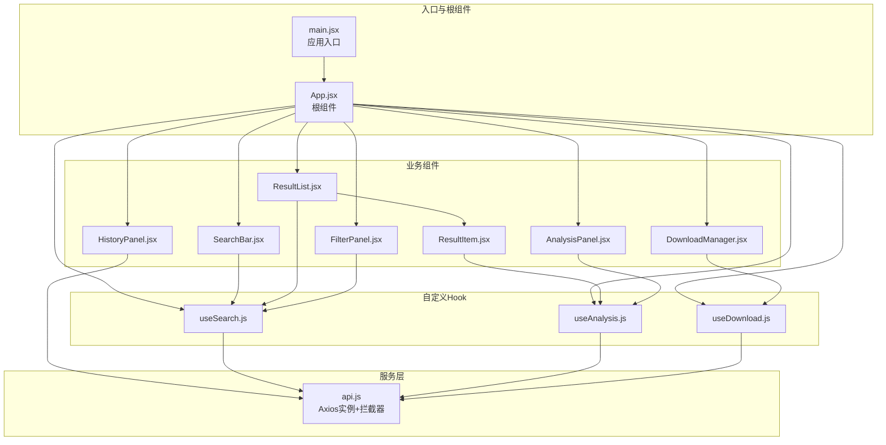
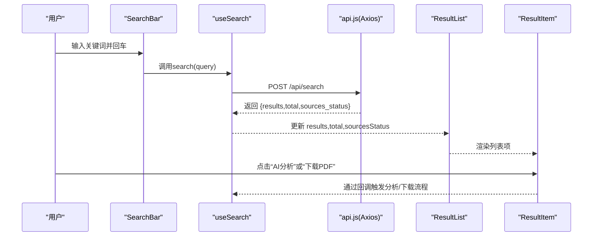
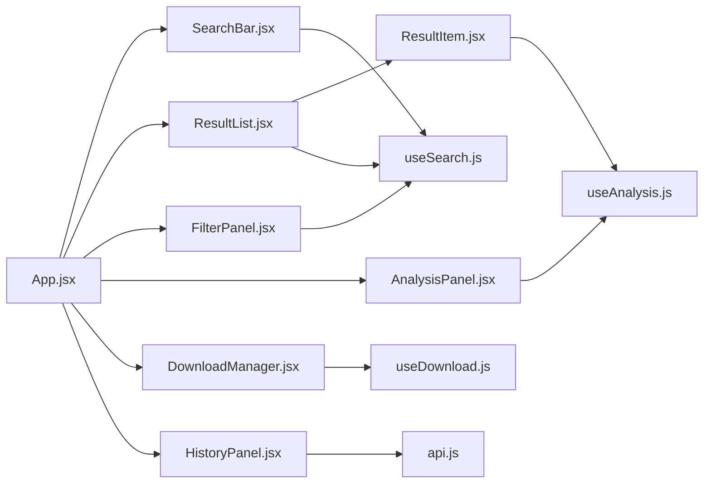
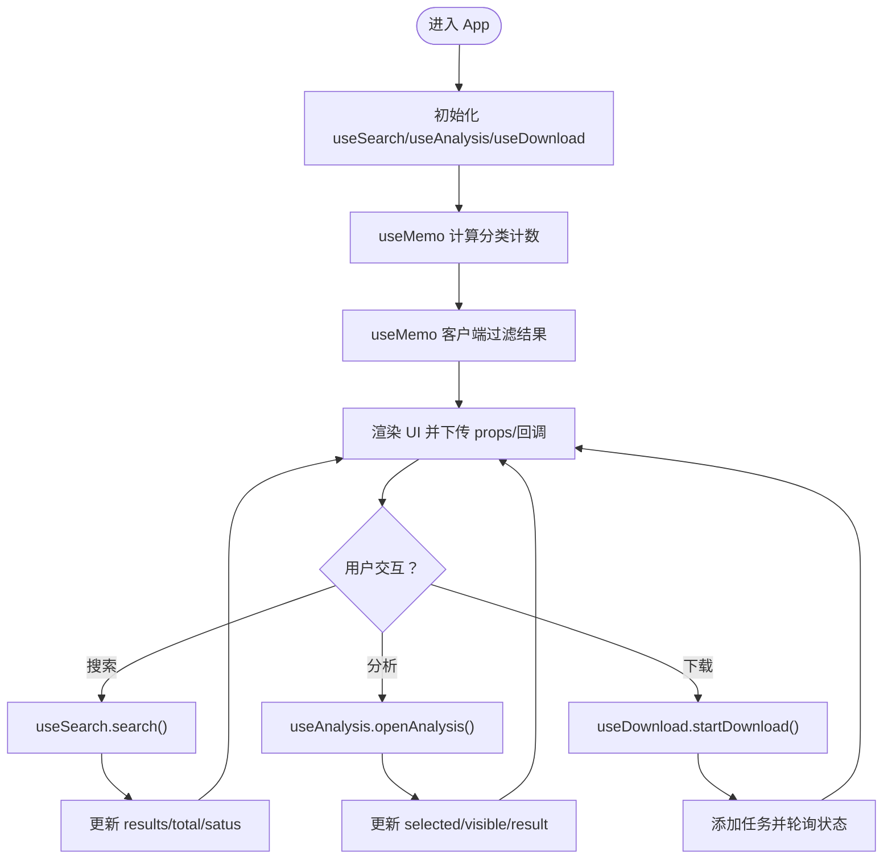
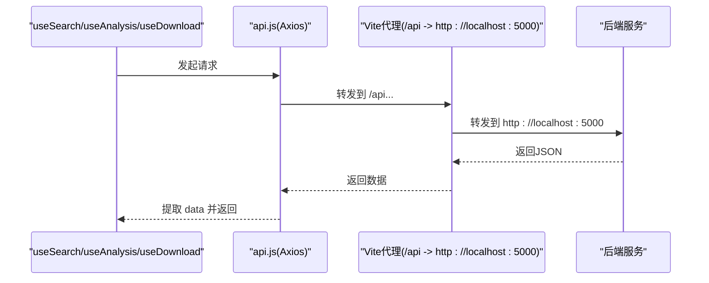
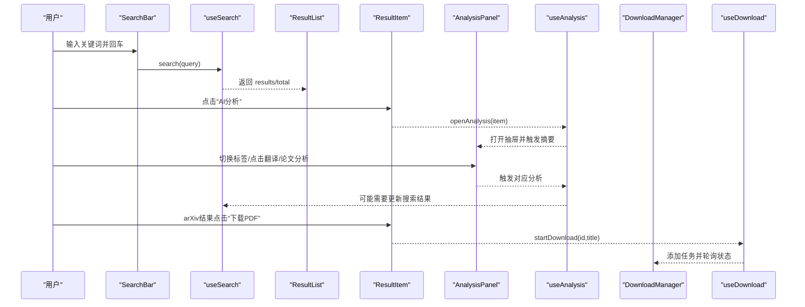
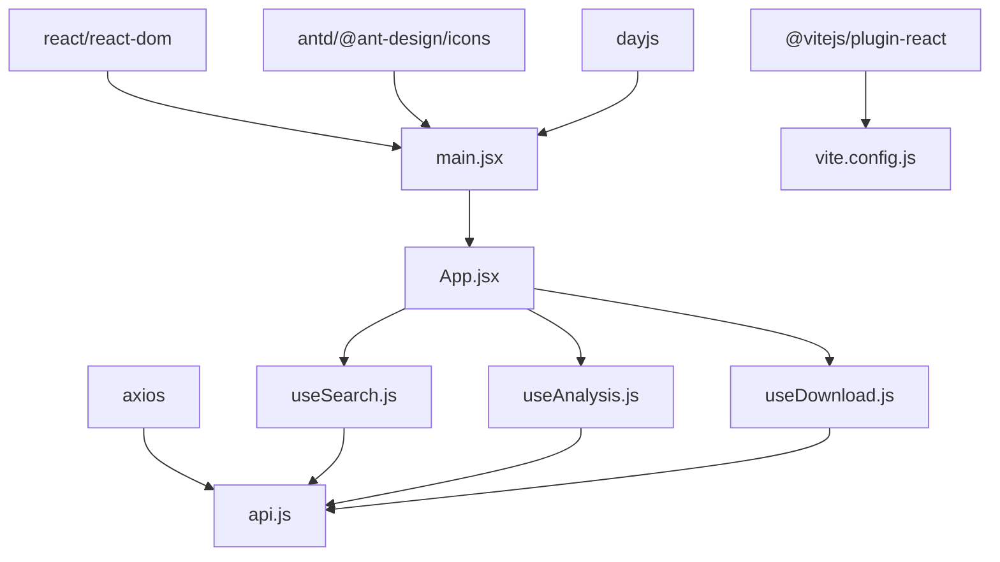

# 前端架构设计

<cite>
**本文引用的文件**
- [frontend/src/main.jsx](file://frontend/src/main.jsx)
- [frontend/src/App.jsx](file://frontend/src/App.jsx)
- [frontend/src/services/api.js](file://frontend/src/services/api.js)
- [frontend/src/hooks/useSearch.js](file://frontend/src/hooks/useSearch.js)
- [frontend/src/hooks/useAnalysis.js](file://frontend/src/hooks/useAnalysis.js)
- [frontend/src/hooks/useDownload.js](file://frontend/src/hooks/useDownload.js)
- [frontend/src/components/SearchBar.jsx](file://frontend/src/components/SearchBar.jsx)
- [frontend/src/components/ResultList.jsx](file://frontend/src/components/ResultList.jsx)
- [frontend/src/components/ResultItem.jsx](file://frontend/src/components/ResultItem.jsx)
- [frontend/src/components/FilterPanel.jsx](file://frontend/src/components/FilterPanel.jsx)
- [frontend/src/components/AnalysisPanel.jsx](file://frontend/src/components/AnalysisPanel.jsx)
- [frontend/src/components/DownloadManager.jsx](file://frontend/src/components/DownloadManager.jsx)
- [frontend/src/components/HistoryPanel.jsx](file://frontend/src/components/HistoryPanel.jsx)
- [frontend/package.json](file://frontend/package.json)
- [frontend/vite.config.js](file://frontend/vite.config.js)
</cite>

## 目录
1. [简介](#简介)
2. [项目结构](#项目结构)
3. [核心组件](#核心组件)
4. [架构总览](#架构总览)
5. [详细组件分析](#详细组件分析)
6. [依赖关系分析](#依赖关系分析)
7. [性能考量](#性能考量)
8. [故障排查指南](#故障排查指南)
9. [结论](#结论)
10. [附录](#附录)

## 简介
本文件面向前端开发者，系统阐述该React应用的组件化架构设计。重点覆盖组件树结构、状态管理模式（含自定义Hook）、组件间通信机制、数据流向、生命周期管理、API服务层封装与HTTP客户端配置、错误处理策略，以及响应式设计、性能优化与用户体验考量。文档同时提供组件依赖关系图、状态管理流程图与用户交互流程图，帮助快速理解与高效开发。

## 项目结构
前端采用Vite构建，使用React 18与Ant Design作为UI基础库。项目按功能域组织：入口在main.jsx，根组件App.jsx负责协调各业务面板；组件位于components目录，通用逻辑抽取为自定义Hook，服务层封装于services目录，样式集中于styles目录。

图表来源
- [frontend/src/main.jsx](file://frontend/src/main.jsx#L1-L15)
- [frontend/src/App.jsx](file://frontend/src/App.jsx#L1-L149)
- [frontend/src/services/api.js](file://frontend/src/services/api.js#L1-L32)
- [frontend/src/hooks/useSearch.js](file://frontend/src/hooks/useSearch.js#L1-L74)
- [frontend/src/hooks/useAnalysis.js](file://frontend/src/hooks/useAnalysis.js#L1-L86)
- [frontend/src/hooks/useDownload.js](file://frontend/src/hooks/useDownload.js#L1-L78)
- [frontend/src/components/SearchBar.jsx](file://frontend/src/components/SearchBar.jsx#L1-L42)
- [frontend/src/components/ResultList.jsx](file://frontend/src/components/ResultList.jsx#L1-L58)
- [frontend/src/components/ResultItem.jsx](file://frontend/src/components/ResultItem.jsx#L1-L108)
- [frontend/src/components/FilterPanel.jsx](file://frontend/src/components/FilterPanel.jsx#L1-L52)
- [frontend/src/components/AnalysisPanel.jsx](file://frontend/src/components/AnalysisPanel.jsx#L1-L171)
- [frontend/src/components/DownloadManager.jsx](file://frontend/src/components/DownloadManager.jsx#L1-L114)
- [frontend/src/components/HistoryPanel.jsx](file://frontend/src/components/HistoryPanel.jsx#L1-L91)

章节来源
- [frontend/src/main.jsx](file://frontend/src/main.jsx#L1-L15)
- [frontend/src/App.jsx](file://frontend/src/App.jsx#L1-L149)
- [frontend/package.json](file://frontend/package.json#L1-L24)
- [frontend/vite.config.js](file://frontend/vite.config.js#L1-L20)

## 核心组件
- 根组件App：集中管理全局状态（搜索、分析、下载、历史抽屉可见性），计算过滤后的结果集与分类统计，并向下传递props与回调。
- 自定义Hook：
  - useSearch：封装搜索查询、筛选器（来源、分类、语言）、加载态与错误状态，统一调用后端搜索接口。
  - useAnalysis：封装AI摘要、翻译、论文深度分析等能力，维护抽屉可见性、当前选中项、活动标签页与结果缓存。
  - useDownload：封装下载任务创建、轮询状态更新、下载进度与完成态处理。
- 业务组件：SearchBar、ResultList、ResultItem、FilterPanel、AnalysisPanel、DownloadManager、HistoryPanel，分别承担输入、展示、筛选、分析、下载与历史管理职责。

章节来源
- [frontend/src/App.jsx](file://frontend/src/App.jsx#L16-L148)
- [frontend/src/hooks/useSearch.js](file://frontend/src/hooks/useSearch.js#L6-L73)
- [frontend/src/hooks/useAnalysis.js](file://frontend/src/hooks/useAnalysis.js#L4-L85)
- [frontend/src/hooks/useDownload.js](file://frontend/src/hooks/useDownload.js#L4-L77)

## 架构总览
应用采用“容器组件+展示组件”分层与“自定义Hook抽取横切关注点”的模式。App作为容器，聚合useSearch/useAnalysis/useDownload的状态与行为，通过props向子组件下放数据与回调。组件间通信以props为主，事件回调为辅；数据流自上而下，事件自下而上，形成清晰的单向数据流。

图表来源
- [frontend/src/components/SearchBar.jsx](file://frontend/src/components/SearchBar.jsx#L12-L29)
- [frontend/src/hooks/useSearch.js](file://frontend/src/hooks/useSearch.js#L19-L50)
- [frontend/src/services/api.js](file://frontend/src/services/api.js#L4-L8)
- [frontend/src/components/ResultList.jsx](file://frontend/src/components/ResultList.jsx#L7-L55)
- [frontend/src/components/ResultItem.jsx](file://frontend/src/components/ResultItem.jsx#L37-L104)

## 详细组件分析

### 组件树与通信机制
- 组件树：App为根，Header区域包含SearchBar与历史按钮；Content区域由ResultList与可选FilterPanel组成；AnalysisPanel与DownloadManager为浮层/抽屉；HistoryPanel为左侧抽屉。
- 通信方式：
  - App向子组件下传数据与回调（如onSearch、onAnalyze、onDownload）。
  - 子组件通过回调向上触发状态变更（useSearch.updateSources/updateCategory、useAnalysis.openAnalysis/closeAnalysis、useDownload.startDownload/removeDownload）。
  - 分类统计与过滤在App内通过useMemo计算，避免重复渲染。

图表来源
- [frontend/src/App.jsx](file://frontend/src/App.jsx#L75-L146)
- [frontend/src/components/SearchBar.jsx](file://frontend/src/components/SearchBar.jsx#L12-L29)
- [frontend/src/components/ResultList.jsx](file://frontend/src/components/ResultList.jsx#L7-L55)
- [frontend/src/components/ResultItem.jsx](file://frontend/src/components/ResultItem.jsx#L37-L104)
- [frontend/src/components/FilterPanel.jsx](file://frontend/src/components/FilterPanel.jsx#L16-L50)
- [frontend/src/components/AnalysisPanel.jsx](file://frontend/src/components/AnalysisPanel.jsx#L11-L168)
- [frontend/src/components/DownloadManager.jsx](file://frontend/src/components/DownloadManager.jsx#L22-L112)
- [frontend/src/components/HistoryPanel.jsx](file://frontend/src/components/HistoryPanel.jsx#L8-L90)
- [frontend/src/hooks/useSearch.js](file://frontend/src/hooks/useSearch.js#L6-L73)
- [frontend/src/hooks/useAnalysis.js](file://frontend/src/hooks/useAnalysis.js#L4-L85)
- [frontend/src/hooks/useDownload.js](file://frontend/src/hooks/useDownload.js#L4-L77)
- [frontend/src/services/api.js](file://frontend/src/services/api.js#L1-L32)

章节来源
- [frontend/src/App.jsx](file://frontend/src/App.jsx#L16-L148)
- [frontend/src/components/SearchBar.jsx](file://frontend/src/components/SearchBar.jsx#L12-L41)
- [frontend/src/components/ResultList.jsx](file://frontend/src/components/ResultList.jsx#L7-L57)
- [frontend/src/components/ResultItem.jsx](file://frontend/src/components/ResultItem.jsx#L37-L107)
- [frontend/src/components/FilterPanel.jsx](file://frontend/src/components/FilterPanel.jsx#L16-L51)
- [frontend/src/components/AnalysisPanel.jsx](file://frontend/src/components/AnalysisPanel.jsx#L11-L170)
- [frontend/src/components/DownloadManager.jsx](file://frontend/src/components/DownloadManager.jsx#L22-L113)
- [frontend/src/components/HistoryPanel.jsx](file://frontend/src/components/HistoryPanel.jsx#L8-L90)

### 状态管理模式与生命周期
- App集中状态：
  - 历史抽屉可见性：useState控制。
  - useSearch返回results、total、sourcesStatus、loading、filters与操作函数。
  - useAnalysis返回analysisResult、loading、visible、selectedItem、activeTab与操作函数。
  - useDownload返回downloads、visible与操作函数。
- 过滤与统计：
  - 使用useMemo计算分类计数与客户端过滤结果，避免每次渲染都重新计算。
- 生命周期：
  - useAnalysis在抽屉打开且未有摘要时自动触发默认摘要生成。
  - useDownload基于定时轮询更新进行中的下载状态，组件卸载时清理定时器。

图表来源
- [frontend/src/App.jsx](file://frontend/src/App.jsx#L16-L73)
- [frontend/src/hooks/useSearch.js](file://frontend/src/hooks/useSearch.js#L19-L50)
- [frontend/src/hooks/useAnalysis.js](file://frontend/src/hooks/useAnalysis.js#L59-L70)
- [frontend/src/hooks/useDownload.js](file://frontend/src/hooks/useDownload.js#L51-L64)

章节来源
- [frontend/src/App.jsx](file://frontend/src/App.jsx#L16-L73)
- [frontend/src/hooks/useAnalysis.js](file://frontend/src/hooks/useAnalysis.js#L23-L28)
- [frontend/src/hooks/useDownload.js](file://frontend/src/hooks/useDownload.js#L51-L64)

### API服务层与HTTP客户端
- Axios实例：创建带baseURL、超时与默认头的实例。
- 响应拦截：统一提取响应数据，对429、>=500、400、超时与网络异常进行消息提示与错误透传。
- 请求路径：
  - 搜索：POST /api/search
  - AI摘要：POST /api/analysis/summarize
  - 翻译：POST /api/analysis/translate
  - 论文分析：POST /api/analysis/paper
  - arXiv下载：POST /api/download/arxiv
  - 下载状态：GET /api/download/status/{id}
  - 历史：GET /api/history, DELETE /api/history

图表来源
- [frontend/src/services/api.js](file://frontend/src/services/api.js#L4-L8)
- [frontend/src/services/api.js](file://frontend/src/services/api.js#L10-L29)
- [frontend/vite.config.js](file://frontend/vite.config.js#L8-L13)

章节来源
- [frontend/src/services/api.js](file://frontend/src/services/api.js#L1-L32)
- [frontend/vite.config.js](file://frontend/vite.config.js#L1-L20)

### 用户交互流程图
- 搜索与结果展示：输入关键词→调用search→渲染列表→可选筛选分类。
- AI分析：点击“AI分析”→打开抽屉→自动触发摘要生成→可切换摘要/翻译/论文分析标签页→执行对应分析。
- 下载管理：arXiv结果项点击“下载PDF”→创建下载任务→加入队列→定时轮询状态→完成后提供下载链接。
- 历史管理：点击历史按钮→打开抽屉→拉取历史→点击某条历史→触发搜索并关闭抽屉。

图表来源
- [frontend/src/components/SearchBar.jsx](file://frontend/src/components/SearchBar.jsx#L12-L29)
- [frontend/src/hooks/useSearch.js](file://frontend/src/hooks/useSearch.js#L19-L50)
- [frontend/src/components/ResultList.jsx](file://frontend/src/components/ResultList.jsx#L7-L55)
- [frontend/src/components/ResultItem.jsx](file://frontend/src/components/ResultItem.jsx#L37-L104)
- [frontend/src/components/AnalysisPanel.jsx](file://frontend/src/components/AnalysisPanel.jsx#L11-L168)
- [frontend/src/hooks/useAnalysis.js](file://frontend/src/hooks/useAnalysis.js#L59-L84)
- [frontend/src/components/DownloadManager.jsx](file://frontend/src/components/DownloadManager.jsx#L22-L112)
- [frontend/src/hooks/useDownload.js](file://frontend/src/hooks/useDownload.js#L9-L24)

## 依赖关系分析
- 外部依赖：React、React DOM、Ant Design、Axios、dayjs、@ant-design/icons。
- 构建工具：Vite插件react，本地开发代理至后端服务。
- 组件耦合：App作为高阶协调者，其余组件均为纯展示或轻逻辑，耦合度低、职责单一。
- 数据流：自上而下的props与自下而上的回调，配合useMemo减少不必要渲染。

图表来源
- [frontend/package.json](file://frontend/package.json#L11-L22)
- [frontend/src/main.jsx](file://frontend/src/main.jsx#L1-L15)
- [frontend/src/services/api.js](file://frontend/src/services/api.js#L1-L32)
- [frontend/vite.config.js](file://frontend/vite.config.js#L1-L20)

章节来源
- [frontend/package.json](file://frontend/package.json#L1-L24)
- [frontend/vite.config.js](file://frontend/vite.config.js#L1-L20)

## 性能考量
- 渲染优化：
  - 使用useMemo对分类计数与过滤结果进行缓存，避免重复计算。
  - 列表渲染使用稳定的key（优先url，否则索引），提升列表更新效率。
- 网络优化：
  - Axios设置合理超时时间，避免长时间阻塞。
  - 响应拦截统一处理错误，减少组件内重复分支。
- 轮询策略：
  - 下载状态轮询仅在存在进行中任务时启动，结束时清理定时器，降低CPU占用。
- UI反馈：
  - 加载态使用Spin与按钮loading，空态使用Empty，提升感知与可用性。

章节来源
- [frontend/src/App.jsx](file://frontend/src/App.jsx#L60-L73)
- [frontend/src/components/ResultList.jsx](file://frontend/src/components/ResultList.jsx#L15-L25)
- [frontend/src/hooks/useDownload.js](file://frontend/src/hooks/useDownload.js#L51-L64)
- [frontend/src/services/api.js](file://frontend/src/services/api.js#L6-L8)

## 故障排查指南
- 网络与代理：
  - 确认Vite代理配置是否指向正确的后端地址。
  - 若出现跨域问题，检查代理与CORS设置。
- 错误提示：
  - 429：触发频率限制，建议增加退避或提示用户稍后再试。
  - 400：参数错误，检查请求体字段与类型。
  - 5xx：服务端异常，查看后端日志与限流策略。
  - 超时/ECONNABORTED：网络不稳定或后端处理过久，建议优化后端或前端重试策略。
- 下载问题：
  - 任务创建成功但状态不更新：确认轮询间隔与后端状态接口可用性。
  - 完成后无法下载：检查后端文件路由与权限。
- 历史问题：
  - 抽屉为空：确认历史接口返回格式与权限。

章节来源
- [frontend/src/services/api.js](file://frontend/src/services/api.js#L10-L29)
- [frontend/vite.config.js](file://frontend/vite.config.js#L8-L13)
- [frontend/src/hooks/useDownload.js](file://frontend/src/hooks/useDownload.js#L26-L48)
- [frontend/src/components/HistoryPanel.jsx](file://frontend/src/components/HistoryPanel.jsx#L12-L22)

## 结论
该前端架构以App为中心协调多个自定义Hook，结合Ant Design组件实现清晰的业务分层与职责分离。通过Axios统一服务层与拦截器，配合Vite代理与合理的错误处理策略，实现了稳定、可维护且具备良好用户体验的搜索与分析平台。建议后续在复杂场景引入更细粒度的状态管理方案（如Redux/Zustand）与完善的测试体系，以进一步提升可扩展性与可靠性。

## 附录
- 开发与构建：
  - 开发：npm run dev（Vite热更新）
  - 构建：npm run build（输出至dist）
  - 预览：npm run preview
- 本地代理：
  - /api → http://localhost:5000

章节来源
- [frontend/package.json](file://frontend/package.json#L6-L10)
- [frontend/vite.config.js](file://frontend/vite.config.js#L4-L19)