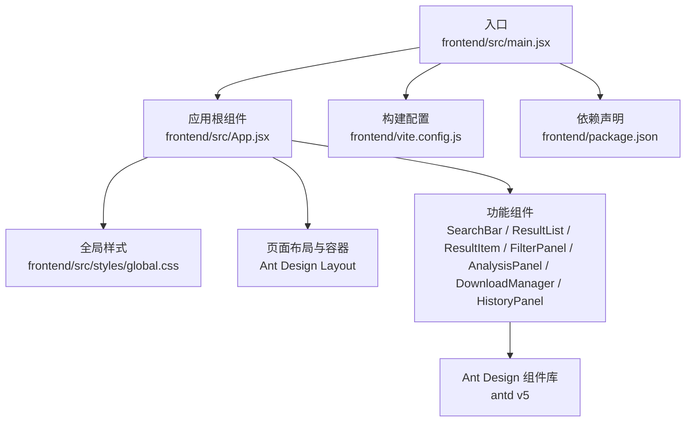
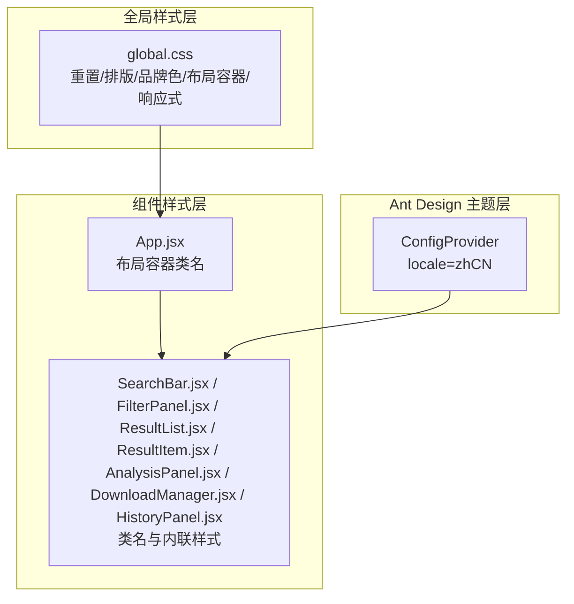
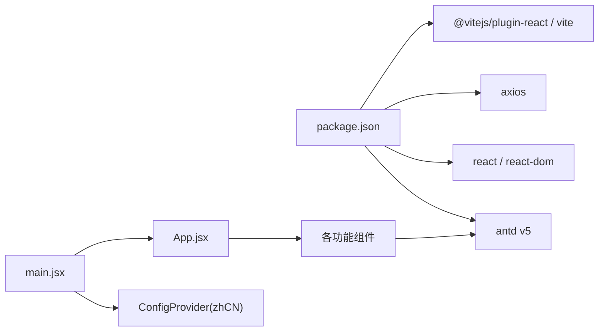
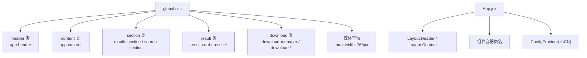
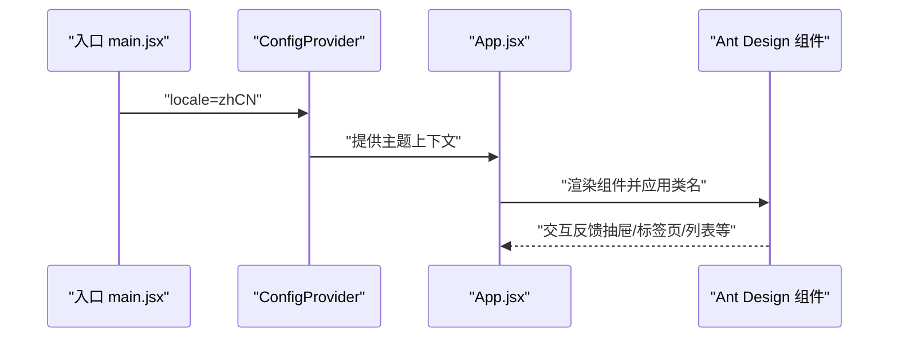
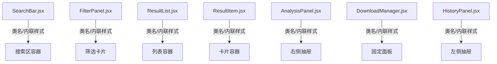

# 样式与主题设计

<cite>
**本文引用的文件**
- [frontend/src/styles/global.css](file://frontend/src/styles/global.css)
- [frontend/src/main.jsx](file://frontend/src/main.jsx)
- [frontend/src/App.jsx](file://frontend/src/App.jsx)
- [frontend/src/components/SearchBar.jsx](file://frontend/src/components/SearchBar.jsx)
- [frontend/src/components/ResultList.jsx](file://frontend/src/components/ResultList.jsx)
- [frontend/src/components/ResultItem.jsx](file://frontend/src/components/ResultItem.jsx)
- [frontend/src/components/FilterPanel.jsx](file://frontend/src/components/FilterPanel.jsx)
- [frontend/src/components/AnalysisPanel.jsx](file://frontend/src/components/AnalysisPanel.jsx)
- [frontend/src/components/DownloadManager.jsx](file://frontend/src/components/DownloadManager.jsx)
- [frontend/src/components/HistoryPanel.jsx](file://frontend/src/components/HistoryPanel.jsx)
- [frontend/src/hooks/useSearch.js](file://frontend/src/hooks/useSearch.js)
- [frontend/src/hooks/useAnalysis.js](file://frontend/src/hooks/useAnalysis.js)
- [frontend/src/hooks/useDownload.js](file://frontend/src/hooks/useDownload.js)
- [frontend/package.json](file://frontend/package.json)
- [frontend/vite.config.js](file://frontend/vite.config.js)
</cite>

## 目录
1. [简介](#简介)
2. [项目结构](#项目结构)
3. [核心组件](#核心组件)
4. [架构总览](#架构总览)
5. [详细组件分析](#详细组件分析)
6. [依赖分析](#依赖分析)
7. [性能考虑](#性能考虑)
8. [故障排查指南](#故障排查指南)
9. [结论](#结论)
10. [附录](#附录)

## 简介
本设计文档聚焦于前端样式与主题体系，围绕全局样式组织、命名规范、CSS 变量使用、响应式策略、Ant Design 主题定制与组件样式覆盖、动画与交互表现、移动端适配、浏览器兼容性与性能优化进行系统化梳理，并给出样式架构图、主题配置图与组件样式关系图，帮助前端开发者在保持品牌一致性的前提下高效扩展与维护。

## 项目结构
前端采用 Vite 构建，Ant Design v5 提供基础 UI 能力，React 组件通过类名与 Ant Design 组件组合形成页面布局与交互。样式以全局 CSS 文件集中管理，配合少量内联样式与 Ant Design 的默认主题，形成统一的设计语言。

图表来源
- [frontend/src/main.jsx](file://frontend/src/main.jsx#L1-L15)
- [frontend/src/App.jsx](file://frontend/src/App.jsx#L1-L149)
- [frontend/src/styles/global.css](file://frontend/src/styles/global.css#L1-L156)
- [frontend/vite.config.js](file://frontend/vite.config.js#L1-L20)
- [frontend/package.json](file://frontend/package.json#L1-L24)

章节来源
- [frontend/src/main.jsx](file://frontend/src/main.jsx#L1-L15)
- [frontend/src/App.jsx](file://frontend/src/App.jsx#L1-L149)
- [frontend/src/styles/global.css](file://frontend/src/styles/global.css#L1-L156)
- [frontend/vite.config.js](file://frontend/vite.config.js#L1-L20)
- [frontend/package.json](file://frontend/package.json#L1-L24)

## 核心组件
- 全局样式：统一重置、基础排版、品牌色与布局容器类名，提供响应式断点与组件级覆盖。
- 应用根组件：负责 Ant Design 国际化注入与页面骨架布局，承载各功能区域。
- 功能组件：基于 Ant Design 组件封装，通过类名与内联样式实现品牌化外观与交互。
- 钩子函数：useSearch/useAnalysis/useDownload 封装业务状态与异步流程，减少组件复杂度。

章节来源
- [frontend/src/styles/global.css](file://frontend/src/styles/global.css#L1-L156)
- [frontend/src/App.jsx](file://frontend/src/App.jsx#L1-L149)
- [frontend/src/components/SearchBar.jsx](file://frontend/src/components/SearchBar.jsx#L1-L42)
- [frontend/src/components/ResultList.jsx](file://frontend/src/components/ResultList.jsx#L1-L58)
- [frontend/src/components/ResultItem.jsx](file://frontend/src/components/ResultItem.jsx#L1-L108)
- [frontend/src/components/FilterPanel.jsx](file://frontend/src/components/FilterPanel.jsx#L1-L52)
- [frontend/src/components/AnalysisPanel.jsx](file://frontend/src/components/AnalysisPanel.jsx#L1-L171)
- [frontend/src/components/DownloadManager.jsx](file://frontend/src/components/DownloadManager.jsx#L1-L114)
- [frontend/src/components/HistoryPanel.jsx](file://frontend/src/components/HistoryPanel.jsx#L1-L91)
- [frontend/src/hooks/useSearch.js](file://frontend/src/hooks/useSearch.js#L1-L74)
- [frontend/src/hooks/useAnalysis.js](file://frontend/src/hooks/useAnalysis.js#L1-L86)
- [frontend/src/hooks/useDownload.js](file://frontend/src/hooks/useDownload.js#L1-L78)

## 架构总览
样式架构由“全局样式层 + 组件样式层 + Ant Design 主题层”构成。全局样式层提供基础排版、品牌色与布局容器；组件样式层通过类名与 Ant Design 组件组合实现品牌化外观；Ant Design 主题层通过 ConfigProvider 注入语言包与默认主题上下文。

图表来源
- [frontend/src/styles/global.css](file://frontend/src/styles/global.css#L1-L156)
- [frontend/src/App.jsx](file://frontend/src/App.jsx#L75-L148)
- [frontend/src/main.jsx](file://frontend/src/main.jsx#L3-L12)
- [frontend/src/components/SearchBar.jsx](file://frontend/src/components/SearchBar.jsx#L19-L41)
- [frontend/src/components/FilterPanel.jsx](file://frontend/src/components/FilterPanel.jsx#L19-L51)
- [frontend/src/components/ResultList.jsx](file://frontend/src/components/ResultList.jsx#L27-L57)
- [frontend/src/components/ResultItem.jsx](file://frontend/src/components/ResultItem.jsx#L41-L107)
- [frontend/src/components/AnalysisPanel.jsx](file://frontend/src/components/AnalysisPanel.jsx#L147-L170)
- [frontend/src/components/DownloadManager.jsx](file://frontend/src/components/DownloadManager.jsx#L29-L113)
- [frontend/src/components/HistoryPanel.jsx](file://frontend/src/components/HistoryPanel.jsx#L42-L90)

## 详细组件分析

### 全局样式与命名规范
- 选择器策略：采用语义化类名（如 app-header、app-content、results-section）与组件级类名（如 result-card、download-manager），避免深层后代选择器，降低样式耦合。
- 品牌色与层级：使用品牌主色作为头部与高亮元素背景，确保视觉层级清晰；阴影与圆角统一，提升卡片与面板的可读性。
- 响应式断点：在小屏设备上调整侧栏布局与下载管理器宽度，保证信息密度与可用性。

章节来源
- [frontend/src/styles/global.css](file://frontend/src/styles/global.css#L1-L156)

### Ant Design 主题定制与组件样式覆盖
- 国际化注入：通过 ConfigProvider 注入中文语言包，确保组件文案与交互符合本地用户习惯。
- 组件组合：页面通过 Ant Design 的 Layout、Card、List、Drawer、Tabs 等组件实现布局与交互，内部通过类名覆盖与内联样式微调品牌化外观。
- 图标与尺寸：统一使用 Ant Design Icons，按钮与输入框尺寸按业务需求设置，保持一致的交互反馈。

章节来源
- [frontend/src/main.jsx](file://frontend/src/main.jsx#L3-L12)
- [frontend/src/App.jsx](file://frontend/src/App.jsx#L75-L148)
- [frontend/src/components/ResultItem.jsx](file://frontend/src/components/ResultItem.jsx#L77-L104)
- [frontend/src/components/AnalysisPanel.jsx](file://frontend/src/components/AnalysisPanel.jsx#L147-L170)

### 动画与过渡效果
- 卡片悬停：通过 hover 状态添加阴影过渡，增强交互反馈。
- 列表加载：使用 Spin 组件展示加载态，避免页面闪烁。
- 抽屉与抽屉内标签页：Drawer 与 Tabs 提供平滑展开与切换体验。

章节来源
- [frontend/src/styles/global.css](file://frontend/src/styles/global.css#L68-L70)
- [frontend/src/components/ResultList.jsx](file://frontend/src/components/ResultList.jsx#L15-L21)
- [frontend/src/components/AnalysisPanel.jsx](file://frontend/src/components/AnalysisPanel.jsx#L147-L170)

### 移动端适配与响应式策略
- 断点与布局：在小屏设备上将侧栏变为全宽并置于主内容下方，下载管理器宽度自适应屏幕，底部留白避免遮挡。
- 触控友好：按钮与列表项具备合适的触摸目标尺寸，标签页与抽屉宽度适配移动设备操作范围。

章节来源
- [frontend/src/styles/global.css](file://frontend/src/styles/global.css#L144-L155)
- [frontend/src/components/AnalysisPanel.jsx](file://frontend/src/components/AnalysisPanel.jsx#L148-L167)

### 浏览器兼容性
- 字体栈与系统字体优先，确保跨平台一致的阅读体验。
- 使用现代 CSS 属性（如 Flexbox、线性渐变、阴影），结合 Ant Design 的 polyfill 与构建工具链，满足主流浏览器支持要求。

章节来源
- [frontend/src/styles/global.css](file://frontend/src/styles/global.css#L7-L13)
- [frontend/package.json](file://frontend/package.json#L11-L18)

### 性能优化
- 构建输出：Vite 默认启用代码分割与压缩，生产构建输出至 dist 目录，便于 CDN 分发与缓存。
- 组件渲染：通过 useMemo 与 useCallback 优化计算与回调，减少不必要的重渲染。
- 异步状态：使用轮询刷新下载状态，避免频繁请求导致的性能问题。

章节来源
- [frontend/vite.config.js](file://frontend/vite.config.js#L15-L19)
- [frontend/src/hooks/useSearch.js](file://frontend/src/hooks/useSearch.js#L59-L73)
- [frontend/src/hooks/useAnalysis.js](file://frontend/src/hooks/useAnalysis.js#L72-L84)
- [frontend/src/hooks/useDownload.js](file://frontend/src/hooks/useDownload.js#L50-L64)

### 样式模块化与隔离
- 类名作用域：通过语义化类名限定作用域，避免全局污染；Ant Design 组件样式通过 props 与类名覆盖实现局部修改。
- 组件内联样式：仅用于动态或与数据强相关的样式，减少额外 CSS 文件依赖。
- 构建产物：Vite 将样式与脚本打包，按需加载，降低首屏阻塞。

章节来源
- [frontend/src/components/SearchBar.jsx](file://frontend/src/components/SearchBar.jsx#L19-L41)
- [frontend/src/components/ResultItem.jsx](file://frontend/src/components/ResultItem.jsx#L41-L107)
- [frontend/src/components/FilterPanel.jsx](file://frontend/src/components/FilterPanel.jsx#L19-L51)
- [frontend/src/components/AnalysisPanel.jsx](file://frontend/src/components/AnalysisPanel.jsx#L147-L170)
- [frontend/src/components/DownloadManager.jsx](file://frontend/src/components/DownloadManager.jsx#L29-L113)
- [frontend/src/components/HistoryPanel.jsx](file://frontend/src/components/HistoryPanel.jsx#L42-L90)

### 设计系统可扩展性与品牌一致性
- 品牌色与层级：通过全局 CSS 定义品牌主色与阴影，确保所有组件遵循同一视觉语言。
- 组件复用：将通用交互（如分析、翻译、下载）抽象为独立钩子，提高组件复用率与一致性。
- 维护成本：集中式样式与组件化封装降低维护成本，新增页面只需遵循现有命名与布局规范即可快速接入。

章节来源
- [frontend/src/styles/global.css](file://frontend/src/styles/global.css#L19-L155)
- [frontend/src/hooks/useAnalysis.js](file://frontend/src/hooks/useAnalysis.js#L11-L57)
- [frontend/src/hooks/useDownload.js](file://frontend/src/hooks/useDownload.js#L9-L48)

## 依赖分析
Ant Design 作为核心 UI 依赖，提供大量可定制的组件与主题能力；React 与 Vite 构成开发与构建基础；Axios 用于服务端通信。

图表来源
- [frontend/package.json](file://frontend/package.json#L11-L22)
- [frontend/src/main.jsx](file://frontend/src/main.jsx#L3-L12)
- [frontend/src/App.jsx](file://frontend/src/App.jsx#L1-L149)

章节来源
- [frontend/package.json](file://frontend/package.json#L1-L24)
- [frontend/src/main.jsx](file://frontend/src/main.jsx#L1-L15)
- [frontend/src/App.jsx](file://frontend/src/App.jsx#L1-L149)

## 性能考虑
- 构建优化：启用代码分割与压缩，合理拆分路由与组件，减少初始包体积。
- 运行时优化：使用 useMemo/useCallback 缓存计算结果与回调，避免重复渲染；对高频更新的状态进行节流或轮询频率控制。
- 样式优化：合并重复规则，避免深层嵌套与通配符选择器，减少重绘与回流。

## 故障排查指南
- 样式未生效：检查类名拼写与作用域，确认是否被 Ant Design 组件样式覆盖；必要时使用更具体的选择器或内联样式临时定位问题。
- 响应式异常：核对媒体查询断点与布局容器类名，确保在小屏设备上的样式覆盖正确。
- 组件交互异常：检查 ConfigProvider 的 locale 设置与组件 props 传入，确认事件回调与状态更新逻辑。

章节来源
- [frontend/src/styles/global.css](file://frontend/src/styles/global.css#L144-L155)
- [frontend/src/main.jsx](file://frontend/src/main.jsx#L3-L12)
- [frontend/src/App.jsx](file://frontend/src/App.jsx#L75-L148)

## 结论
该样式与主题体系以 Ant Design 为基础，结合全局 CSS 与组件化封装，实现了品牌一致性与良好用户体验。通过明确的命名规范、响应式策略与性能优化手段，能够在保证可维护性的同时快速扩展新功能。建议后续引入 CSS 变量与主题切换机制，进一步提升主题可配置性与可访问性。

## 附录

### 样式架构图（代码级映射）

图表来源
- [frontend/src/styles/global.css](file://frontend/src/styles/global.css#L19-L155)
- [frontend/src/App.jsx](file://frontend/src/App.jsx#L75-L148)
- [frontend/src/main.jsx](file://frontend/src/main.jsx#L3-L12)

### 主题配置图（Ant Design）

图表来源
- [frontend/src/main.jsx](file://frontend/src/main.jsx#L3-L12)
- [frontend/src/App.jsx](file://frontend/src/App.jsx#L75-L148)

### 组件样式关系图（类名与组件映射）

图表来源
- [frontend/src/components/SearchBar.jsx](file://frontend/src/components/SearchBar.jsx#L19-L41)
- [frontend/src/components/FilterPanel.jsx](file://frontend/src/components/FilterPanel.jsx#L19-L51)
- [frontend/src/components/ResultList.jsx](file://frontend/src/components/ResultList.jsx#L27-L57)
- [frontend/src/components/ResultItem.jsx](file://frontend/src/components/ResultItem.jsx#L41-L107)
- [frontend/src/components/AnalysisPanel.jsx](file://frontend/src/components/AnalysisPanel.jsx#L147-L170)
- [frontend/src/components/DownloadManager.jsx](file://frontend/src/components/DownloadManager.jsx#L29-L113)
- [frontend/src/components/HistoryPanel.jsx](file://frontend/src/components/HistoryPanel.jsx#L42-L90)