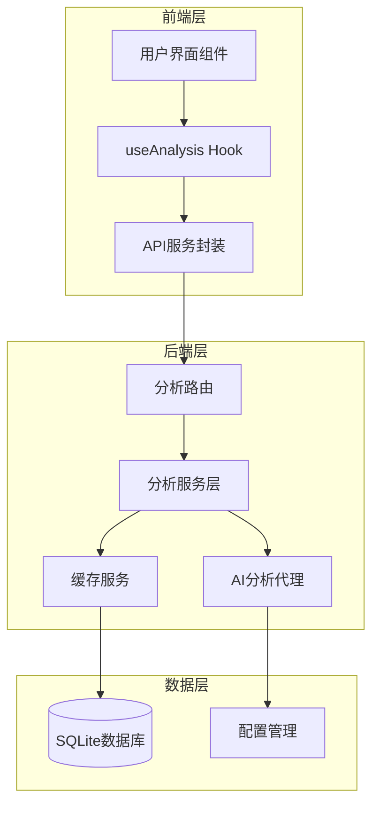
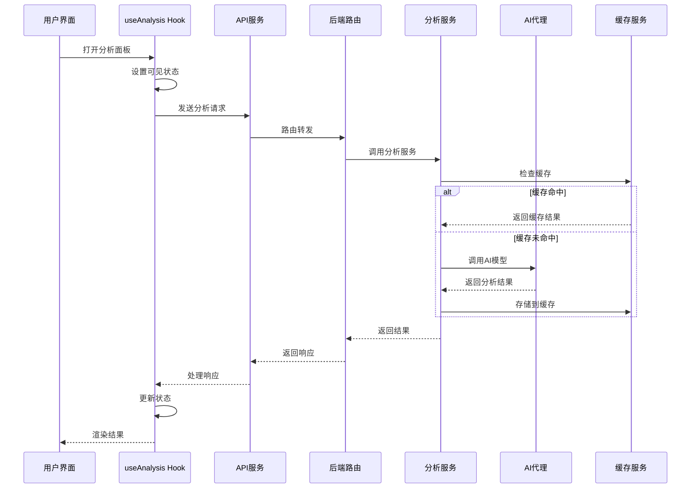
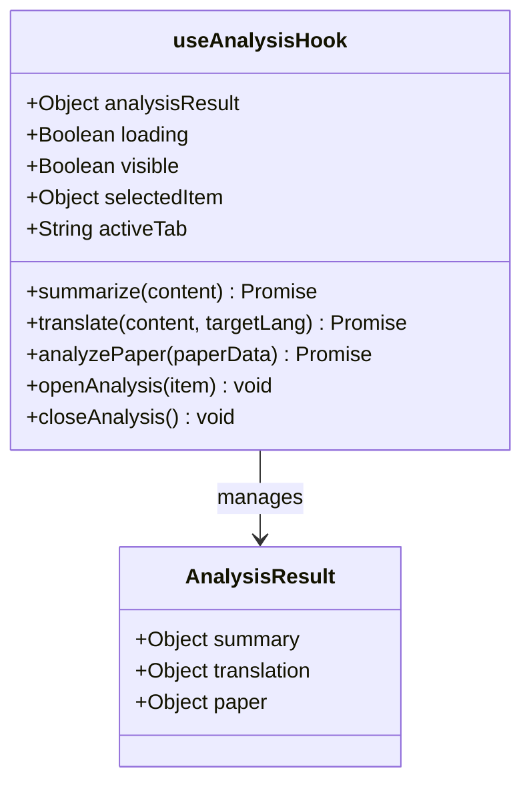
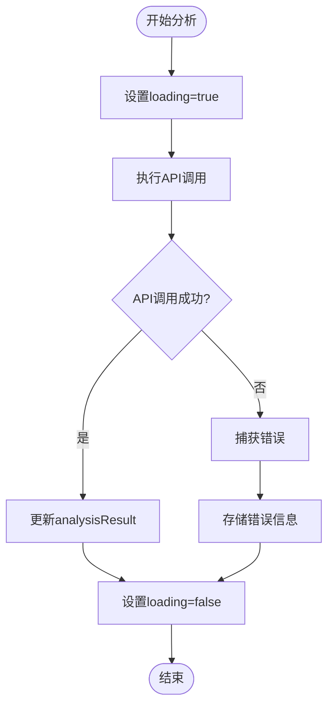
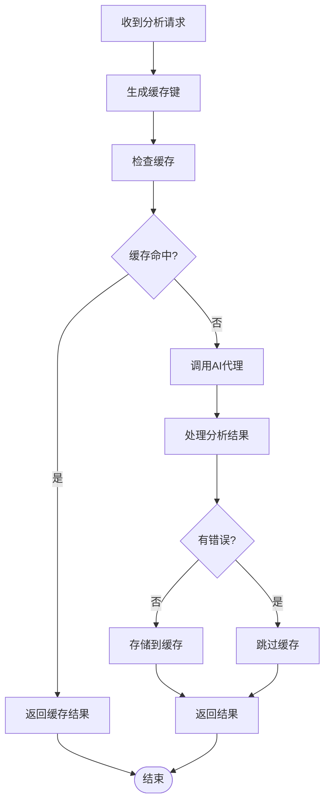
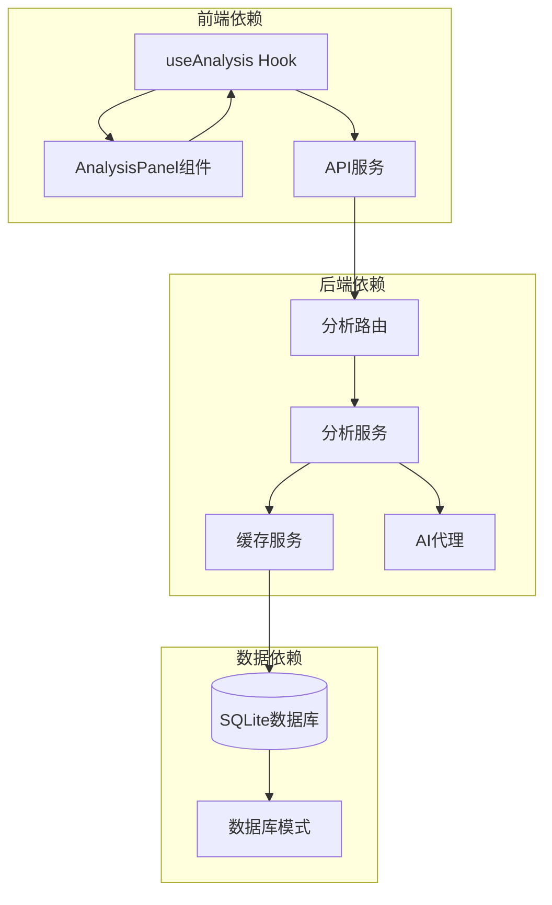

# useAnalysis Hook - AI分析状态管理

<cite>
**本文档引用的文件**
- [useAnalysis.js](file://frontend/src/hooks/useAnalysis.js)
- [api.js](file://frontend/src/services/api.js)
- [AnalysisPanel.jsx](file://frontend/src/components/AnalysisPanel.jsx)
- [App.jsx](file://frontend/src/App.jsx)
- [analysis.py](file://backend/routes/analysis.py)
- [analysis_service.py](file://backend/services/analysis_service.py)
- [cache_service.py](file://backend/services/cache_service.py)
- [analysis_agent.py](file://.qoder/agents/analysis_agent.py)
- [schemas.py](file://backend/models/schemas.py)
</cite>

## 目录
1. [简介](#简介)
2. [项目结构](#项目结构)
3. [核心组件](#核心组件)
4. [架构概览](#架构概览)
5. [详细组件分析](#详细组件分析)
6. [依赖关系分析](#依赖关系分析)
7. [性能考虑](#性能考虑)
8. [故障排除指南](#故障排除指南)
9. [结论](#结论)

## 简介

useAnalysis Hook是本项目中AI分析功能的核心状态管理模块，负责处理内容摘要生成、文本翻译和学术论文深度分析等AI分析任务。该Hook实现了完整的异步状态管理，包括加载状态、错误处理、结果缓存和UI状态同步等功能。

该Hook采用React Hooks模式，提供了简洁的API接口，使得组件能够轻松地执行各种AI分析操作，并在UI中展示相应的分析结果。通过与后端服务的紧密集成，useAnalysis Hook实现了高效的分析流程和良好的用户体验。

## 项目结构

AI分析功能的实现遵循前后端分离的架构设计，主要由以下层次组成：

**图表来源**
- [useAnalysis.js](file://frontend/src/hooks/useAnalysis.js#L1-L86)
- [analysis.py](file://backend/routes/analysis.py#L1-L66)
- [analysis_service.py](file://backend/services/analysis_service.py#L1-L91)

**章节来源**
- [useAnalysis.js](file://frontend/src/hooks/useAnalysis.js#L1-L86)
- [App.jsx](file://frontend/src/App.jsx#L1-L149)

## 核心组件

useAnalysis Hook实现了完整的AI分析状态管理，包含以下核心状态和功能：

### 主要状态结构

| 状态名称 | 类型 | 默认值 | 描述 |
|---------|------|--------|------|
| analysisResult | Object | null | 存储所有分析结果的数据对象，包含summary、translation、paper三个子字段 |
| loading | Boolean | false | 全局加载状态，指示是否有正在进行的分析操作 |
| visible | Boolean | false | 分析面板可见状态 |
| selectedItem | Object | null | 当前选中的分析项目数据 |
| activeTab | String | 'summary' | 当前激活的分析标签页 |

### 分析类型函数

Hook提供了三种主要的分析能力：

1. **summarize(content)** - 内容摘要生成
2. **translate(content, targetLang)** - 文本翻译
3. **analyzePaper(paperData)** - 学术论文深度分析

**章节来源**
- [useAnalysis.js](file://frontend/src/hooks/useAnalysis.js#L4-L10)
- [useAnalysis.js](file://frontend/src/hooks/useAnalysis.js#L11-L57)

## 架构概览

AI分析功能采用分层架构设计，确保了良好的可维护性和扩展性：

**图表来源**
- [useAnalysis.js](file://frontend/src/hooks/useAnalysis.js#L11-L57)
- [api.js](file://frontend/src/services/api.js#L1-L32)
- [analysis.py](file://backend/routes/analysis.py#L10-L65)
- [analysis_service.py](file://backend/services/analysis_service.py#L25-L90)

## 详细组件分析

### useAnalysis Hook 实现分析

useAnalysis Hook采用了现代React Hooks的最佳实践，实现了完整的状态管理和异步操作处理。

#### 状态初始化

Hook使用useState钩子初始化了所有必要的状态变量，每个状态都有明确的职责分工：

**图表来源**
- [useAnalysis.js](file://frontend/src/hooks/useAnalysis.js#L4-L84)

#### 异步处理流程

每个分析函数都遵循相同的异步处理模式：

1. **设置加载状态** - 开始分析前设置loading为true
2. **执行API调用** - 使用async/await等待响应
3. **错误处理** - 使用try/catch捕获异常
4. **状态更新** - 成功时更新analysisResult，失败时存储错误信息
5. **清理状态** - finally块中设置loading为false

#### 错误处理策略

Hook实现了多层次的错误处理机制：

**图表来源**
- [useAnalysis.js](file://frontend/src/hooks/useAnalysis.js#L11-L57)

**章节来源**
- [useAnalysis.js](file://frontend/src/hooks/useAnalysis.js#L11-L84)

### API服务集成

前端API服务封装了HTTP请求处理逻辑，提供了统一的错误处理机制：

#### 请求拦截器

API服务使用axios拦截器处理所有响应：

- **429错误** - 请求过于频繁，显示友好提示
- **500错误** - 服务器内部错误，显示错误详情
- **400错误** - 参数错误，显示警告信息
- **超时错误** - 显示超时提示
- **网络错误** - 显示连接失败信息

#### 请求配置

API服务配置了合理的超时时间和请求头设置：
- 超时时间：60秒
- 内容类型：application/json
- 基础URL：/api

**章节来源**
- [api.js](file://frontend/src/services/api.js#L1-L32)

### 后端服务架构

后端服务层实现了完整的AI分析功能，包括缓存管理和错误处理。

#### 分析服务层

分析服务层提供了三种核心分析能力：

1. **内容摘要** - 生成简洁的中文摘要和关键要点
2. **文本翻译** - 支持多语言翻译，保持专业术语准确性
3. **论文分析** - 深度分析学术论文的研究方法、创新点等

#### 缓存机制

服务层实现了智能缓存策略：

**图表来源**
- [analysis_service.py](file://backend/services/analysis_service.py#L25-L90)
- [cache_service.py](file://backend/services/cache_service.py#L57-L86)

**章节来源**
- [analysis_service.py](file://backend/services/analysis_service.py#L25-L90)
- [cache_service.py](file://backend/services/cache_service.py#L57-L86)

### AI代理实现

AI代理封装了LLM API调用逻辑，支持多种AI提供商：

#### 支持的AI提供商

- **ZhipuAI (默认)** - 使用glm-4-flash模型
- **DeepSeek** - 使用deepseek-chat模型

#### 配置管理

代理支持动态配置：
- 最大内容长度：4000字符
- 温度参数：0.7
- 模型选择：根据提供商自动配置

#### API调用处理

代理实现了robust的API调用逻辑：
- 自动客户端初始化
- 错误处理和重试机制
- 结果解析和验证

**章节来源**
- [analysis_agent.py](file://.qoder/agents/analysis_agent.py#L13-L33)
- [analysis_agent.py](file://.qoder/agents/analysis_agent.py#L68-L84)

## 依赖关系分析

AI分析功能涉及多个层面的依赖关系，形成了清晰的分层架构：

**图表来源**
- [useAnalysis.js](file://frontend/src/hooks/useAnalysis.js#L1-L2)
- [analysis.py](file://backend/routes/analysis.py#L1-L4)
- [cache_service.py](file://backend/services/cache_service.py#L1-L6)

**章节来源**
- [App.jsx](file://frontend/src/App.jsx#L10-L42)
- [AnalysisPanel.jsx](file://frontend/src/components/AnalysisPanel.jsx#L1-L22)

## 性能考虑

AI分析功能在设计时充分考虑了性能优化：

### 缓存策略

1. **分析结果缓存** - 7天有效期
2. **搜索结果缓存** - 24小时有效期
3. **智能缓存键生成** - 基于内容和类型生成唯一标识

### 内容截断

AI代理实现了智能内容截断：
- 最大内容长度：4000字符
- 自动截断并添加省略号标识
- 保护长文本的完整性

### 并发控制

- 单个分析操作的并发限制
- 加载状态的正确管理
- 错误状态的隔离处理

## 故障排除指南

### 常见问题及解决方案

#### API密钥配置问题

**问题症状**：AI代理初始化失败，返回"API key not configured"错误

**解决方案**：
1. 检查.env文件中的API密钥配置
2. 确认AI提供商的API密钥正确无误
3. 重启应用使配置生效

#### 缓存问题

**问题症状**：分析结果不更新或显示过期数据

**解决方案**：
1. 检查缓存表结构是否正确
2. 手动清理过期缓存
3. 验证缓存键生成逻辑

#### 网络连接问题

**问题症状**：API调用超时或连接失败

**解决方案**：
1. 检查网络连接状态
2. 验证后端服务可用性
3. 调整超时配置

### 调试技巧

#### 前端调试

1. **状态监控** - 使用React DevTools观察Hook状态变化
2. **API日志** - 查看浏览器开发者工具中的网络请求
3. **错误追踪** - 检查控制台中的错误信息

#### 后端调试

1. **日志分析** - 查看后端日志文件中的错误信息
2. **缓存检查** - 验证数据库中的缓存记录
3. **性能监控** - 监控AI代理的响应时间

**章节来源**
- [analysis_agent.py](file://.qoder/agents/analysis_agent.py#L34-L61)
- [cache_service.py](file://backend/services/cache_service.py#L91-L103)

## 结论

useAnalysis Hook成功实现了完整的AI分析状态管理功能，具有以下特点：

### 技术优势

1. **模块化设计** - 清晰的分层架构，便于维护和扩展
2. **状态管理** - 完善的状态管理机制，包括加载、错误、缓存状态
3. **错误处理** - 多层次的错误处理策略，提升系统稳定性
4. **性能优化** - 智能缓存机制，减少重复计算

### 功能特性

1. **多分析类型** - 支持摘要生成、文本翻译、论文分析
2. **智能缓存** - 基于内容的缓存策略，提高响应速度
3. **友好界面** - 与AnalysisPanel组件无缝集成
4. **错误恢复** - 完善的错误处理和用户提示

### 扩展建议

1. **分析类型扩展** - 可以轻松添加新的分析类型
2. **缓存策略优化** - 可以根据使用模式调整缓存策略
3. **性能监控** - 可以添加更详细的性能指标监控
4. **用户反馈** - 可以添加用户满意度调查功能

该Hook为AI分析功能提供了坚实的基础，通过合理的设计和实现，确保了良好的用户体验和系统性能。