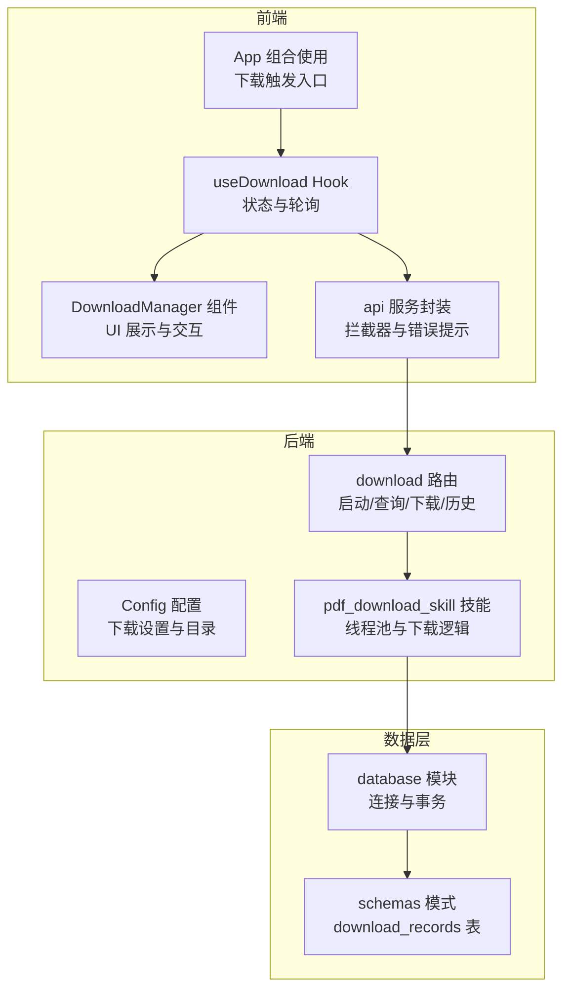
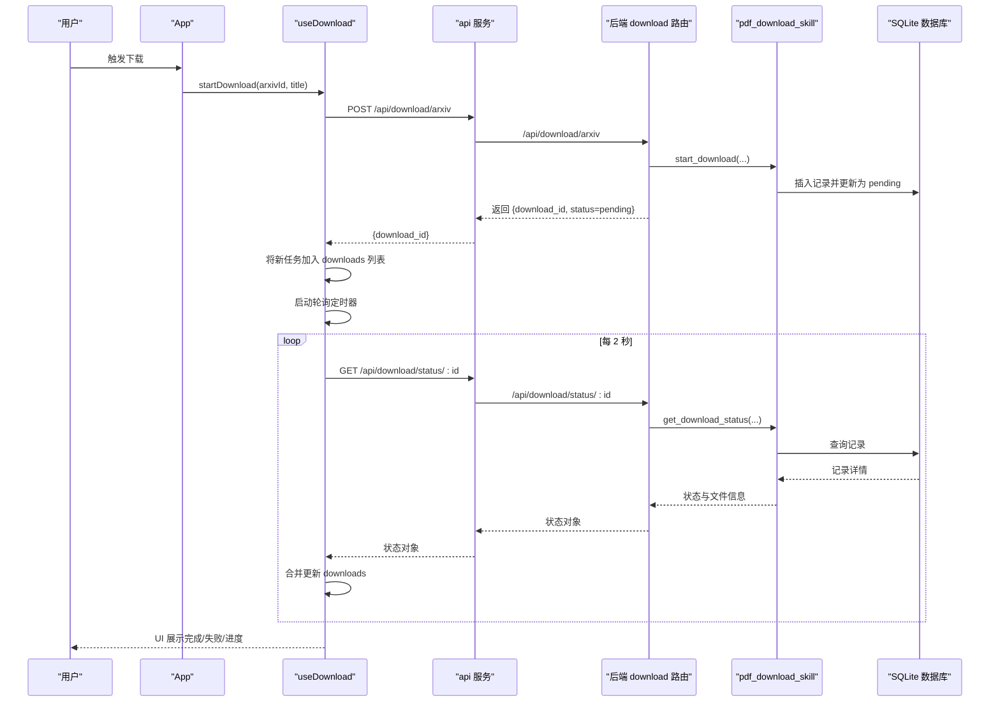
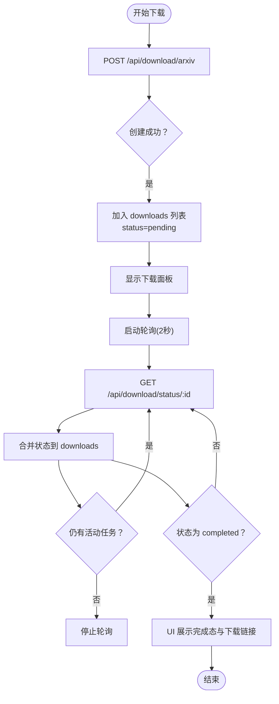
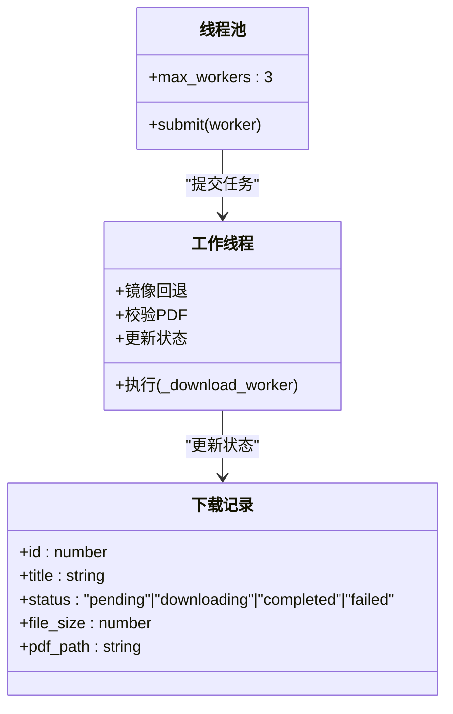
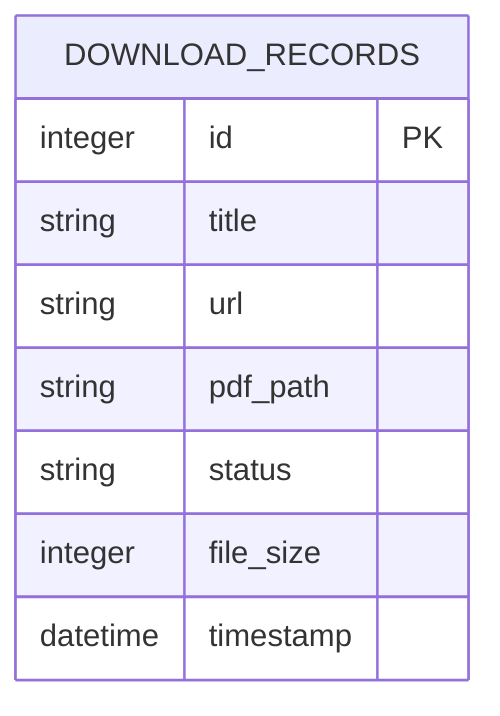
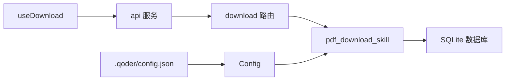

# useDownload Hook - 下载状态管理

<cite>
**本文引用的文件**
- [frontend/src/hooks/useDownload.js](file://frontend/src/hooks/useDownload.js)
- [frontend/src/services/api.js](file://frontend/src/services/api.js)
- [frontend/src/components/DownloadManager.jsx](file://frontend/src/components/DownloadManager.jsx)
- [frontend/src/App.jsx](file://frontend/src/App.jsx)
- [backend/routes/download.py](file://backend/routes/download.py)
- [backend/config.py](file://backend/config.py)
- [.qoder/config.json](file://.qoder/config.json)
- [.qoder/skills/pdf_download_skill.py](file://.qoder/skills/pdf_download_skill.py)
- [backend/models/database.py](file://backend/models/database.py)
- [backend/models/schemas.py](file://backend/models/schemas.py)
</cite>

## 目录
1. [简介](#简介)
2. [项目结构](#项目结构)
3. [核心组件](#核心组件)
4. [架构总览](#架构总览)
5. [详细组件分析](#详细组件分析)
6. [依赖关系分析](#依赖关系分析)
7. [性能考虑](#性能考虑)
8. [故障排查指南](#故障排查指南)
9. [结论](#结论)
10. [附录](#附录)

## 简介
本文件围绕前端 Hook useDownload 的下载状态管理能力进行系统性说明，重点覆盖以下方面：
- Hook 内部状态结构与管理：downloads、visible、pollingRef 等
- 下载任务生命周期：创建、状态轮询、进度更新、完成处理
- 并发下载控制策略：最大并发数、线程池与任务调度
- 下载队列与执行顺序：基于后端线程池的异步执行
- 进度更新机制：后端状态驱动的前端轮询
- 状态持久化：SQLite 数据库存储与恢复
- 使用示例：下载触发、进度监听、错误处理
- 性能优化与并发控制最佳实践

## 项目结构
该功能横跨前端 Hook、UI 组件、API 服务、后端路由与技能实现、数据库模型等多个模块，形成“前端状态 + 后端任务 + 数据持久化”的闭环。

图表来源
- [frontend/src/hooks/useDownload.js](file://frontend/src/hooks/useDownload.js#L1-L78)
- [frontend/src/components/DownloadManager.jsx](file://frontend/src/components/DownloadManager.jsx#L1-L114)
- [frontend/src/services/api.js](file://frontend/src/services/api.js#L1-L32)
- [frontend/src/App.jsx](file://frontend/src/App.jsx#L1-L149)
- [backend/routes/download.py](file://backend/routes/download.py#L1-L98)
- [backend/config.py](file://backend/config.py#L1-L85)
- [.qoder/skills/pdf_download_skill.py](file://.qoder/skills/pdf_download_skill.py#L1-L146)
- [backend/models/database.py](file://backend/models/database.py#L1-L51)
- [backend/models/schemas.py](file://backend/models/schemas.py#L1-L38)

章节来源
- [frontend/src/hooks/useDownload.js](file://frontend/src/hooks/useDownload.js#L1-L78)
- [frontend/src/components/DownloadManager.jsx](file://frontend/src/components/DownloadManager.jsx#L1-L114)
- [frontend/src/services/api.js](file://frontend/src/services/api.js#L1-L32)
- [frontend/src/App.jsx](file://frontend/src/App.jsx#L1-L149)
- [backend/routes/download.py](file://backend/routes/download.py#L1-L98)
- [backend/config.py](file://backend/config.py#L1-L85)
- [.qoder/config.json](file://.qoder/config.json#L1-L31)
- [.qoder/skills/pdf_download_skill.py](file://.qoder/skills/pdf_download_skill.py#L1-L146)
- [backend/models/database.py](file://backend/models/database.py#L1-L51)
- [backend/models/schemas.py](file://backend/models/schemas.py#L1-L38)

## 核心组件
- useDownload Hook：负责下载任务的创建、状态轮询、可见性控制与移除；内部维护 downloads 列表与轮询定时器。
- DownloadManager 组件：展示下载列表、状态图标、大小信息与进度条；支持完成态下载链接与删除操作。
- api 服务：统一的 HTTP 客户端，内置响应拦截器，对 429、5xx、400 等错误进行统一提示。
- 后端 download 路由：提供 /download/arxiv 创建任务、/download/status 查询状态、/download/file 提供下载、/download/history 获取历史。
- pdf_download_skill 技能：使用线程池执行下载任务，支持镜像回退、校验与状态更新。
- 数据库与模式：download_records 表用于持久化下载记录，包含状态、路径、大小、时间戳等字段。

章节来源
- [frontend/src/hooks/useDownload.js](file://frontend/src/hooks/useDownload.js#L1-L78)
- [frontend/src/components/DownloadManager.jsx](file://frontend/src/components/DownloadManager.jsx#L1-L114)
- [frontend/src/services/api.js](file://frontend/src/services/api.js#L1-L32)
- [backend/routes/download.py](file://backend/routes/download.py#L1-L98)
- [.qoder/skills/pdf_download_skill.py](file://.qoder/skills/pdf_download_skill.py#L1-L146)
- [backend/models/schemas.py](file://backend/models/schemas.py#L1-L38)

## 架构总览
前端通过 useDownload 发起下载任务，后端启动异步下载并在数据库中记录状态。前端通过定时轮询拉取最新状态，UI 实时反映任务进度与结果。

图表来源
- [frontend/src/hooks/useDownload.js](file://frontend/src/hooks/useDownload.js#L9-L48)
- [frontend/src/services/api.js](file://frontend/src/services/api.js#L10-L29)
- [backend/routes/download.py](file://backend/routes/download.py#L14-L56)
- [.qoder/skills/pdf_download_skill.py](file://.qoder/skills/pdf_download_skill.py#L21-L48)
- [backend/models/database.py](file://backend/models/database.py#L11-L21)

## 详细组件分析

### useDownload Hook 状态与生命周期
- 状态结构
  - downloads：数组，元素包含 id、title、status、file_size 等字段，按时间倒序排列。
  - visible：布尔值，控制下载管理面板的显示/隐藏。
  - pollingRef：引用保存轮询定时器，避免重复开启。
- 生命周期流程
  - 创建：调用 startDownload 发起 POST 请求，成功后在列表头部插入新任务并显示面板。
  - 轮询：当存在 pending 或 downloading 任务时，每 2 秒轮询一次状态；无活动任务时停止轮询。
  - 更新：refreshStatus 对每个活动任务发起 GET 请求，合并后端返回的状态到 downloads。
  - 完成：完成后端状态变为 completed，前端 UI 展示完成态与下载链接。
  - 清理：组件卸载或停止轮询时清理定时器。

图表来源
- [frontend/src/hooks/useDownload.js](file://frontend/src/hooks/useDownload.js#L9-L64)

章节来源
- [frontend/src/hooks/useDownload.js](file://frontend/src/hooks/useDownload.js#L1-L78)

### 下载队列与并发控制
- 队列与调度
  - 前端：downloads 列表作为“待处理/进行中”队列，按时间倒序展示；UI 展示 pending/downloading/completed/failed 状态。
  - 后端：ThreadPoolExecutor(max_workers=3) 作为全局线程池，异步执行下载任务，支持镜像回退与校验。
- 并发策略
  - 最大并发数：线程池 max_workers=3，受配置影响（见配置项）。
  - 任务调度：start_download 插入记录后立即提交至线程池，由工作线程按队列顺序执行。
  - 失败与回退：镜像列表逐个尝试，任一成功即完成；失败则标记 failed。
- 执行顺序
  - 后端按记录插入顺序由线程池调度执行；前端按创建时间倒序展示，不保证与后端执行顺序一致。

图表来源
- [.qoder/skills/pdf_download_skill.py](file://.qoder/skills/pdf_download_skill.py#L12-L14)
- [.qoder/skills/pdf_download_skill.py](file://.qoder/skills/pdf_download_skill.py#L51-L88)
- [.qoder/skills/pdf_download_skill.py](file://.qoder/skills/pdf_download_skill.py#L91-L105)

章节来源
- [.qoder/skills/pdf_download_skill.py](file://.qoder/skills/pdf_download_skill.py#L1-L146)
- [backend/config.py](file://backend/config.py#L62-L65)
- [.qoder/config.json](file://.qoder/config.json#L14-L21)

### 进度更新机制
- 百分比计算
  - 当前实现：前端 UI 中下载进度条固定为 50%，未使用后端返回的实时百分比。
  - 建议：后端可返回已下载字节与总大小，前端据此计算百分比；若后端暂不支持，可保留当前占位。
- 剩余时间与速度
  - 当前未实现；可在后端增加速率与剩余时间估算，并通过状态接口返回给前端。
- 文件大小展示
  - 前端从状态对象读取 file_size 并换算为 MB 展示。

章节来源
- [frontend/src/components/DownloadManager.jsx](file://frontend/src/components/DownloadManager.jsx#L87-L91)
- [frontend/src/hooks/useDownload.js](file://frontend/src/hooks/useDownload.js#L34-L41)

### 状态持久化与恢复
- 存储介质：SQLite 数据库，表 download_records 持久化记录。
- 字段覆盖：id、title、url、pdf_path、status、file_size、timestamp。
- 初始化：首次运行自动创建表；线程池与连接上下文由后端模块管理。
- 恢复：应用重启后可通过 /download/history 接口读取历史记录；前端也可通过状态轮询恢复当前会话的任务状态。

图表来源
- [backend/models/schemas.py](file://backend/models/schemas.py#L28-L36)
- [.qoder/skills/pdf_download_skill.py](file://.qoder/skills/pdf_download_skill.py#L122-L134)

章节来源
- [backend/models/schemas.py](file://backend/models/schemas.py#L1-L38)
- [backend/models/database.py](file://backend/models/database.py#L1-L51)
- [.qoder/skills/pdf_download_skill.py](file://.qoder/skills/pdf_download_skill.py#L122-L146)
- [backend/routes/download.py](file://backend/routes/download.py#L85-L98)

### API 与错误处理
- 请求拦截器：统一处理 429、5xx、400、超时与网络错误，弹出相应提示。
- 下载接口：
  - POST /api/download/arxiv：创建任务并返回 download_id。
  - GET /api/download/status/:id：查询状态，包含文件路径与大小。
  - GET /api/download/file/:id：完成态时返回 PDF 文件。
  - GET /api/download/history：获取全部历史记录。

章节来源
- [frontend/src/services/api.js](file://frontend/src/services/api.js#L10-L29)
- [backend/routes/download.py](file://backend/routes/download.py#L14-L98)

### UI 组件与交互
- DownloadManager：根据状态映射展示图标、颜色与文案；完成态提供下载链接；支持删除任务。
- App：在结果项中提供下载按钮，点击后调用 useDownload 的 startDownload 并提示消息。

章节来源
- [frontend/src/components/DownloadManager.jsx](file://frontend/src/components/DownloadManager.jsx#L15-L114)
- [frontend/src/App.jsx](file://frontend/src/App.jsx#L52-L57)

## 依赖关系分析
- 前端依赖
  - useDownload 依赖 api 服务与后端路由；依赖 DownloadManager 展示状态。
  - App 将下载能力组合到主界面，作为下载触发入口。
- 后端依赖
  - download 路由依赖 pdf_download_skill；pdf_download_skill 依赖 SQLite 数据库与线程池。
  - Config 与 .qoder/config.json 提供下载相关配置（最大并发、镜像源等）。

图表来源
- [frontend/src/hooks/useDownload.js](file://frontend/src/hooks/useDownload.js#L1-L78)
- [frontend/src/services/api.js](file://frontend/src/services/api.js#L1-L32)
- [backend/routes/download.py](file://backend/routes/download.py#L1-L98)
- [.qoder/skills/pdf_download_skill.py](file://.qoder/skills/pdf_download_skill.py#L1-L146)
- [backend/config.py](file://backend/config.py#L1-L85)
- [.qoder/config.json](file://.qoder/config.json#L1-L31)

章节来源
- [frontend/src/hooks/useDownload.js](file://frontend/src/hooks/useDownload.js#L1-L78)
- [backend/routes/download.py](file://backend/routes/download.py#L1-L98)
- [.qoder/skills/pdf_download_skill.py](file://.qoder/skills/pdf_download_skill.py#L1-L146)
- [backend/config.py](file://backend/config.py#L1-L85)
- [.qoder/config.json](file://.qoder/config.json#L1-L31)

## 性能考虑
- 轮询频率：当前 2 秒一次，建议根据任务数量动态调整；空闲时可延长间隔以降低开销。
- 并发上限：线程池 max_workers=3，可根据硬件与网络条件调整；过大可能导致磁盘与网络拥塞。
- I/O 优化：后端流式写入与镜像回退减少失败重试成本；建议在前端对重复任务去重。
- 错误隔离：后端异常不影响其他任务；前端忽略单次轮询错误，避免中断整体状态刷新。
- 前端渲染：列表项按需渲染，避免一次性渲染过多节点；可结合虚拟列表优化长列表。

## 故障排查指南
- 无法创建任务
  - 检查后端 /api/download/arxiv 是否返回 400（缺少 arxiv_id）或 500（异常）。
  - 前端拦截器会提示 400 参数错误、5xx 服务器错误等。
- 状态一直为 pending
  - 确认后端线程池是否正常运行；查看日志是否有异常。
  - 前端轮询是否被意外停止（无活动任务时会自动停止）。
- 下载失败
  - 检查镜像回退是否生效；确认 PDF 校验是否通过。
  - 查看数据库中记录是否更新为 failed。
- 无法下载文件
  - 确认状态为 completed；检查 pdf_path 是否存在且可访问。
- 轮询风暴
  - 若任务过多导致频繁轮询，建议在前端合并多次轮询请求或在后端增加速率限制。

章节来源
- [frontend/src/services/api.js](file://frontend/src/services/api.js#L10-L29)
- [backend/routes/download.py](file://backend/routes/download.py#L14-L98)
- [.qoder/skills/pdf_download_skill.py](file://.qoder/skills/pdf_download_skill.py#L51-L88)

## 结论
useDownload Hook 通过前后端协作实现了完整的下载状态管理：前端负责任务创建、轮询与 UI 展示，后端负责异步下载、状态持久化与文件输出。当前实现具备良好的扩展性，后续可在后端补充实时进度与速度统计，并在前端引入更精细的并发控制与去重策略，进一步提升用户体验与系统稳定性。

## 附录

### 使用示例（步骤说明）
- 下载触发
  - 在结果项中点击“下载”，调用 App 中的 handleDownload，内部通过 useDownload 的 startDownload 发起请求。
- 进度监听
  - 下载面板显示 pending/downloading/completed/failed 状态；完成态出现下载链接。
- 错误处理
  - 前端拦截器统一提示网络/超时/参数错误；后端返回 429/5xx 时前端也会提示。

章节来源
- [frontend/src/App.jsx](file://frontend/src/App.jsx#L52-L57)
- [frontend/src/hooks/useDownload.js](file://frontend/src/hooks/useDownload.js#L9-L24)
- [frontend/src/components/DownloadManager.jsx](file://frontend/src/components/DownloadManager.jsx#L45-L114)
- [frontend/src/services/api.js](file://frontend/src/services/api.js#L10-L29)