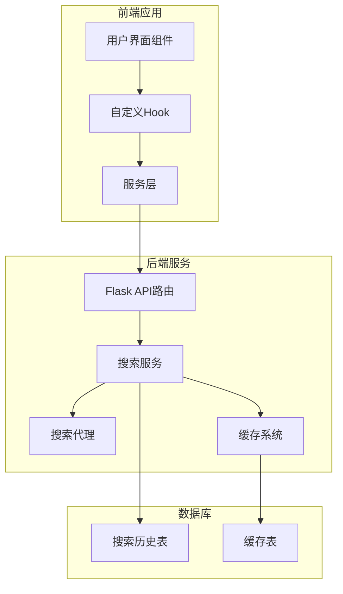
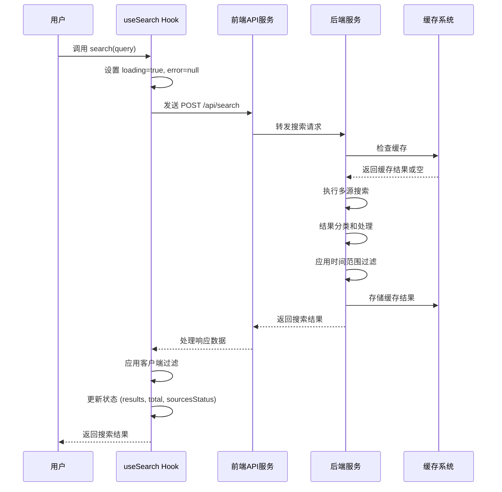
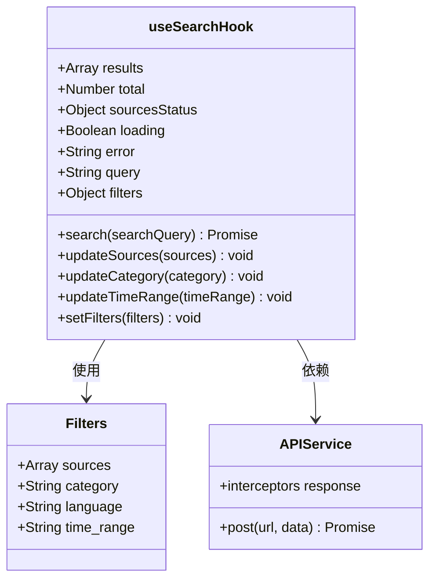
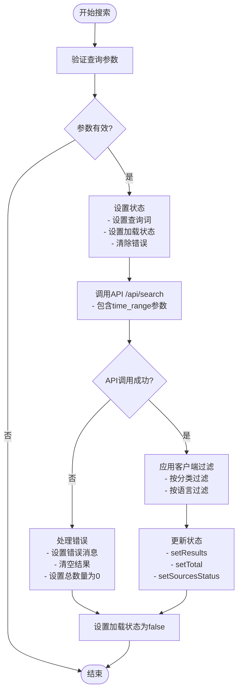
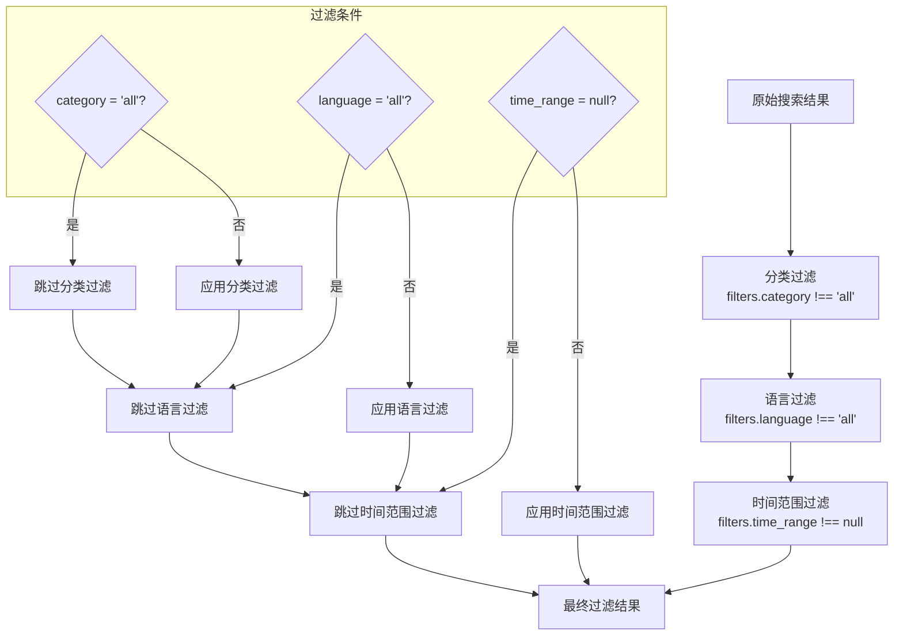
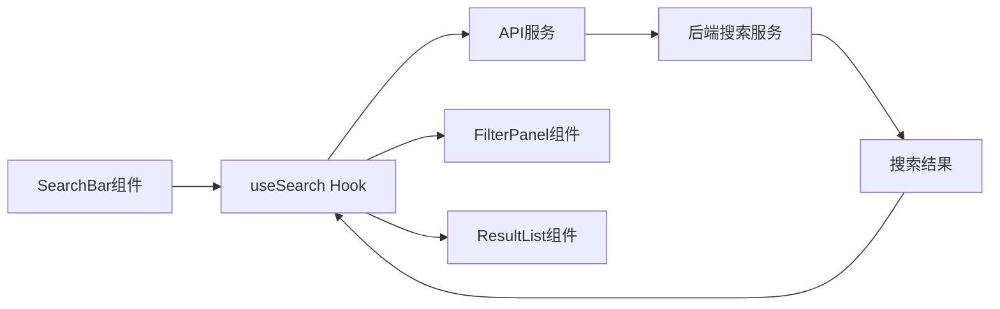
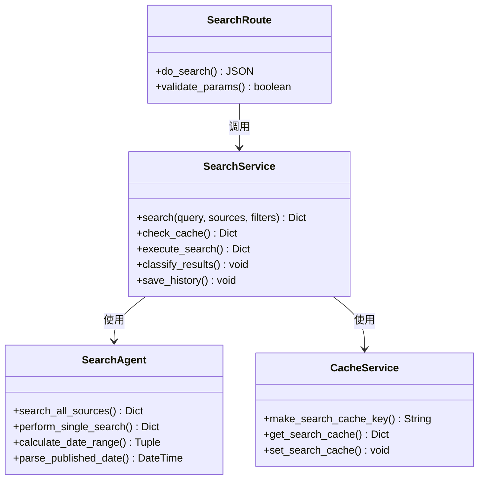
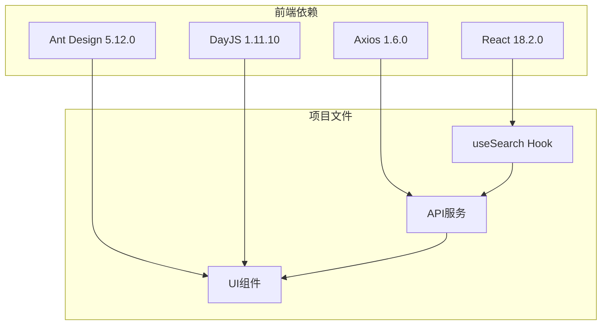
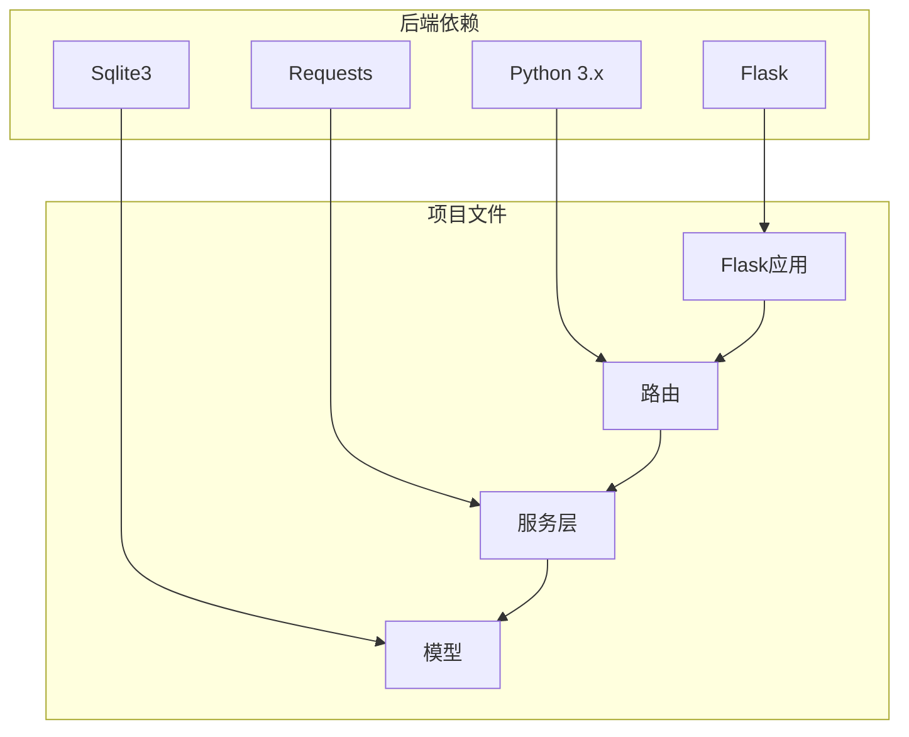
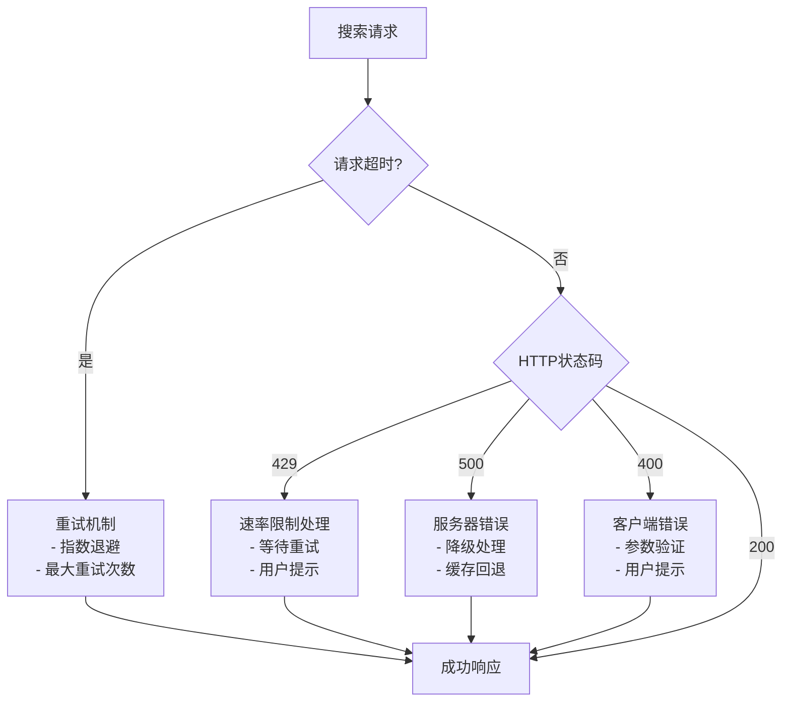

# useSearch Hook - 搜索状态管理

<cite>
**本文档引用的文件**
- [useSearch.js](file://frontend/src/hooks/useSearch.js)
- [api.js](file://frontend/src/services/api.js)
- [App.jsx](file://frontend/src/App.jsx)
- [SearchBar.jsx](file://frontend/src/components/SearchBar.jsx)
- [FilterPanel.jsx](file://frontend/src/components/FilterPanel.jsx)
- [ResultList.jsx](file://frontend/src/components/ResultList.jsx)
- [ResultItem.jsx](file://frontend/src/components/ResultItem.jsx)
- [HistoryPanel.jsx](file://frontend/src/components/HistoryPanel.jsx)
- [search_service.py](file://backend/services/search_service.py)
- [search.py](file://backend/routes/search.py)
- [config.py](file://backend/config.py)
- [schemas.py](file://backend/models/schemas.py)
- [search_agent.py](file://.qoder/agents/search_agent.py)
</cite>

## 更新摘要
**变更内容**
- 新增时间范围过滤功能：在useSearch Hook中增加了time_range过滤器支持
- 新增updateTimeRange回调函数：用于管理时间范围状态变化
- 更新状态结构：filters对象现在包含time_range属性
- 更新API调用：search函数现在包含time_range参数
- 更新后端支持：后端路由和搜索代理支持时间范围过滤

## 目录
1. [简介](#简介)
2. [项目结构](#项目结构)
3. [核心组件](#核心组件)
4. [架构概览](#架构概览)
5. [详细组件分析](#详细组件分析)
6. [依赖关系分析](#依赖关系分析)
7. [性能考虑](#性能考虑)
8. [故障排除指南](#故障排除指南)
9. [结论](#结论)
10. [附录](#附录)

## 简介

useSearch Hook 是本项目前端搜索功能的核心状态管理模块，负责处理用户搜索请求、管理搜索结果状态、实现客户端过滤机制，并与后端搜索服务进行交互。该Hook实现了完整的搜索生命周期管理，包括状态初始化、异步搜索执行、错误处理和状态更新策略。

**更新** 新增了时间范围过滤功能，允许用户按时间区间筛选搜索结果，支持"不限"、"近一周"、"近一月"、"近一年"、"近三年"等多种时间范围选项。

## 项目结构

该项目采用前后端分离的架构设计，前端使用React + Ant Design构建用户界面，后端使用Flask提供RESTful API服务。



**图表来源**
- [App.jsx](file://frontend/src/App.jsx#L1-L152)
- [useSearch.js](file://frontend/src/hooks/useSearch.js#L1-L82)
- [search_agent.py](file://.qoder/agents/search_agent.py#L1-L408)

**章节来源**
- [App.jsx](file://frontend/src/App.jsx#L1-L152)
- [useSearch.js](file://frontend/src/hooks/useSearch.js#L1-L82)

## 核心组件

useSearch Hook 提供了完整的搜索状态管理功能，包含以下核心状态：

### 状态结构详解

| 状态名称 | 类型 | 默认值 | 作用描述 |
|---------|------|--------|----------|
| results | Array | [] | 搜索结果数组，包含过滤后的结果 |
| total | Number | 0 | 搜索结果总数 |
| sourcesStatus | Object | {} | 各数据源的搜索状态 |
| loading | Boolean | false | 搜索加载状态 |
| error | String/null | null | 错误信息 |
| query | String | '' | 当前搜索关键词 |
| filters | Object | {sources: [], category: 'all', language: 'all', time_range: null} | 搜索过滤条件 |

**更新** 新增time_range属性，默认值为null，表示不限制时间范围。支持的值包括：null（不限）、"week"（近一周）、"month"（近一月）、"year"（近一年）、"3years"（近三年）。

### 关键方法

- **search(searchQuery)**: 执行异步搜索的主要方法
- **updateSources(sources)**: 更新数据源过滤条件
- **updateCategory(category)**: 更新内容分类过滤条件
- **updateTimeRange(timeRange)**: 更新时间范围过滤条件
- **setFilters(filters)**: 直接设置完整过滤条件

**章节来源**
- [useSearch.js](file://frontend/src/hooks/useSearch.js#L13-L18)
- [useSearch.js](file://frontend/src/hooks/useSearch.js#L55-L65)

## 架构概览

useSearch Hook 采用React Hooks模式，结合客户端过滤和服务器端搜索的混合架构。



**图表来源**
- [useSearch.js](file://frontend/src/hooks/useSearch.js#L20-L53)
- [api.js](file://frontend/src/services/api.js#L10-L29)
- [search_agent.py](file://.qoder/agents/search_agent.py#L73-L175)

## 详细组件分析

### useSearch Hook 实现分析

#### 状态初始化和依赖管理

Hook使用React的useState和useCallback来管理状态，其中filters作为依赖项影响search函数的重新创建。



**图表来源**
- [useSearch.js](file://frontend/src/hooks/useSearch.js#L6-L18)
- [useSearch.js](file://frontend/src/hooks/useSearch.js#L20-L53)

#### 异步搜索流程

search函数实现了完整的异步搜索流程，包括参数验证、状态更新、API调用和错误处理。



**图表来源**
- [useSearch.js](file://frontend/src/hooks/useSearch.js#L20-L53)

#### 客户端过滤机制

Hook实现了双重过滤机制：

1. **服务器端过滤**: 通过filters参数传递给后端
2. **客户端过滤**: 在前端应用额外的过滤逻辑



**图表来源**
- [useSearch.js](file://frontend/src/hooks/useSearch.js#L38-L41)
- [App.jsx](file://frontend/src/App.jsx#L70-L74)

#### 状态更新策略

Hook提供了多种状态更新方法，每种都有特定的触发时机和数据格式：

| 方法 | 触发时机 | 数据格式 | 作用 |
|------|----------|----------|------|
| setResults | 搜索成功后 | Array | 更新搜索结果列表 |
| setTotal | 搜索成功后 | Number | 更新结果总数 |
| setSourcesStatus | 搜索成功后 | Object | 更新各数据源状态 |
| setError | 搜索失败时 | String/null | 更新错误信息 |
| setQuery | 搜索开始时 | String | 更新当前查询词 |
| **updateTimeRange** | **用户选择时间范围时** | **String/null** | **更新时间范围过滤条件** |

**更新** 新增updateTimeRange方法，用于管理时间范围状态变化。该方法接收time_range参数，支持null（不限）和各种时间范围值。

**章节来源**
- [useSearch.js](file://frontend/src/hooks/useSearch.js#L40-L53)
- [useSearch.js](file://frontend/src/hooks/useSearch.js#L63-L65)

### 组件集成分析

#### 搜索栏组件集成

SearchBar组件与useSearch Hook紧密集成，提供用户交互界面。



**图表来源**
- [SearchBar.jsx](file://frontend/src/components/SearchBar.jsx#L20-L65)
- [App.jsx](file://frontend/src/App.jsx#L81-L88)

#### 过滤面板组件

FilterPanel组件展示搜索结果统计信息，并允许用户选择不同的内容分类。

**章节来源**
- [FilterPanel.jsx](file://frontend/src/components/FilterPanel.jsx#L16-L51)
- [App.jsx](file://frontend/src/App.jsx#L114-L118)

### 后端服务集成

#### 搜索服务架构

后端使用Flask提供RESTful API，实现了多源搜索、缓存和结果分类功能。



**图表来源**
- [search.py](file://backend/routes/search.py#L12-L35)
- [search_agent.py](file://.qoder/agents/search_agent.py#L73-L175)

**章节来源**
- [search_agent.py](file://.qoder/agents/search_agent.py#L73-L175)
- [search.py](file://backend/routes/search.py#L12-L35)

## 依赖关系分析

### 前端依赖关系



**图表来源**
- [package.json](file://frontend/package.json#L11-L17)
- [useSearch.js](file://frontend/src/hooks/useSearch.js#L1-L2)
- [api.js](file://frontend/src/services/api.js#L1-L8)

### 后端依赖关系



**图表来源**
- [search_agent.py](file://.qoder/agents/search_agent.py#L1-L18)
- [search.py](file://backend/routes/search.py#L1-L7)

**章节来源**
- [package.json](file://frontend/package.json#L11-L17)
- [search_agent.py](file://.qoder/agents/search_agent.py#L1-L18)

## 性能考虑

### 缓存策略

系统实现了多层次的缓存机制来提升性能：

1. **后端缓存**: 使用SQLite存储搜索结果，支持自定义过期时间
2. **前端缓存**: React状态管理中的结果缓存
3. **浏览器缓存**: API响应的HTTP缓存

### 性能优化建议

1. **防抖处理**: 对频繁的搜索输入添加防抖机制
2. **虚拟滚动**: 对大量结果使用虚拟滚动技术
3. **懒加载**: 对图片和内容使用懒加载
4. **并发控制**: 限制同时进行的搜索请求数量
5. **时间范围优化**: 对arXiv和Semantic Scholar等支持原生时间过滤的数据源，使用更精确的查询参数减少不必要的结果获取

### 错误处理和重试机制

系统实现了完善的错误处理机制：



**图表来源**
- [api.js](file://frontend/src/services/api.js#L10-L29)

**章节来源**
- [api.js](file://frontend/src/services/api.js#L10-L29)
- [search_agent.py](file://.qoder/agents/search_agent.py#L119-L136)

## 故障排除指南

### 常见问题诊断

1. **搜索无结果**
   - 检查后端日志了解具体错误
   - 验证数据源可用性
   - 确认查询关键词的有效性
   - **检查时间范围过滤是否过于严格**

2. **API请求失败**
   - 检查网络连接状态
   - 验证API端点可达性
   - 查看错误拦截器输出
   - **确认time_range参数格式正确**

3. **性能问题**
   - 监控缓存命中率
   - 检查数据库连接池
   - 优化查询语句
   - **检查时间范围过滤对不同数据源的影响**

### 调试工具

- **浏览器开发者工具**: 监控网络请求和响应
- **后端日志**: 查看详细的错误信息和性能指标
- **状态检查**: 使用React DevTools检查Hook状态变化
- **时间范围调试**: 检查filters.time_range的值和有效性

**章节来源**
- [api.js](file://frontend/src/services/api.js#L10-L29)
- [config.py](file://backend/config.py#L53-L59)

## 结论

useSearch Hook 作为一个完整的搜索状态管理解决方案，成功地实现了以下目标：

1. **状态管理**: 提供了清晰的状态结构和更新策略
2. **异步处理**: 实现了健壮的异步搜索流程
3. **过滤机制**: 支持多维度的结果过滤，包括新增的时间范围过滤
4. **错误处理**: 包含全面的错误处理和用户反馈
5. **性能优化**: 通过缓存和优化策略提升用户体验

**更新** 新增的时间范围过滤功能进一步增强了搜索的精确性和实用性。该功能支持多种时间范围选项，为用户提供了更精细的搜索控制能力。后端实现了智能的时间范围过滤，包括原生支持和后端安全过滤两种方式，确保了过滤效果的一致性和可靠性。

该Hook的设计充分体现了现代React开发的最佳实践，为用户提供了流畅的搜索体验。

## 附录

### API接口规范

#### 搜索接口

**请求**
```
POST /api/search
Content-Type: application/json

{
    "query": "搜索关键词",
    "sources": ["duckduckgo", "arxiv", "scholar", "zhihu"],
    "filters": {
        "time_range": "month"
    }
}
```

**响应**
```javascript
{
    "results": [...],
    "total": 15,
    "sources_status": {"arxiv": "success", "duckduckgo": "success"}
}
```

**更新** filters对象现在包含time_range字段，支持null（不限）和各种时间范围值。

### 使用示例

#### 基本使用
```javascript
const { results, total, loading, search } = useSearch();

// 执行搜索
useEffect(() => {
  search('react hooks');
}, []);

// 渲染结果
return (
  <div>
    <p>共找到 {total} 条结果</p>
    {results.map(item => (
      <div key={item.url}>{item.title}</div>
    ))}
  </div>
);
```

#### 错误处理
```javascript
const { error, loading, search } = useSearch();

useEffect(() => {
  const performSearch = async () => {
    try {
      await search('query');
    } catch (err) {
      console.error('搜索失败:', err.message);
    }
  };
  
  performSearch();
}, []);
```

#### 过滤使用
```javascript
const { filters, updateCategory, updateSources, updateTimeRange } = useSearch();

// 更新分类过滤
const handleCategoryChange = (category) => {
  updateCategory(category);
};

// 更新数据源
const handleSourceChange = (sources) => {
  updateSources(sources);
};

// 更新时间范围
const handleTimeRangeChange = (timeRange) => {
  updateTimeRange(timeRange);
};
```

#### 时间范围过滤最佳实践
```javascript
// 使用时间范围过滤提高搜索精度
const handleTimeRangeChange = (timeRange) => {
  // 设置时间范围后自动触发搜索
  updateTimeRange(timeRange);
  // 或者手动调用search函数
  // search(currentQuery);
};

// 清除时间范围过滤
const clearTimeRange = () => {
  updateTimeRange(null);
};
```

### 最佳实践

1. **状态管理**: 使用useMemo优化昂贵的计算
2. **错误处理**: 实现统一的错误边界和用户反馈
3. **性能优化**: 添加防抖和节流机制
4. **用户体验**: 提供加载状态和进度指示
5. **可访问性**: 确保键盘导航和屏幕阅读器支持
6. **时间范围优化**: 合理使用时间范围过滤，避免过度严格的条件导致结果过少
7. **数据源兼容性**: 注意不同数据源对时间范围过滤的支持程度

**章节来源**
- [README.md](file://README.md#L229-L275)
- [App.jsx](file://frontend/src/App.jsx#L19-L29)
- [SearchBar.jsx](file://frontend/src/components/SearchBar.jsx#L12-L18)