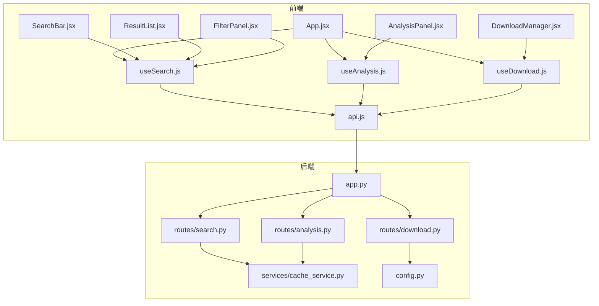
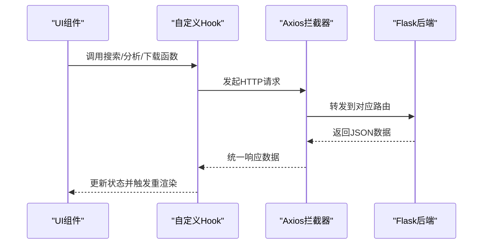
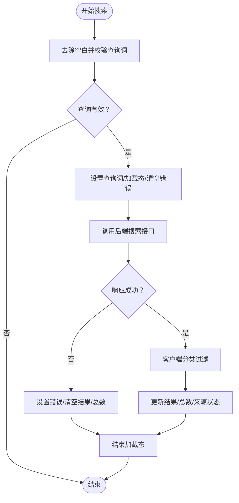
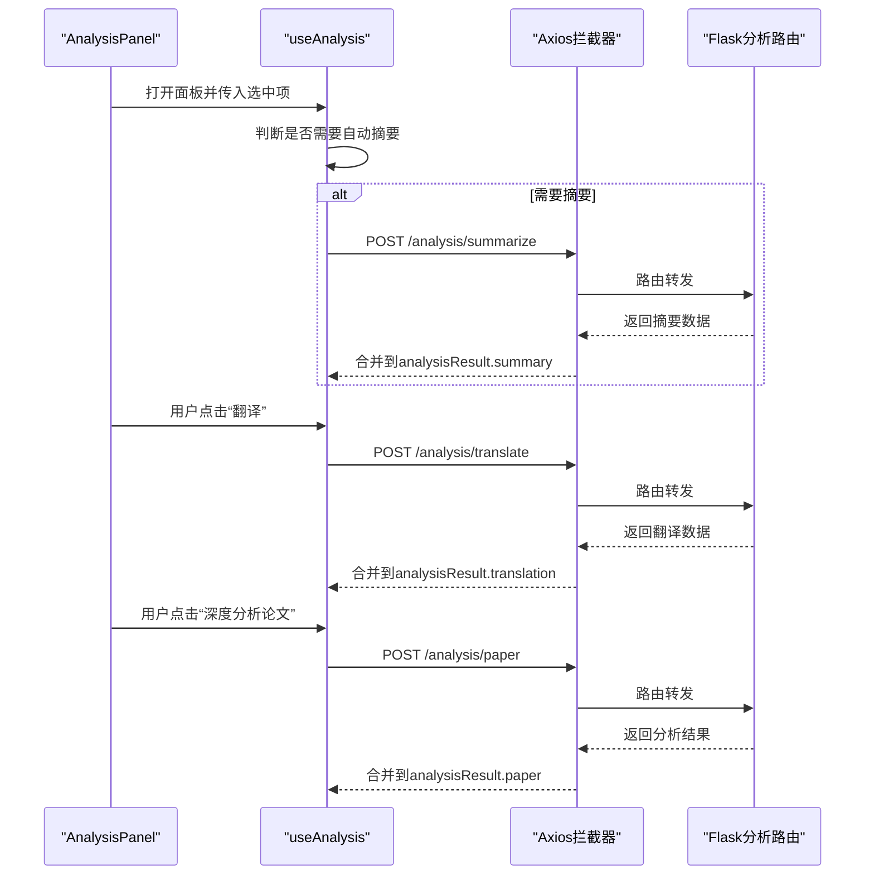
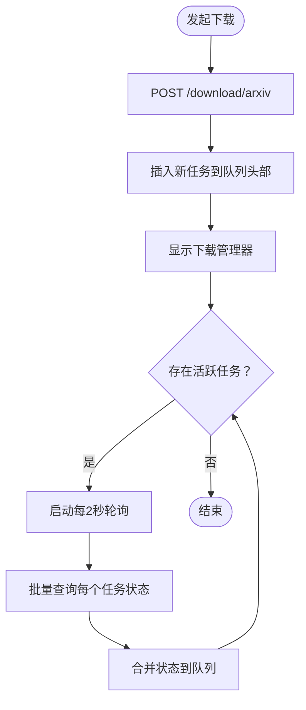
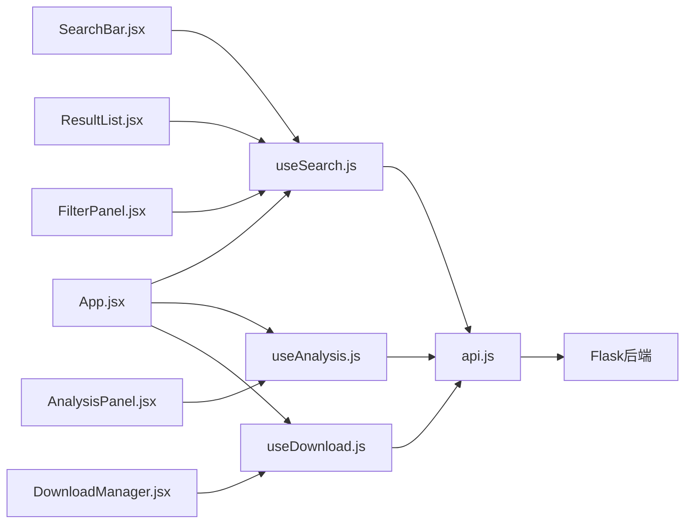

# 状态管理与自定义Hook

<cite>
**本文引用的文件**
- [frontend/src/hooks/useSearch.js](file://frontend/src/hooks/useSearch.js)
- [frontend/src/hooks/useAnalysis.js](file://frontend/src/hooks/useAnalysis.js)
- [frontend/src/hooks/useDownload.js](file://frontend/src/hooks/useDownload.js)
- [frontend/src/services/api.js](file://frontend/src/services/api.js)
- [frontend/src/App.jsx](file://frontend/src/App.jsx)
- [frontend/src/components/SearchBar.jsx](file://frontend/src/components/SearchBar.jsx)
- [frontend/src/components/AnalysisPanel.jsx](file://frontend/src/components/AnalysisPanel.jsx)
- [frontend/src/components/DownloadManager.jsx](file://frontend/src/components/DownloadManager.jsx)
- [frontend/src/components/ResultList.jsx](file://frontend/src/components/ResultList.jsx)
- [frontend/src/components/FilterPanel.jsx](file://frontend/src/components/FilterPanel.jsx)
- [backend/routes/search.py](file://backend/routes/search.py)
- [backend/routes/analysis.py](file://backend/routes/analysis.py)
- [backend/routes/download.py](file://backend/routes/download.py)
- [backend/services/cache_service.py](file://backend/services/cache_service.py)
- [backend/config.py](file://backend/config.py)
- [backend/app.py](file://backend/app.py)
- [frontend/package.json](file://frontend/package.json)
</cite>

## 目录
1. [引言](#引言)
2. [项目结构](#项目结构)
3. [核心组件](#核心组件)
4. [架构总览](#架构总览)
5. [详细组件分析](#详细组件分析)
6. [依赖分析](#依赖分析)
7. [性能考虑](#性能考虑)
8. [故障排查指南](#故障排查指南)
9. [结论](#结论)
10. [附录](#附录)

## 引言
本文件系统性梳理前端自定义Hook在状态管理中的应用，重点覆盖以下三个Hook：useSearch（搜索状态与过滤）、useAnalysis（异步分析与错误管理）、useDownload（并发与轮询）。文档从状态流转、副作用处理、数据缓存、组件交互、错误处理、性能优化等维度进行深入解析，并提供状态流转图、Hook依赖关系图与数据流图，帮助开发者理解如何设计可复用、高性能且易维护的Hook。

## 项目结构
前端采用按功能模块组织的目录结构，核心状态由自定义Hook集中管理，UI组件通过Hook暴露的方法与状态进行交互。后端以Flask蓝图划分路由，提供搜索、分析、下载等API，并内置缓存与配置管理。

图表来源
- [frontend/src/App.jsx](file://frontend/src/App.jsx#L16-L50)
- [frontend/src/hooks/useSearch.js](file://frontend/src/hooks/useSearch.js#L6-L72)
- [frontend/src/hooks/useAnalysis.js](file://frontend/src/hooks/useAnalysis.js#L4-L84)
- [frontend/src/hooks/useDownload.js](file://frontend/src/hooks/useDownload.js#L4-L76)
- [frontend/src/services/api.js](file://frontend/src/services/api.js#L4-L31)
- [backend/app.py](file://backend/app.py#L21-L67)
- [backend/routes/search.py](file://backend/routes/search.py#L10-L27)
- [backend/routes/analysis.py](file://backend/routes/analysis.py#L10-L65)
- [backend/routes/download.py](file://backend/routes/download.py#L14-L97)
- [backend/services/cache_service.py](file://backend/services/cache_service.py#L30-L86)
- [backend/config.py](file://backend/config.py#L50-L73)

章节来源
- [frontend/src/App.jsx](file://frontend/src/App.jsx#L16-L50)
- [backend/app.py](file://backend/app.py#L21-L67)

## 核心组件
- useSearch：负责搜索查询、结果展示、客户端分类过滤、多源状态聚合与错误处理。
- useAnalysis：负责摘要、翻译、论文深度分析的异步调用与错误回退，以及面板可见性与标签页切换。
- useDownload：负责发起下载、轮询状态、并发控制与列表管理。

章节来源
- [frontend/src/hooks/useSearch.js](file://frontend/src/hooks/useSearch.js#L6-L72)
- [frontend/src/hooks/useAnalysis.js](file://frontend/src/hooks/useAnalysis.js#L4-L84)
- [frontend/src/hooks/useDownload.js](file://frontend/src/hooks/useDownload.js#L4-L76)

## 架构总览
前端通过自定义Hook统一管理状态，组件只负责渲染与事件分发；后端提供REST接口，结合缓存服务提升性能与稳定性。

图表来源
- [frontend/src/services/api.js](file://frontend/src/services/api.js#L10-L29)
- [backend/routes/search.py](file://backend/routes/search.py#L10-L27)
- [backend/routes/analysis.py](file://backend/routes/analysis.py#L10-L65)
- [backend/routes/download.py](file://backend/routes/download.py#L14-L97)

## 详细组件分析

### useSearch Hook 分析
- 状态结构
  - 结果集、总数、来源状态、加载态、错误信息、查询词、过滤器（来源、分类、语言）。
- 关键行为
  - 搜索执行：清理空查询、设置查询词与加载态、调用后端搜索接口、客户端分类过滤、更新结果与来源状态。
  - 过滤器变更：来源切换、分类筛选，均通过不可变更新方式保持稳定引用。
- 副作用与性能
  - 使用回调封装避免重复创建函数；过滤器作为依赖项影响搜索逻辑，减少不必要重渲染。
- 错误处理
  - 请求异常时设置错误信息、清空结果并结束加载态。
- 数据缓存机制
  - 后端提供搜索缓存服务，使用哈希键与过期时间控制缓存命中与清理；前端未直接实现本地缓存，建议在Hook层增加本地LRU或基于查询参数的内存缓存以降低重复请求。

图表来源
- [frontend/src/hooks/useSearch.js](file://frontend/src/hooks/useSearch.js#L19-L50)
- [backend/routes/search.py](file://backend/routes/search.py#L10-L27)
- [backend/services/cache_service.py](file://backend/services/cache_service.py#L30-L52)

章节来源
- [frontend/src/hooks/useSearch.js](file://frontend/src/hooks/useSearch.js#L6-L72)
- [frontend/src/components/SearchBar.jsx](file://frontend/src/components/SearchBar.jsx#L12-L28)
- [frontend/src/components/ResultList.jsx](file://frontend/src/components/ResultList.jsx#L7-L57)
- [frontend/src/components/FilterPanel.jsx](file://frontend/src/components/FilterPanel.jsx#L16-L49)
- [backend/routes/search.py](file://backend/routes/search.py#L10-L27)
- [backend/services/cache_service.py](file://backend/services/cache_service.py#L30-L52)

### useAnalysis Hook 分析
- 状态结构
  - 分析结果（摘要、翻译、论文分析）、加载态、可见性、选中项、活动标签页。
- 关键行为
  - 摘要/翻译/论文分析：分别调用对应后端接口，合并到分析结果对象；错误时在对应字段写入错误信息。
  - 面板控制：打开时重置状态、关闭时清理状态与选中项。
- 副作用与性能
  - 使用回调封装异步操作，避免闭包陷阱；分析结果采用浅合并策略，确保部分字段更新不影响其他字段。
- 错误管理
  - 接口异常时在对应字段返回错误提示，UI层据此渲染错误信息或占位内容。
- 用户交互响应
  - 面板首次打开且缺少摘要时自动触发摘要生成；根据内容类型启用/禁用特定功能。

图表来源
- [frontend/src/hooks/useAnalysis.js](file://frontend/src/hooks/useAnalysis.js#L11-L57)
- [frontend/src/components/AnalysisPanel.jsx](file://frontend/src/components/AnalysisPanel.jsx#L23-L28)
- [backend/routes/analysis.py](file://backend/routes/analysis.py#L10-L65)
- [frontend/src/services/api.js](file://frontend/src/services/api.js#L10-L29)

章节来源
- [frontend/src/hooks/useAnalysis.js](file://frontend/src/hooks/useAnalysis.js#L4-L84)
- [frontend/src/components/AnalysisPanel.jsx](file://frontend/src/components/AnalysisPanel.jsx#L11-L169)
- [backend/routes/analysis.py](file://backend/routes/analysis.py#L10-L65)

### useDownload Hook 分析
- 状态结构
  - 下载队列、可见性；使用ref保存轮询定时器。
- 关键行为
  - 发起下载：提交arXiv ID与标题，插入新任务至队首并显示管理器。
  - 轮询刷新：对处于“等待中/下载中”的任务批量查询状态并合并更新。
  - 并发控制：通过effect在有活跃任务时启动轮询，在无活跃任务时停止轮询，避免无效请求。
  - 移除任务：根据ID过滤队列。
- 副作用与性能
  - 使用ref保存定时器，避免effect依赖链导致的重复setInterval；对pending任务进行去重与并发处理。
- 错误处理
  - 轮询错误静默处理，保证UI稳定；下载启动失败返回空值供上层判断。
- 进度跟踪与状态同步
  - 状态映射表用于UI图标与颜色；下载完成后提供直链下载入口。

图表来源
- [frontend/src/hooks/useDownload.js](file://frontend/src/hooks/useDownload.js#L9-L64)
- [frontend/src/components/DownloadManager.jsx](file://frontend/src/components/DownloadManager.jsx#L15-L101)
- [backend/routes/download.py](file://backend/routes/download.py#L14-L56)

章节来源
- [frontend/src/hooks/useDownload.js](file://frontend/src/hooks/useDownload.js#L4-L76)
- [frontend/src/components/DownloadManager.jsx](file://frontend/src/components/DownloadManager.jsx#L22-L113)
- [backend/routes/download.py](file://backend/routes/download.py#L14-L97)

## 依赖分析
- 组件与Hook的依赖关系
  - App同时依赖useSearch、useAnalysis、useDownload，作为状态聚合中心。
  - SearchBar、ResultList、FilterPanel消费useSearch状态与方法。
  - AnalysisPanel消费useAnalysis状态与方法。
  - DownloadManager消费useDownload状态与方法。
- Hook之间的耦合
  - 当前三个Hook彼此独立，通过UI协调工作；若需跨Hook共享状态，建议抽象为更高层的Context或组合多个Hook的复合Hook。
- 外部依赖
  - Axios拦截器统一处理响应与错误提示；后端提供REST接口与缓存服务；配置中心提供默认参数与限流策略。

图表来源
- [frontend/src/App.jsx](file://frontend/src/App.jsx#L19-L50)
- [frontend/src/hooks/useSearch.js](file://frontend/src/hooks/useSearch.js#L6-L72)
- [frontend/src/hooks/useAnalysis.js](file://frontend/src/hooks/useAnalysis.js#L4-L84)
- [frontend/src/hooks/useDownload.js](file://frontend/src/hooks/useDownload.js#L4-L76)
- [frontend/src/services/api.js](file://frontend/src/services/api.js#L4-L31)
- [backend/app.py](file://backend/app.py#L21-L67)

章节来源
- [frontend/src/App.jsx](file://frontend/src/App.jsx#L19-L50)
- [frontend/src/services/api.js](file://frontend/src/services/api.js#L4-L31)
- [backend/app.py](file://backend/app.py#L21-L67)

## 性能考虑
- 减少重渲染
  - 将回调函数用useCallback包裹，确保依赖稳定；对过滤器等对象使用不可变更新，避免不必要的订阅者重渲染。
- 异步请求优化
  - useAnalysis对错误进行局部回退，避免整体状态崩溃；useDownload对轮询进行条件启动与静默错误处理，降低UI抖动。
- 缓存策略
  - 后端提供搜索与分析缓存，建议前端在Hook层增加轻量级内存缓存（如LRU），以减少重复请求与提升交互流畅度。
- 并发控制
  - useDownload通过effect动态启停轮询，避免无效请求；建议在业务层限制最大并发数，防止资源争用。
- 本地存储与状态恢复
  - 可将搜索历史、分析记录、下载队列持久化到localStorage/sessionStorage，应用启动时恢复状态，提升用户体验。

## 故障排查指南
- 搜索无结果或报错
  - 检查查询词是否为空；查看useSearch的错误状态与后端返回；确认过滤器是否导致结果为空。
- 分析功能异常
  - 查看useAnalysis的错误字段；确认选中项内容是否为空；检查后端分析路由的参数校验。
- 下载无法开始或状态不更新
  - 确认下载启动接口返回的ID；检查轮询是否启动；查看后端状态查询接口是否正常；确认文件路径是否存在。
- 网络与超时
  - Axios拦截器已统一处理429、5xx、400与超时错误，可在UI层看到提示；必要时调整超时时间与重试策略。

章节来源
- [frontend/src/hooks/useSearch.js](file://frontend/src/hooks/useSearch.js#L43-L49)
- [frontend/src/hooks/useAnalysis.js](file://frontend/src/hooks/useAnalysis.js#L16-L23)
- [frontend/src/hooks/useDownload.js](file://frontend/src/hooks/useDownload.js#L26-L47)
- [frontend/src/services/api.js](file://frontend/src/services/api.js#L10-L29)

## 结论
本项目通过自定义Hook实现了清晰的状态管理与职责分离：useSearch负责搜索与过滤，useAnalysis负责异步分析与错误回退，useDownload负责并发与轮询。配合后端缓存与配置中心，整体具备良好的扩展性与稳定性。建议在前端引入轻量缓存与状态持久化，进一步提升性能与用户体验。

## 附录
- 设计原则
  - 单一职责：每个Hook聚焦一个领域状态。
  - 不可变更新：使用不可变模式减少副作用。
  - 回调稳定：用useCallback包裹异步回调，避免闭包陷阱。
  - 错误局部化：在Hook内捕获并回退错误，保持UI稳定。
- 复用策略
  - 将通用逻辑抽取为更小的辅助Hook（如useAsync、usePolling），在多个业务Hook中复用。
  - 通过参数化配置（如模型、超时、并发数）提升可定制性。
- 最佳实践
  - 在Hook中统一处理加载态、错误态与空态，UI层只负责渲染。
  - 对高频请求进行节流/防抖与缓存，避免重复计算与网络压力。
  - 使用ref管理定时器、订阅等非状态副作用，避免effect依赖链过长。
- 调试技巧
  - 使用浏览器React DevTools追踪状态变化与渲染次数。
  - 在Hook中打印关键状态（如查询词、任务ID、错误信息）以便定位问题。
  - 对异步流程添加日志与埋点，便于回放与分析。