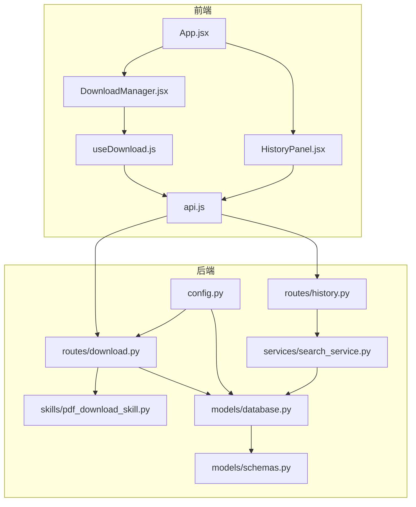
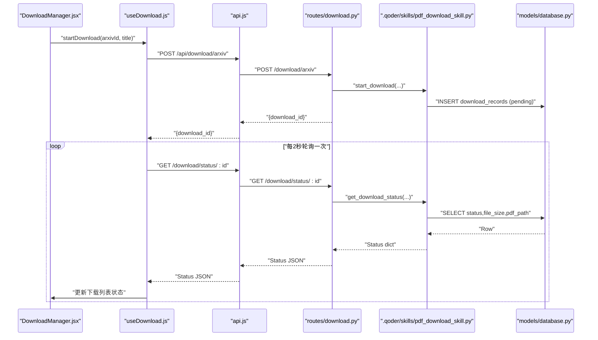
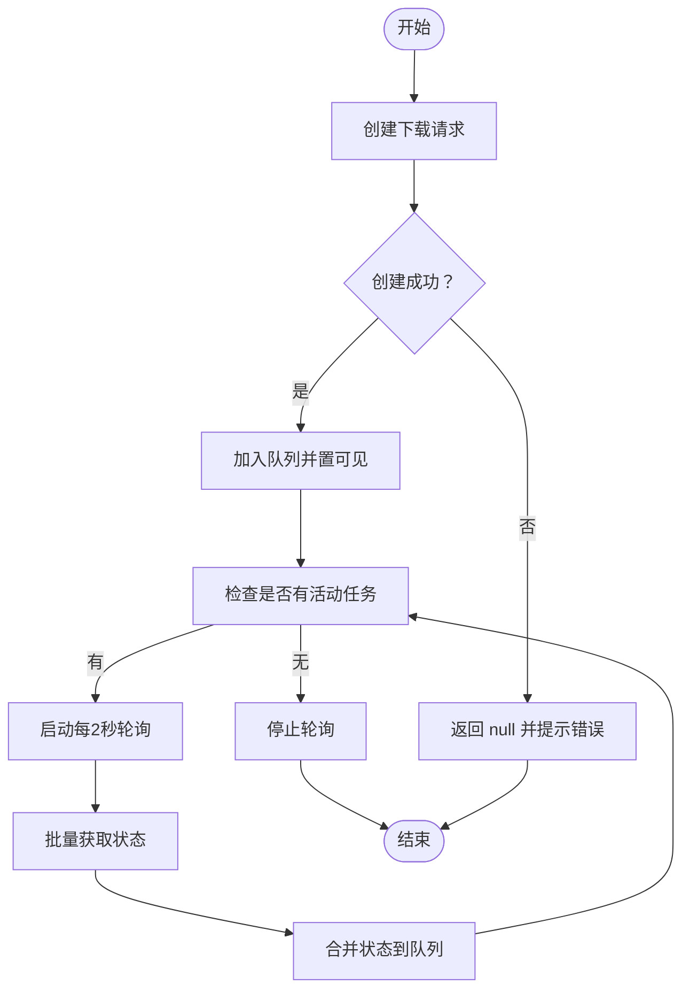
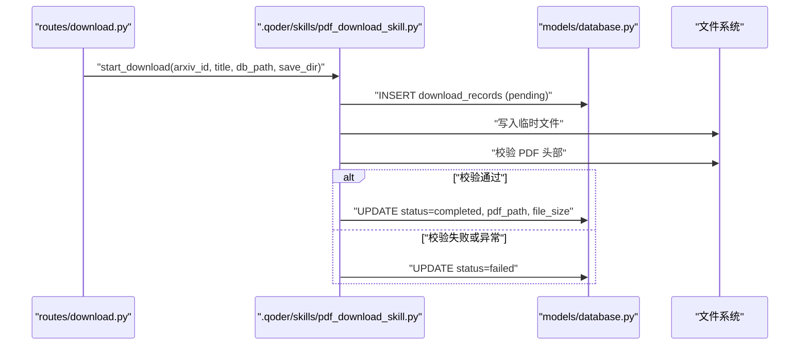
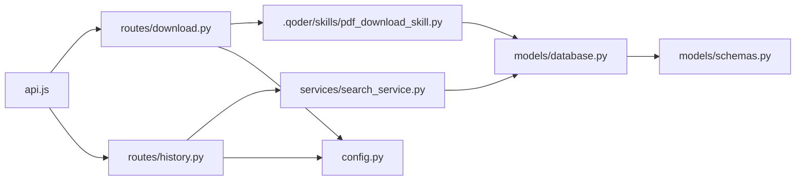

# 下载与历史组件

<cite>
**本文引用的文件**
- [frontend/src/components/DownloadManager.jsx](file://frontend/src/components/DownloadManager.jsx)
- [frontend/src/components/HistoryPanel.jsx](file://frontend/src/components/HistoryPanel.jsx)
- [frontend/src/hooks/useDownload.js](file://frontend/src/hooks/useDownload.js)
- [frontend/src/services/api.js](file://frontend/src/services/api.js)
- [frontend/src/App.jsx](file://frontend/src/App.jsx)
- [backend/routes/download.py](file://backend/routes/download.py)
- [backend/routes/history.py](file://backend/routes/history.py)
- [backend/services/search_service.py](file://backend/services/search_service.py)
- [backend/models/database.py](file://backend/models/database.py)
- [backend/models/schemas.py](file://backend/models/schemas.py)
- [backend/config.py](file://backend/config.py)
- [.qoder/skills/pdf_download_skill.py](file://.qoder/skills/pdf_download_skill.py)
- [.qoder/config.json](file://.qoder/config.json)
- [backend/utils/logger.py](file://backend/utils/logger.py)
</cite>

## 目录
1. [简介](#简介)
2. [项目结构](#项目结构)
3. [核心组件](#核心组件)
4. [架构总览](#架构总览)
5. [详细组件分析](#详细组件分析)
6. [依赖关系分析](#依赖关系分析)
7. [性能考量](#性能考量)
8. [故障排查指南](#故障排查指南)
9. [结论](#结论)

## 简介
本文件聚焦于前端“下载管理器”与“历史面板”两大组件，以及后端对应的下载与历史接口与数据持久化层。文档从设计与实现角度，系统阐述：
- DownloadManager 的下载队列管理、并发控制、进度跟踪与状态更新机制
- HistoryPanel 的历史记录展示、历史搜索功能与数据持久化处理
- 组件的异步操作处理、错误恢复机制与用户体验优化策略
- 组件与文件系统交互、下载状态同步与历史数据管理的技术实现
- 性能优化建议与故障排查指导

## 项目结构
前端采用组件化架构，下载与历史功能通过独立组件与自定义 Hook 驱动；后端以 Flask 蓝图组织路由，配合 SQLite 数据模型与配置中心，实现下载任务状态与搜索历史的持久化。

图表来源
- [frontend/src/App.jsx](file://frontend/src/App.jsx#L1-L149)
- [frontend/src/components/DownloadManager.jsx](file://frontend/src/components/DownloadManager.jsx#L1-L114)
- [frontend/src/components/HistoryPanel.jsx](file://frontend/src/components/HistoryPanel.jsx#L1-L91)
- [frontend/src/hooks/useDownload.js](file://frontend/src/hooks/useDownload.js#L1-L78)
- [frontend/src/services/api.js](file://frontend/src/services/api.js#L1-L32)
- [backend/routes/download.py](file://backend/routes/download.py#L1-L98)
- [backend/routes/history.py](file://backend/routes/history.py#L1-L33)
- [backend/services/search_service.py](file://backend/services/search_service.py#L1-L98)
- [backend/models/database.py](file://backend/models/database.py#L1-L51)
- [backend/models/schemas.py](file://backend/models/schemas.py#L1-L38)
- [backend/config.py](file://backend/config.py#L1-L85)
- [.qoder/skills/pdf_download_skill.py](file://.qoder/skills/pdf_download_skill.py#L1-L146)

章节来源
- [frontend/src/App.jsx](file://frontend/src/App.jsx#L1-L149)
- [backend/config.py](file://backend/config.py#L1-L85)

## 核心组件
- DownloadManager：负责展示下载队列、状态与进度，并提供移除与触发下载的操作入口。
- HistoryPanel：负责展示搜索历史、支持清空与点击回放搜索。
- useDownload：封装下载任务的创建、轮询状态、可见性与移除逻辑。
- 后端下载路由：提供启动下载、查询状态、提供文件与下载历史查询。
- 后端历史路由：提供历史查询与清空。
- 数据持久化：SQLite 表结构定义与连接上下文管理。

章节来源
- [frontend/src/components/DownloadManager.jsx](file://frontend/src/components/DownloadManager.jsx#L1-L114)
- [frontend/src/components/HistoryPanel.jsx](file://frontend/src/components/HistoryPanel.jsx#L1-L91)
- [frontend/src/hooks/useDownload.js](file://frontend/src/hooks/useDownload.js#L1-L78)
- [backend/routes/download.py](file://backend/routes/download.py#L1-L98)
- [backend/routes/history.py](file://backend/routes/history.py#L1-L33)
- [backend/models/schemas.py](file://backend/models/schemas.py#L1-L38)
- [backend/models/database.py](file://backend/models/database.py#L1-L51)

## 架构总览
前端通过统一的 API 客户端与后端交互，后端路由根据请求类型调用相应服务或技能模块，最终访问 SQLite 数据库进行读写。下载流程由后端技能模块在后台线程池中执行，前端通过轮询获取状态并驱动 UI 更新。

图表来源
- [frontend/src/components/DownloadManager.jsx](file://frontend/src/components/DownloadManager.jsx#L1-L114)
- [frontend/src/hooks/useDownload.js](file://frontend/src/hooks/useDownload.js#L1-L78)
- [frontend/src/services/api.js](file://frontend/src/services/api.js#L1-L32)
- [backend/routes/download.py](file://backend/routes/download.py#L1-L98)
- [.qoder/skills/pdf_download_skill.py](file://.qoder/skills/pdf_download_skill.py#L1-L146)
- [backend/models/database.py](file://backend/models/database.py#L1-L51)

## 详细组件分析

### DownloadManager 组件
- 展示下载队列：基于传入的下载数组渲染列表项，显示标题、状态图标、颜色与文本、文件大小等。
- 状态映射：将内部状态映射为 UI 图标与颜色，便于用户快速识别任务状态。
- 进度展示：当处于下载中时显示进度条（当前实现为固定百分比占位，可扩展为真实进度）。
- 操作入口：对已完成的任务提供下载链接；提供移除按钮用于清理已完成或失败的任务。
- 可见性与计数：顶部显示“下载管理”标题与未完成任务数量徽章，支持展开/收起。

章节来源
- [frontend/src/components/DownloadManager.jsx](file://frontend/src/components/DownloadManager.jsx#L1-L114)

### useDownload Hook（下载管理钩子）
- 任务创建：向后端发起创建下载请求，成功后将新任务插入队列头部，设置可见性并返回任务 ID。
- 状态轮询：仅对“等待中/下载中”的任务进行轮询，轮询间隔为 2 秒；当无活动任务时停止轮询。
- 状态更新：拉取单个任务状态后合并到现有队列，保持 UI 即时刷新。
- 错误处理：轮询过程中的异常被忽略，避免影响其他任务的状态更新。
- 任务移除：根据 ID 过滤队列，支持清理已完成或失败的任务。

图表来源
- [frontend/src/hooks/useDownload.js](file://frontend/src/hooks/useDownload.js#L1-L78)

章节来源
- [frontend/src/hooks/useDownload.js](file://frontend/src/hooks/useDownload.js#L1-L78)

### 后端下载路由与技能模块
- 启动下载：接收 arXiv ID 与标题，调用技能模块创建下载记录并提交到线程池执行。
- 查询状态：根据记录 ID 查询数据库，返回当前状态、文件路径、大小与时间戳。
- 提供文件：仅在状态为“已完成”时返回 PDF 文件，否则返回相应错误码。
- 下载历史：查询所有下载记录，按时间倒序返回。
- 技能模块：使用线程池并发执行下载，镜像回退策略，校验 PDF 有效性，更新数据库状态。

图表来源
- [backend/routes/download.py](file://backend/routes/download.py#L1-L98)
- [.qoder/skills/pdf_download_skill.py](file://.qoder/skills/pdf_download_skill.py#L1-L146)
- [backend/models/database.py](file://backend/models/database.py#L1-L51)

章节来源
- [backend/routes/download.py](file://backend/routes/download.py#L1-L98)
- [.qoder/skills/pdf_download_skill.py](file://.qoder/skills/pdf_download_skill.py#L1-L146)
- [backend/models/database.py](file://backend/models/database.py#L1-L51)

### 历史面板组件
- 历史加载：打开抽屉时自动拉取最近的历史记录，默认限制条数。
- 清空历史：通过确认对话框触发删除请求，成功后清空本地列表。
- 历史回放：点击某条历史记录触发上层回调进行搜索，并关闭抽屉。
- 空状态：无历史时显示空状态提示。

章节来源
- [frontend/src/components/HistoryPanel.jsx](file://frontend/src/components/HistoryPanel.jsx#L1-L91)

### 后端历史路由与服务
- 历史查询：支持 limit 参数，范围限制在 1~100，按时间倒序返回。
- 清空历史：删除表内全部记录。
- 持久化：通过数据库连接上下文管理事务，确保一致性。
- 保存历史：搜索服务在返回结果后将查询、过滤条件与结果数量写入历史表。

章节来源
- [backend/routes/history.py](file://backend/routes/history.py#L1-L33)
- [backend/services/search_service.py](file://backend/services/search_service.py#L1-L98)
- [backend/models/database.py](file://backend/models/database.py#L1-L51)
- [backend/models/schemas.py](file://backend/models/schemas.py#L1-L38)

### 数据模型与配置
- 数据库初始化：在应用启动时创建必要的表（搜索历史、缓存、分析缓存、下载记录）。
- 连接上下文：线程局部连接，启用 WAL、超时与外键约束，保证并发安全。
- 配置中心：融合 .env 与 .qoder/config.json，提供下载并发、镜像源、默认搜索源等配置。

章节来源
- [backend/models/schemas.py](file://backend/models/schemas.py#L1-L38)
- [backend/models/database.py](file://backend/models/database.py#L1-L51)
- [backend/config.py](file://backend/config.py#L1-L85)
- [.qoder/config.json](file://.qoder/config.json#L1-L31)

## 依赖关系分析
- 前端依赖
  - API 客户端：统一拦截器处理错误码与提示，屏蔽底层网络细节。
  - 组件依赖 Hook：DownloadManager 与 HistoryPanel 分别消费 useDownload 与 API。
- 后端依赖
  - 路由依赖服务与技能模块：下载路由调用 PDF 技能，历史路由调用搜索服务。
  - 服务依赖数据库：历史保存与查询均通过数据库上下文管理。
  - 技能模块依赖线程池与外部资源：并发下载与镜像回退。

图表来源
- [frontend/src/services/api.js](file://frontend/src/services/api.js#L1-L32)
- [backend/routes/download.py](file://backend/routes/download.py#L1-L98)
- [backend/routes/history.py](file://backend/routes/history.py#L1-L33)
- [backend/services/search_service.py](file://backend/services/search_service.py#L1-L98)
- [.qoder/skills/pdf_download_skill.py](file://.qoder/skills/pdf_download_skill.py#L1-L146)
- [backend/models/database.py](file://backend/models/database.py#L1-L51)
- [backend/models/schemas.py](file://backend/models/schemas.py#L1-L38)
- [backend/config.py](file://backend/config.py#L1-L85)

## 性能考量
- 并发控制
  - 后端线程池最大工作线程数与下载并发上限由配置决定，避免过度占用资源。
  - 前端轮询频率为 2 秒，可根据实际场景调整，减少不必要的请求。
- I/O 优化
  - 后端下载使用流式写入与分块读取，降低内存峰值。
  - 数据库启用 WAL 模式与超时设置，提升并发读写稳定性。
- 缓存与索引
  - 搜索历史与分析缓存具备索引，查询效率高。
- 用户体验
  - 下载进度条占位符可替换为真实进度（需后端返回已下载字节），提升感知速度。
  - 历史面板默认限制条数，避免一次性加载过多数据。

章节来源
- [.qoder/config.json](file://.qoder/config.json#L1-L31)
- [backend/config.py](file://backend/config.py#L1-L85)
- [.qoder/skills/pdf_download_skill.py](file://.qoder/skills/pdf_download_skill.py#L1-L146)
- [backend/models/database.py](file://backend/models/database.py#L1-L51)

## 故障排查指南
- 下载无法开始
  - 检查后端日志与错误响应，确认 arXiv ID 是否为空、技能模块是否可用。
  - 确认下载目录存在且可写。
- 下载卡在“等待中”
  - 检查线程池是否已满，适当提高并发上限或减少同时任务数。
  - 查看轮询是否正常，确认前端轮询开关逻辑。
- 下载完成后无法下载文件
  - 确认状态为“已完成”，文件路径存在且可读。
  - 校验 PDF 文件头与大小，避免无效文件。
- 历史无法加载或清空
  - 检查数据库连接与表是否存在，确认历史服务返回的数据结构。
  - 清空历史后确认前端列表已清空。
- 网络与超时
  - API 客户端已内置错误提示，关注 429、5xx、400 等状态码。
  - 若出现超时，适当增加请求超时时间或减少并发。

章节来源
- [frontend/src/services/api.js](file://frontend/src/services/api.js#L1-L32)
- [backend/routes/download.py](file://backend/routes/download.py#L1-L98)
- [backend/routes/history.py](file://backend/routes/history.py#L1-L33)
- [.qoder/skills/pdf_download_skill.py](file://.qoder/skills/pdf_download_skill.py#L1-L146)
- [backend/utils/logger.py](file://backend/utils/logger.py#L1-L23)

## 结论
该组件体系通过清晰的前后端职责划分与稳定的数据库持久化，实现了可靠的下载与历史管理能力。前端通过 Hook 将复杂的状态与异步流程抽象为简单易用的接口，后端通过线程池与镜像回退保障下载的鲁棒性。后续可在真实进度上报、并发上限动态调节与缓存策略等方面进一步优化，以获得更佳的性能与用户体验。