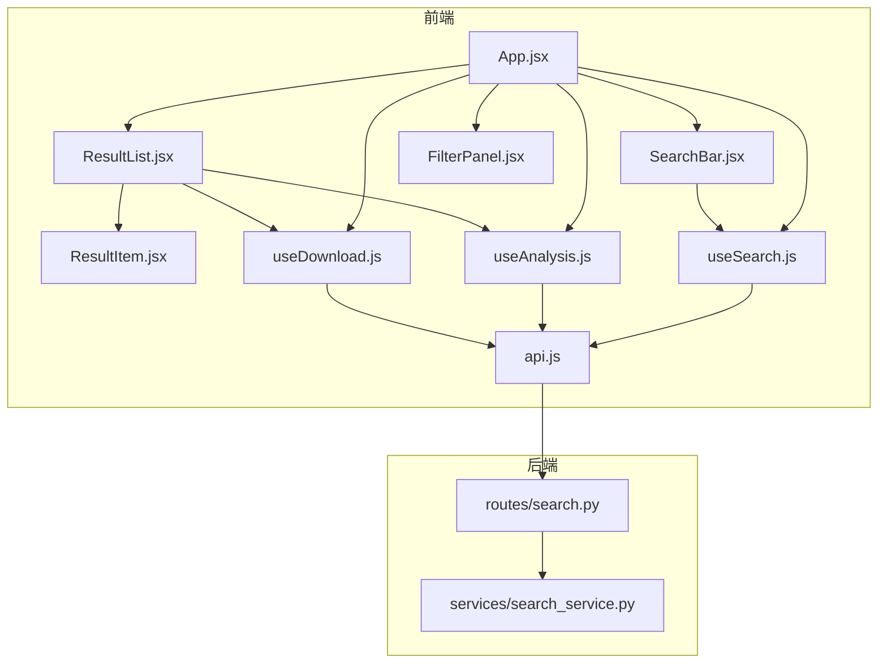
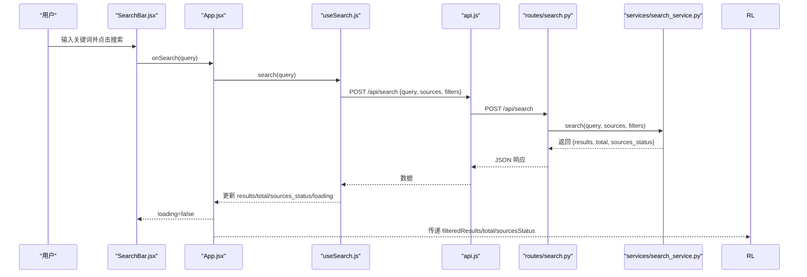
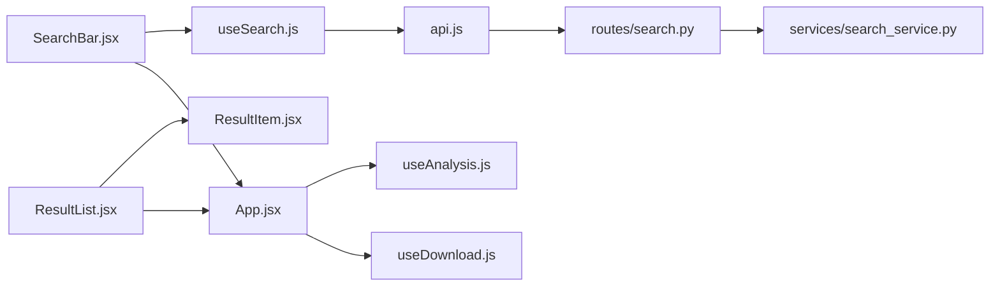

# 搜索相关组件

<cite>
**本文档引用的文件**
- [frontend/src/components/SearchBar.jsx](file://frontend/src/components/SearchBar.jsx)
- [frontend/src/components/ResultList.jsx](file://frontend/src/components/ResultList.jsx)
- [frontend/src/components/ResultItem.jsx](file://frontend/src/components/ResultItem.jsx)
- [frontend/src/hooks/useSearch.js](file://frontend/src/hooks/useSearch.js)
- [frontend/src/services/api.js](file://frontend/src/services/api.js)
- [frontend/src/App.jsx](file://frontend/src/App.jsx)
- [frontend/src/components/FilterPanel.jsx](file://frontend/src/components/FilterPanel.jsx)
- [frontend/src/hooks/useAnalysis.js](file://frontend/src/hooks/useAnalysis.js)
- [frontend/src/hooks/useDownload.js](file://frontend/src/hooks/useDownload.js)
- [backend/routes/search.py](file://backend/routes/search.py)
- [backend/services/search_service.py](file://backend/services/search_service.py)
</cite>

## 目录
1. [简介](#简介)
2. [项目结构](#项目结构)
3. [核心组件](#核心组件)
4. [架构总览](#架构总览)
5. [详细组件分析](#详细组件分析)
6. [依赖关系分析](#依赖关系分析)
7. [性能考虑](#性能考虑)
8. [故障排除指南](#故障排除指南)
9. [结论](#结论)
10. [附录](#附录)

## 简介
本文件聚焦于前端搜索相关组件的设计与实现，重点覆盖以下三个核心组件：
- SearchBar：负责用户输入、数据源选择与搜索触发
- ResultList：结果列表容器、加载状态与来源状态展示
- ResultItem：单条结果项的渲染、元信息展示与交互处理

同时，文档阐述了组件间通信方式、数据流向、状态管理策略以及渲染优化技巧，并提供使用示例与最佳实践建议。

## 项目结构
前端采用 React + Ant Design 架构，组件通过自定义 Hook 进行状态管理，后端提供 REST 接口支持多源搜索与缓存。

图表来源
- [frontend/src/App.jsx](file://frontend/src/App.jsx#L1-L149)
- [frontend/src/components/SearchBar.jsx](file://frontend/src/components/SearchBar.jsx#L1-L42)
- [frontend/src/components/ResultList.jsx](file://frontend/src/components/ResultList.jsx#L1-L58)
- [frontend/src/components/ResultItem.jsx](file://frontend/src/components/ResultItem.jsx#L1-L108)
- [frontend/src/components/FilterPanel.jsx](file://frontend/src/components/FilterPanel.jsx#L1-L52)
- [frontend/src/hooks/useSearch.js](file://frontend/src/hooks/useSearch.js#L1-L74)
- [frontend/src/hooks/useAnalysis.js](file://frontend/src/hooks/useAnalysis.js#L1-L86)
- [frontend/src/hooks/useDownload.js](file://frontend/src/hooks/useDownload.js#L1-L78)
- [frontend/src/services/api.js](file://frontend/src/services/api.js#L1-L32)
- [backend/routes/search.py](file://backend/routes/search.py#L1-L28)
- [backend/services/search_service.py](file://backend/services/search_service.py#L1-L98)

章节来源
- [frontend/src/App.jsx](file://frontend/src/App.jsx#L1-L149)
- [frontend/src/main.jsx](file://frontend/src/main.jsx#L1-L15)

## 核心组件
本节从职责、接口、状态与交互四个方面概述三个核心组件。

- SearchBar
  - 职责：提供搜索输入框、数据源复选框组，触发搜索回调
  - 关键 Props：onSearch、sources、onSourcesChange、loading
  - 关键行为：输入回车或点击“搜索”按钮时调用 onSearch；数据源变更时调用 onSourcesChange
  - 复杂度：O(1)，UI 层轻量组件

- ResultList
  - 职责：根据 loading、results、total、sourcesStatus 渲染列表与统计信息
  - 关键 Props：results、total、loading、sourcesStatus、onAnalyze、onDownload
  - 关键行为：空结果展示 Empty；加载中展示 Spin；逐项渲染 ResultItem
  - 复杂度：O(n)，n 为结果数量

- ResultItem
  - 职责：渲染单条结果的标题、摘要、分类标签、来源、作者、发布时间、域名等元信息，并提供分析、翻译、下载等操作
  - 关键 Props：item、onAnalyze、onDownload
  - 关键行为：点击“AI分析”、“翻译”触发 onAnalyze；arXiv 条目提供“下载PDF”
  - 复杂度：O(1)，渲染开销主要来自 Ant Design 组件

章节来源
- [frontend/src/components/SearchBar.jsx](file://frontend/src/components/SearchBar.jsx#L12-L41)
- [frontend/src/components/ResultList.jsx](file://frontend/src/components/ResultList.jsx#L7-L57)
- [frontend/src/components/ResultItem.jsx](file://frontend/src/components/ResultItem.jsx#L37-L107)

## 架构总览
下图展示了从前端组件到后端服务的数据流与交互路径。

图表来源
- [frontend/src/components/SearchBar.jsx](file://frontend/src/components/SearchBar.jsx#L13-L17)
- [frontend/src/App.jsx](file://frontend/src/App.jsx#L19-L28)
- [frontend/src/hooks/useSearch.js](file://frontend/src/hooks/useSearch.js#L19-L50)
- [frontend/src/services/api.js](file://frontend/src/services/api.js#L10-L29)
- [backend/routes/search.py](file://backend/routes/search.py#L10-L27)
- [backend/services/search_service.py](file://backend/services/search_service.py#L28-L67)

## 详细组件分析

### SearchBar 组件
- 设计要点
  - 使用 Ant Design 的 Input.Search 作为输入入口，支持回车搜索、清空按钮、加载态
  - 使用 Checkbox.Group 提供多源选择，选项固定为 DuckDuckGo、arXiv、Google Scholar、知乎
  - 通过 props.onSearch、onSourcesChange、loading 与父组件通信
- Props 接口
  - onSearch(value): 搜索回调，接收去除首尾空白的查询字符串
  - sources: 当前选中的数据源数组
  - onSourcesChange(sources): 数据源变更回调
  - loading: 搜索进行中的布尔状态
- 事件与状态
  - handleSearch(value)：非空校验后调用 onSearch
  - sourcesStatus 在 ResultList 中用于展示各源成功/失败状态
- 最佳实践
  - 在父组件中确保 onSearch 仅在有效查询时触发
  - 将 loading 与 useSearch 的 loading 同步，避免 UI 不一致
  - 数据源默认值由 useSearch 的 filters.sources 提供

章节来源
- [frontend/src/components/SearchBar.jsx](file://frontend/src/components/SearchBar.jsx#L5-L10)
- [frontend/src/components/SearchBar.jsx](file://frontend/src/components/SearchBar.jsx#L12-L17)
- [frontend/src/components/SearchBar.jsx](file://frontend/src/components/SearchBar.jsx#L30-L38)

### ResultList 组件
- 设计要点
  - 根据 loading、results、total、sourcesStatus 渲染不同视图
  - 加载中：居中 Spin 提示“正在搜索中...”
  - 无结果：Empty 描述“暂无搜索结果”
  - 有结果：顶部展示总数与当前显示数，右侧展示各源状态（✓/✗）
  - 列表项：逐条渲染 ResultItem，传入 onAnalyze、onDownload
- Props 接口
  - results: 结果数组
  - total: 总数
  - loading: 加载状态
  - sourcesStatus: 各源执行状态映射
  - onAnalyze(item): 打开分析面板
  - onDownload(id, title): 触发下载
- 渲染优化
  - 使用 Ant Design List 渲染大量结果，具备基础虚拟化能力
  - 通过父组件过滤后的 filteredResults 减少不必要的重渲染
- 最佳实践
  - 在父组件中先进行客户端过滤，再传入 ResultList
  - sourcesStatus 用于直观反馈各源执行情况

章节来源
- [frontend/src/components/ResultList.jsx](file://frontend/src/components/ResultList.jsx#L7-L25)
- [frontend/src/components/ResultList.jsx](file://frontend/src/components/ResultList.jsx#L27-L56)

### ResultItem 组件
- 设计要点
  - 标题：可点击链接跳转至原文
  - 摘要：展示 snippet 或默认提示
  - 元信息：分类标签、来源标签、作者（可选）、发布日期（可选）、域名（可选）
  - 操作区：AI分析、翻译、arXiv 条目的 PDF 下载
- Props 接口
  - item: 单条结果对象，包含 url、title、snippet、category、source、authors、published、extra 等字段
  - onAnalyze(item): 分析回调
  - onDownload(id, title): 下载回调
- 交互处理
  - “AI分析”和“翻译”均调用 onAnalyze(item)
  - arXiv 条目且存在 arxiv_id 时显示“下载PDF”，点击触发 onDownload(arxivId, title)
- 最佳实践
  - 对长文本进行截断与 Tooltip 提示，提升可读性
  - 链接使用新窗口打开并设置安全属性

章节来源
- [frontend/src/components/ResultItem.jsx](file://frontend/src/components/ResultItem.jsx#L37-L107)

### 状态管理与数据流（useSearch）
- 状态概览
  - results: 搜索结果数组
  - total: 总数
  - sourcesStatus: 各源执行状态
  - loading: 搜索加载状态
  - error: 错误信息
  - query: 当前查询词
  - filters: 包含 sources、category、language 的过滤器
- 关键方法
  - search(query): 发起搜索请求，更新 results/total/sourcesStatus/loading/error
  - updateSources(sources): 更新 sources
  - updateCategory(category): 更新 category
- 客户端过滤
  - 在 useSearch 内部对 results 进行 category 过滤，减少 ResultList 的渲染压力
- 最佳实践
  - 将 filters 作为依赖传入 useCallback，避免闭包陷阱
  - 错误处理统一通过 api.interceptors.response 进行提示

章节来源
- [frontend/src/hooks/useSearch.js](file://frontend/src/hooks/useSearch.js#L6-L17)
- [frontend/src/hooks/useSearch.js](file://frontend/src/hooks/useSearch.js#L19-L50)
- [frontend/src/hooks/useSearch.js](file://frontend/src/hooks/useSearch.js#L52-L58)

### 与父组件的通信（App.jsx）
- SearchBar 与 useSearch 的绑定
  - onSearch={search}、sources={filters.sources}、onSourcesChange={updateSources}、loading={searchLoading}
- ResultList 与 useSearch 的绑定
  - results={filteredResults}、total={total}、loading={searchLoading}、sourcesStatus={sourcesStatus}、onAnalyze={openAnalysis}、onDownload={handleDownload}
- 客户端过滤与统计
  - resultCounts：基于 results 计算各类别计数，用于 FilterPanel
  - filteredResults：按 filters.category 进行客户端过滤
- 最佳实践
  - 使用 useMemo 缓存计算结果，避免重复计算
  - 将下载成功的消息提示放在 App.jsx 中统一处理

章节来源
- [frontend/src/App.jsx](file://frontend/src/App.jsx#L19-L28)
- [frontend/src/App.jsx](file://frontend/src/App.jsx#L60-L73)
- [frontend/src/App.jsx](file://frontend/src/App.jsx#L80-L85)
- [frontend/src/App.jsx](file://frontend/src/App.jsx#L100-L107)

### 与后端的交互（API 与路由）
- 请求封装
  - api.js 基于 axios 创建实例，设置 baseURL、超时与通用响应拦截器
  - 响应拦截器统一处理 429、5xx、400、超时与网络错误，返回 Promise.reject 以便上层捕获
- 搜索接口
  - routes/search.py 接收 POST /api/search，校验 query，调用 search_service.search 并返回 JSON
  - search_service.search 支持缓存、分类、历史记录保存与 TTL 控制
- 最佳实践
  - 在前端统一处理错误提示，避免分散逻辑
  - 后端返回的 sources_status 用于前端直观展示各源执行状态

章节来源
- [frontend/src/services/api.js](file://frontend/src/services/api.js#L4-L8)
- [frontend/src/services/api.js](file://frontend/src/services/api.js#L10-L29)
- [backend/routes/search.py](file://backend/routes/search.py#L10-L27)
- [backend/services/search_service.py](file://backend/services/search_service.py#L28-L67)

## 依赖关系分析
- 组件耦合
  - SearchBar 与 useSearch 强耦合，通过 props 传递状态与回调
  - ResultList 依赖 ResultItem，同时依赖 App.jsx 的过滤与统计逻辑
  - ResultItem 依赖 App.jsx 的 onAnalyze/onDownload 回调
- 外部依赖
  - Ant Design 组件库提供 UI 基础
  - axios 用于 HTTP 请求
  - 后端 Flask 路由与服务层提供搜索能力
- 循环依赖
  - 未发现循环依赖，组件间通过 props 与回调解耦

图表来源
- [frontend/src/components/SearchBar.jsx](file://frontend/src/components/SearchBar.jsx#L1-L42)
- [frontend/src/components/ResultList.jsx](file://frontend/src/components/ResultList.jsx#L1-L58)
- [frontend/src/components/ResultItem.jsx](file://frontend/src/components/ResultItem.jsx#L1-L108)
- [frontend/src/hooks/useSearch.js](file://frontend/src/hooks/useSearch.js#L1-L74)
- [frontend/src/services/api.js](file://frontend/src/services/api.js#L1-L32)
- [frontend/src/App.jsx](file://frontend/src/App.jsx#L1-L149)
- [frontend/src/hooks/useAnalysis.js](file://frontend/src/hooks/useAnalysis.js#L1-L86)
- [frontend/src/hooks/useDownload.js](file://frontend/src/hooks/useDownload.js#L1-L78)
- [backend/routes/search.py](file://backend/routes/search.py#L1-L28)
- [backend/services/search_service.py](file://backend/services/search_service.py#L1-L98)

## 性能考虑
- 渲染优化
  - ResultList 使用 Ant Design List 渲染，具备基础虚拟化能力；对于超大数据集可考虑分页或懒加载
  - App.jsx 中对 filteredResults 与 resultCounts 使用 useMemo 缓存，避免重复计算
- 网络与状态
  - useSearch 将客户端过滤与后端搜索结合，减少不必要的网络请求
  - api.interceptors.response 统一错误处理，避免 UI 频繁闪烁
- 资源管理
  - useDownload 通过轮询刷新下载状态，仅对处于 pending/downloading 的任务进行轮询，避免无效请求

章节来源
- [frontend/src/App.jsx](file://frontend/src/App.jsx#L60-L73)
- [frontend/src/hooks/useSearch.js](file://frontend/src/hooks/useSearch.js#L35-L38)
- [frontend/src/hooks/useDownload.js](file://frontend/src/hooks/useDownload.js#L51-L64)

## 故障排除指南
- 搜索无结果
  - 检查 query 是否为空；确认 sources 是否正确选择
  - 查看 sourcesStatus 是否显示部分源失败
- 加载状态异常
  - 确保 SearchBar 的 loading 与 useSearch 的 loading 同步
  - 检查 API 响应是否被拦截器提前 reject
- 下载失败
  - 确认 arxivId 与 title 参数正确传递
  - 检查下载轮询是否正常运行，关注 pending/downloading 状态变化
- 错误提示
  - 429：请求过于频繁，适当降低频率或增加等待
  - 5xx：服务器内部错误，稍后重试
  - 400：请求参数错误，检查请求体格式
  - 超时：调整超时时间或网络环境

章节来源
- [frontend/src/services/api.js](file://frontend/src/services/api.js#L10-L29)
- [frontend/src/hooks/useDownload.js](file://frontend/src/hooks/useDownload.js#L26-L48)

## 结论
SearchBar、ResultList、ResultItem 三者通过清晰的 Props 与回调实现解耦，配合 useSearch 的状态管理与 App.jsx 的过滤/统计逻辑，形成完整的搜索体验闭环。后端通过缓存与分类服务提升响应速度与结果质量。整体架构简洁、扩展性强，适合进一步引入虚拟滚动、分页与更细粒度的错误处理。

## 附录

### 组件 Props 接口速查
- SearchBar
  - onSearch(value: string): void
  - sources: string[]
  - onSourcesChange(sources: string[]): void
  - loading: boolean
- ResultList
  - results: any[]
  - total: number
  - loading: boolean
  - sourcesStatus: Record<string, string>
  - onAnalyze(item: any): void
  - onDownload(id: string, title: string): void
- ResultItem
  - item: {
      url: string
      title?: string
      snippet?: string
      category?: string
      source?: string
      authors?: string
      published?: string
      extra?: { arxiv_id?: string }
    }
  - onAnalyze(item: any): void
  - onDownload(id: string, title: string): void

章节来源
- [frontend/src/components/SearchBar.jsx](file://frontend/src/components/SearchBar.jsx#L12-L17)
- [frontend/src/components/ResultList.jsx](file://frontend/src/components/ResultList.jsx#L7-L14)
- [frontend/src/components/ResultItem.jsx](file://frontend/src/components/ResultItem.jsx#L37-L37)

### 使用示例与最佳实践
- 基本用法
  - 在父组件中引入 useSearch，将 search、filters、updateSources、updateCategory 传给 SearchBar
  - 将 filteredResults、total、sourcesStatus、openAnalysis、handleDownload 传给 ResultList
- 最佳实践
  - 保持 loading 状态同步，避免 UI 与实际状态不一致
  - 对长文本使用 Tooltip 截断，提升可读性
  - 使用 useMemo 缓存过滤与统计逻辑
  - 统一错误提示，避免分散处理

章节来源
- [frontend/src/App.jsx](file://frontend/src/App.jsx#L80-L85)
- [frontend/src/App.jsx](file://frontend/src/App.jsx#L100-L107)
- [frontend/src/App.jsx](file://frontend/src/App.jsx#L60-L73)