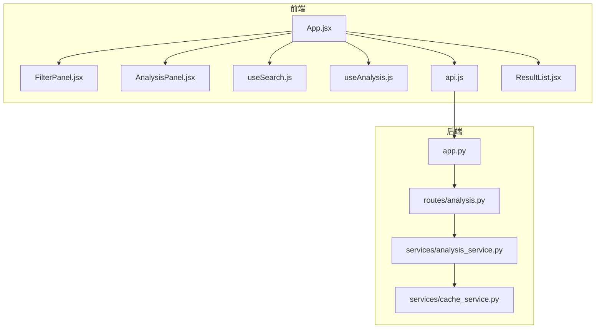
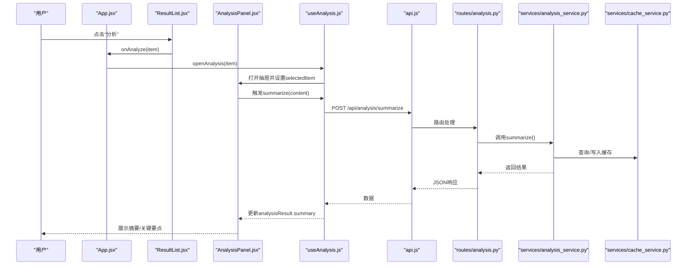
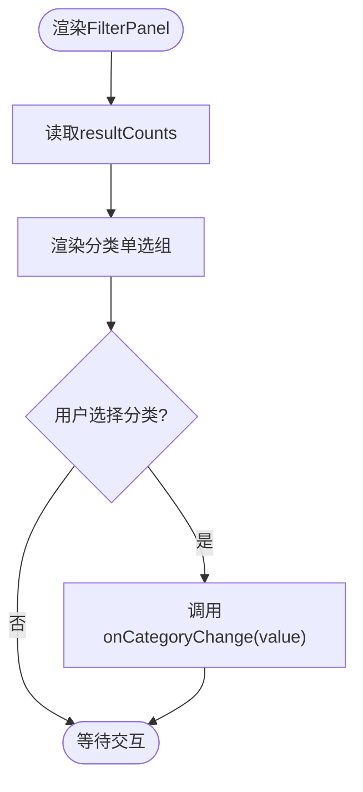
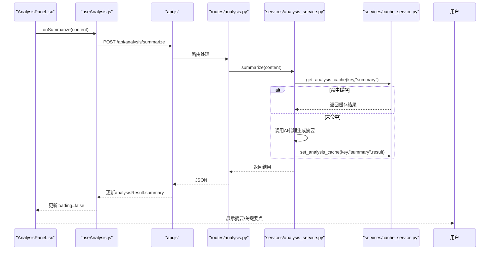
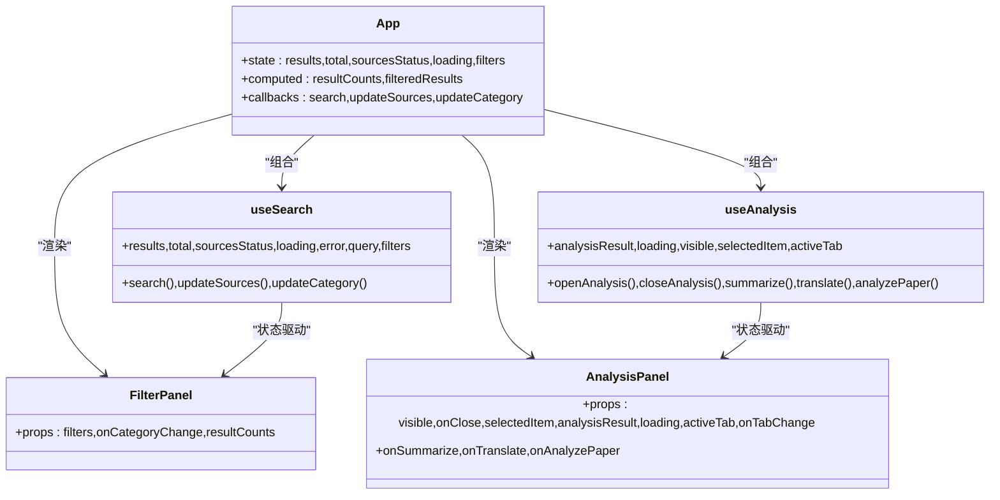
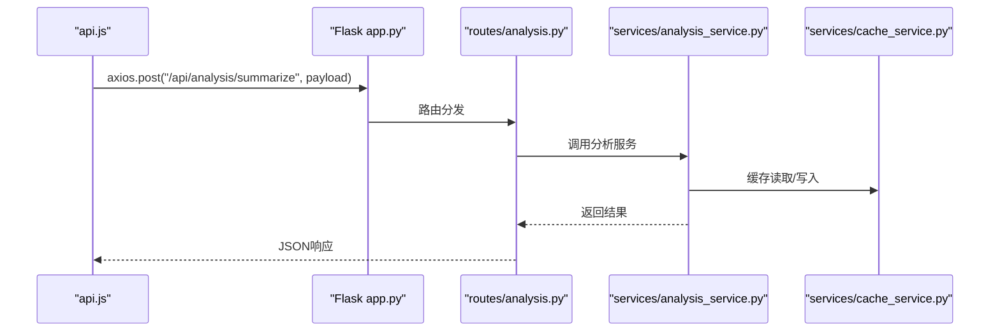
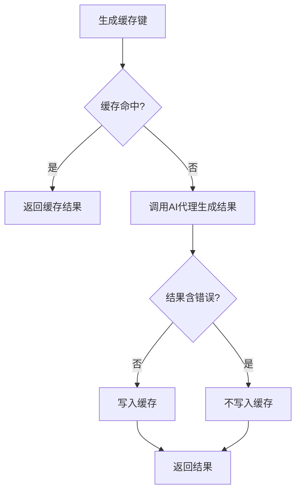
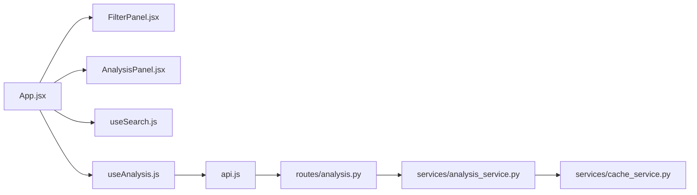

# 筛选与分析组件

<cite>
**本文档引用的文件**
- [frontend/src/components/FilterPanel.jsx](file://frontend/src/components/FilterPanel.jsx)
- [frontend/src/components/AnalysisPanel.jsx](file://frontend/src/components/AnalysisPanel.jsx)
- [frontend/src/hooks/useAnalysis.js](file://frontend/src/hooks/useAnalysis.js)
- [frontend/src/hooks/useSearch.js](file://frontend/src/hooks/useSearch.js)
- [frontend/src/services/api.js](file://frontend/src/services/api.js)
- [frontend/src/App.jsx](file://frontend/src/App.jsx)
- [frontend/src/components/ResultList.jsx](file://frontend/src/components/ResultList.jsx)
- [backend/routes/analysis.py](file://backend/routes/analysis.py)
- [backend/services/analysis_service.py](file://backend/services/analysis_service.py)
- [backend/services/cache_service.py](file://backend/services/cache_service.py)
- [backend/app.py](file://backend/app.py)
</cite>

## 目录
1. [简介](#简介)
2. [项目结构](#项目结构)
3. [核心组件](#核心组件)
4. [架构总览](#架构总览)
5. [详细组件分析](#详细组件分析)
6. [依赖关系分析](#依赖关系分析)
7. [性能考虑](#性能考虑)
8. [故障排除指南](#故障排除指南)
9. [结论](#结论)
10. [附录](#附录)

## 简介
本文件聚焦于前端筛选与分析两大核心功能组件：FilterPanel（筛选面板）与AnalysisPanel（AI分析面板）。文档从系统架构、组件职责、状态管理、用户交互、响应式设计、与后端API集成、数据缓存策略以及错误处理等方面进行深入解析，并提供配置选项、自定义样式与扩展开发指导，帮助开发者快速理解与二次开发。

## 项目结构
本项目采用前后端分离架构：
- 前端使用React + Ant Design，组件位于frontend/src/components，业务逻辑通过自定义Hook封装在frontend/src/hooks，HTTP请求通过frontend/src/services/api.js统一管理。
- 后端使用Flask，路由集中在backend/routes，业务逻辑在backend/services，数据库与缓存策略在backend/services/cache_service.py中实现，应用入口在backend/app.py。

图表来源
- [frontend/src/App.jsx](file://frontend/src/App.jsx#L1-L149)
- [frontend/src/components/FilterPanel.jsx](file://frontend/src/components/FilterPanel.jsx#L1-L52)
- [frontend/src/components/AnalysisPanel.jsx](file://frontend/src/components/AnalysisPanel.jsx#L1-L171)
- [frontend/src/hooks/useSearch.js](file://frontend/src/hooks/useSearch.js#L1-L74)
- [frontend/src/hooks/useAnalysis.js](file://frontend/src/hooks/useAnalysis.js#L1-L86)
- [frontend/src/services/api.js](file://frontend/src/services/api.js#L1-L32)
- [frontend/src/components/ResultList.jsx](file://frontend/src/components/ResultList.jsx#L1-L58)
- [backend/app.py](file://backend/app.py#L1-L78)
- [backend/routes/analysis.py](file://backend/routes/analysis.py#L1-L66)
- [backend/services/analysis_service.py](file://backend/services/analysis_service.py#L1-L91)
- [backend/services/cache_service.py](file://backend/services/cache_service.py#L1-L104)

章节来源
- [frontend/src/App.jsx](file://frontend/src/App.jsx#L1-L149)
- [backend/app.py](file://backend/app.py#L1-L78)

## 核心组件
- FilterPanel：负责内容分类筛选，提供分类单选、结果计数展示与事件回调，支持“全部”与多种内容类型（学术论文、问答、博客、论坛、网页）。
- AnalysisPanel：基于抽屉的AI分析面板，包含摘要、翻译、论文分析三个选项卡，支持自动触发摘要生成、手动触发翻译与论文分析，具备加载态、空态与错误态展示。

章节来源
- [frontend/src/components/FilterPanel.jsx](file://frontend/src/components/FilterPanel.jsx#L1-L52)
- [frontend/src/components/AnalysisPanel.jsx](file://frontend/src/components/AnalysisPanel.jsx#L1-L171)

## 架构总览
前端通过App.jsx协调各模块：useSearch管理搜索状态与筛选条件，useAnalysis管理分析状态与调用后端接口，FilterPanel与AnalysisPanel作为UI组件接收状态与回调。后端通过Flask蓝图注册分析相关路由，analysis_service封装AI代理调用与缓存逻辑，cache_service提供数据库级缓存与过期清理。

图表来源
- [frontend/src/App.jsx](file://frontend/src/App.jsx#L100-L132)
- [frontend/src/components/AnalysisPanel.jsx](file://frontend/src/components/AnalysisPanel.jsx#L23-L53)
- [frontend/src/hooks/useAnalysis.js](file://frontend/src/hooks/useAnalysis.js#L11-L24)
- [frontend/src/services/api.js](file://frontend/src/services/api.js#L1-L32)
- [backend/routes/analysis.py](file://backend/routes/analysis.py#L10-L25)
- [backend/services/analysis_service.py](file://backend/services/analysis_service.py#L25-L44)
- [backend/services/cache_service.py](file://backend/services/cache_service.py#L57-L87)

## 详细组件分析

### FilterPanel 组件
- 功能定位：提供内容分类筛选，支持“全部”与多种类型，显示各类别结果数量。
- 关键属性与回调：
  - filters：当前筛选条件对象（category等）
  - onCategoryChange：分类变更回调
  - resultCounts：各分类结果计数映射
- 实现要点：
  - 使用Ant Design的Radio.Group实现垂直布局的分类选择。
  - 分类项右侧动态显示该分类的结果数量，提升信息密度。
  - 通过props传递counts，避免在组件内重复计算。
- 响应式与可访问性：使用Ant Design组件，遵循其默认的尺寸与间距规范，适配不同屏幕尺寸。

图表来源
- [frontend/src/components/FilterPanel.jsx](file://frontend/src/components/FilterPanel.jsx#L16-L47)

章节来源
- [frontend/src/components/FilterPanel.jsx](file://frontend/src/components/FilterPanel.jsx#L1-L52)

### AnalysisPanel 组件
- 功能定位：右侧抽屉式AI分析面板，支持摘要、翻译、论文分析三类能力。
- 关键属性与回调：
  - visible/onClose：控制抽屉显隐
  - selectedItem：当前选中的结果项
  - analysisResult/loading：分析结果与加载状态
  - activeTab/onTabChange：当前激活选项卡与切换回调
  - onSummarize/onTranslate/onAnalyzePaper：对应分析操作的触发器
- 自动化行为：
  - 当抽屉打开且存在选中项但未有摘要时，自动提取标题或片段并触发摘要生成。
- 选项卡渲染策略：
  - 摘要：支持加载态、空态（提示点击生成）、错误态与成功态（摘要+关键要点列表）。
  - 翻译：支持加载态、按钮触发、错误态与成功态（翻译文本）。
  - 论文分析：仅当类别为学术论文时可用，支持加载态、按钮触发、错误态与成功态（分节展示）。
- 响应式设计：宽度固定，配合Ant Design的Drawer与Tabs组件，适配桌面端侧边栏式展示。

图表来源
- [frontend/src/components/AnalysisPanel.jsx](file://frontend/src/components/AnalysisPanel.jsx#L23-L53)
- [frontend/src/hooks/useAnalysis.js](file://frontend/src/hooks/useAnalysis.js#L11-L24)
- [frontend/src/services/api.js](file://frontend/src/services/api.js#L1-L32)
- [backend/routes/analysis.py](file://backend/routes/analysis.py#L10-L25)
- [backend/services/analysis_service.py](file://backend/services/analysis_service.py#L25-L44)
- [backend/services/cache_service.py](file://backend/services/cache_service.py#L57-L87)

章节来源
- [frontend/src/components/AnalysisPanel.jsx](file://frontend/src/components/AnalysisPanel.jsx#L1-L171)
- [frontend/src/hooks/useAnalysis.js](file://frontend/src/hooks/useAnalysis.js#L1-L86)

### 状态管理与用户交互
- App.jsx集中管理：
  - useSearch：维护查询词、结果集、总数、来源状态、筛选条件（sources/category/language），并提供更新函数。
  - useAnalysis：维护分析结果、加载状态、抽屉可见性、选中项、当前选项卡，并提供分析操作函数。
  - 计算属性：resultCounts用于FilterPanel，filteredResults用于ResultList的客户端过滤。
- 用户交互：
  - 在ResultList中点击“分析”触发openAnalysis，随后AnalysisPanel根据selectedItem自动触发摘要生成。
  - 在FilterPanel中选择分类，App.jsx通过updateCategory更新filters，filteredResults随之变化。

图表来源
- [frontend/src/App.jsx](file://frontend/src/App.jsx#L19-L73)
- [frontend/src/hooks/useSearch.js](file://frontend/src/hooks/useSearch.js#L6-L73)
- [frontend/src/hooks/useAnalysis.js](file://frontend/src/hooks/useAnalysis.js#L4-L85)
- [frontend/src/components/FilterPanel.jsx](file://frontend/src/components/FilterPanel.jsx#L16-L17)
- [frontend/src/components/AnalysisPanel.jsx](file://frontend/src/components/AnalysisPanel.jsx#L11-L22)

章节来源
- [frontend/src/App.jsx](file://frontend/src/App.jsx#L1-L149)
- [frontend/src/hooks/useSearch.js](file://frontend/src/hooks/useSearch.js#L1-L74)
- [frontend/src/hooks/useAnalysis.js](file://frontend/src/hooks/useAnalysis.js#L1-L86)

### 与后端API的集成
- 前端API封装：
  - 基础URL为/api，统一拦截器处理429/5xx/400等错误并通过Ant Design消息提示反馈。
  - 超时时间60秒，适合长耗时的AI分析请求。
- 后端路由：
  - /api/analysis/summarize：POST，输入content，返回摘要与关键要点。
  - /api/analysis/translate：POST，输入content与target_lang，返回翻译结果。
  - /api/analysis/paper：POST，输入title/abstract/snippet，返回论文分节分析。
- 应用入口：
  - Flask注册蓝图，CORS允许Vite开发服务器跨域访问，静态资源在生产环境由Flask提供。

图表来源
- [frontend/src/services/api.js](file://frontend/src/services/api.js#L4-L8)
- [backend/app.py](file://backend/app.py#L35-L39)
- [backend/routes/analysis.py](file://backend/routes/analysis.py#L10-L25)
- [backend/services/analysis_service.py](file://backend/services/analysis_service.py#L25-L44)
- [backend/services/cache_service.py](file://backend/services/cache_service.py#L57-L87)

章节来源
- [frontend/src/services/api.js](file://frontend/src/services/api.js#L1-L32)
- [backend/routes/analysis.py](file://backend/routes/analysis.py#L1-L66)
- [backend/app.py](file://backend/app.py#L1-L78)

### 数据缓存策略
- 缓存类型：
  - 搜索缓存：按查询词、来源、过滤条件生成哈希键，24小时过期。
  - 分析缓存：按内容前缀与分析类型生成哈希键，7天过期。
- 缓存实现：
  - 使用SQLite数据库表存储，键值对形式，带时间戳。
  - 过期检查在读取时执行，过期条目在读取时被清理。
- 性能收益：
  - 避免重复调用AI代理，显著降低延迟与成本。
  - 对相同内容的多次分析请求可直接命中缓存。

图表来源
- [backend/services/cache_service.py](file://backend/services/cache_service.py#L57-L87)
- [backend/services/analysis_service.py](file://backend/services/analysis_service.py#L32-L43)

章节来源
- [backend/services/cache_service.py](file://backend/services/cache_service.py#L1-L104)
- [backend/services/analysis_service.py](file://backend/services/analysis_service.py#L1-L91)

### 错误处理机制
- 前端：
  - axios拦截器统一处理429（频率过高）、5xx（服务器错误）、400（参数错误）、超时与网络异常，通过Ant Design消息提示用户。
- 后端：
  - 路由层对必填字段校验，缺失时返回400；异常捕获记录日志并返回500。
- 组件层：
  - AnalysisPanel针对每个分析结果的error字段进行错误态渲染，保证用户感知。

章节来源
- [frontend/src/services/api.js](file://frontend/src/services/api.js#L10-L29)
- [backend/routes/analysis.py](file://backend/routes/analysis.py#L15-L24)
- [frontend/src/components/AnalysisPanel.jsx](file://frontend/src/components/AnalysisPanel.jsx#L34-L34)

## 依赖关系分析
- 组件耦合：
  - App.jsx作为容器组件，聚合useSearch与useAnalysis，向FilterPanel与AnalysisPanel传递状态与回调，耦合度低、职责清晰。
  - FilterPanel与AnalysisPanel均为纯展示组件，依赖外部传入的props与回调，便于测试与复用。
- 外部依赖：
  - 前端：React、Ant Design、Axios。
  - 后端：Flask、Flask-CORS、SQLite（通过数据库模型与缓存服务）。
- 可能的循环依赖：
  - 未发现直接循环导入；分析服务通过懒初始化代理实例，避免启动时循环依赖。

图表来源
- [frontend/src/App.jsx](file://frontend/src/App.jsx#L1-L149)
- [frontend/src/components/FilterPanel.jsx](file://frontend/src/components/FilterPanel.jsx#L1-L52)
- [frontend/src/components/AnalysisPanel.jsx](file://frontend/src/components/AnalysisPanel.jsx#L1-L171)
- [frontend/src/hooks/useSearch.js](file://frontend/src/hooks/useSearch.js#L1-L74)
- [frontend/src/hooks/useAnalysis.js](file://frontend/src/hooks/useAnalysis.js#L1-L86)
- [frontend/src/services/api.js](file://frontend/src/services/api.js#L1-L32)
- [backend/routes/analysis.py](file://backend/routes/analysis.py#L1-L66)
- [backend/services/analysis_service.py](file://backend/services/analysis_service.py#L1-L91)
- [backend/services/cache_service.py](file://backend/services/cache_service.py#L1-L104)

章节来源
- [frontend/src/App.jsx](file://frontend/src/App.jsx#L1-L149)
- [backend/routes/analysis.py](file://backend/routes/analysis.py#L1-L66)

## 性能考虑
- 客户端过滤：App.jsx对结果进行客户端过滤，减少不必要的后端请求，但需注意大数据量时的性能影响。
- 缓存策略：分析结果缓存7天，显著降低重复请求成本；搜索结果缓存24小时，适合高频查询场景。
- 并发控制：前端未见显式的并发限制，建议在useAnalysis中增加防抖或队列控制，避免短时间内多次触发同一分析。
- 资源加载：Ant Design组件按需引入可进一步优化打包体积（当前项目已使用按需引入）。

## 故障排除指南
- 请求频繁被限流（429）：前端拦截器会提示“请求过于频繁，请稍后再试”。建议降低请求频率或增加节流。
- 服务器内部错误（5xx）：检查后端日志与AI代理可用性，确认analysis_service与cache_service正常工作。
- 参数错误（400）：确保content或paper必要字段非空，后端路由对必填字段进行严格校验。
- 网络连接失败：检查前端与后端连通性，确认Flask CORS配置允许开发服务器访问。
- 抽屉无法关闭或内容不刷新：确认App.jsx中visible与selectedItem状态正确传递至AnalysisPanel。

章节来源
- [frontend/src/services/api.js](file://frontend/src/services/api.js#L10-L29)
- [backend/routes/analysis.py](file://backend/routes/analysis.py#L15-L24)
- [frontend/src/components/AnalysisPanel.jsx](file://frontend/src/components/AnalysisPanel.jsx#L23-L28)

## 结论
FilterPanel与AnalysisPanel分别承担了筛选与AI分析两大核心功能，二者通过App.jsx的统一状态管理实现解耦协作。前端通过useAnalysis与useSearch实现清晰的业务逻辑封装，后端通过analysis_service与cache_service提供稳定的分析能力与缓存保障。整体架构简洁、可扩展性强，适合在此基础上继续增强分析能力与用户体验。

## 附录

### 配置选项与自定义样式
- FilterPanel
  - 支持通过props传入分类计数映射以显示各类别结果数量。
  - 可通过Ant Design主题变量调整尺寸、颜色与间距。
- AnalysisPanel
  - 抽屉宽度固定为480px，适合桌面端展示。
  - 选项卡图标与文案可按需替换，样式可通过Ant Design的CSS变量覆盖。
- ResultList
  - 支持展示总数与当前显示数量，以及各来源状态指示。

章节来源
- [frontend/src/components/FilterPanel.jsx](file://frontend/src/components/FilterPanel.jsx#L16-L47)
- [frontend/src/components/AnalysisPanel.jsx](file://frontend/src/components/AnalysisPanel.jsx#L147-L168)
- [frontend/src/components/ResultList.jsx](file://frontend/src/components/ResultList.jsx#L29-L43)

### 扩展开发指导
- 新增分析能力
  - 在后端routes/analysis.py新增路由与处理函数，返回标准化JSON结构。
  - 在analysis_service.py中实现对应分析逻辑，并在缓存层添加键生成与读写。
  - 在前端useAnalysis.js中新增对应异步函数，在AnalysisPanel中新增选项卡与渲染逻辑。
- 筛选扩展
  - 在App.jsx的filters中新增字段，useSearch.updateSources/updateCategory中同步更新。
  - 在FilterPanel中新增筛选控件，并在App.jsx中计算新的resultCounts。
- 缓存策略优化
  - 可引入LRU缓存或Redis，提升高并发下的缓存命中率与一致性。
  - 增加缓存清理任务与监控指标，便于运维观测。

章节来源
- [backend/routes/analysis.py](file://backend/routes/analysis.py#L1-L66)
- [backend/services/analysis_service.py](file://backend/services/analysis_service.py#L1-L91)
- [frontend/src/hooks/useAnalysis.js](file://frontend/src/hooks/useAnalysis.js#L1-L86)
- [frontend/src/components/AnalysisPanel.jsx](file://frontend/src/components/AnalysisPanel.jsx#L1-L171)
- [frontend/src/App.jsx](file://frontend/src/App.jsx#L1-L149)