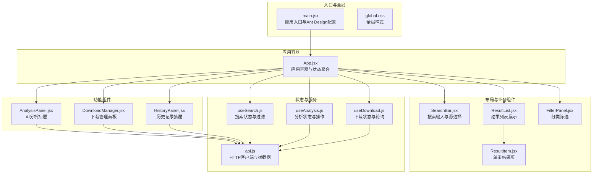
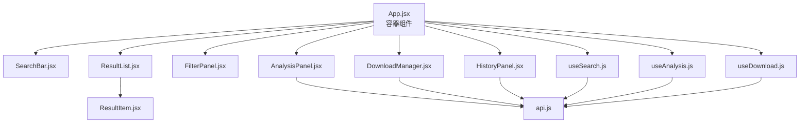
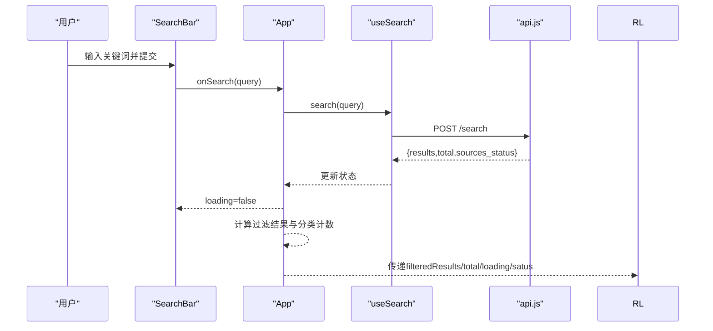
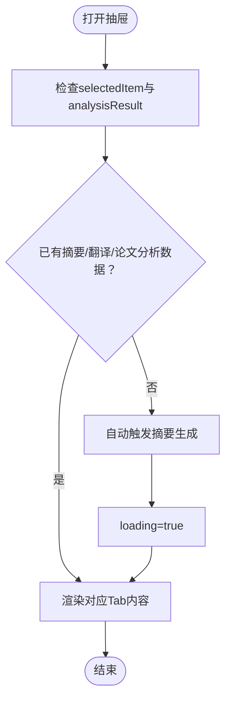
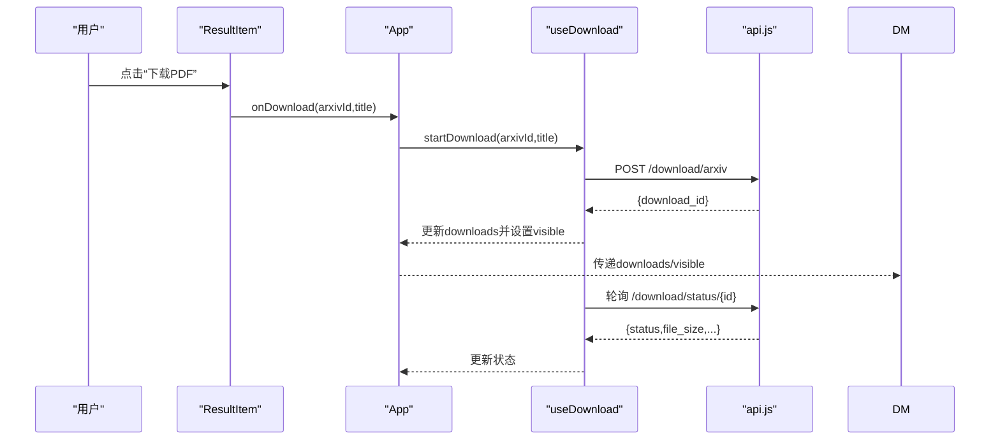
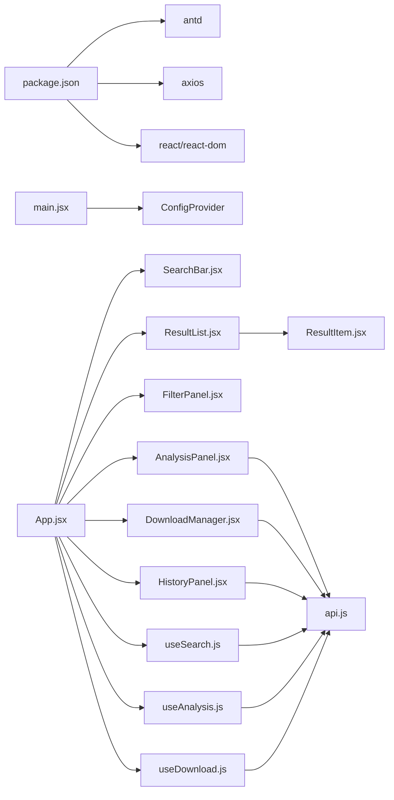
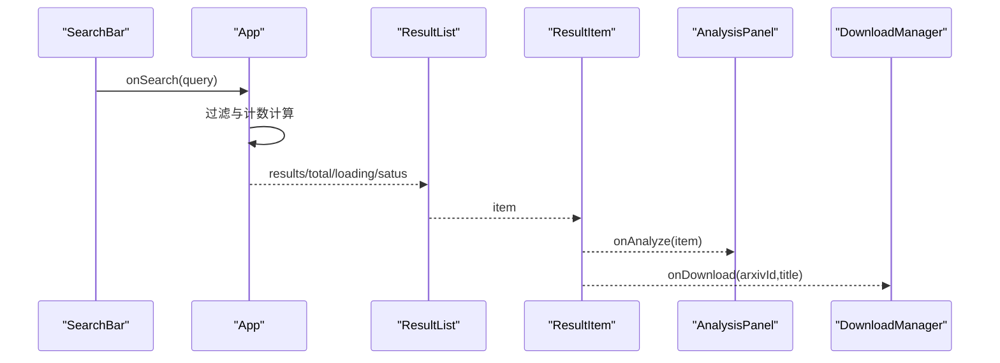

# 组件架构设计

<cite>
**本文引用的文件**
- [frontend/src/App.jsx](file://frontend/src/App.jsx)
- [frontend/src/main.jsx](file://frontend/src/main.jsx)
- [frontend/src/components/SearchBar.jsx](file://frontend/src/components/SearchBar.jsx)
- [frontend/src/components/ResultList.jsx](file://frontend/src/components/ResultList.jsx)
- [frontend/src/components/ResultItem.jsx](file://frontend/src/components/ResultItem.jsx)
- [frontend/src/components/FilterPanel.jsx](file://frontend/src/components/FilterPanel.jsx)
- [frontend/src/components/AnalysisPanel.jsx](file://frontend/src/components/AnalysisPanel.jsx)
- [frontend/src/components/DownloadManager.jsx](file://frontend/src/components/DownloadManager.jsx)
- [frontend/src/components/HistoryPanel.jsx](file://frontend/src/components/HistoryPanel.jsx)
- [frontend/src/hooks/useSearch.js](file://frontend/src/hooks/useSearch.js)
- [frontend/src/hooks/useAnalysis.js](file://frontend/src/hooks/useAnalysis.js)
- [frontend/src/hooks/useDownload.js](file://frontend/src/hooks/useDownload.js)
- [frontend/src/services/api.js](file://frontend/src/services/api.js)
- [frontend/src/styles/global.css](file://frontend/src/styles/global.css)
- [frontend/package.json](file://frontend/package.json)
</cite>

## 目录
1. [引言](#引言)
2. [项目结构](#项目结构)
3. [核心组件](#核心组件)
4. [架构总览](#架构总览)
5. [详细组件分析](#详细组件分析)
6. [依赖关系分析](#依赖关系分析)
7. [性能考量](#性能考量)
8. [故障排查指南](#故障排查指南)
9. [结论](#结论)
10. [附录](#附录)

## 引言
本设计文档面向前端React组件系统，聚焦“布局组件（Layout）”、“业务组件（SearchBar、ResultList等）”与“功能组件（AnalysisPanel、DownloadManager、HistoryPanel）”的分层设计与职责划分，阐述组件间通信机制（Props传递、事件回调、状态共享）、生命周期管理、条件渲染与动态加载策略；并给出组件依赖关系图、数据流向图与用户交互流程图，总结可复用性设计、属性校验建议与错误边界处理思路，最后提供Ant Design组件的定制化与样式覆盖最佳实践。

## 项目结构
前端采用Vite构建，入口在main.jsx中通过ConfigProvider注入Ant Design本地化配置，应用根组件App负责组织布局与业务组件协作。组件按功能模块化放置于src/components，状态逻辑抽离为自定义Hook，服务层统一通过api.js封装Axios调用与错误拦截。

图表来源
- [frontend/src/main.jsx](file://frontend/src/main.jsx#L1-L15)
- [frontend/src/App.jsx](file://frontend/src/App.jsx#L1-L149)
- [frontend/src/components/SearchBar.jsx](file://frontend/src/components/SearchBar.jsx#L1-L42)
- [frontend/src/components/ResultList.jsx](file://frontend/src/components/ResultList.jsx#L1-L58)
- [frontend/src/components/ResultItem.jsx](file://frontend/src/components/ResultItem.jsx#L1-L108)
- [frontend/src/components/FilterPanel.jsx](file://frontend/src/components/FilterPanel.jsx#L1-L52)
- [frontend/src/components/AnalysisPanel.jsx](file://frontend/src/components/AnalysisPanel.jsx#L1-L171)
- [frontend/src/components/DownloadManager.jsx](file://frontend/src/components/DownloadManager.jsx#L1-L114)
- [frontend/src/components/HistoryPanel.jsx](file://frontend/src/components/HistoryPanel.jsx#L1-L91)
- [frontend/src/hooks/useSearch.js](file://frontend/src/hooks/useSearch.js#L1-L74)
- [frontend/src/hooks/useAnalysis.js](file://frontend/src/hooks/useAnalysis.js#L1-L86)
- [frontend/src/hooks/useDownload.js](file://frontend/src/hooks/useDownload.js#L1-L78)
- [frontend/src/services/api.js](file://frontend/src/services/api.js#L1-L32)

章节来源
- [frontend/src/main.jsx](file://frontend/src/main.jsx#L1-L15)
- [frontend/src/App.jsx](file://frontend/src/App.jsx#L1-L149)
- [frontend/package.json](file://frontend/package.json#L1-L24)

## 核心组件
- 布局组件（Layout）
  - App.jsx作为根布局容器，使用Ant Design Layout组件承载Header与Content区域，协调各业务与功能组件的布局与可见性。
- 业务组件
  - SearchBar：提供关键词输入与多源选择，触发搜索钩子。
  - ResultList：根据加载状态与结果集渲染列表或空态，展示总数与各源状态。
  - ResultItem：单条结果卡片，包含元信息、标签与操作按钮。
  - FilterPanel：基于分类维度进行筛选，展示各分类计数。
- 功能组件
  - AnalysisPanel：右侧抽屉式分析面板，支持摘要、翻译、论文分析三类能力。
  - DownloadManager：底部固定面板，管理下载任务状态与进度。
  - HistoryPanel：左侧抽屉式历史面板，支持查看与回放历史查询。

章节来源
- [frontend/src/App.jsx](file://frontend/src/App.jsx#L14-L148)
- [frontend/src/components/SearchBar.jsx](file://frontend/src/components/SearchBar.jsx#L12-L41)
- [frontend/src/components/ResultList.jsx](file://frontend/src/components/ResultList.jsx#L7-L57)
- [frontend/src/components/ResultItem.jsx](file://frontend/src/components/ResultItem.jsx#L37-L107)
- [frontend/src/components/FilterPanel.jsx](file://frontend/src/components/FilterPanel.jsx#L16-L51)
- [frontend/src/components/AnalysisPanel.jsx](file://frontend/src/components/AnalysisPanel.jsx#L11-L170)
- [frontend/src/components/DownloadManager.jsx](file://frontend/src/components/DownloadManager.jsx#L22-L113)
- [frontend/src/components/HistoryPanel.jsx](file://frontend/src/components/HistoryPanel.jsx#L8-L90)

## 架构总览
系统采用“容器组件 + 展示组件 + 自定义Hook + 服务层”的分层架构：
- 容器组件（App.jsx）负责状态聚合与组件编排，向下传递Props，向上接收回调。
- 展示组件（SearchBar、ResultList、ResultItem、FilterPanel、AnalysisPanel、DownloadManager、HistoryPanel）专注UI与交互细节。
- 自定义Hook（useSearch、useAnalysis、useDownload）封装状态与副作用，暴露稳定API供容器使用。
- 服务层（api.js）统一封装HTTP请求与错误处理，屏蔽网络细节。

图表来源
- [frontend/src/App.jsx](file://frontend/src/App.jsx#L16-L148)
- [frontend/src/hooks/useSearch.js](file://frontend/src/hooks/useSearch.js#L6-L73)
- [frontend/src/hooks/useAnalysis.js](file://frontend/src/hooks/useAnalysis.js#L4-L84)
- [frontend/src/hooks/useDownload.js](file://frontend/src/hooks/useDownload.js#L4-L77)
- [frontend/src/services/api.js](file://frontend/src/services/api.js#L4-L31)

## 详细组件分析

### 容器组件：App.jsx
- 职责
  - 聚合useSearch、useAnalysis、useDownload的状态与方法，计算过滤后的结果与分类计数，驱动布局与功能组件。
  - 处理下载成功消息提示，控制历史抽屉可见性。
- 关键交互
  - 将搜索回调、过滤器与加载状态传递给SearchBar与FilterPanel。
  - 将结果列表、总数、加载状态与源状态传递给ResultList。
  - 将打开分析、切换标签、汇总与翻译等回调传递给AnalysisPanel。
  - 将下载任务列表与可见性、移除回调传递给DownloadManager。
  - 将历史抽屉可见性与关闭回调、回放搜索回调传递给HistoryPanel。
- 条件渲染与动态加载
  - 使用useMemo对分类计数与过滤结果进行缓存，避免不必要重渲染。
  - 根据results长度决定是否渲染侧边栏FilterPanel。
- 生命周期管理
  - 通过useEffect在AnalysisPanel首次打开且缺少摘要时自动触发摘要生成。

图表来源
- [frontend/src/components/SearchBar.jsx](file://frontend/src/components/SearchBar.jsx#L13-L17)
- [frontend/src/App.jsx](file://frontend/src/App.jsx#L19-L73)
- [frontend/src/hooks/useSearch.js](file://frontend/src/hooks/useSearch.js#L19-L50)
- [frontend/src/services/api.js](file://frontend/src/services/api.js#L10-L29)

章节来源
- [frontend/src/App.jsx](file://frontend/src/App.jsx#L16-L148)

### 业务组件

#### SearchBar.jsx
- 设计模式
  - 纯展示组件，通过props接收回调与状态，内部只做事件转发与简单校验。
- Props约定
  - onSearch：执行搜索的回调
  - sources：当前选中的搜索源数组
  - onSourcesChange：源变更回调
  - loading：搜索加载状态
- 交互细节
  - 使用Ant Design Input.Search与Checkbox.Group组合实现输入与多选。
  - Enter键与按钮均触发搜索，输入为空则忽略。

章节来源
- [frontend/src/components/SearchBar.jsx](file://frontend/src/components/SearchBar.jsx#L12-L41)

#### ResultList.jsx
- 设计模式
  - 展示型组件，根据loading与results决定渲染骨架屏或空态，否则渲染列表。
- Props约定
  - results、total、loading、sourcesStatus、onAnalyze、onDownload
- 渲染策略
  - loading时返回居中Spin；无结果时返回Empty；有结果时展示总数与各源状态，并逐条渲染ResultItem。

章节来源
- [frontend/src/components/ResultList.jsx](file://frontend/src/components/ResultList.jsx#L7-L57)

#### ResultItem.jsx
- 设计模式
  - 单条结果卡片，内含元信息、标签与操作按钮，支持arXiv下载。
- Props约定
  - item：单条结果对象
  - onAnalyze、onDownload：回调
- 可复用性
  - 通过CATEGORY_COLORS、CATEGORY_LABELS、SOURCE_LABELS集中管理映射，便于扩展新分类与来源。

章节来源
- [frontend/src/components/ResultItem.jsx](file://frontend/src/components/ResultItem.jsx#L37-L107)

#### FilterPanel.jsx
- 设计模式
  - 展示型筛选面板，基于分类维度进行单选，显示各分类计数。
- Props约定
  - filters、onCategoryChange、resultCounts
- 交互细节
  - Radio.Group用于分类切换，右侧显示对应计数。

章节来源
- [frontend/src/components/FilterPanel.jsx](file://frontend/src/components/FilterPanel.jsx#L16-L51)

### 功能组件

#### AnalysisPanel.jsx
- 设计模式
  - 抽屉式功能组件，Tab页组织不同分析能力，内部根据状态渲染不同内容。
- Props约定
  - visible、onClose、selectedItem、analysisResult、loading、activeTab、onTabChange、onSummarize、onTranslate、onAnalyzePaper
- 生命周期与条件渲染
  - useEffect在可见且无摘要时自动触发摘要生成。
  - 根据loading与是否存在数据决定渲染骨架、空态或结果。
- 可复用性
  - 通过renderSummary/renderTranslation/renderPaperAnalysis拆分渲染逻辑，便于扩展新能力。

图表来源
- [frontend/src/components/AnalysisPanel.jsx](file://frontend/src/components/AnalysisPanel.jsx#L23-L28)
- [frontend/src/components/AnalysisPanel.jsx](file://frontend/src/components/AnalysisPanel.jsx#L30-L127)

章节来源
- [frontend/src/components/AnalysisPanel.jsx](file://frontend/src/components/AnalysisPanel.jsx#L11-L170)

#### DownloadManager.jsx
- 设计模式
  - 底部固定面板，折叠展开展示下载队列，支持移除与完成态下载链接。
- Props约定
  - downloads、visible、onToggle、onRemove
- 动态加载与轮询
  - 通过useDownload钩子维护下载队列与轮询逻辑，面板仅在存在任务时渲染。
- 可复用性
  - STATUS_MAP集中管理状态图标与文案，便于扩展新状态。

章节来源
- [frontend/src/components/DownloadManager.jsx](file://frontend/src/components/DownloadManager.jsx#L22-L113)

#### HistoryPanel.jsx
- 设计模式
  - 左侧抽屉式历史面板，支持查看历史、清空历史与回放搜索。
- Props约定
  - visible、onClose、onSearch
- 生命周期
  - 打开时拉取历史，清空后更新本地状态。

章节来源
- [frontend/src/components/HistoryPanel.jsx](file://frontend/src/components/HistoryPanel.jsx#L8-L90)

### 自定义Hook与状态管理

#### useSearch.js
- 职责
  - 维护搜索结果、总数、源状态、加载与错误状态，以及过滤器（sources、category、language）。
- 关键方法
  - search：向后端发起搜索请求，支持客户端侧过滤与状态更新。
  - updateSources/updateCategory：更新过滤器。
- 性能
  - 使用useCallback包裹异步方法与更新函数，减少重渲染。

章节来源
- [frontend/src/hooks/useSearch.js](file://frontend/src/hooks/useSearch.js#L6-L73)

#### useAnalysis.js
- 职责
  - 维护分析结果、加载状态、抽屉可见性、选中项与活动Tab。
- 关键方法
  - summarize/translate/analyzePaper：调用后端分析接口，合并结果到analysisResult。
  - openAnalysis/closeAnalysis：控制抽屉与选中项。
- 性能
  - 使用useCallback保证回调稳定性。

章节来源
- [frontend/src/hooks/useAnalysis.js](file://frontend/src/hooks/useAnalysis.js#L4-L84)

#### useDownload.js
- 职责
  - 维护下载队列、可见性与轮询刷新。
- 关键方法
  - startDownload：创建下载任务并入队。
  - refreshStatus：批量轮询待处理任务状态。
  - removeDownload：移除指定任务。
- 生命周期
  - 在有活跃任务时启动轮询，无活跃任务时清理定时器。

图表来源
- [frontend/src/components/ResultItem.jsx](file://frontend/src/components/ResultItem.jsx#L94-L103)
- [frontend/src/App.jsx](file://frontend/src/App.jsx#L52-L57)
- [frontend/src/hooks/useDownload.js](file://frontend/src/hooks/useDownload.js#L9-L64)
- [frontend/src/services/api.js](file://frontend/src/services/api.js#L10-L29)

章节来源
- [frontend/src/hooks/useDownload.js](file://frontend/src/hooks/useDownload.js#L4-L77)

### 服务层：api.js
- 职责
  - 创建Axios实例，设置基础URL与超时，统一拦截响应错误并弹出提示。
- 错误处理
  - 针对429、5xx、400、超时与网络异常分别提示，提升用户体验。
- 与组件解耦
  - 组件仅依赖稳定的API方法，无需关心底层网络细节。

章节来源
- [frontend/src/services/api.js](file://frontend/src/services/api.js#L4-L31)

## 依赖关系分析
- 组件依赖
  - App.jsx依赖所有业务与功能组件及三个自定义Hook。
  - ResultList依赖ResultItem；AnalysisPanel依赖api.js；DownloadManager与HistoryPanel依赖api.js。
- 外部依赖
  - Ant Design组件库与图标库；Axios；React与React DOM。
- 依赖方向
  - 数据从服务层流向Hook，再由Hook流向容器组件，最终由容器组件向下传递给展示组件。

图表来源
- [frontend/package.json](file://frontend/package.json#L11-L17)
- [frontend/src/main.jsx](file://frontend/src/main.jsx#L3-L12)
- [frontend/src/App.jsx](file://frontend/src/App.jsx#L4-L12)
- [frontend/src/components/ResultList.jsx](file://frontend/src/components/ResultList.jsx#L3)
- [frontend/src/components/ResultItem.jsx](file://frontend/src/components/ResultItem.jsx#L2)
- [frontend/src/components/AnalysisPanel.jsx](file://frontend/src/components/AnalysisPanel.jsx#L2)
- [frontend/src/components/DownloadManager.jsx](file://frontend/src/components/DownloadManager.jsx#L2)
- [frontend/src/components/HistoryPanel.jsx](file://frontend/src/components/HistoryPanel.jsx#L4)
- [frontend/src/hooks/useSearch.js](file://frontend/src/hooks/useSearch.js#L2)
- [frontend/src/hooks/useAnalysis.js](file://frontend/src/hooks/useAnalysis.js#L2)
- [frontend/src/hooks/useDownload.js](file://frontend/src/hooks/useDownload.js#L2)
- [frontend/src/services/api.js](file://frontend/src/services/api.js#L1)

章节来源
- [frontend/package.json](file://frontend/package.json#L1-L24)

## 性能考量
- 渲染优化
  - 使用useMemo缓存分类计数与过滤结果，避免不必要的重渲染。
  - 列表渲染使用稳定的key（优先url，降级索引），减少节点重建。
- 网络与轮询
  - useDownload在无活跃任务时停止轮询，降低资源消耗。
  - api.js设置合理超时与统一错误提示，改善弱网体验。
- 样式与布局
  - 全局CSS中为卡片悬停阴影与文本截断提供过渡动画，提升交互质感。
  - 响应式布局在小屏设备下调整结果区为纵向排列，优化移动端体验。

章节来源
- [frontend/src/App.jsx](file://frontend/src/App.jsx#L60-L73)
- [frontend/src/hooks/useDownload.js](file://frontend/src/hooks/useDownload.js#L51-L64)
- [frontend/src/styles/global.css](file://frontend/src/styles/global.css#L62-L100)

## 故障排查指南
- 搜索无结果
  - 检查useSearch的search方法是否正确调用，确认filters.sources与filters.category未被意外清空。
  - 查看ResultList的loading与results状态，确认后端返回格式。
- 分析面板空白
  - 确认AnalysisPanel的selectedItem存在且包含可摘要内容；若无数据，检查useAnalysis的summarize是否被触发。
- 下载任务不更新
  - 确认useDownload的轮询定时器是否启动；检查refreshStatus对状态字段的合并逻辑。
- 错误提示
  - api.js拦截器会针对不同HTTP状态与异常类型弹出提示，优先查看控制台与消息提示以定位问题。

章节来源
- [frontend/src/hooks/useSearch.js](file://frontend/src/hooks/useSearch.js#L19-L50)
- [frontend/src/components/AnalysisPanel.jsx](file://frontend/src/components/AnalysisPanel.jsx#L23-L28)
- [frontend/src/hooks/useDownload.js](file://frontend/src/hooks/useDownload.js#L26-L48)
- [frontend/src/services/api.js](file://frontend/src/services/api.js#L10-L29)

## 结论
该组件系统通过清晰的分层设计实现了高内聚低耦合：容器组件负责编排与状态聚合，展示组件专注UI与交互，自定义Hook封装复杂逻辑，服务层统一处理网络与错误。组件间通过Props与回调进行松耦合通信，配合useMemo与useCallback优化渲染性能。Ant Design组件的合理使用与全局样式的覆盖使界面一致且具备良好的可维护性。建议后续引入属性校验与错误边界以进一步增强健壮性。

## 附录

### 组件通信机制与数据流
- Props传递
  - App.jsx向下传递搜索、过滤、加载与分析相关状态与回调。
- 事件回调
  - 各组件通过回调向上通知容器，如onSearch、onAnalyze、onDownload、onRemove等。
- 状态共享
  - 通过useSearch/useAnalysis/useDownload在多个组件间共享状态，避免重复请求与状态分散。

图表来源
- [frontend/src/components/SearchBar.jsx](file://frontend/src/components/SearchBar.jsx#L13-L17)
- [frontend/src/App.jsx](file://frontend/src/App.jsx#L69-L117)
- [frontend/src/components/ResultList.jsx](file://frontend/src/components/ResultList.jsx#L44-L54)
- [frontend/src/components/ResultItem.jsx](file://frontend/src/components/ResultItem.jsx#L77-L103)
- [frontend/src/components/AnalysisPanel.jsx](file://frontend/src/components/AnalysisPanel.jsx#L11-L22)
- [frontend/src/components/DownloadManager.jsx](file://frontend/src/components/DownloadManager.jsx#L22-L23)

### Ant Design定制化与样式覆盖
- 本地化与主题
  - 在入口通过ConfigProvider设置locale为zhCN，确保组件文案与日期格式符合中文环境。
- 样式覆盖
  - 通过global.css覆盖Ant Design默认样式，如Header背景、卡片悬停阴影、文本截断与下载管理面板布局等。
- 图标与交互
  - 统一使用Ant Design Icons，结合Typography、Tag、Button等组件实现一致的视觉与交互体验。

章节来源
- [frontend/src/main.jsx](file://frontend/src/main.jsx#L3-L12)
- [frontend/src/styles/global.css](file://frontend/src/styles/global.css#L19-L155)