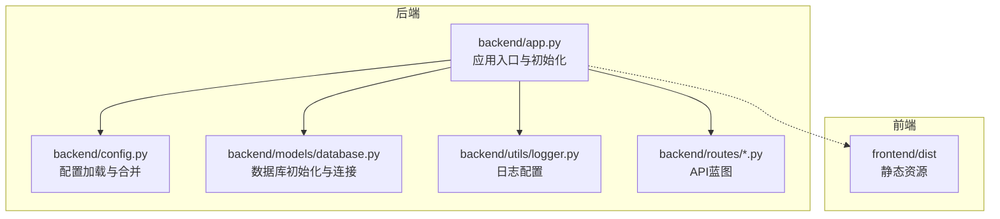
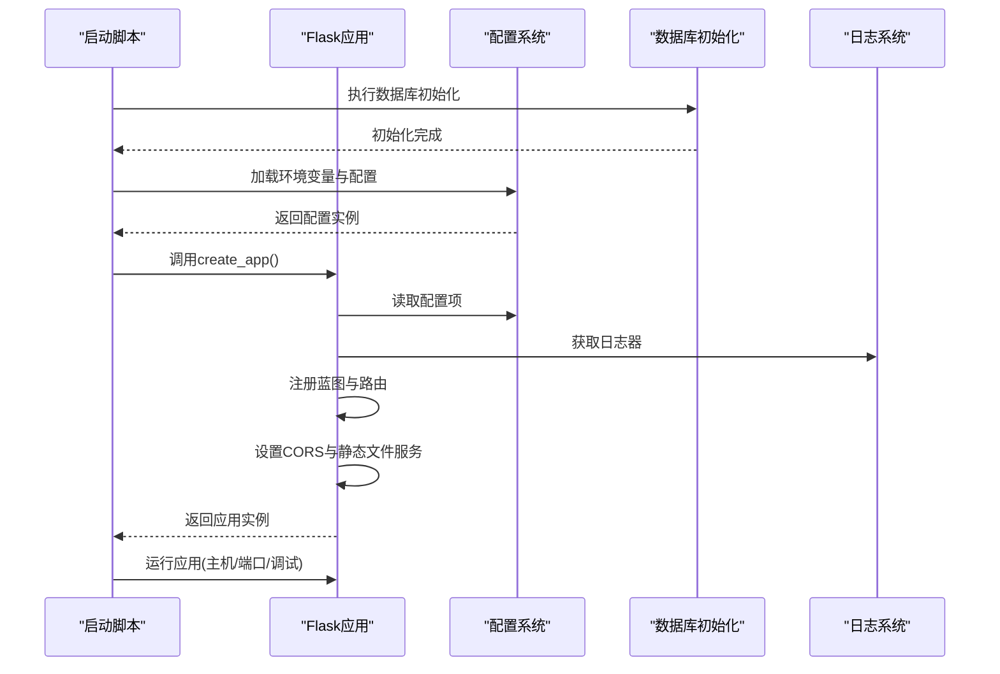
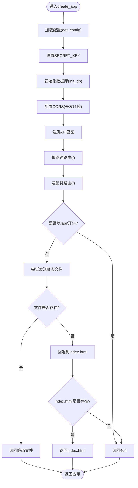
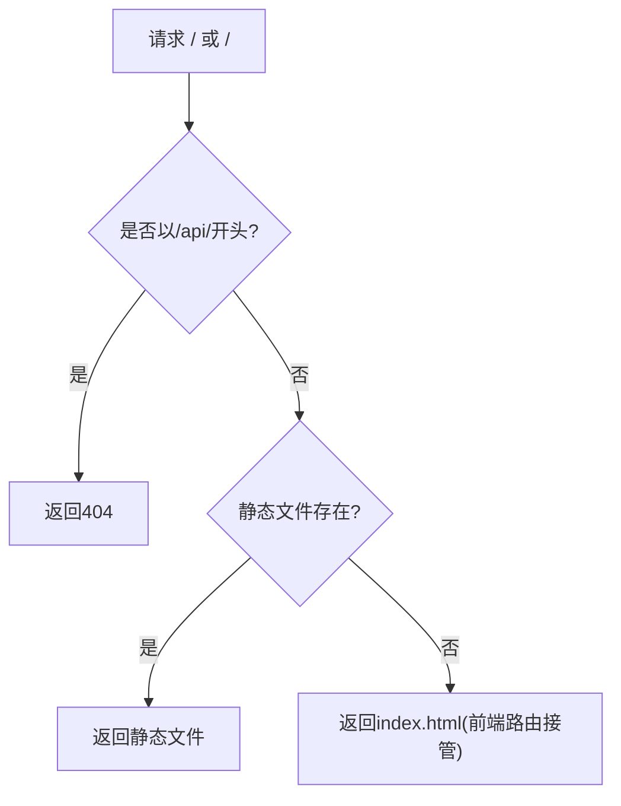
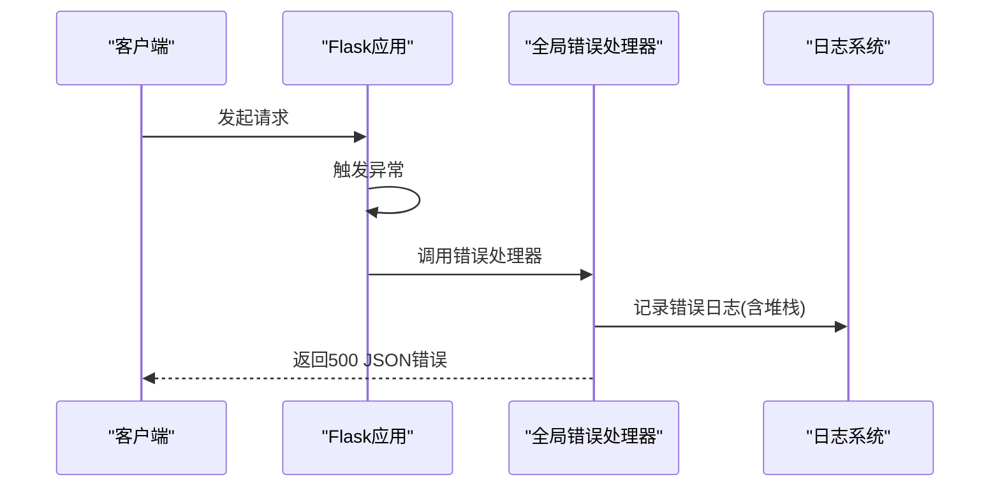
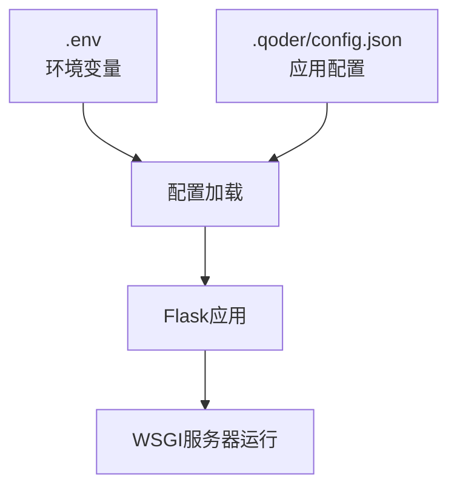
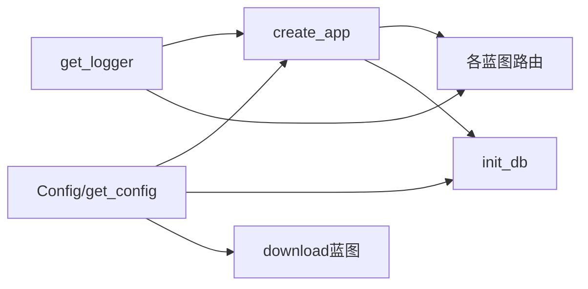

# Flask应用入口与初始化

<cite>
**本文档引用的文件**
- [backend/app.py](file://backend/app.py)
- [backend/config.py](file://backend/config.py)
- [backend/utils/logger.py](file://backend/utils/logger.py)
- [backend/models/database.py](file://backend/models/database.py)
- [backend/routes/search.py](file://backend/routes/search.py)
- [backend/routes/analysis.py](file://backend/routes/analysis.py)
- [backend/routes/download.py](file://backend/routes/download.py)
- [backend/routes/history.py](file://backend/routes/history.py)
- [backend/requirements.txt](file://backend/requirements.txt)
- [run.sh](file://run.sh)
- [.env](file://.env)
- [.qoder/config.json](file://.qoder/config.json)
</cite>

## 目录
1. [简介](#简介)
2. [项目结构](#项目结构)
3. [核心组件](#核心组件)
4. [架构概览](#架构概览)
5. [详细组件分析](#详细组件分析)
6. [依赖关系分析](#依赖关系分析)
7. [性能考虑](#性能考虑)
8. [故障排查指南](#故障排查指南)
9. [结论](#结论)
10. [附录](#附录)

## 简介
本文件聚焦于Flask应用的入口与初始化流程，系统性阐述以下主题：
- create_app()函数的实现逻辑：应用配置加载、蓝图注册、CORS跨域设置、静态文件与SPA路由处理。
- SPA路由处理机制：根路径重定向与前端路由回退策略。
- 全局错误处理器与日志记录机制。
- 应用启动流程、环境变量处理与生产部署要点。
- 关键初始化步骤图与配置依赖关系。

## 项目结构
后端采用分层组织：配置(Config)、数据库模型与连接、路由蓝图、服务层、工具模块。前端构建产物位于frontend/dist，作为Flask静态资源提供。

**图表来源**
- [backend/app.py](file://backend/app.py#L21-L67)
- [backend/config.py](file://backend/config.py#L15-L84)
- [backend/models/database.py](file://backend/models/database.py#L36-L43)
- [backend/utils/logger.py](file://backend/utils/logger.py#L5-L22)
- [backend/routes/search.py](file://backend/routes/search.py#L10-L27)

**章节来源**
- [backend/app.py](file://backend/app.py#L1-L78)
- [backend/config.py](file://backend/config.py#L1-L85)

## 核心组件
- 应用工厂函数 create_app()：负责读取配置、初始化数据库、注册蓝图、设置CORS、配置SPA静态文件服务与全局错误处理，并返回Flask应用实例。
- 配置系统 Config：统一从.env与.qoder/config.json加载配置，提供应用运行所需参数（如端口、密钥、数据库路径、下载目录、API密钥、速率限制、搜索/下载/分析默认值等）。
- 日志系统：基于标准库logging，输出到stdout，格式包含时间戳、级别、名称与消息。
- 数据库初始化：在应用启动前执行，确保SQLite表结构存在。

**章节来源**
- [backend/app.py](file://backend/app.py#L21-L67)
- [backend/config.py](file://backend/config.py#L15-L84)
- [backend/utils/logger.py](file://backend/utils/logger.py#L5-L22)
- [backend/models/database.py](file://backend/models/database.py#L36-L43)

## 架构概览
应用启动流程的关键步骤如下：

**图表来源**
- [backend/app.py](file://backend/app.py#L70-L77)
- [backend/config.py](file://backend/config.py#L80-L84)
- [backend/models/database.py](file://backend/models/database.py#L36-L43)
- [backend/utils/logger.py](file://backend/utils/logger.py#L5-L22)

## 详细组件分析

### create_app()函数实现逻辑
- 配置加载：调用配置工厂函数获取单例配置，设置SECRET_KEY等关键参数。
- 静态文件夹定位：指向frontend/dist，static_url_path设为空字符串以启用SPA路由回退。
- CORS设置：开发环境下允许Vite本地开发服务器域名。
- 蓝图注册：注册搜索、分析、下载、历史四个API蓝图。
- SPA静态文件服务与路由回退：
  - 根路径(/)：优先返回index.html；若不存在则返回简短JSON健康检查响应。
  - 通配符路径(/<path:path>)：若请求以/api/开头则返回404；否则先尝试直接返回静态文件；若不存在则回退到index.html；若仍不存在则返回404。
- 全局错误处理：捕获未处理异常，记录错误日志并返回统一的500错误响应。
- 返回应用实例供WSGI服务器或直接运行。

**图表来源**
- [backend/app.py](file://backend/app.py#L21-L67)

**章节来源**
- [backend/app.py](file://backend/app.py#L21-L67)

### SPA路由处理机制
- 根路径重定向：当访问/时，优先返回前端构建产物中的index.html，确保SPA单页应用正常加载。
- 前端路由回退策略：对于非/api/*的静态资源请求，若目标文件存在则直接返回；若不存在则回退到index.html，交由前端路由处理，避免404导致页面刷新。
- API路由保护：对/api/开头的请求明确不进行SPA回退，确保后端API路由不被静态文件服务拦截。

**图表来源**
- [backend/app.py](file://backend/app.py#L42-L59)

**章节来源**
- [backend/app.py](file://backend/app.py#L42-L59)

### 全局错误处理器与日志记录
- 全局错误处理器：捕获所有未处理异常，记录带堆栈信息的日志，返回统一的JSON错误响应与500状态码。
- 日志配置：使用标准库logging，输出到stdout，格式包含时间戳、级别、名称与消息；仅在首次获取logger时添加处理器，避免重复。

**图表来源**
- [backend/app.py](file://backend/app.py#L61-L65)
- [backend/utils/logger.py](file://backend/utils/logger.py#L5-L22)

**章节来源**
- [backend/app.py](file://backend/app.py#L61-L65)
- [backend/utils/logger.py](file://backend/utils/logger.py#L5-L22)

### 应用启动流程、环境变量与生产部署
- 启动入口：在app.py中直接运行Flask，读取配置中的端口与调试模式。
- 环境变量处理：通过dotenv加载.env文件；配置类同时合并.qoder/config.json中的设置。
- 生产部署要点：
  - 使用WSGI服务器（如gunicorn/uwsgi）托管Flask应用，避免直接使用Flask内置开发服务器。
  - 在生产环境中将FLASK_ENV设为production，DEBUG关闭，端口与主机根据部署环境配置。
  - 确保frontend/dist已构建并可被静态文件服务访问。
  - 保证数据库路径与下载目录权限正确，且在容器化部署时持久化存储。

**图表来源**
- [backend/config.py](file://backend/config.py#L11-L12)
- [backend/config.py](file://backend/config.py#L80-L84)
- [backend/app.py](file://backend/app.py#L74-L77)

**章节来源**
- [backend/app.py](file://backend/app.py#L74-L77)
- [backend/config.py](file://backend/config.py#L11-L12)
- [backend/config.py](file://backend/config.py#L80-L84)

## 依赖关系分析
- 配置依赖：create_app依赖get_config提供运行参数；数据库初始化依赖配置中的数据库路径；下载路由依赖配置中的下载目录。
- 日志依赖：各模块通过get_logger获取命名日志器，形成统一日志输出。
- 蓝图依赖：API蓝图各自独立，但共享配置与日志依赖。

**图表来源**
- [backend/config.py](file://backend/config.py#L80-L84)
- [backend/app.py](file://backend/app.py#L21-L67)
- [backend/models/database.py](file://backend/models/database.py#L36-L43)
- [backend/routes/download.py](file://backend/routes/download.py#L14-L39)
- [backend/utils/logger.py](file://backend/utils/logger.py#L5-L22)

**章节来源**
- [backend/config.py](file://backend/config.py#L80-L84)
- [backend/app.py](file://backend/app.py#L21-L67)
- [backend/models/database.py](file://backend/models/database.py#L36-L43)
- [backend/routes/download.py](file://backend/routes/download.py#L14-L39)
- [backend/utils/logger.py](file://backend/utils/logger.py#L5-L22)

## 性能考虑
- 静态文件服务：生产环境建议由反向代理（Nginx/Caddy）直接提供静态文件，减轻Flask负载。
- 数据库连接：使用线程局部连接池，配合WAL模式与超时设置，提升并发稳定性。
- 缓存策略：搜索与分析服务具备缓存机制，合理设置TTL可显著降低重复请求开销。
- CORS与路由：开发环境允许Vite本地端口，生产环境应收紧允许源，减少不必要的预检请求。

## 故障排查指南
- 404错误：
  - 若访问/api/*返回404，确认请求路径与蓝图路由一致。
  - 若SPA路由返回404，检查frontend/dist是否构建完成且index.html存在。
- 500错误：
  - 查看日志输出，定位异常堆栈；检查配置项（如API密钥、数据库路径、下载目录）是否正确。
- CORS错误：
  - 开发环境确认允许Vite本地端口；生产环境确认CORS白名单配置。
- 数据库问题：
  - 确认数据库文件存在且可写；检查初始化脚本是否成功执行。

**章节来源**
- [backend/app.py](file://backend/app.py#L42-L59)
- [backend/app.py](file://backend/app.py#L61-L65)
- [backend/utils/logger.py](file://backend/utils/logger.py#L5-L22)
- [backend/models/database.py](file://backend/models/database.py#L36-L43)

## 结论
该Flask应用通过工厂函数create_app集中初始化配置、数据库、蓝图与静态文件服务，结合CORS与SPA路由回退策略，实现了前后端一体化部署。全局错误处理与日志系统保障了运行时可观测性。生产部署时建议使用WSGI服务器与反向代理，严格管理环境变量与配置文件，确保稳定与安全。

## 附录
- 环境变量与配置映射：
  - SECRET_KEY、FLASK_ENV、FLASK_PORT、DATABASE_PATH、DOWNLOAD_DIR、ZHIPU_API_KEY、DEEPSEEK_API_KEY、HTTP_PROXY等。
- 依赖包：Flask、Flask-CORS、zhipuai、arxiv、scholarly、duckduckgo-search、requests、beautifulsoup4、lxml、python-dotenv。
- 启动脚本：run.sh负责虚拟环境、依赖安装、前端构建与应用启动。

**章节来源**
- [.env](file://.env#L1-L22)
- [.qoder/config.json](file://.qoder/config.json#L1-L31)
- [backend/requirements.txt](file://backend/requirements.txt#L1-L11)
- [run.sh](file://run.sh#L1-L50)