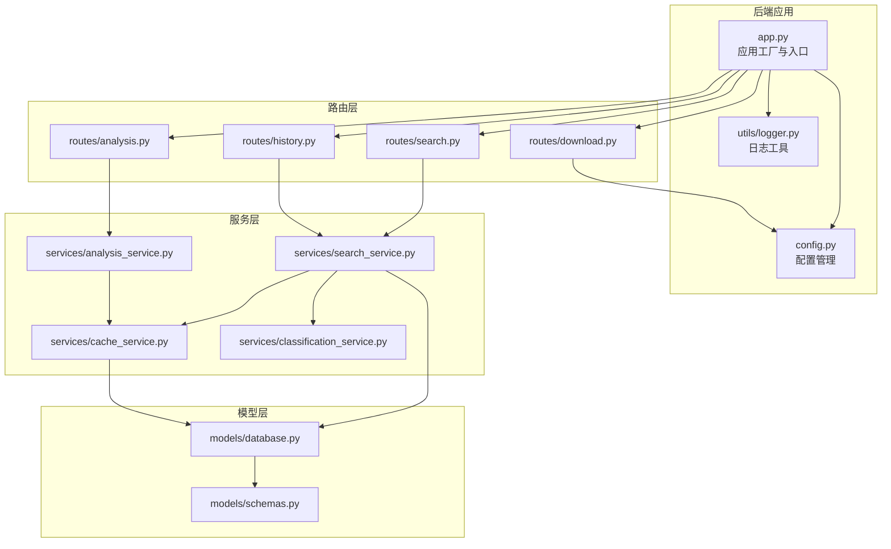
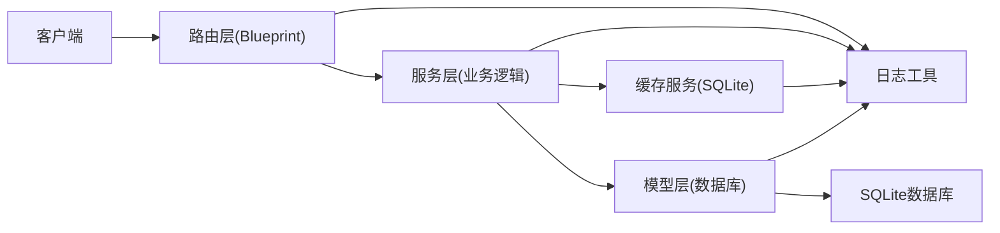
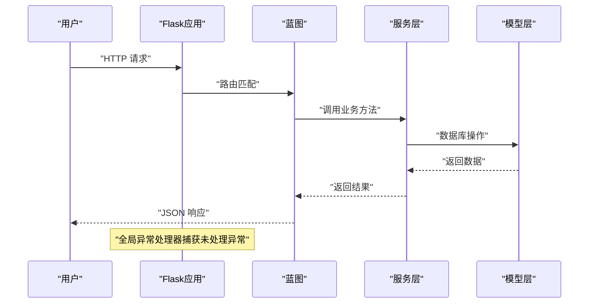
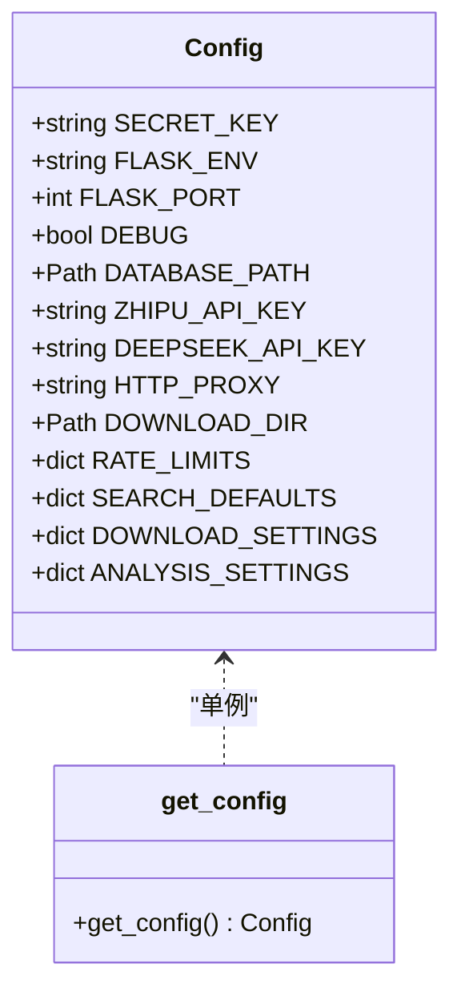
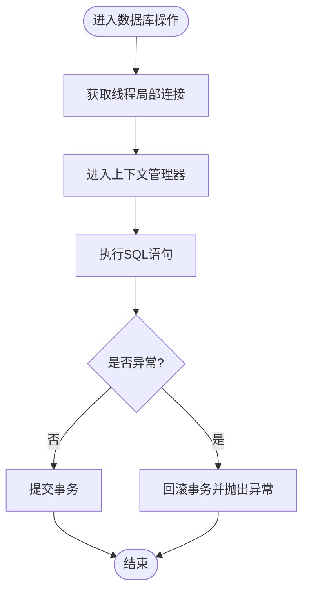
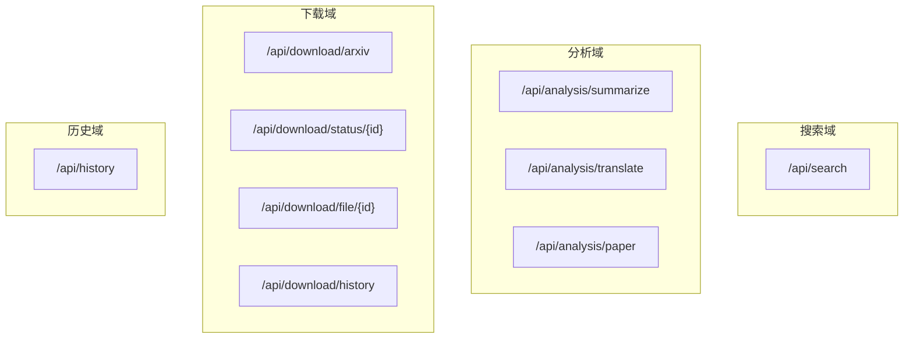
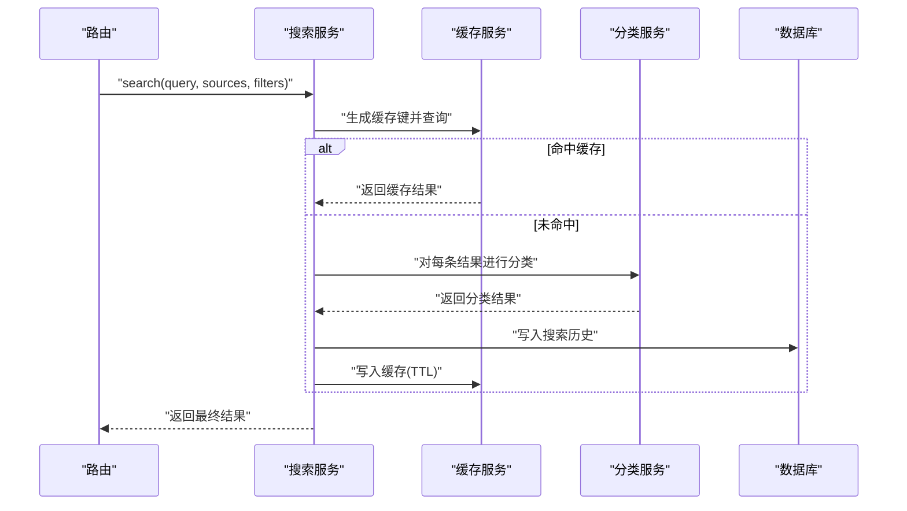
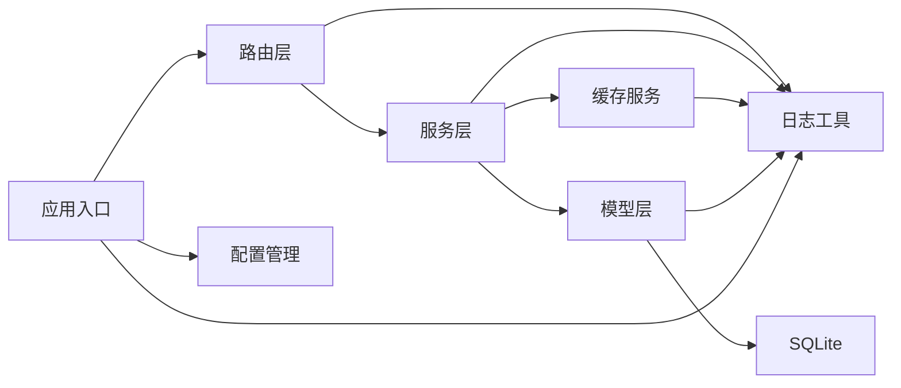

# 后端架构设计

<cite>
**本文档引用的文件**
- [backend/app.py](file://backend/app.py)
- [backend/config.py](file://backend/config.py)
- [backend/models/database.py](file://backend/models/database.py)
- [backend/models/schemas.py](file://backend/models/schemas.py)
- [backend/routes/search.py](file://backend/routes/search.py)
- [backend/routes/analysis.py](file://backend/routes/analysis.py)
- [backend/routes/download.py](file://backend/routes/download.py)
- [backend/routes/history.py](file://backend/routes/history.py)
- [backend/services/search_service.py](file://backend/services/search_service.py)
- [backend/services/analysis_service.py](file://backend/services/analysis_service.py)
- [backend/services/cache_service.py](file://backend/services/cache_service.py)
- [backend/services/classification_service.py](file://backend/services/classification_service.py)
- [backend/utils/logger.py](file://backend/utils/logger.py)
- [backend/requirements.txt](file://backend/requirements.txt)
</cite>

## 目录
1. [引言](#引言)
2. [项目结构](#项目结构)
3. [核心组件](#核心组件)
4. [架构总览](#架构总览)
5. [详细组件分析](#详细组件分析)
6. [依赖关系分析](#依赖关系分析)
7. [性能考虑](#性能考虑)
8. [故障排除指南](#故障排除指南)
9. [结论](#结论)
10. [附录](#附录)

## 引言
本文件面向后端架构设计与实现，围绕Flask应用的分层架构展开，重点阐述MVC模式在项目中的落地：模型层负责数据访问与持久化、服务层承载业务逻辑与缓存策略、路由层提供REST风格的API接口。同时，文档覆盖蓝图（Blueprint）机制、静态文件服务策略、CORS跨域配置、数据库连接管理、配置管理系统以及全局错误处理机制；并给出后端组件的依赖关系图、数据流图与API端点分布图，最后总结扩展性设计与性能优化策略。

## 项目结构
后端采用按功能域划分的目录组织方式，遵循“路由-服务-模型-工具”的分层职责：
- 路由层（routes）：定义API端点，接收请求参数，调用服务层，返回JSON响应。
- 服务层（services）：封装业务逻辑，协调外部能力（如搜索代理、分析代理），实现缓存与分类等策略。
- 模型层（models）：抽象数据库连接、表结构与事务控制。
- 工具层（utils）：提供日志、通用辅助方法。
- 配置（config）：集中管理环境变量与本地配置合并。
- 应用入口（app.py）：创建Flask应用、注册蓝图、设置CORS、静态文件服务与全局异常处理。

图表来源
- [backend/app.py](file://backend/app.py#L21-L78)
- [backend/config.py](file://backend/config.py#L15-L85)
- [backend/routes/search.py](file://backend/routes/search.py#L1-L28)
- [backend/routes/analysis.py](file://backend/routes/analysis.py#L1-L66)
- [backend/routes/download.py](file://backend/routes/download.py#L1-L98)
- [backend/routes/history.py](file://backend/routes/history.py#L1-L33)
- [backend/services/search_service.py](file://backend/services/search_service.py#L1-L98)
- [backend/services/analysis_service.py](file://backend/services/analysis_service.py#L1-L91)
- [backend/services/cache_service.py](file://backend/services/cache_service.py#L1-L104)
- [backend/services/classification_service.py](file://backend/services/classification_service.py#L1-L64)
- [backend/models/database.py](file://backend/models/database.py#L1-L51)
- [backend/models/schemas.py](file://backend/models/schemas.py#L1-L38)

章节来源
- [backend/app.py](file://backend/app.py#L1-L78)
- [backend/config.py](file://backend/config.py#L1-L85)

## 核心组件
- 应用工厂与入口：创建Flask实例、加载配置、注册蓝图、配置CORS、提供SPA静态文件服务、统一异常处理。
- 配置管理：从.env与本地配置文件合并，提供数据库路径、下载目录、速率限制、搜索默认值、分析设置等。
- 数据库连接：线程局部连接、上下文管理器自动提交/回滚、WAL模式、超时与外键约束。
- 日志系统：统一格式化输出，便于问题定位与审计。
- 蓝图机制：将不同功能域的路由拆分为独立模块，提升可维护性与可测试性。
- 缓存服务：基于SQLite的搜索与分析结果缓存，支持TTL与过期清理。
- 分类服务：基于URL与来源的简单规则分类，用于结果归类。
- 服务层：搜索服务整合多源搜索、分类与历史记录；分析服务对接分析代理并缓存结果。

章节来源
- [backend/app.py](file://backend/app.py#L21-L78)
- [backend/config.py](file://backend/config.py#L15-L85)
- [backend/models/database.py](file://backend/models/database.py#L11-L51)
- [backend/utils/logger.py](file://backend/utils/logger.py#L1-L23)
- [backend/services/cache_service.py](file://backend/services/cache_service.py#L1-L104)
- [backend/services/classification_service.py](file://backend/services/classification_service.py#L1-L64)
- [backend/services/search_service.py](file://backend/services/search_service.py#L1-L98)
- [backend/services/analysis_service.py](file://backend/services/analysis_service.py#L1-L91)

## 架构总览
本项目采用经典的MVC分层架构：
- 视图层（V）：蓝图路由负责请求解析与响应序列化。
- 控制器层（C）：路由层作为控制器，调度服务层执行业务逻辑。
- 模型层（M）：模型层封装数据库连接、表结构与事务，为上层提供数据访问能力。

图表来源
- [backend/app.py](file://backend/app.py#L21-L78)
- [backend/routes/search.py](file://backend/routes/search.py#L1-L28)
- [backend/routes/analysis.py](file://backend/routes/analysis.py#L1-L66)
- [backend/routes/download.py](file://backend/routes/download.py#L1-L98)
- [backend/routes/history.py](file://backend/routes/history.py#L1-L33)
- [backend/services/search_service.py](file://backend/services/search_service.py#L1-L98)
- [backend/services/analysis_service.py](file://backend/services/analysis_service.py#L1-L91)
- [backend/services/cache_service.py](file://backend/services/cache_service.py#L1-L104)
- [backend/models/database.py](file://backend/models/database.py#L1-L51)
- [backend/utils/logger.py](file://backend/utils/logger.py#L1-L23)

## 详细组件分析

### 应用工厂与入口（app.py）
- 职责：创建Flask应用、加载配置、注册蓝图、配置CORS、提供SPA静态文件服务、统一异常处理。
- 关键点：
  - 静态文件夹指向前端构建产物目录，生产环境通过单页应用回退策略处理非API路径。
  - 全局异常处理器统一返回JSON错误信息并记录日志。
  - 初始化数据库并在应用启动前完成表结构创建。

图表来源
- [backend/app.py](file://backend/app.py#L21-L78)
- [backend/routes/search.py](file://backend/routes/search.py#L10-L28)
- [backend/services/search_service.py](file://backend/services/search_service.py#L28-L67)
- [backend/models/database.py](file://backend/models/database.py#L24-L34)

章节来源
- [backend/app.py](file://backend/app.py#L21-L78)

### 配置管理（config.py）
- 职责：集中读取环境变量与本地配置文件，合并为单一配置对象，提供数据库路径、下载目录、速率限制、搜索默认值、分析设置等。
- 设计要点：
  - 单例模式确保全局一致的配置实例。
  - 自动创建数据目录与下载目录，保证运行时可用。
  - 将外部能力的API密钥与代理设置纳入配置。

图表来源
- [backend/config.py](file://backend/config.py#L15-L85)

章节来源
- [backend/config.py](file://backend/config.py#L15-L85)

### 数据库连接与模型（models/database.py, models/schemas.py）
- 连接管理：
  - 线程局部存储连接，避免并发冲突。
  - 上下文管理器自动提交或回滚，简化事务控制。
  - 启用WAL模式、设置busy_timeout与外键约束，提升并发与一致性。
- 表结构：
  - 搜索历史、搜索缓存、分析缓存、下载记录四张表，配合索引提升查询效率。
- 初始化：
  - 在应用启动前执行SQL脚本创建表结构。

图表来源
- [backend/models/database.py](file://backend/models/database.py#L24-L34)

章节来源
- [backend/models/database.py](file://backend/models/database.py#L1-L51)
- [backend/models/schemas.py](file://backend/models/schemas.py#L1-L38)

### 路由层（routes/search.py, routes/analysis.py, routes/download.py, routes/history.py）
- 路由职责：
  - 接收请求参数，进行基础校验，调用服务层，返回JSON响应。
  - 统一异常处理，记录错误日志并返回友好提示。
- API端点分布：
  - 搜索：POST /api/search
  - 分析：POST /api/analysis/summarize, POST /api/analysis/translate, POST /api/analysis/paper
  - 下载：POST /api/download/arxiv, GET /api/download/status/<id>, GET /api/download/file/<id>, GET /api/download/history
  - 历史：GET /api/history, DELETE /api/history

图表来源
- [backend/routes/search.py](file://backend/routes/search.py#L10-L28)
- [backend/routes/analysis.py](file://backend/routes/analysis.py#L10-L66)
- [backend/routes/download.py](file://backend/routes/download.py#L14-L98)
- [backend/routes/history.py](file://backend/routes/history.py#L10-L33)

章节来源
- [backend/routes/search.py](file://backend/routes/search.py#L1-L28)
- [backend/routes/analysis.py](file://backend/routes/analysis.py#L1-L66)
- [backend/routes/download.py](file://backend/routes/download.py#L1-L98)
- [backend/routes/history.py](file://backend/routes/history.py#L1-L33)

### 服务层（services/search_service.py, services/analysis_service.py, services/cache_service.py, services/classification_service.py）
- 搜索服务：
  - 多源搜索、结果分类、缓存命中、历史记录保存。
  - 使用延迟初始化的搜索代理，减少启动开销。
- 分析服务：
  - 总结、翻译、论文深度分析，均支持缓存。
  - 使用延迟初始化的分析代理。
- 缓存服务：
  - 搜索缓存：基于查询参数哈希+TTL。
  - 分析缓存：基于内容哈希+类型+7天有效期。
  - 定期清理过期缓存条目。
- 分类服务：
  - 基于来源与URL域名规则的简单分类。

图表来源
- [backend/services/search_service.py](file://backend/services/search_service.py#L28-L67)
- [backend/services/cache_service.py](file://backend/services/cache_service.py#L30-L52)
- [backend/services/classification_service.py](file://backend/services/classification_service.py#L30-L64)
- [backend/models/database.py](file://backend/models/database.py#L73-L78)

章节来源
- [backend/services/search_service.py](file://backend/services/search_service.py#L1-L98)
- [backend/services/analysis_service.py](file://backend/services/analysis_service.py#L1-L91)
- [backend/services/cache_service.py](file://backend/services/cache_service.py#L1-L104)
- [backend/services/classification_service.py](file://backend/services/classification_service.py#L1-L64)

### 日志与错误处理（utils/logger.py, app.py）
- 日志：
  - 统一日志格式与输出目标，避免重复Handler。
  - 所有模块共享同一Logger实例，便于追踪调用链。
- 错误处理：
  - 全局异常处理器捕获未处理异常，记录堆栈并返回JSON错误。
  - 路由与服务层内部异常统一记录并返回结构化错误信息。

章节来源
- [backend/utils/logger.py](file://backend/utils/logger.py#L1-L23)
- [backend/app.py](file://backend/app.py#L61-L66)

## 依赖关系分析
- 组件耦合：
  - 路由层仅依赖服务层接口，低耦合高内聚。
  - 服务层依赖缓存与模型层，形成清晰的业务边界。
  - 模型层仅暴露连接与表结构，不直接参与业务判断。
- 外部依赖：
  - Flask与Flask-CORS提供Web框架与跨域支持。
  - 外部搜索与分析能力通过代理模块注入，便于替换与扩展。

图表来源
- [backend/app.py](file://backend/app.py#L10-L18)
- [backend/routes/search.py](file://backend/routes/search.py#L3-L4)
- [backend/services/search_service.py](file://backend/services/search_service.py#L7-L11)
- [backend/models/database.py](file://backend/models/database.py#L5-L6)

章节来源
- [backend/app.py](file://backend/app.py#L1-L78)
- [backend/requirements.txt](file://backend/requirements.txt#L1-L11)

## 性能考虑
- 数据库层面：
  - 线程局部连接避免锁竞争；WAL模式提升读写并发；索引加速缓存查询。
  - 事务自动提交/回滚，减少显式事务开销。
- 缓存策略：
  - 搜索缓存支持自定义TTL；分析缓存7天有效期，定期清理过期项。
  - 缓存键基于内容哈希，命中率高且更新及时。
- 服务层优化：
  - 延迟初始化代理，按需加载，降低启动时间。
  - 结果分类在内存中完成，避免额外网络请求。
- 静态文件与CORS：
  - 生产环境SPA回退策略减少无效请求；CORS仅允许开发服务器源，保障安全。
- 可扩展性建议：
  - 将外部代理模块抽象为接口，便于替换不同供应商。
  - 引入异步任务队列处理耗时下载与分析，提升吞吐量。
  - 增加数据库连接池与读写分离，支撑更高并发。

## 故障排除指南
- 常见问题与定位：
  - 404错误：确认静态文件路径与回退策略；检查API前缀是否正确。
  - 500错误：查看全局异常日志，定位具体路由与服务层异常。
  - 数据库异常：检查数据库文件权限、路径与WAL模式配置。
  - 缓存异常：确认缓存键生成规则与TTL设置，必要时手动清理过期项。
- 建议排查步骤：
  - 开启DEBUG模式观察日志输出。
  - 使用最小化请求体复现问题，逐步缩小范围。
  - 检查配置文件与环境变量是否正确加载。

章节来源
- [backend/app.py](file://backend/app.py#L48-L66)
- [backend/utils/logger.py](file://backend/utils/logger.py#L1-L23)

## 结论
本项目以Flask为基础，采用清晰的分层架构与蓝图机制，实现了搜索、分析、下载与历史管理的完整后端能力。通过线程局部数据库连接、SQLite缓存与统一日志体系，兼顾了易用性与可维护性。未来可在代理抽象、异步任务与数据库扩展方面进一步增强性能与可扩展性。

## 附录
- API端点一览：
  - 搜索：POST /api/search
  - 分析：POST /api/analysis/summarize, POST /api/analysis/translate, POST /api/analysis/paper
  - 下载：POST /api/download/arxiv, GET /api/download/status/<id>, GET /api/download/file/<id>, GET /api/download/history
  - 历史：GET /api/history, DELETE /api/history