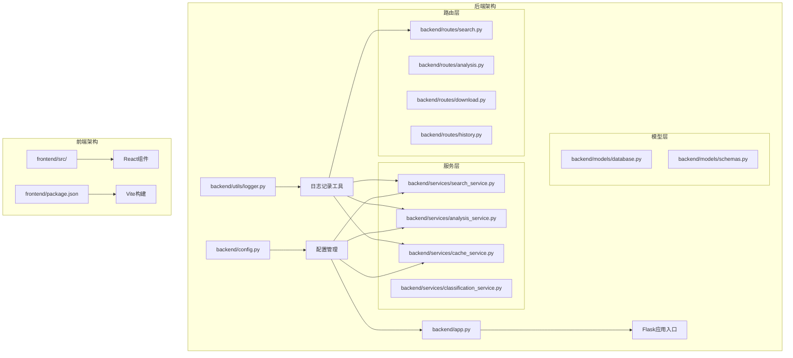
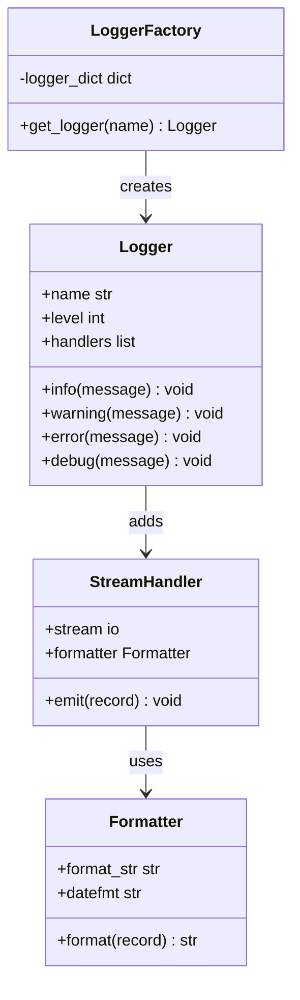
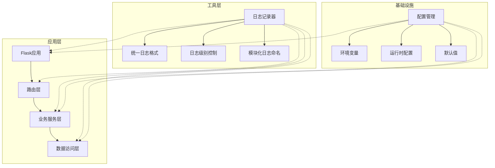
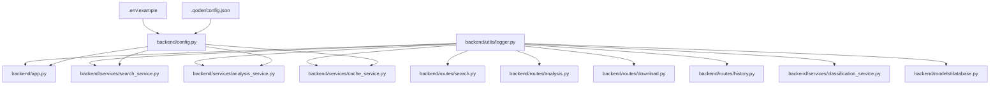

# 工具与辅助功能

<cite>
**本文档引用的文件**
- [backend/utils/logger.py](file://backend/utils/logger.py)
- [backend/app.py](file://backend/app.py)
- [backend/routes/search.py](file://backend/routes/search.py)
- [backend/services/search_service.py](file://backend/services/search_service.py)
- [backend/services/cache_service.py](file://backend/services/cache_service.py)
- [backend/services/analysis_service.py](file://backend/services/analysis_service.py)
- [backend/config.py](file://backend/config.py)
- [README.md](file://README.md)
- [.env.example](file://.env.example)
- [.qoder/config.json](file://.qoder/config.json)
</cite>

## 目录
1. [简介](#简介)
2. [项目结构](#项目结构)
3. [核心组件](#核心组件)
4. [架构概览](#架构概览)
5. [详细组件分析](#详细组件分析)
6. [依赖关系分析](#依赖关系分析)
7. [性能考虑](#性能考虑)
8. [故障排查指南](#故障排查指南)
9. [结论](#结论)

## 简介

本项目是一个全栈Web应用，提供多源内容检索和AI智能分析功能。工具与辅助功能主要集中在日志记录系统的设计与实现上，为整个应用提供了统一的日志记录机制，支持调试、监控和故障排查等多种场景。

日志系统采用Python标准库logging模块，实现了集中化的日志配置和格式化策略，确保了日志输出的一致性和可读性。通过合理的日志级别设置和格式化策略，为开发者提供了强大的调试能力和运维支持。

## 项目结构

该项目采用前后端分离的架构设计，后端使用Flask框架，前端使用React技术栈。工具与辅助功能主要分布在后端的utils目录中，目前主要包含日志记录相关的工具函数。

**图表来源**
- [backend/app.py](file://backend/app.py#L1-L78)
- [backend/config.py](file://backend/config.py#L1-L85)
- [backend/utils/logger.py](file://backend/utils/logger.py#L1-L23)

**章节来源**
- [backend/app.py](file://backend/app.py#L1-L78)
- [backend/config.py](file://backend/config.py#L1-L85)
- [README.md](file://README.md#L376-L404)

## 核心组件

### 日志记录系统

日志记录系统是本项目工具与辅助功能的核心组件，位于`backend/utils/logger.py`文件中。该系统提供了统一的日志记录接口，支持多种日志级别和格式化策略。

#### 核心特性

1. **集中化配置**：通过单例模式确保日志配置在整个应用中的一致性
2. **流处理器**：使用StreamHandler将日志输出到标准输出流
3. **格式化策略**：采用统一的时间戳、日志级别、模块名称和消息格式
4. **级别控制**：默认设置为DEBUG级别，便于开发和调试阶段的详细日志记录

#### 关键实现

**图表来源**
- [backend/utils/logger.py](file://backend/utils/logger.py#L5-L22)

**章节来源**
- [backend/utils/logger.py](file://backend/utils/logger.py#L1-L23)

### 配置管理系统

配置管理系统负责管理应用的各种配置参数，包括环境变量、运行时配置和默认值设置。该系统确保了日志记录和其他功能的正确配置。

#### 配置层次

1. **环境变量**：通过`.env`文件加载的运行时配置
2. **运行时配置**：从`.qoder/config.json`加载的动态配置
3. **默认值**：硬编码的默认配置参数

**章节来源**
- [backend/config.py](file://backend/config.py#L1-L85)
- [.env.example](file://.env.example#L1-L21)
- [.qoder/config.json](file://.qoder/config.json#L1-L31)

## 架构概览

日志记录系统在整个应用架构中扮演着重要的基础设施角色，为各个模块提供统一的日志记录能力。

**图表来源**
- [backend/app.py](file://backend/app.py#L16-L18)
- [backend/routes/search.py](file://backend/routes/search.py#L4-L6)
- [backend/services/search_service.py](file://backend/services/search_service.py#L11-L13)

## 详细组件分析

### 日志记录器实现

#### get_logger函数分析

日志记录器的实现采用了单例模式，确保每个模块只创建一个logger实例。该函数的核心逻辑包括：

1. **Logger获取**：通过`logging.getLogger(name)`获取或创建logger实例
2. **初始化检查**：检查logger是否已经配置过处理器
3. **级别设置**：将日志级别设置为DEBUG
4. **处理器配置**：创建StreamHandler并将格式化器应用到处理器
5. **格式化器设置**：定义统一的日志格式字符串

#### 日志格式化策略

日志格式采用统一的格式化策略，包含以下字段：
- 时间戳：精确到秒级的时间格式
- 日志级别：INFO、WARNING、ERROR、DEBUG等
- 模块名称：标识日志来源的模块或包名
- 消息内容：实际的日志信息

**章节来源**
- [backend/utils/logger.py](file://backend/utils/logger.py#L5-L22)

### 应用集成分析

#### Flask应用集成

在Flask应用中，日志记录器被集成到应用的全局错误处理机制中。当发生未处理的异常时，系统会记录详细的错误信息，包括异常类型、消息和堆栈跟踪。

#### 路由层集成

各个路由模块都集成了日志记录器，用于记录API请求的处理过程。例如搜索路由会在处理搜索请求时记录查询参数、处理结果和可能发生的错误。

#### 服务层集成

服务层的各个模块都使用日志记录器来记录业务逻辑的执行过程，包括缓存命中率、数据库操作、外部API调用等关键操作。

**章节来源**
- [backend/app.py](file://backend/app.py#L62-L65)
- [backend/routes/search.py](file://backend/routes/search.py#L22-L27)
- [backend/services/search_service.py](file://backend/services/search_service.py#L48-L66)

### 日志级别使用策略

#### DEBUG级别
- 用于开发阶段的详细日志记录
- 包括缓存命中详情、数据库查询语句等
- 在生产环境中通常不启用

#### INFO级别
- 记录正常的业务流程和关键操作
- 包括搜索完成、缓存设置、历史记录保存等
- 用于监控应用的正常运行状态

#### WARNING级别
- 记录潜在的问题但不影响正常功能
- 包括历史记录保存失败等可恢复错误
- 用于早期发现问题的预警

#### ERROR级别
- 记录影响功能的错误事件
- 包括API调用失败、数据库连接异常等
- 用于故障排查和问题定位

**章节来源**
- [backend/services/search_service.py](file://backend/services/search_service.py#L79-L79)
- [backend/services/cache_service.py](file://backend/services/cache_service.py#L38-L38)
- [backend/routes/search.py](file://backend/routes/search.py#L26-L26)

## 依赖关系分析

日志记录系统在整个应用中的依赖关系呈现树状结构，从应用层向下辐射到各个模块。

**图表来源**
- [backend/utils/logger.py](file://backend/utils/logger.py#L1-L23)
- [backend/app.py](file://backend/app.py#L10-L16)
- [backend/config.py](file://backend/config.py#L15-L84)

### 依赖关系特点

1. **单向依赖**：日志记录器只依赖于应用层，不反向依赖其他模块
2. **无循环依赖**：日志系统不会被任何模块依赖，避免了循环依赖问题
3. **模块独立性**：每个模块都可以独立使用日志记录器，不需要额外的配置

**章节来源**
- [backend/utils/logger.py](file://backend/utils/logger.py#L1-L23)
- [backend/app.py](file://backend/app.py#L10-L16)

## 性能考虑

### 日志性能优化

#### 异步日志处理
- 当前实现使用同步的StreamHandler，适合开发环境
- 生产环境中可以考虑使用异步日志处理器以提高性能

#### 日志级别优化
- 在生产环境中将日志级别调整为INFO或WARNING，减少DEBUG级别的开销
- 避免在高频操作中使用DEBUG级别的详细日志

#### 格式化开销
- 统一的日志格式化策略减少了格式化开销
- 避免在日志消息中进行复杂的字符串拼接操作

### 内存使用优化

#### 日志缓冲
- 使用标准库的默认缓冲策略，避免额外的内存分配
- 合理控制日志消息的长度，避免过长的消息占用内存

#### 处理器管理
- 通过单例模式避免重复创建处理器实例
- 合理管理日志处理器的数量，避免过多的I/O操作

## 故障排查指南

### 常见日志问题

#### 日志不显示
- 检查日志级别设置是否正确
- 确认Flask应用的DEBUG模式配置
- 验证环境变量配置是否正确

#### 日志格式异常
- 检查时间格式化配置
- 确认模块名称的正确性
- 验证消息格式化字符串

#### 性能问题
- 分析日志输出频率和量级
- 检查是否有过多的DEBUG级别日志
- 评估日志处理器的性能影响

### 调试技巧

#### 条件日志记录
- 在关键业务逻辑处添加条件判断，避免不必要的日志输出
- 使用不同的日志级别区分不同类型的事件

#### 错误追踪
- 在异常处理中记录详细的上下文信息
- 使用exc_info参数记录完整的堆栈跟踪

#### 性能监控
- 记录关键操作的执行时间
- 监控缓存命中率和数据库查询性能

**章节来源**
- [backend/app.py](file://backend/app.py#L62-L65)
- [backend/routes/search.py](file://backend/routes/search.py#L22-L27)
- [README.md](file://README.md#L361-L375)

## 结论

本项目的工具与辅助功能虽然相对简单，但日志记录系统的设计体现了良好的工程实践。通过统一的日志记录接口、清晰的日志级别策略和一致的格式化方案，为整个应用提供了强大的调试和监控能力。

日志系统的主要优势包括：
1. **一致性**：统一的日志格式和级别策略
2. **可维护性**：模块化的日志记录器设计
3. **可扩展性**：易于添加新的日志记录点
4. **性能友好**：合理的日志级别和格式化策略

未来可以考虑的改进方向：
1. 添加异步日志处理器以提升性能
2. 实现日志轮转和归档机制
3. 添加结构化日志支持
4. 集成分布式追踪系统

通过持续优化日志记录系统，可以进一步提升应用的可观测性和可维护性，为用户提供更好的使用体验。