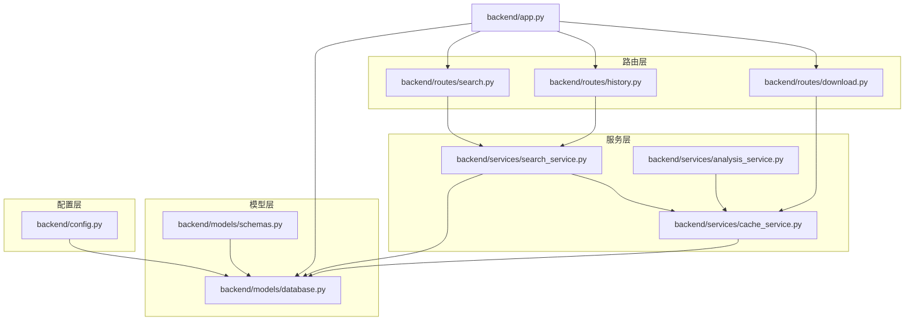
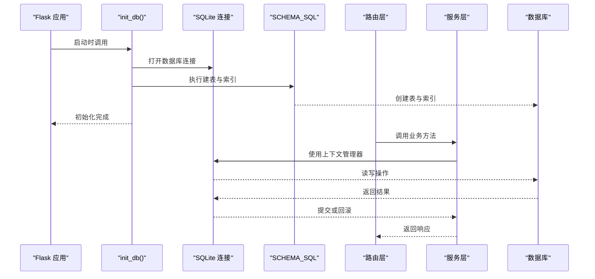
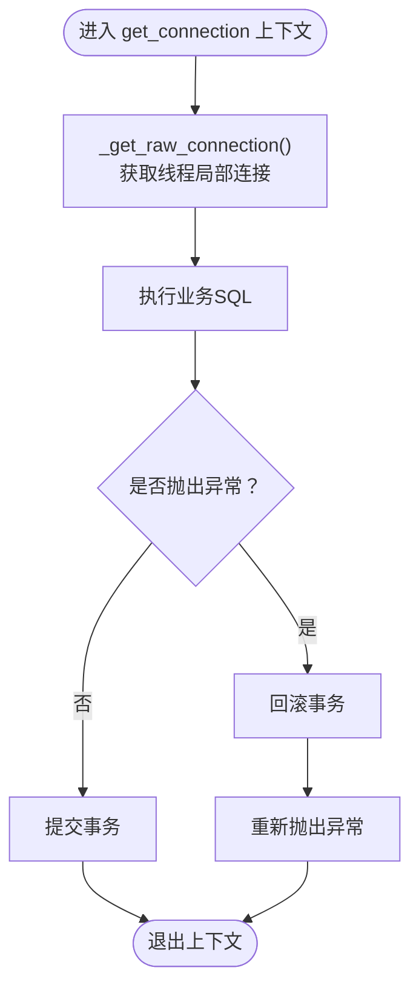
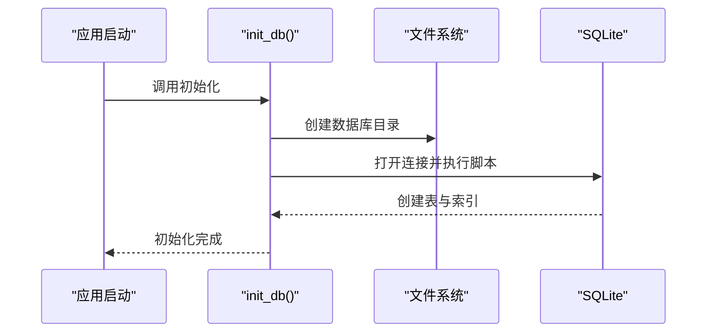
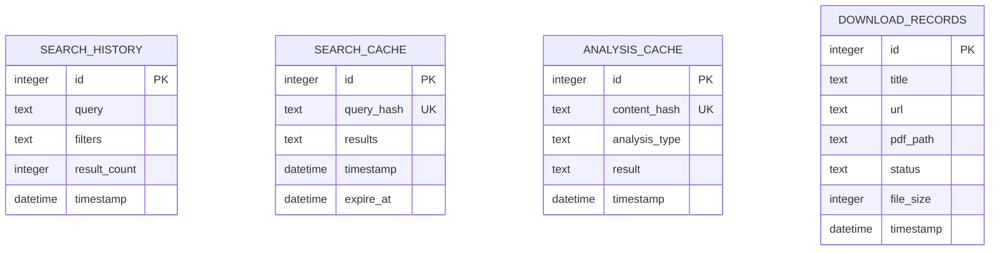
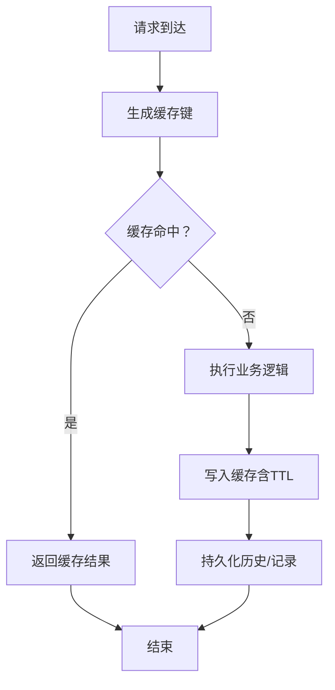
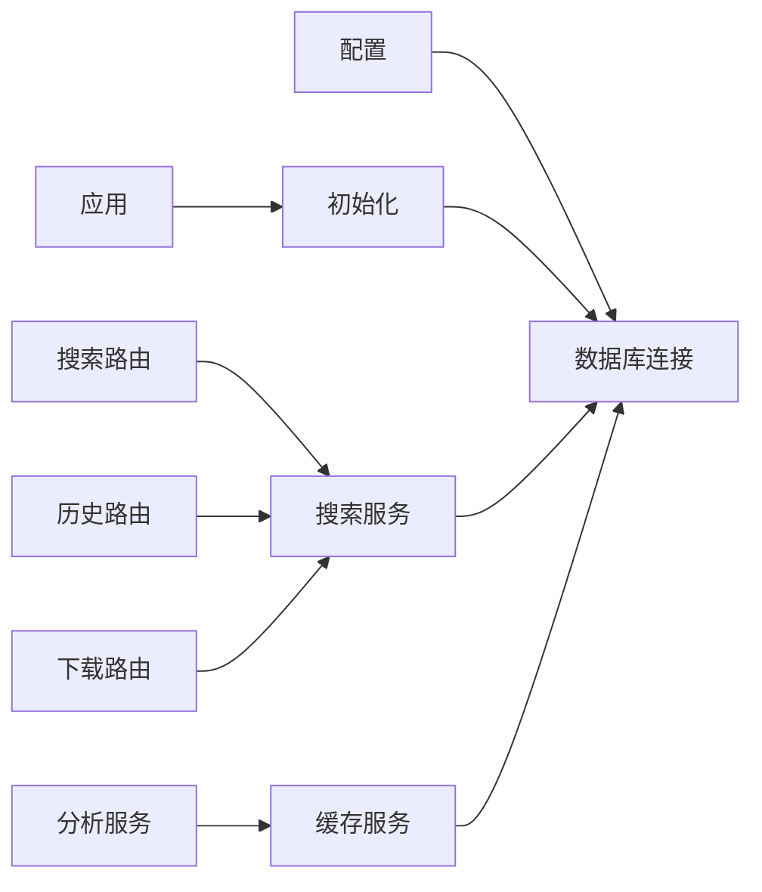

# 数据库模型层

<cite>
**本文档引用的文件**
- [backend/models/database.py](file://backend/models/database.py)
- [backend/models/schemas.py](file://backend/models/schemas.py)
- [backend/config.py](file://backend/config.py)
- [backend/app.py](file://backend/app.py)
- [backend/services/cache_service.py](file://backend/services/cache_service.py)
- [backend/services/search_service.py](file://backend/services/search_service.py)
- [backend/routes/history.py](file://backend/routes/history.py)
- [backend/routes/search.py](file://backend/routes/search.py)
- [backend/routes/download.py](file://backend/routes/download.py)
</cite>

## 目录
1. [简介](#简介)
2. [项目结构](#项目结构)
3. [核心组件](#核心组件)
4. [架构总览](#架构总览)
5. [详细组件分析](#详细组件分析)
6. [依赖关系分析](#依赖关系分析)
7. [性能考虑](#性能考虑)
8. [故障排查指南](#故障排查指南)
9. [结论](#结论)

## 简介
本文件系统性梳理数据库模型层的设计与实现，覆盖 SQLite 连接管理、表结构设计、ORM 映射策略、初始化流程、连接池与事务处理、数据模型关系、字段约束与索引优化、数据访问模式与查询优化技巧，以及数据一致性保障机制。目标是帮助开发者与运维人员快速理解并高效维护数据库层。

## 项目结构
数据库模型层位于后端 models 目录，核心由以下模块组成：
- 配置模块：提供数据库路径等配置项
- 数据库连接与初始化：封装线程局部连接、自动提交/回滚、数据库初始化脚本执行
- 模式定义：集中声明各表结构与索引
- 服务层：缓存服务、搜索服务、分析服务等对数据库的读写操作
- 路由层：对外暴露 API，调用服务层完成业务逻辑

图表来源
- [backend/app.py](file://backend/app.py#L1-L78)
- [backend/models/database.py](file://backend/models/database.py#L1-L51)
- [backend/models/schemas.py](file://backend/models/schemas.py#L1-L38)
- [backend/config.py](file://backend/config.py#L1-L85)
- [backend/services/cache_service.py](file://backend/services/cache_service.py#L1-L104)
- [backend/services/search_service.py](file://backend/services/search_service.py#L1-L98)
- [backend/routes/search.py](file://backend/routes/search.py#L1-L28)
- [backend/routes/history.py](file://backend/routes/history.py#L1-L33)
- [backend/routes/download.py](file://backend/routes/download.py#L1-L98)

章节来源
- [backend/app.py](file://backend/app.py#L1-L78)
- [backend/config.py](file://backend/config.py#L1-L85)

## 核心组件
- 连接管理与上下文：通过线程局部存储持有连接，提供带自动提交/回滚的上下文管理器，确保异常时回滚、成功时提交
- 初始化流程：应用启动时执行数据库初始化，创建所有表与索引
- 模式定义：集中于模式脚本，包含搜索历史、搜索缓存、分析缓存、下载记录四张表及相应索引
- 缓存策略：基于哈希键的搜索与分析缓存，支持 TTL 与定期清理
- 数据访问模式：服务层统一通过上下文管理器进行读写，路由层负责参数校验与错误处理

章节来源
- [backend/models/database.py](file://backend/models/database.py#L1-L51)
- [backend/models/schemas.py](file://backend/models/schemas.py#L1-L38)
- [backend/services/cache_service.py](file://backend/services/cache_service.py#L1-L104)
- [backend/services/search_service.py](file://backend/services/search_service.py#L1-L98)

## 架构总览
下图展示从应用启动到数据库初始化、再到服务层与路由层的数据流：

图表来源
- [backend/app.py](file://backend/app.py#L70-L72)
- [backend/models/database.py](file://backend/models/database.py#L36-L43)
- [backend/models/schemas.py](file://backend/models/schemas.py#L1-L38)
- [backend/routes/search.py](file://backend/routes/search.py#L10-L27)
- [backend/services/search_service.py](file://backend/services/search_service.py#L28-L67)

## 详细组件分析

### 连接管理与事务处理
- 线程局部连接：每个线程拥有独立连接，避免并发竞争
- 自动提交/回滚：上下文管理器在退出时自动提交；捕获异常时回滚，保证一致性
- WAL 模式与超时设置：提升并发读写能力与减少锁等待
- 外键约束：启用外键检查，确保参照完整性（尽管当前表间无显式外键）

图表来源
- [backend/models/database.py](file://backend/models/database.py#L11-L33)

章节来源
- [backend/models/database.py](file://backend/models/database.py#L1-L51)

### 数据库初始化流程
- 目录准备：确保数据库目录存在
- 执行脚本：一次性执行模式脚本，创建所有表与索引
- 关闭连接：初始化完成后关闭连接，避免资源泄漏

图表来源
- [backend/app.py](file://backend/app.py#L70-L72)
- [backend/models/database.py](file://backend/models/database.py#L36-L43)
- [backend/models/schemas.py](file://backend/models/schemas.py#L1-L38)

章节来源
- [backend/app.py](file://backend/app.py#L70-L72)
- [backend/models/database.py](file://backend/models/database.py#L36-L43)

### 表结构设计与字段约束

#### 搜索历史表（search_history）
- 主键：自增整数
- 字段：查询文本、过滤条件 JSON、结果数量、时间戳
- 约束：查询文本非空；过滤条件默认空对象；结果数量默认 0；时间戳默认当前时间
- 用途：记录用户搜索行为，支持历史查询与统计

#### 搜索缓存表（search_cache）
- 主键：自增整数
- 键：查询哈希唯一；结果 JSON；时间戳；过期时间
- 索引：按查询哈希建立唯一索引
- 约束：查询哈希唯一；过期时间非空
- 用途：缓存多源搜索结果，支持 TTL 控制

#### 分析缓存表（analysis_cache）
- 主键：自增整数
- 键：内容哈希唯一；分析类型；结果 JSON；时间戳
- 索引：按内容哈希建立唯一索引
- 约束：内容哈希唯一；分析类型非空
- 用途：缓存摘要、翻译、论文分析等结果，支持 7 天有效期清理

#### 下载记录表（download_records）
- 主键：自增整数
- 字段：标题、URL、PDF 路径、状态、文件大小、时间戳
- 约束：状态默认 pending；文件大小默认 0；时间戳默认当前时间
- 用途：跟踪下载任务生命周期与产物

图表来源
- [backend/models/schemas.py](file://backend/models/schemas.py#L1-L38)

章节来源
- [backend/models/schemas.py](file://backend/models/schemas.py#L1-L38)

### ORM 映射策略
- 原生 SQL：未引入第三方 ORM，采用原生 SQL 语句与 sqlite3.Row 行工厂
- 行工厂：返回字典式行对象，便于以键值方式访问列
- JSON 序列化：缓存表中使用 JSON 文本存储复杂结构，服务层负责序列化/反序列化
- 唯一键：通过哈希函数生成唯一键，避免重复插入与冗余数据

章节来源
- [backend/models/database.py](file://backend/models/database.py#L15-L16)
- [backend/services/cache_service.py](file://backend/services/cache_service.py#L1-L104)

### 数据访问模式与查询优化
- 统一上下文：所有读写均通过上下文管理器，确保事务一致性
- 唯一键命中：缓存查询优先命中唯一键，避免全表扫描
- TTL 策略：搜索缓存按小时级 TTL，分析缓存按天级清理，降低无效数据占用
- 定期清理：后台清理过期缓存，释放空间并维持性能

图表来源
- [backend/services/search_service.py](file://backend/services/search_service.py#L28-L67)
- [backend/services/cache_service.py](file://backend/services/cache_service.py#L30-L52)
- [backend/services/cache_service.py](file://backend/services/cache_service.py#L57-L86)

章节来源
- [backend/services/search_service.py](file://backend/services/search_service.py#L28-L98)
- [backend/services/cache_service.py](file://backend/services/cache_service.py#L1-L104)

### 数据一致性保障机制
- 事务边界：上下文管理器包裹单次业务操作，失败自动回滚
- 外键约束：启用外键检查，为未来扩展关系提供基础
- 唯一键约束：缓存表唯一键避免重复写入
- 异常日志：路由层与服务层统一记录异常，便于追踪问题

章节来源
- [backend/models/database.py](file://backend/models/database.py#L24-L33)
- [backend/routes/search.py](file://backend/routes/search.py#L22-L27)
- [backend/routes/history.py](file://backend/routes/history.py#L16-L21)

## 依赖关系分析
- 配置驱动：数据库路径与目录由配置模块提供，确保部署一致性
- 初始化入口：应用启动即执行初始化，确保表与索引就绪
- 服务耦合：缓存服务与搜索/分析服务紧密耦合，共享键生成与读写逻辑
- 路由解耦：路由层仅负责参数与错误处理，业务逻辑下沉至服务层

图表来源
- [backend/config.py](file://backend/config.py#L35-L36)
- [backend/app.py](file://backend/app.py#L70-L72)
- [backend/routes/search.py](file://backend/routes/search.py#L10-L27)
- [backend/routes/history.py](file://backend/routes/history.py#L10-L32)
- [backend/routes/download.py](file://backend/routes/download.py#L14-L97)
- [backend/services/search_service.py](file://backend/services/search_service.py#L28-L98)
- [backend/services/cache_service.py](file://backend/services/cache_service.py#L1-L104)
- [backend/services/analysis_service.py](file://backend/services/analysis_service.py#L25-L90)

章节来源
- [backend/config.py](file://backend/config.py#L1-L85)
- [backend/app.py](file://backend/app.py#L1-L78)

## 性能考虑
- WAL 模式：提升并发读写吞吐，减少写放大
- 索引优化：缓存表按唯一键建立索引，加速命中与去重
- TTL 策略：控制缓存体积，避免无限增长
- 定期清理：删除过期条目，保持查询效率
- 行工厂：字典式访问简化代码，减少解析成本

[本节为通用性能建议，不直接分析具体文件]

## 故障排查指南
- 连接异常：确认数据库路径与权限；检查线程局部连接是否正确创建
- 初始化失败：检查模式脚本语法；确认数据库目录可写
- 缓存未命中：核对键生成逻辑与 TTL；确认过期时间是否正确
- 事务未提交：检查上下文管理器使用；确保异常被捕获并回滚
- 路由错误：查看路由层日志与状态码；定位具体服务层异常

章节来源
- [backend/models/database.py](file://backend/models/database.py#L11-L21)
- [backend/models/database.py](file://backend/models/database.py#L36-L43)
- [backend/services/cache_service.py](file://backend/services/cache_service.py#L91-L103)
- [backend/routes/search.py](file://backend/routes/search.py#L22-L27)
- [backend/routes/history.py](file://backend/routes/history.py#L16-L21)

## 结论
该数据库模型层以最小依赖实现了清晰的连接管理、完善的表结构与索引、一致的事务处理与缓存策略。通过集中初始化与统一上下文，既保证了开发效率，也兼顾了运行时的稳定性与性能。建议后续根据业务增长逐步引入更细粒度的索引与分区策略，并在需要时评估引入轻量 ORM 以进一步提升可维护性。