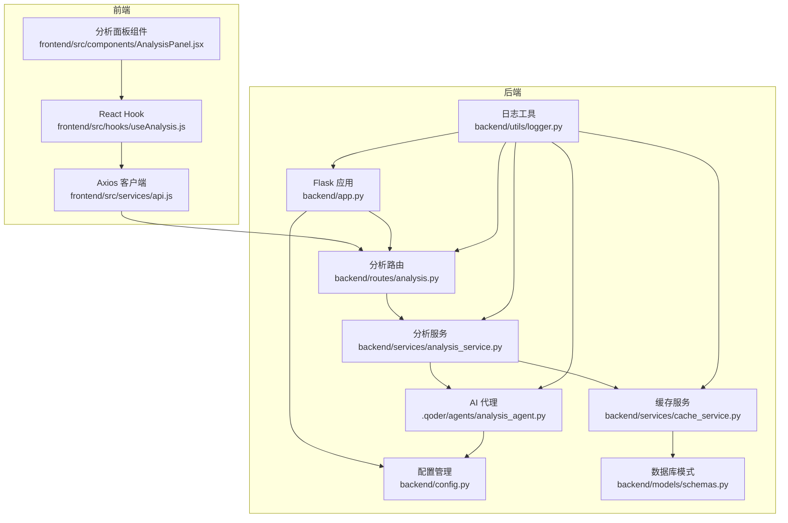
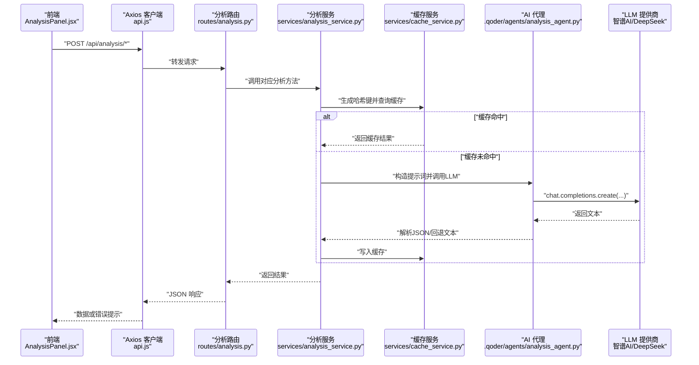
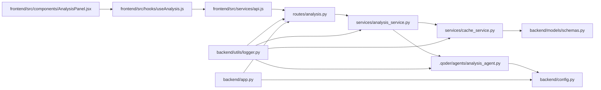

# 分析服务

<cite>
**本文引用的文件**
- [backend/app.py](file://backend/app.py)
- [backend/config.py](file://backend/config.py)
- [backend/routes/analysis.py](file://backend/routes/analysis.py)
- [backend/services/analysis_service.py](file://backend/services/analysis_service.py)
- [backend/services/cache_service.py](file://backend/services/cache_service.py)
- [.qoder/agents/analysis_agent.py](file://.qoder/agents/analysis_agent.py)
- [backend/models/schemas.py](file://backend/models/schemas.py)
- [backend/utils/logger.py](file://backend/utils/logger.py)
- [frontend/src/services/api.js](file://frontend/src/services/api.js)
- [frontend/src/hooks/useAnalysis.js](file://frontend/src/hooks/useAnalysis.js)
- [frontend/src/components/AnalysisPanel.jsx](file://frontend/src/components/AnalysisPanel.jsx)
- [README.md](file://README.md)
</cite>

## 目录
1. [简介](#简介)
2. [项目结构](#项目结构)
3. [核心组件](#核心组件)
4. [架构总览](#架构总览)
5. [详细组件分析](#详细组件分析)
6. [依赖关系分析](#依赖关系分析)
7. [性能考量](#性能考量)
8. [故障排查指南](#故障排查指南)
9. [结论](#结论)
10. [附录](#附录)

## 简介
本文件面向“分析服务”的使用者与维护者，系统性阐述该服务如何集成AI模型进行内容分析，覆盖摘要生成、文本翻译与论文深度分析三大能力。文档重点说明AI代理的调用流程、参数传递、响应处理与缓存策略；并给出不同分析任务的请求格式、模型选择与结果格式化方式，以及具体的API使用示例与错误处理机制。

## 项目结构
后端采用Flask框架，路由层负责接收请求并校验参数，服务层封装业务逻辑与缓存，AI代理层对接第三方LLM提供商（智谱AI/DeepSeek）。前端通过Axios调用后端API，并在UI中展示分析结果。

图表来源
- [backend/app.py](file://backend/app.py#L21-L67)
- [backend/routes/analysis.py](file://backend/routes/analysis.py#L1-L66)
- [backend/services/analysis_service.py](file://backend/services/analysis_service.py#L1-L91)
- [backend/services/cache_service.py](file://backend/services/cache_service.py#L1-L104)
- [.qoder/agents/analysis_agent.py](file://.qoder/agents/analysis_agent.py#L1-L211)
- [backend/config.py](file://backend/config.py#L15-L85)
- [backend/utils/logger.py](file://backend/utils/logger.py#L1-L23)
- [backend/models/schemas.py](file://backend/models/schemas.py#L1-L38)
- [frontend/src/services/api.js](file://frontend/src/services/api.js#L1-L32)
- [frontend/src/hooks/useAnalysis.js](file://frontend/src/hooks/useAnalysis.js#L1-L86)
- [frontend/src/components/AnalysisPanel.jsx](file://frontend/src/components/AnalysisPanel.jsx#L1-L171)

章节来源
- [backend/app.py](file://backend/app.py#L21-L67)
- [README.md](file://README.md#L1-L409)

## 核心组件
- Flask应用与CORS配置：负责注册蓝图、静态资源托管与全局异常处理。
- 配置管理：统一读取环境变量与.qoder/config.json中的分析设置。
- 分析路由：提供摘要、翻译、论文分析三个POST接口，负责参数校验与错误处理。
- 分析服务：封装AI代理调用与缓存逻辑，统一返回结构。
- 缓存服务：基于SQLite的分析缓存表，支持内容哈希键与过期时间控制。
- AI代理：根据配置初始化智谱AI或DeepSeek客户端，构造提示词并调用LLM，解析JSON响应。
- 日志工具：统一格式化输出，便于排障。
- 前端API与Hooks：封装Axios拦截器与错误提示，提供分析调用方法。

章节来源
- [backend/app.py](file://backend/app.py#L21-L67)
- [backend/config.py](file://backend/config.py#L67-L78)
- [backend/routes/analysis.py](file://backend/routes/analysis.py#L1-L66)
- [backend/services/analysis_service.py](file://backend/services/analysis_service.py#L1-L91)
- [backend/services/cache_service.py](file://backend/services/cache_service.py#L1-L104)
- [.qoder/agents/analysis_agent.py](file://.qoder/agents/analysis_agent.py#L13-L211)
- [backend/utils/logger.py](file://backend/utils/logger.py#L1-L23)
- [frontend/src/services/api.js](file://frontend/src/services/api.js#L1-L32)
- [frontend/src/hooks/useAnalysis.js](file://frontend/src/hooks/useAnalysis.js#L1-L86)

## 架构总览
分析服务遵循“路由-服务-缓存-AI代理”的分层设计。请求从前端发起，经由Axios拦截器统一处理错误，到达Flask路由层；路由层调用分析服务，分析服务先查询缓存命中，未命中则委托AI代理调用LLM，最后将结果写入缓存并返回给前端。

图表来源
- [frontend/src/components/AnalysisPanel.jsx](file://frontend/src/components/AnalysisPanel.jsx#L11-L171)
- [frontend/src/services/api.js](file://frontend/src/services/api.js#L1-L32)
- [backend/routes/analysis.py](file://backend/routes/analysis.py#L10-L66)
- [backend/services/analysis_service.py](file://backend/services/analysis_service.py#L25-L91)
- [backend/services/cache_service.py](file://backend/services/cache_service.py#L57-L87)
- [.qoder/agents/analysis_agent.py](file://.qoder/agents/analysis_agent.py#L68-L185)

## 详细组件分析

### 路由层（分析接口）
- 摘要接口：POST /api/analysis/summarize
  - 请求体：{"content": "待分析文本"}
  - 校验：content非空
  - 返回：{"summary": "摘要", "key_points": ["要点1","要点2",...], "error": null|"错误信息"}
- 翻译接口：POST /api/analysis/translate
  - 请求体：{"content": "待翻译文本", "target_lang": "zh"}
  - 校验：content非空
  - 返回：{"translated_text": "译文", "source_lang": "en", "error": null|"错误信息"}
- 论文分析接口：POST /api/analysis/paper
  - 请求体：{"title": "标题", "abstract": "摘要", "snippet": "片段"}
  - 校验：至少提供title或abstract/snippet之一
  - 返回：{"abstract_summary": "摘要概述", "method": "方法", "innovation": "创新点", "results": "结果", "conclusion": "结论与局限性", "error": null|"错误信息"}

章节来源
- [backend/routes/analysis.py](file://backend/routes/analysis.py#L10-L66)
- [README.md](file://README.md#L250-L258)

### 服务层（分析服务）
- 摘要：生成摘要与关键要点，使用缓存键“content_hash:summary”
- 翻译：将内容翻译为目标语言，缓存键“content_hash:translate_{target_lang}”
- 论文分析：对学术论文进行结构化解析，缓存键“content_for_key:paper_analysis”
- 缓存策略：命中则直接返回；未命中则调用AI代理，成功后写入缓存

章节来源
- [backend/services/analysis_service.py](file://backend/services/analysis_service.py#L25-L91)
- [backend/services/cache_service.py](file://backend/services/cache_service.py#L22-L25)
- [backend/services/cache_service.py](file://backend/services/cache_service.py#L57-L87)

### 缓存层（SQLite）
- 表结构：analysis_cache（content_hash, analysis_type, result, timestamp）
- 哈希规则：对内容截断后拼接分析类型生成MD5键
- 过期策略：按时间戳判断是否超过7天，过期条目会在查询时清理
- 清理任务：可定期清理过期缓存

章节来源
- [backend/models/schemas.py](file://backend/models/schemas.py#L19-L26)
- [backend/services/cache_service.py](file://backend/services/cache_service.py#L11-L13)
- [backend/services/cache_service.py](file://backend/services/cache_service.py#L57-L87)
- [backend/services/cache_service.py](file://backend/services/cache_service.py#L91-L104)

### AI代理层（LLM封装）
- 支持提供商：zhipu（默认）、deepseek
- 模型选择：根据provider读取配置中的zhipu_model或deepseek_model
- 参数控制：max_content_length、temperature等
- 提示词设计：
  - 摘要：要求返回JSON对象，包含summary与key_points
  - 翻译：要求保持专业术语并标注英文原文
  - 论文分析：要求返回JSON对象，包含abstract_summary、method、innovation、results、conclusion
- 响应解析：优先解析JSON，否则回退为纯文本
- 错误处理：API调用失败时返回error字段

章节来源
- [.qoder/agents/analysis_agent.py](file://.qoder/agents/analysis_agent.py#L16-L32)
- [.qoder/agents/analysis_agent.py](file://.qoder/agents/analysis_agent.py#L68-L85)
- [.qoder/agents/analysis_agent.py](file://.qoder/agents/analysis_agent.py#L86-L115)
- [.qoder/agents/analysis_agent.py](file://.qoder/agents/analysis_agent.py#L116-L139)
- [.qoder/agents/analysis_agent.py](file://.qoder/agents/analysis_agent.py#L141-L185)
- [.qoder/agents/analysis_agent.py](file://.qoder/agents/analysis_agent.py#L187-L211)

### 配置与运行
- 环境变量：ZHIPU_API_KEY、DEEPSEEK_API_KEY、FLASK_PORT、DATABASE_PATH等
- 分析设置：provider、zhipu_model、deepseek_model、max_content_length、temperature、cache_expire_days
- 应用启动：初始化数据库，注册蓝图，开启CORS，提供静态资源

章节来源
- [backend/config.py](file://backend/config.py#L38-L78)
- [backend/app.py](file://backend/app.py#L21-L67)
- [README.md](file://README.md#L97-L112)

### 前端交互
- Axios拦截器：统一处理429、5xx、400等错误并弹出消息提示
- useAnalysis Hook：封装三个分析方法，管理loading与结果状态
- AnalysisPanel组件：根据tab切换渲染摘要、翻译、论文分析结果，支持自动触发摘要

章节来源
- [frontend/src/services/api.js](file://frontend/src/services/api.js#L1-L32)
- [frontend/src/hooks/useAnalysis.js](file://frontend/src/hooks/useAnalysis.js#L1-L86)
- [frontend/src/components/AnalysisPanel.jsx](file://frontend/src/components/AnalysisPanel.jsx#L1-L171)

## 依赖关系分析
- 路由依赖服务层，服务层依赖缓存与AI代理
- AI代理依赖配置管理与日志工具
- 缓存依赖数据库模式与连接
- 前端依赖后端API与Hook

图表来源
- [backend/routes/analysis.py](file://backend/routes/analysis.py#L1-L66)
- [backend/services/analysis_service.py](file://backend/services/analysis_service.py#L1-L91)
- [backend/services/cache_service.py](file://backend/services/cache_service.py#L1-L104)
- [.qoder/agents/analysis_agent.py](file://.qoder/agents/analysis_agent.py#L1-L211)
- [backend/config.py](file://backend/config.py#L15-L85)
- [backend/models/schemas.py](file://backend/models/schemas.py#L1-L38)
- [frontend/src/services/api.js](file://frontend/src/services/api.js#L1-L32)
- [frontend/src/hooks/useAnalysis.js](file://frontend/src/hooks/useAnalysis.js#L1-L86)
- [frontend/src/components/AnalysisPanel.jsx](file://frontend/src/components/AnalysisPanel.jsx#L1-L171)
- [backend/utils/logger.py](file://backend/utils/logger.py#L1-L23)
- [backend/app.py](file://backend/app.py#L21-L67)

## 性能考量
- 缓存命中率：对相同内容的重复分析可显著降低LLM调用次数
- 内容截断：避免超出模型上下文长度限制，提升稳定性
- 并发与超时：前端请求超时设置为60秒，可根据网络状况调整
- 数据库索引：analysis_cache已建立content_hash索引，查询效率较高
- 过期清理：定期清理过期缓存，避免数据库膨胀

章节来源
- [backend/services/cache_service.py](file://backend/services/cache_service.py#L57-L87)
- [.qoder/agents/analysis_agent.py](file://.qoder/agents/analysis_agent.py#L62-L66)
- [frontend/src/services/api.js](file://frontend/src/services/api.js#L4-L8)

## 故障排查指南
- 常见错误类型与处理
  - 400错误：请求参数缺失（如content为空），前端会提示参数错误
  - 500错误：服务内部异常，日志中包含异常堆栈
  - 429错误：前端拦截器提示请求过于频繁
- AI代理初始化失败
  - 检查ZHIPU_API_KEY或DEEPSEEK_API_KEY是否配置
  - 确认provider与model配置正确
- 缓存异常
  - 检查analysis_cache表是否存在且索引正常
  - 观察日志中缓存命中/写入信息
- 响应解析失败
  - LLM返回非标准JSON时，代理会回退为纯文本
- 日志定位
  - 使用统一格式的日志输出，定位具体模块与错误信息

章节来源
- [backend/routes/analysis.py](file://backend/routes/analysis.py#L19-L24)
- [backend/routes/analysis.py](file://backend/routes/analysis.py#L38-L43)
- [backend/routes/analysis.py](file://backend/routes/analysis.py#L60-L65)
- [frontend/src/services/api.js](file://frontend/src/services/api.js#L10-L29)
- [.qoder/agents/analysis_agent.py](file://.qoder/agents/analysis_agent.py#L34-L60)
- [backend/services/cache_service.py](file://backend/services/cache_service.py#L57-L87)
- [backend/utils/logger.py](file://backend/utils/logger.py#L5-L22)

## 结论
分析服务通过清晰的分层设计与完善的缓存策略，实现了对摘要、翻译与论文分析的稳定支持。其可扩展性强，可通过配置切换LLM提供商与模型，并在前端提供直观的交互体验。建议在生产环境中合理设置API密钥与缓存策略，结合日志监控持续优化性能与可用性。

## 附录

### API使用示例
- 摘要生成
  - 请求：POST /api/analysis/summarize
  - 请求体：{"content": "待分析文本"}
  - 成功响应：{"summary": "摘要", "key_points": ["要点1","要点2",...], "error": null}
- 文本翻译
  - 请求：POST /api/analysis/translate
  - 请求体：{"content": "待翻译文本", "target_lang": "zh"}
  - 成功响应：{"translated_text": "译文", "source_lang": "en", "error": null}
- 论文深度分析
  - 请求：POST /api/analysis/paper
  - 请求体：{"title": "标题", "abstract": "摘要", "snippet": "片段"}
  - 成功响应：{"abstract_summary": "摘要概述", "method": "方法", "innovation": "创新点", "results": "结果", "conclusion": "结论与局限性", "error": null}

章节来源
- [backend/routes/analysis.py](file://backend/routes/analysis.py#L10-L66)
- [README.md](file://README.md#L250-L258)

### 错误处理机制
- 路由层：参数校验失败返回400，异常捕获返回500
- 前端拦截器：根据状态码与错误类型弹出提示
- AI代理：API调用失败返回error字段，不抛出异常

章节来源
- [backend/routes/analysis.py](file://backend/routes/analysis.py#L19-L24)
- [backend/routes/analysis.py](file://backend/routes/analysis.py#L38-L43)
- [backend/routes/analysis.py](file://backend/routes/analysis.py#L60-L65)
- [frontend/src/services/api.js](file://frontend/src/services/api.js#L10-L29)
- [.qoder/agents/analysis_agent.py](file://.qoder/agents/analysis_agent.py#L82-L84)