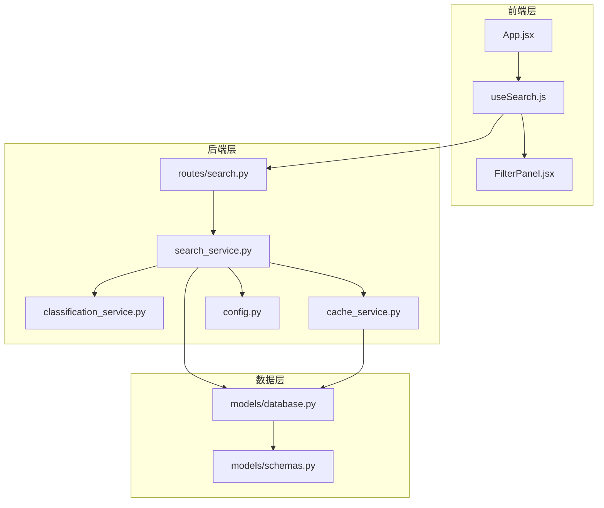
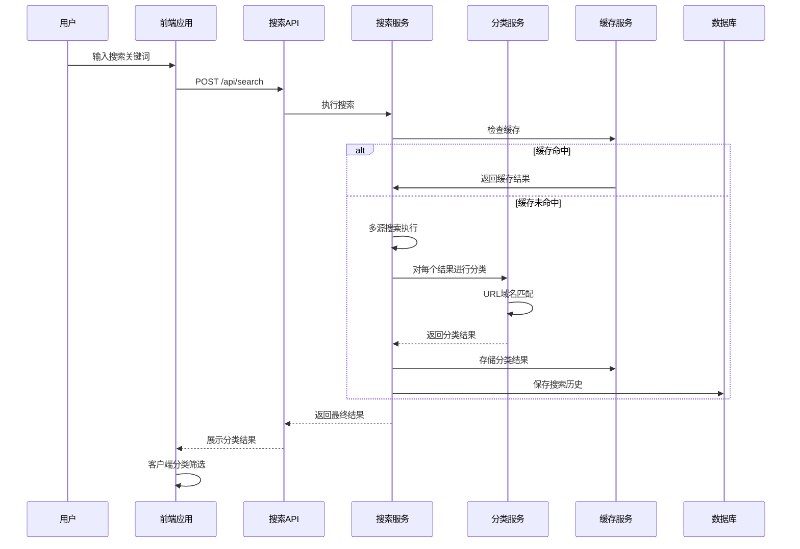
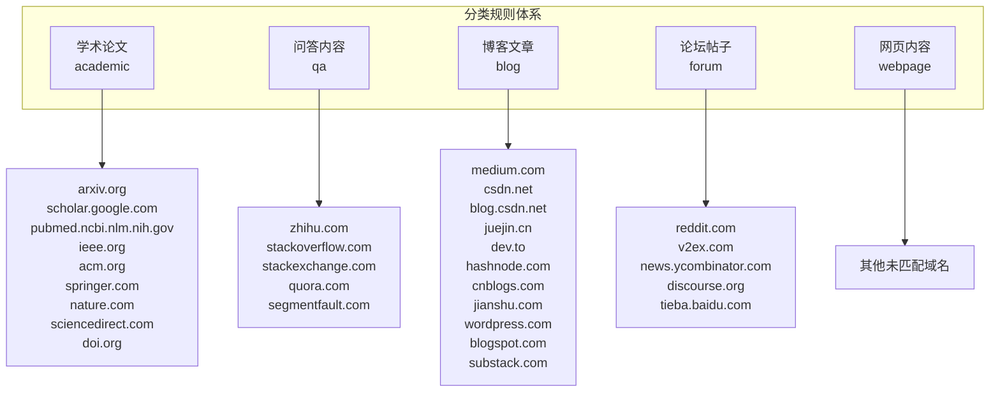
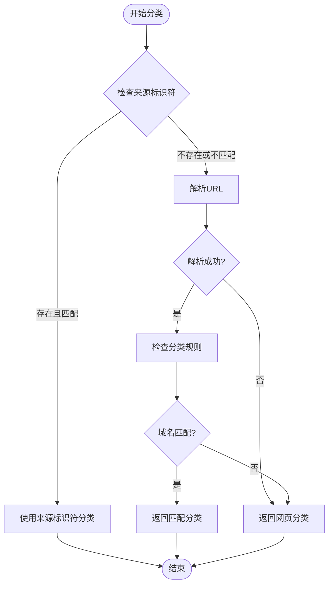
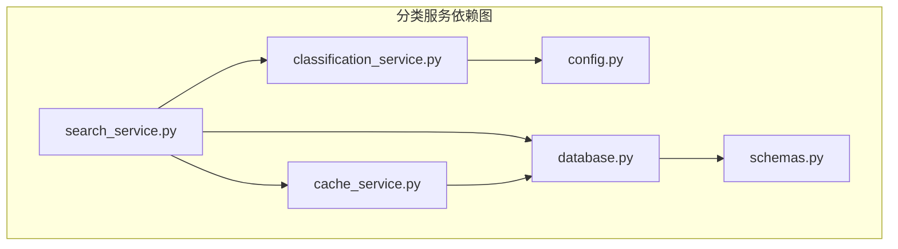

# 分类服务

<cite>
**本文档引用的文件**
- [classification_service.py](file://backend/services/classification_service.py)
- [search_service.py](file://backend/services/search_service.py)
- [cache_service.py](file://backend/services/cache_service.py)
- [schemas.py](file://backend/models/schemas.py)
- [database.py](file://backend/models/database.py)
- [config.py](file://backend/config.py)
- [search.py](file://backend/routes/search.py)
- [useSearch.js](file://frontend/src/hooks/useSearch.js)
- [FilterPanel.jsx](file://frontend/src/components/FilterPanel.jsx)
- [App.jsx](file://frontend/src/App.jsx)
- [config.json](file://.qoder/config.json)
- [README.md](file://README.md)
</cite>

## 目录
1. [简介](#简介)
2. [项目结构](#项目结构)
3. [核心组件](#核心组件)
4. [架构概览](#架构概览)
5. [详细组件分析](#详细组件分析)
6. [依赖关系分析](#依赖关系分析)
7. [性能考虑](#性能考虑)
8. [故障排除指南](#故障排除指南)
9. [结论](#结论)
10. [附录](#附录)

## 简介
分类服务是本项目的核心功能之一，负责将搜索结果自动识别并归类到不同的内容类型中。该服务在搜索结果处理流程中发挥着关键作用，确保用户能够根据内容类型进行有效筛选和管理。

本服务实现了基于URL域名的智能分类算法，支持学术论文、博客文章、问答内容、论坛帖子和网页内容五种主要类型。通过配置化的分类规则和高效的缓存机制，分类服务能够在保证准确性的同时提供优秀的性能表现。

## 项目结构
分类服务在整个项目架构中位于后端服务层，与搜索服务、缓存服务和前端界面紧密集成。项目采用前后端分离架构，分类逻辑主要在后端实现，前端负责展示和交互。

**图表来源**
- [search.py](file://backend/routes/search.py#L1-L28)
- [search_service.py](file://backend/services/search_service.py#L1-L98)
- [classification_service.py](file://backend/services/classification_service.py#L1-L64)
- [cache_service.py](file://backend/services/cache_service.py#L1-L104)
- [schemas.py](file://backend/models/schemas.py#L1-L38)

**章节来源**
- [README.md](file://README.md#L1-L409)

## 核心组件
分类服务由多个相互协作的组件构成，每个组件都有明确的职责和边界：

### 分类服务核心
- **分类算法引擎**：实现基于URL域名的智能分类逻辑
- **规则管理系统**：维护各类内容类型的域名规则集
- **优先级处理机制**：支持来源标识符优先级分类

### 缓存集成
- **搜索结果缓存**：存储分类后的搜索结果
- **分析结果缓存**：缓存AI分析的分类结果
- **过期清理机制**：自动清理过期的缓存条目

### 配置管理
- **运行时配置**：支持动态调整分类参数
- **环境变量集成**：通过.env文件管理敏感配置
- **默认值管理**：提供合理的默认配置选项

**章节来源**
- [classification_service.py](file://backend/services/classification_service.py#L1-L64)
- [search_service.py](file://backend/services/search_service.py#L1-L98)
- [cache_service.py](file://backend/services/cache_service.py#L1-L104)

## 架构概览
分类服务采用分层架构设计，确保了良好的可维护性和扩展性。整个流程从用户发起搜索开始，经过多源搜索、结果分类、缓存存储，最终返回给前端展示。

**图表来源**
- [search.py](file://backend/routes/search.py#L10-L27)
- [search_service.py](file://backend/services/search_service.py#L28-L67)
- [classification_service.py](file://backend/services/classification_service.py#L30-L63)

## 详细组件分析

### 分类算法实现
分类算法采用双层优先级策略，确保分类结果的准确性和一致性。

#### 优先级策略
1. **来源标识符优先级**：当搜索结果包含明确的来源标识符时，优先使用该标识符进行分类
2. **URL域名匹配**：当没有来源标识符或标识符不在映射表中时，使用URL域名进行分类

#### 分类规则体系
系统维护了四个主要的内容类型及其对应的域名规则：

**图表来源**
- [classification_service.py](file://backend/services/classification_service.py#L8-L27)

#### 分类算法流程

**图表来源**
- [classification_service.py](file://backend/services/classification_service.py#L30-L63)

**章节来源**
- [classification_service.py](file://backend/services/classification_service.py#L1-L64)

### 分类配置管理
分类服务通过多种配置方式进行管理，确保灵活性和可扩展性。

#### 配置层次结构
1. **环境变量配置**：通过.env文件管理基础配置
2. **运行时配置**：通过.qoder/config.json管理高级配置
3. **默认值配置**：提供合理的默认配置选项

#### 配置项详解
- **分类规则配置**：维护各类内容类型的域名规则
- **缓存配置**：设置分类结果的缓存策略
- **分析配置**：管理AI分析相关的缓存设置

**章节来源**
- [config.py](file://backend/config.py#L15-L84)
- [config.json](file://.qoder/config.json#L1-L31)

### 分类结果缓存
分类服务集成了完整的缓存机制，通过多级缓存策略提升性能表现。

#### 缓存策略
1. **搜索结果缓存**：缓存完整的搜索结果，包括分类信息
2. **分析结果缓存**：缓存AI分析的分类结果
3. **过期管理**：自动清理过期的缓存条目

#### 缓存键生成
缓存键采用哈希算法生成，确保唯一性和安全性：
- **搜索缓存键**：基于查询词、数据源和过滤条件的组合
- **分析缓存键**：基于内容截取和分析类型的组合

**章节来源**
- [cache_service.py](file://backend/services/cache_service.py#L11-L26)
- [search_service.py](file://backend/services/search_service.py#L44-L61)

### 前端集成与展示
前端应用提供了完整的分类结果展示和筛选功能。

#### 分类筛选功能
前端实现了客户端的分类筛选功能，支持用户按内容类型进行筛选：
- **全部内容**：显示所有分类结果
- **学术论文**：仅显示学术类内容
- **问答内容**：仅显示问答类内容
- **博客文章**：仅显示博客类内容
- **论坛帖子**：仅显示论坛类内容
- **网页内容**：仅显示普通网页内容

#### 实时统计功能
前端应用能够实时统计各类内容的数量，并在筛选面板中显示：
- **分类计数**：统计每种分类的结果数量
- **动态更新**：随着用户筛选实时更新计数

**章节来源**
- [FilterPanel.jsx](file://frontend/src/components/FilterPanel.jsx#L7-L14)
- [useSearch.js](file://frontend/src/hooks/useSearch.js#L35-L38)
- [App.jsx](file://frontend/src/App.jsx#L59-L73)

## 依赖关系分析
分类服务与其他组件之间存在清晰的依赖关系，形成了一个完整的搜索生态系统。

**图表来源**
- [classification_service.py](file://backend/services/classification_service.py#L1-L64)
- [search_service.py](file://backend/services/search_service.py#L1-L98)
- [cache_service.py](file://backend/services/cache_service.py#L1-L104)
- [config.py](file://backend/config.py#L1-L84)
- [schemas.py](file://backend/models/schemas.py#L1-L38)

### 依赖特性分析
- **低耦合高内聚**：分类服务独立性强，与其他模块耦合度较低
- **单向依赖**：分类服务只依赖于配置和缓存服务，不反向依赖其他模块
- **可测试性**：清晰的依赖关系便于单元测试和集成测试

**章节来源**
- [search_service.py](file://backend/services/search_service.py#L7-L11)
- [cache_service.py](file://backend/services/cache_service.py#L5-L6)

## 性能考虑
分类服务在设计时充分考虑了性能优化，采用了多种策略确保高效运行。

### 时间复杂度分析
- **分类算法**：O(n*m)，其中n为分类规则数量，m为域名匹配次数
- **URL解析**：O(1)，固定时间复杂度
- **缓存查找**：O(log n)，基于SQLite索引的查询

### 空间复杂度分析
- **内存占用**：主要取决于分类规则集和缓存大小
- **数据库存储**：搜索历史和缓存数据的持久化存储

### 性能优化策略
1. **缓存优先**：优先使用缓存结果，减少重复计算
2. **索引优化**：为缓存表建立适当的索引提高查询效率
3. **懒加载**：延迟初始化大型组件，减少启动时间
4. **批量处理**：对多个结果进行批量分类处理

## 故障排除指南
分类服务在运行过程中可能遇到各种问题，以下是常见问题的诊断和解决方法。

### 常见问题及解决方案

#### 分类结果不准确
**问题现象**：某些内容被错误分类
**可能原因**：
- URL格式不符合预期
- 新域名未添加到分类规则中
- 来源标识符映射缺失

**解决方法**：
1. 检查URL格式是否正确
2. 更新分类规则中的域名列表
3. 添加新的来源标识符映射

#### 性能问题
**问题现象**：分类响应时间过长
**可能原因**：
- 缓存未生效
- 数据库连接问题
- 规则集过大影响匹配效率

**解决方法**：
1. 检查缓存配置和状态
2. 验证数据库连接和索引
3. 优化规则集结构

#### 配置问题
**问题现象**：分类服务无法正常启动
**可能原因**：
- 配置文件格式错误
- 环境变量未正确设置
- 数据库初始化失败

**解决方法**：
1. 验证配置文件格式
2. 检查环境变量设置
3. 重新初始化数据库

**章节来源**
- [classification_service.py](file://backend/services/classification_service.py#L55-L56)
- [cache_service.py](file://backend/services/cache_service.py#L91-L103)

## 结论
分类服务作为搜索系统的核心组件，通过智能化的分类算法和高效的缓存机制，为用户提供了准确、快速的内容分类体验。该服务具有以下优势：

1. **准确性高**：采用双层优先级策略，结合URL域名匹配和来源标识符识别
2. **性能优秀**：集成多级缓存，显著提升响应速度
3. **易于扩展**：模块化设计，支持规则和配置的灵活调整
4. **用户体验好**：前端提供直观的分类筛选和统计功能

未来可以考虑的改进方向包括：引入机器学习算法提升分类准确性、支持更复杂的语义分析、增加分类结果的置信度评估等。

## 附录

### 分类规则定制指南
要定制分类规则，需要修改分类服务中的规则定义：

1. **添加新域名**：在相应的分类规则中添加新的域名
2. **调整分类优先级**：修改来源标识符映射表
3. **新增分类类型**：扩展分类规则字典和分类逻辑

### 分类准确性优化策略
- **规则维护**：定期更新域名规则，移除无效域名
- **用户反馈**：收集用户对分类结果的反馈
- **A/B测试**：对不同分类策略进行对比测试
- **性能监控**：监控分类服务的性能指标

### 分类配置最佳实践
- **规则组织**：按内容类型组织域名规则，便于维护
- **备份策略**：定期备份分类规则配置
- **版本管理**：对分类规则变更进行版本控制
- **测试验证**：对新的分类规则进行充分测试