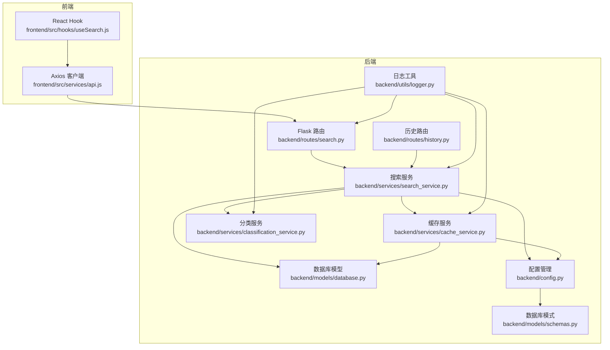
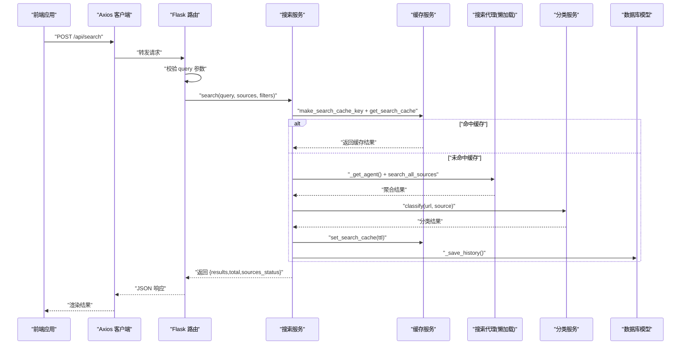
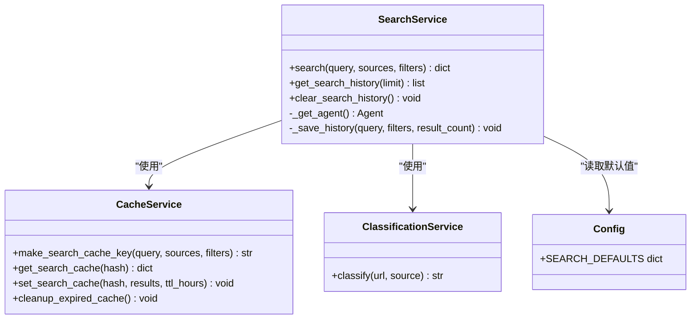
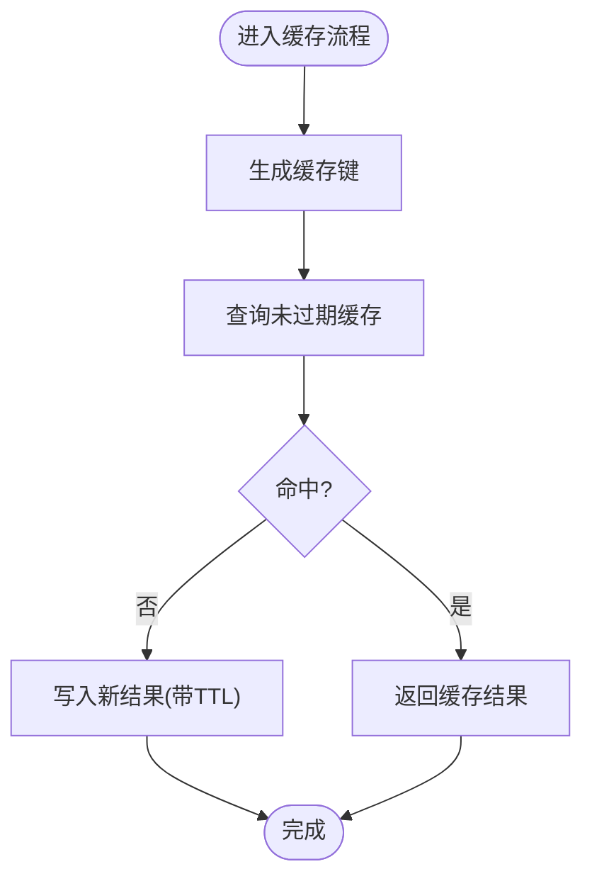
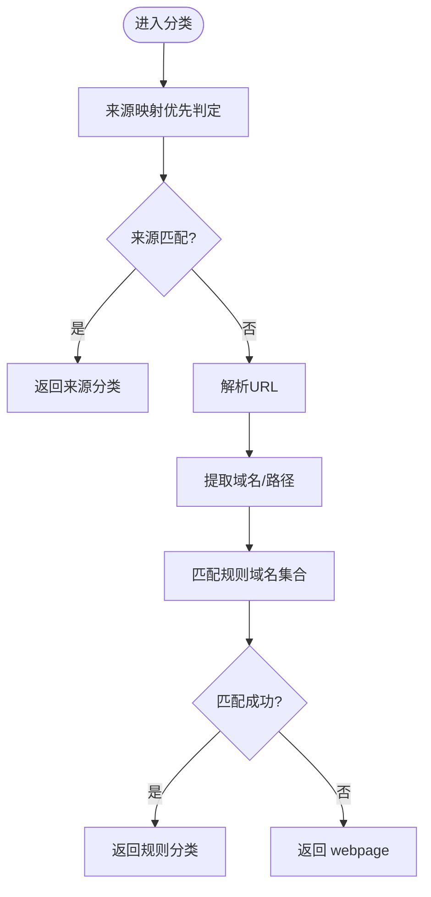
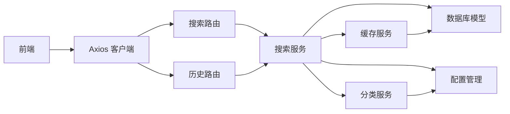

# 搜索服务

<cite>
**本文引用的文件**
- [backend/services/search_service.py](file://backend/services/search_service.py)
- [backend/services/cache_service.py](file://backend/services/cache_service.py)
- [backend/services/classification_service.py](file://backend/services/classification_service.py)
- [backend/routes/search.py](file://backend/routes/search.py)
- [backend/routes/history.py](file://backend/routes/history.py)
- [backend/models/schemas.py](file://backend/models/schemas.py)
- [backend/models/database.py](file://backend/models/database.py)
- [backend/config.py](file://backend/config.py)
- [backend/utils/logger.py](file://backend/utils/logger.py)
- [frontend/src/services/api.js](file://frontend/src/services/api.js)
- [frontend/src/hooks/useSearch.js](file://frontend/src/hooks/useSearch.js)
- [.qoder/config.json](file://.qoder/config.json)
- [README.md](file://README.md)
</cite>

## 目录
1. [简介](#简介)
2. [项目结构](#项目结构)
3. [核心组件](#核心组件)
4. [架构总览](#架构总览)
5. [详细组件分析](#详细组件分析)
6. [依赖关系分析](#依赖关系分析)
7. [性能考量](#性能考量)
8. [故障排查指南](#故障排查指南)
9. [结论](#结论)
10. [附录](#附录)

## 简介
本文件面向“搜索服务”的使用者与维护者，系统性阐述多源聚合搜索、缓存机制、结果分类与历史记录管理等核心能力，并给出完整的搜索流程、参数校验、代理懒加载、配置管理集成与错误处理策略。文档同时提供前后端交互示例与 API 使用方法，帮助快速上手与扩展。

## 项目结构
后端采用分层架构：路由层负责请求接入与参数校验；服务层封装业务逻辑（搜索、缓存、分类、历史）；模型层负责数据库初始化与表结构；配置层统一读取环境变量与运行时配置；工具层提供日志与通用能力。前端通过 React + Axios 与后端交互，提供搜索、筛选、历史等功能。

图表来源
- [backend/routes/search.py](file://backend/routes/search.py#L1-L28)
- [backend/routes/history.py](file://backend/routes/history.py#L1-L33)
- [backend/services/search_service.py](file://backend/services/search_service.py#L1-L98)
- [backend/services/cache_service.py](file://backend/services/cache_service.py#L1-L104)
- [backend/services/classification_service.py](file://backend/services/classification_service.py#L1-L64)
- [backend/models/database.py](file://backend/models/database.py#L1-L51)
- [backend/models/schemas.py](file://backend/models/schemas.py#L1-L38)
- [backend/config.py](file://backend/config.py#L1-L85)
- [backend/utils/logger.py](file://backend/utils/logger.py#L1-L23)
- [frontend/src/services/api.js](file://frontend/src/services/api.js#L1-L32)
- [frontend/src/hooks/useSearch.js](file://frontend/src/hooks/useSearch.js#L1-L74)

章节来源
- [README.md](file://README.md#L1-L409)

## 核心组件
- 搜索服务：实现多源聚合搜索、缓存命中、结果分类、历史记录持久化与代理懒加载。
- 缓存服务：提供搜索与分析两类缓存的键生成、读写与过期清理。
- 分类服务：基于来源与URL规则进行内容类别判定。
- 路由层：对外暴露搜索与历史接口，负责参数校验与异常捕获。
- 数据库模型：初始化表结构、提供连接上下文与关闭机制。
- 配置管理：合并 .env 与 .qoder/config.json，提供搜索默认值、速率限制、下载与分析设置。
- 日志工具：统一格式化输出，便于排障。

章节来源
- [backend/services/search_service.py](file://backend/services/search_service.py#L1-L98)
- [backend/services/cache_service.py](file://backend/services/cache_service.py#L1-L104)
- [backend/services/classification_service.py](file://backend/services/classification_service.py#L1-L64)
- [backend/routes/search.py](file://backend/routes/search.py#L1-L28)
- [backend/routes/history.py](file://backend/routes/history.py#L1-L33)
- [backend/models/schemas.py](file://backend/models/schemas.py#L1-L38)
- [backend/models/database.py](file://backend/models/database.py#L1-L51)
- [backend/config.py](file://backend/config.py#L1-L85)
- [backend/utils/logger.py](file://backend/utils/logger.py#L1-L23)

## 架构总览
搜索服务围绕“请求—缓存—代理—分类—缓存—历史”闭环展开，前端通过 Axios 发起 POST /api/search，后端路由进行参数校验后交由搜索服务处理。搜索服务优先检查缓存，未命中则通过懒加载的搜索代理调用各数据源，随后进行结果分类与缓存写入，并持久化搜索历史。

图表来源
- [backend/routes/search.py](file://backend/routes/search.py#L10-L28)
- [backend/services/search_service.py](file://backend/services/search_service.py#L28-L67)
- [backend/services/cache_service.py](file://backend/services/cache_service.py#L16-L52)
- [backend/services/classification_service.py](file://backend/services/classification_service.py#L30-L63)
- [backend/models/database.py](file://backend/models/database.py#L24-L43)

## 详细组件分析

### 搜索服务（search_service）
职责与流程
- 参数与默认值：若未指定 sources/filters，则从配置中读取默认值。
- 缓存检查：根据查询参数生成稳定键，查询未过期缓存。
- 代理调用：懒加载搜索代理，调用多源聚合搜索。
- 结果分类：逐条调用分类服务，为每条结果添加 category 字段。
- 缓存存储：按配置的过期时间写入缓存。
- 历史记录：将查询、过滤条件与结果总数写入历史表。
- 异常处理：路由层捕获异常并返回标准化错误响应。

懒加载机制
- 使用全局变量保存已初始化的代理实例，首次调用时动态导入并实例化，避免启动时加载无关模块。

配置集成
- 通过配置管理读取 SEARCH_DEFAULTS（如默认数据源、缓存过期小时数等）。

错误处理
- 历史记录保存失败会被记录警告但不影响主流程。

章节来源
- [backend/services/search_service.py](file://backend/services/search_service.py#L19-L67)
- [backend/config.py](file://backend/config.py#L53-L59)

#### 类图（代码级）

图表来源
- [backend/services/search_service.py](file://backend/services/search_service.py#L1-L98)
- [backend/services/cache_service.py](file://backend/services/cache_service.py#L1-L104)
- [backend/services/classification_service.py](file://backend/services/classification_service.py#L1-L64)
- [backend/config.py](file://backend/config.py#L53-L59)

### 缓存服务（cache_service）
职责与特性
- 键生成：对查询参数进行序列化与排序，生成稳定MD5键，确保不同顺序的相同参数得到一致键值。
- 搜索缓存：以 UTC 时间戳 expire_at 标记过期，查询时仅返回未过期记录。
- 分析缓存：内容哈希+类型组合键，7天过期，过期自动清理。
- 清理策略：定期清理过期的搜索与分析缓存，降低数据库膨胀。

复杂度与性能
- 键生成 O(n log n)（排序），查询与写入均为单表索引查找，近似 O(1)。
- TTL 控制与定期清理降低冷数据占用。

章节来源
- [backend/services/cache_service.py](file://backend/services/cache_service.py#L11-L104)
- [backend/models/schemas.py](file://backend/models/schemas.py#L10-L26)

#### 流程图（缓存读写）

图表来源
- [backend/services/cache_service.py](file://backend/services/cache_service.py#L16-L52)

### 分类服务（classification_service）
职责与规则
- 优先依据来源映射（如 arxiv、zhihu 等）进行分类。
- 若来源无法判定，则解析 URL 域名与路径，匹配预设域名集合，归类为 academic、qa、blog、forum 或 webpage。
- 解析失败或未匹配时默认为 webpage。

复杂度与性能
- URL 解析与域名匹配为 O(k)，k 为规则条目数量，整体开销极低。

章节来源
- [backend/services/classification_service.py](file://backend/services/classification_service.py#L30-L63)

#### 流程图（分类判定）

图表来源
- [backend/services/classification_service.py](file://backend/services/classification_service.py#L30-L63)

### 路由层（routes/search 与 routes/history）
职责与行为
- 搜索路由：接收 JSON 请求体，校验 query 必填，调用搜索服务并返回标准响应；异常统一记录日志并返回 500。
- 历史路由：支持 GET（分页获取）与 DELETE（清空）操作，调用搜索服务对应方法。

章节来源
- [backend/routes/search.py](file://backend/routes/search.py#L10-L28)
- [backend/routes/history.py](file://backend/routes/history.py#L10-L33)

### 数据库模型与模式（models/database 与 models/schemas）
职责与特性
- 数据库初始化：按需创建 search_history、search_cache、analysis_cache、download_records 表及索引。
- 连接管理：线程本地连接、自动提交/回滚、WAL 模式、busy_timeout 与外键开启。
- 模式定义：统一在 SCHEMA_SQL 中声明，保证一致性。

章节来源
- [backend/models/database.py](file://backend/models/database.py#L24-L43)
- [backend/models/schemas.py](file://backend/models/schemas.py#L1-L38)

### 配置管理（config）
职责与特性
- 合并 .env 与 .qoder/config.json，提供 SECRET_KEY、FLASK_*、DATABASE_PATH、HTTP_PROXY、DOWNLOAD_DIR、RATE_LIMITS、SEARCH_DEFAULTS、DOWNLOAD_SETTINGS、ANALYSIS_SETTINGS 等。
- 搜索默认值包括 max_results_per_source、timeout_seconds、cache_expire_hours、default_sources。
- 确保数据目录存在，避免首次运行失败。

章节来源
- [backend/config.py](file://backend/config.py#L15-L85)
- [.qoder/config.json](file://.qoder/config.json#L1-L31)

### 日志工具（utils/logger）
职责与特性
- 初始化标准输出处理器，统一格式化日志，便于定位问题。

章节来源
- [backend/utils/logger.py](file://backend/utils/logger.py#L5-L23)

### 前端交互（frontend）
职责与特性
- Axios 客户端：统一 base URL、超时、拦截器，处理 429/5xx/400 等错误提示。
- useSearch Hook：封装搜索状态、过滤器、调用 /api/search 并进行客户端侧分类过滤。

章节来源
- [frontend/src/services/api.js](file://frontend/src/services/api.js#L1-L32)
- [frontend/src/hooks/useSearch.js](file://frontend/src/hooks/useSearch.js#L1-L74)

## 依赖关系分析
- 搜索服务依赖缓存服务、分类服务、配置管理与数据库模型；懒加载搜索代理位于 .qoder 目录。
- 路由层依赖搜索服务；历史路由直接调用搜索服务的历史方法。
- 缓存服务依赖数据库模型与配置管理（TTL）。
- 前端通过 Axios 与后端交互，不直接依赖后端服务。

图表来源
- [backend/routes/search.py](file://backend/routes/search.py#L1-L28)
- [backend/routes/history.py](file://backend/routes/history.py#L1-L33)
- [backend/services/search_service.py](file://backend/services/search_service.py#L1-L98)
- [backend/services/cache_service.py](file://backend/services/cache_service.py#L1-L104)
- [backend/services/classification_service.py](file://backend/services/classification_service.py#L1-L64)
- [backend/models/database.py](file://backend/models/database.py#L1-L51)
- [backend/config.py](file://backend/config.py#L1-L85)
- [frontend/src/services/api.js](file://frontend/src/services/api.js#L1-L32)

## 性能考量
- 懒加载代理：仅在首次搜索时加载，避免启动时的资源占用。
- 缓存命中：搜索结果按查询参数生成稳定键，命中后直接返回，显著降低外部 API 压力与延迟。
- TTL 控制：搜索缓存默认 24 小时，分析缓存 7 天，平衡时效性与性能。
- 数据库优化：为缓存表建立索引，减少查询耗时。
- 前端过滤：客户端侧按类别过滤，减少不必要的网络请求。

[本节为通用性能讨论，不直接分析具体文件]

## 故障排查指南
常见问题与定位思路
- 搜索接口返回 400：检查请求体是否包含非空 query。
- 搜索接口返回 500：查看后端日志中的异常堆栈，确认代理调用、分类或缓存写入环节是否抛出异常。
- 历史记录为空：确认数据库初始化是否完成，且查询 limit 是否合理。
- 缓存未生效：确认缓存键生成逻辑与查询参数一致，检查 expire_at 是否正确写入。
- 代理懒加载失败：确认 .qoder/agents/search_agent.py 是否存在且可导入。

章节来源
- [backend/routes/search.py](file://backend/routes/search.py#L16-L27)
- [backend/services/search_service.py](file://backend/services/search_service.py#L70-L80)
- [backend/models/database.py](file://backend/models/database.py#L36-L43)
- [backend/utils/logger.py](file://backend/utils/logger.py#L5-L23)

## 结论
该搜索服务通过“参数校验—缓存检查—代理调用—结果分类—缓存存储—历史记录”的完整链路，实现了高效、可扩展的多源聚合搜索。配合懒加载代理、稳定的缓存键与完善的配置管理，系统在性能与可维护性之间取得良好平衡。前端通过 Hook 与 Axios 提供了简洁的交互体验，便于快速迭代与扩展。

[本节为总结性内容，不直接分析具体文件]

## 附录

### API 使用示例
- 搜索接口
  - 方法：POST /api/search
  - 请求体字段：
    - query: 关键词字符串（必填）
    - sources: 数据源数组（可选，默认来自配置）
    - filters: 过滤条件对象（可选）
  - 返回字段：
    - results: 搜索结果数组
    - total: 结果总数
    - sources_status: 各数据源状态
  - 示例请求体（不含具体代码内容）
    - {
      - "query": "机器学习",
      - "sources": ["duckduckgo", "arxiv"],
      - "filters": {}
      - }
  - 响应示例（不含具体代码内容）
    - {
      - "results": [...],
      - "total": 15,
      - "sources_status": {"arxiv": "success", "duckduckgo": "success"}
      - }

- 历史接口
  - 获取历史：GET /api/history?limit=20
  - 清空历史：DELETE /api/history

章节来源
- [README.md](file://README.md#L229-L274)
- [backend/routes/search.py](file://backend/routes/search.py#L10-L28)
- [backend/routes/history.py](file://backend/routes/history.py#L10-L33)

### 配置项说明
- 搜索默认配置（来自 .qoder/config.json）
  - max_results_per_source: 每源最大结果数
  - timeout_seconds: 超时秒数
  - cache_expire_hours: 搜索缓存过期小时数
  - default_sources: 默认数据源列表
- 速率限制配置（来自 .qoder/config.json）
  - rate_limits: 各数据源的令牌桶容量与补充速率
- 分析设置（来自 .qoder/config.json）
  - provider: LLM 提供商（zhipu/deepseek）
  - model 名称、max_content_length、temperature、cache_expire_days

章节来源
- [.qoder/config.json](file://.qoder/config.json#L1-L31)
- [backend/config.py](file://backend/config.py#L50-L73)