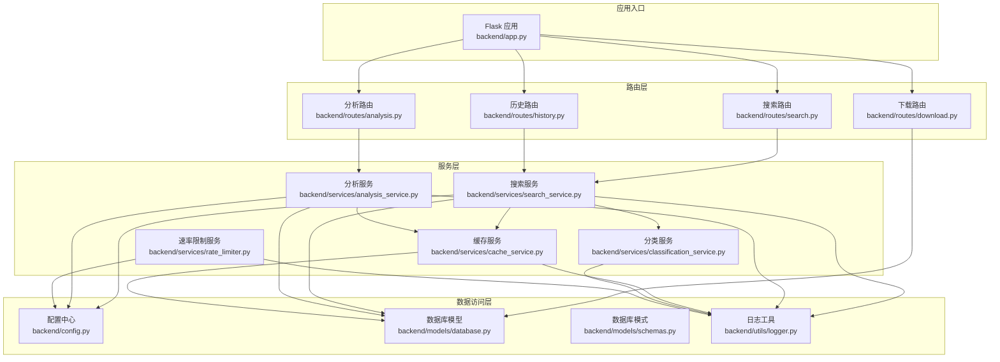
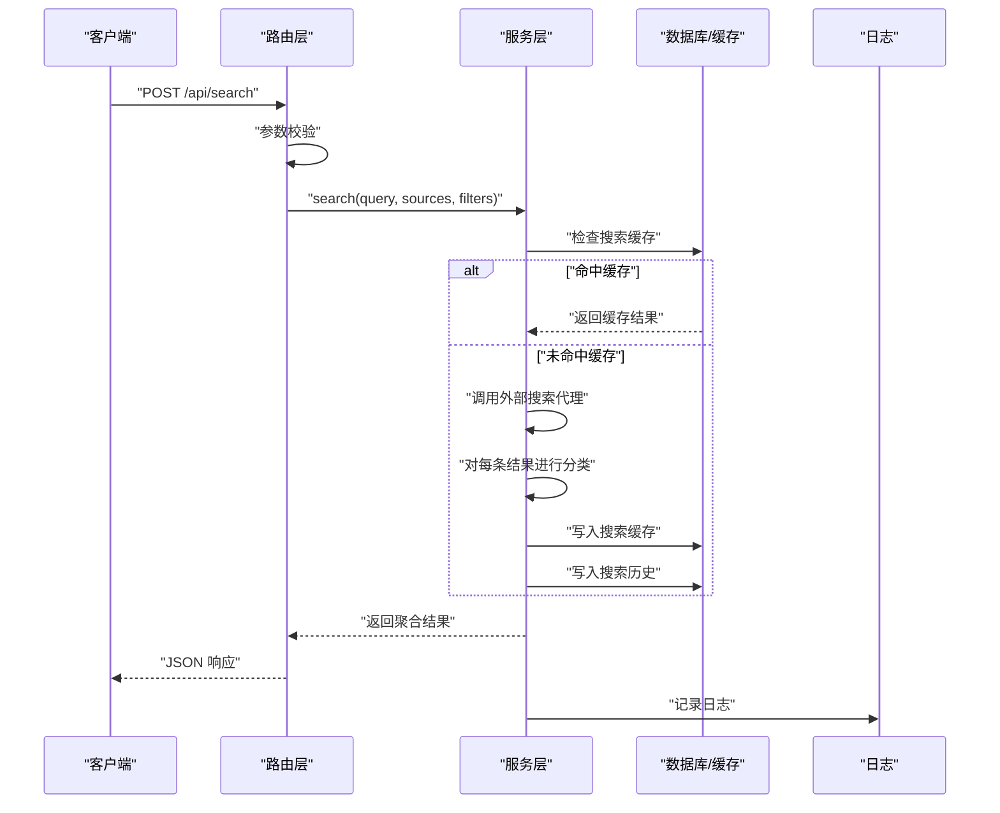
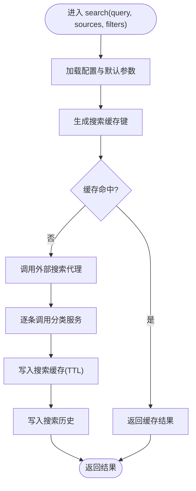
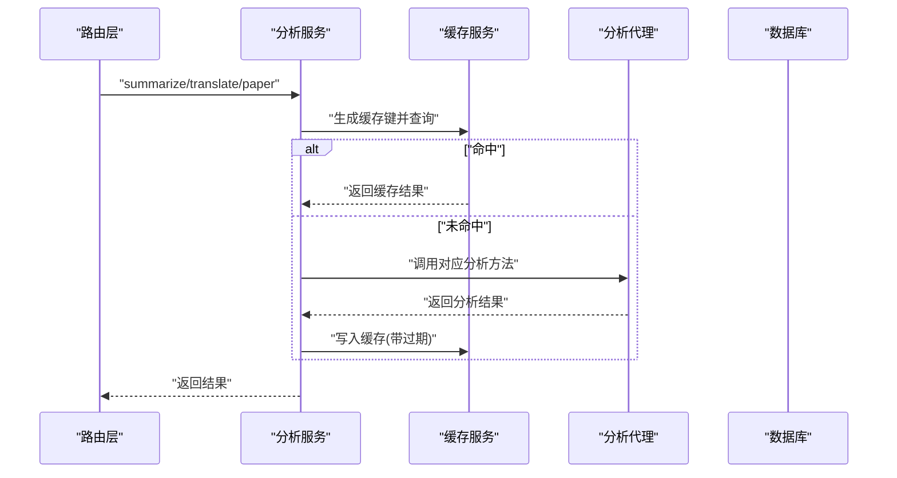
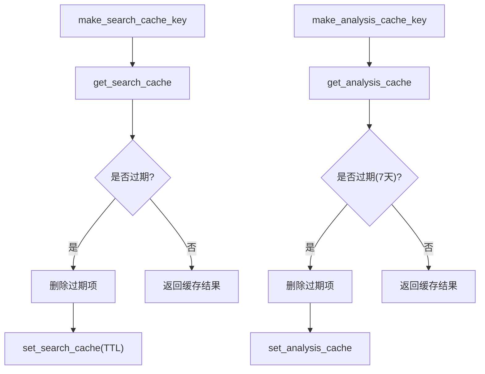
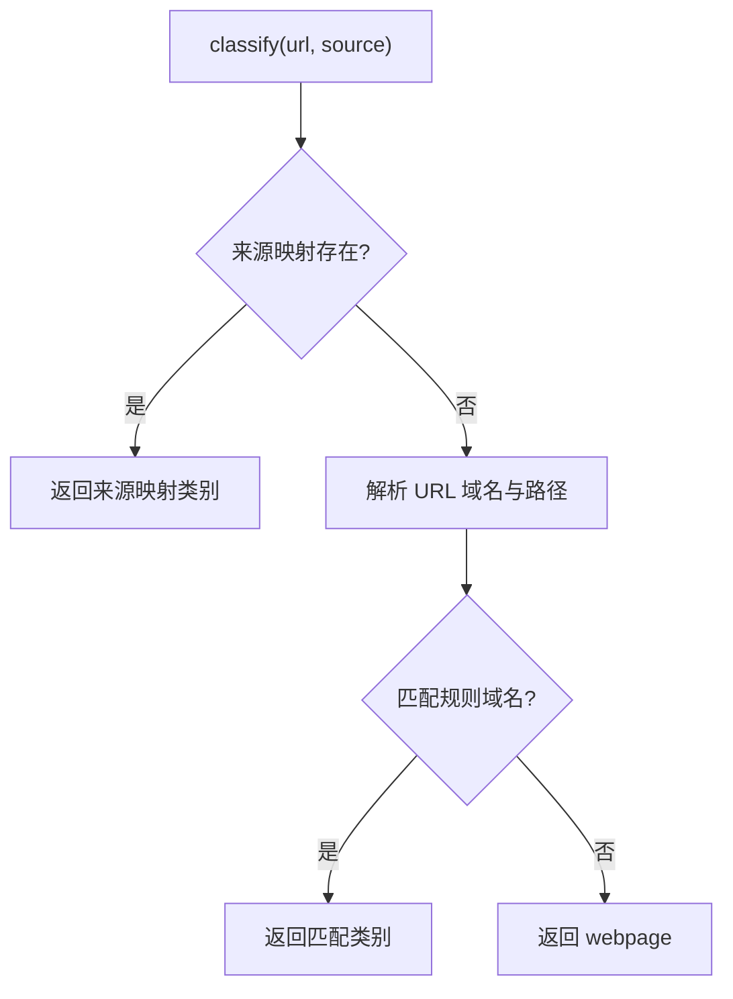
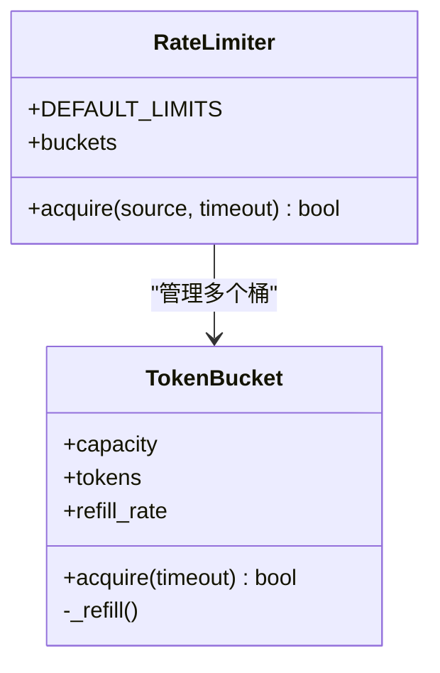
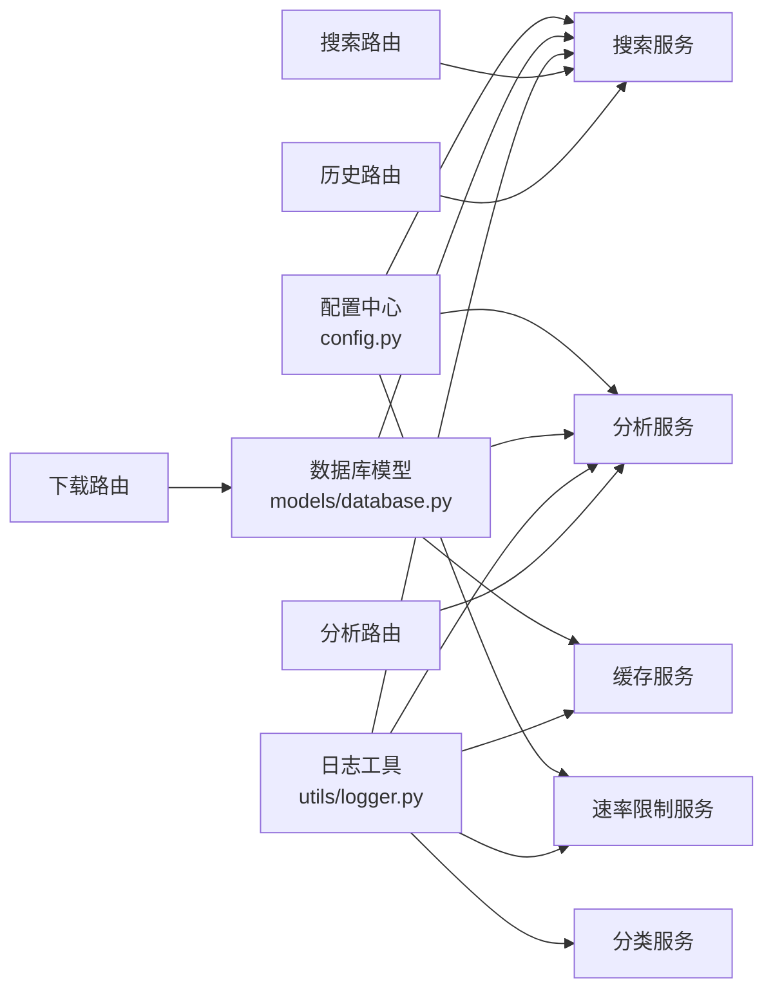

# 服务层架构

<cite>
**本文引用的文件**
- [backend/app.py](file://backend/app.py)
- [backend/config.py](file://backend/config.py)
- [backend/models/database.py](file://backend/models/database.py)
- [backend/models/schemas.py](file://backend/models/schemas.py)
- [backend/utils/logger.py](file://backend/utils/logger.py)
- [backend/routes/search.py](file://backend/routes/search.py)
- [backend/routes/analysis.py](file://backend/routes/analysis.py)
- [backend/routes/download.py](file://backend/routes/download.py)
- [backend/routes/history.py](file://backend/routes/history.py)
- [backend/services/search_service.py](file://backend/services/search_service.py)
- [backend/services/analysis_service.py](file://backend/services/analysis_service.py)
- [backend/services/cache_service.py](file://backend/services/cache_service.py)
- [backend/services/classification_service.py](file://backend/services/classification_service.py)
- [backend/services/rate_limiter.py](file://backend/services/rate_limiter.py)
</cite>

## 目录
1. [简介](#简介)
2. [项目结构](#项目结构)
3. [核心组件](#核心组件)
4. [架构总览](#架构总览)
5. [详细组件分析](#详细组件分析)
6. [依赖关系分析](#依赖关系分析)
7. [性能考量](#性能考量)
8. [故障排查指南](#故障排查指南)
9. [结论](#结论)
10. [附录](#附录)

## 简介
本文件系统性阐述服务层在 MVC 架构中的核心作用与实现方式，覆盖业务逻辑封装、数据处理与外部服务集成。服务层位于控制器与数据访问层之间，负责：
- 搜索服务：多源聚合、分类标注、缓存与历史持久化
- 分析服务：摘要/翻译/论文分析，集成外部 AI 模型
- 缓存服务：统一的搜索与分析缓存键生成与读写
- 分类服务：URL 与来源的智能内容类型识别
- 速率限制服务：基于令牌桶的并发与频率控制

服务层通过依赖注入策略（配置中心、数据库连接、日志器）解耦外部依赖，提供清晰的调用流程与错误传播机制，并辅以单元测试支持。

## 项目结构
后端采用分层架构，服务层位于路由层与数据访问层之间，围绕业务用例组织模块化服务组件，配合配置中心与日志工具实现可扩展与可观测性。

图表来源
- [backend/app.py](file://backend/app.py#L21-L78)
- [backend/routes/search.py](file://backend/routes/search.py#L1-L28)
- [backend/routes/analysis.py](file://backend/routes/analysis.py#L1-L66)
- [backend/routes/download.py](file://backend/routes/download.py#L1-L98)
- [backend/routes/history.py](file://backend/routes/history.py#L1-L33)
- [backend/services/search_service.py](file://backend/services/search_service.py#L1-L98)
- [backend/services/analysis_service.py](file://backend/services/analysis_service.py#L1-L91)
- [backend/services/cache_service.py](file://backend/services/cache_service.py#L1-L104)
- [backend/services/classification_service.py](file://backend/services/classification_service.py#L1-L64)
- [backend/services/rate_limiter.py](file://backend/services/rate_limiter.py#L1-L75)
- [backend/models/database.py](file://backend/models/database.py#L1-L51)
- [backend/models/schemas.py](file://backend/models/schemas.py#L1-L38)
- [backend/config.py](file://backend/config.py#L1-L85)
- [backend/utils/logger.py](file://backend/utils/logger.py#L1-L23)

章节来源
- [backend/app.py](file://backend/app.py#L21-L78)
- [backend/routes/search.py](file://backend/routes/search.py#L1-L28)
- [backend/routes/analysis.py](file://backend/routes/analysis.py#L1-L66)
- [backend/routes/download.py](file://backend/routes/download.py#L1-L98)
- [backend/routes/history.py](file://backend/routes/history.py#L1-L33)
- [backend/services/search_service.py](file://backend/services/search_service.py#L1-L98)
- [backend/services/analysis_service.py](file://backend/services/analysis_service.py#L1-L91)
- [backend/services/cache_service.py](file://backend/services/cache_service.py#L1-L104)
- [backend/services/classification_service.py](file://backend/services/classification_service.py#L1-L64)
- [backend/services/rate_limiter.py](file://backend/services/rate_limiter.py#L1-L75)
- [backend/models/database.py](file://backend/models/database.py#L1-L51)
- [backend/models/schemas.py](file://backend/models/schemas.py#L1-L38)
- [backend/config.py](file://backend/config.py#L1-L85)
- [backend/utils/logger.py](file://backend/utils/logger.py#L1-L23)

## 核心组件
- 搜索服务：负责多源聚合搜索、结果分类标注、缓存命中与未命中处理、历史记录持久化与查询清理。
- 分析服务：封装摘要、翻译与论文分析能力，统一缓存策略，延迟初始化分析代理。
- 缓存服务：提供搜索与分析两类缓存的键生成、读取、写入与过期清理。
- 分类服务：基于来源与 URL 的规则进行内容类型识别。
- 速率限制服务：基于令牌桶的多源并发控制，支持动态配置。

章节来源
- [backend/services/search_service.py](file://backend/services/search_service.py#L28-L98)
- [backend/services/analysis_service.py](file://backend/services/analysis_service.py#L25-L91)
- [backend/services/cache_service.py](file://backend/services/cache_service.py#L16-L104)
- [backend/services/classification_service.py](file://backend/services/classification_service.py#L30-L64)
- [backend/services/rate_limiter.py](file://backend/services/rate_limiter.py#L5-L75)

## 架构总览
服务层通过路由层暴露 REST API，路由层仅负责参数校验与异常捕获，真正的业务逻辑由服务层完成；服务层再通过配置中心、数据库模型与日志工具完成外部依赖的解耦与统一接入。

图表来源
- [backend/routes/search.py](file://backend/routes/search.py#L10-L28)
- [backend/services/search_service.py](file://backend/services/search_service.py#L28-L98)
- [backend/services/cache_service.py](file://backend/services/cache_service.py#L30-L53)
- [backend/services/classification_service.py](file://backend/services/classification_service.py#L30-L64)
- [backend/models/database.py](file://backend/models/database.py#L24-L34)
- [backend/utils/logger.py](file://backend/utils/logger.py#L5-L23)

## 详细组件分析

### 搜索服务（多源聚合与分类）
职责
- 多源聚合：根据配置与用户输入选择数据源，调用外部搜索代理执行搜索。
- 结果分类：对每条结果进行内容类型标注，优先依据来源映射，其次基于 URL 规则。
- 缓存策略：生成统一缓存键，命中则直接返回，未命中则写入缓存并记录 TTL。
- 历史持久化：将查询、过滤条件与结果总数写入历史表，支持查询与清空。

调用流程
- 路由层接收请求，调用搜索服务。
- 搜索服务先查缓存，命中则返回；未命中则调用外部代理聚合结果。
- 对每个结果调用分类服务进行标注。
- 写入缓存与历史记录，返回最终结果。

图表来源
- [backend/services/search_service.py](file://backend/services/search_service.py#L28-L98)
- [backend/services/cache_service.py](file://backend/services/cache_service.py#L16-L53)
- [backend/services/classification_service.py](file://backend/services/classification_service.py#L30-L64)

章节来源
- [backend/services/search_service.py](file://backend/services/search_service.py#L28-L98)
- [backend/routes/search.py](file://backend/routes/search.py#L10-L28)

### 分析服务（AI 模型集成）
职责
- 摘要生成：对长文本生成摘要与关键要点。
- 内容翻译：将文本翻译为目标语言。
- 论文分析：对学术论文的摘要、方法、创新点、结果与结论进行结构化分析。
- 缓存策略：针对不同分析类型生成独立缓存键，命中则直接返回，未命中则写入缓存并设置过期时间。

调用流程
- 路由层接收请求，调用分析服务对应方法。
- 分析服务先查缓存，命中则返回；未命中则延迟初始化分析代理并调用其方法。
- 成功时写入缓存，失败时返回错误信息。

图表来源
- [backend/routes/analysis.py](file://backend/routes/analysis.py#L10-L66)
- [backend/services/analysis_service.py](file://backend/services/analysis_service.py#L25-L91)
- [backend/services/cache_service.py](file://backend/services/cache_service.py#L57-L87)

章节来源
- [backend/services/analysis_service.py](file://backend/services/analysis_service.py#L25-L91)
- [backend/routes/analysis.py](file://backend/routes/analysis.py#L10-L66)

### 缓存服务（统一缓存策略）
职责
- 搜索缓存：基于查询参数生成稳定哈希键，支持 TTL 过期。
- 分析缓存：基于内容与分析类型生成键，支持 7 天过期清理。
- 清理策略：定期清理过期缓存，保证数据库整洁。

图表来源
- [backend/services/cache_service.py](file://backend/services/cache_service.py#L16-L104)

章节来源
- [backend/services/cache_service.py](file://backend/services/cache_service.py#L16-L104)

### 分类服务（内容类型识别）
职责
- 来源优先：根据来源名称（如 arxiv、zhihu）映射到类别。
- URL 规则：解析域名与路径，匹配预设域名集合，归类为学术、问答、博客、论坛或网页。

图表来源
- [backend/services/classification_service.py](file://backend/services/classification_service.py#L30-L64)

章节来源
- [backend/services/classification_service.py](file://backend/services/classification_service.py#L30-L64)

### 速率限制服务（令牌桶）
职责
- 为不同数据源维护独立令牌桶，控制请求频率。
- 支持动态配置，未配置的数据源默认不限流。
- 线程安全，基于时间片补充令牌。

图表来源
- [backend/services/rate_limiter.py](file://backend/services/rate_limiter.py#L5-L75)

章节来源
- [backend/services/rate_limiter.py](file://backend/services/rate_limiter.py#L5-L75)

## 依赖关系分析
服务层内部依赖关系与外部依赖注入
- 服务层依赖配置中心（读取搜索默认值、速率限制、分析设置等）。
- 服务层依赖数据库模型（连接、事务、DDL 初始化）。
- 服务层依赖日志工具（统一日志格式与级别）。
- 路由层仅依赖服务层，不直接访问数据库或外部代理，保持薄控制器。

图表来源
- [backend/config.py](file://backend/config.py#L50-L78)
- [backend/models/database.py](file://backend/models/database.py#L24-L34)
- [backend/utils/logger.py](file://backend/utils/logger.py#L5-L23)
- [backend/routes/search.py](file://backend/routes/search.py#L1-L28)
- [backend/routes/analysis.py](file://backend/routes/analysis.py#L1-L66)
- [backend/routes/download.py](file://backend/routes/download.py#L1-L98)
- [backend/routes/history.py](file://backend/routes/history.py#L1-L33)

章节来源
- [backend/config.py](file://backend/config.py#L50-L78)
- [backend/models/database.py](file://backend/models/database.py#L24-L34)
- [backend/utils/logger.py](file://backend/utils/logger.py#L5-L23)
- [backend/routes/search.py](file://backend/routes/search.py#L1-L28)
- [backend/routes/analysis.py](file://backend/routes/analysis.py#L1-L66)
- [backend/routes/download.py](file://backend/routes/download.py#L1-L98)
- [backend/routes/history.py](file://backend/routes/history.py#L1-L33)

## 性能考量
- 缓存策略
  - 搜索缓存：按查询参数生成稳定键，支持较长 TTL，显著降低重复请求。
  - 分析缓存：按内容与类型生成键，7 天过期，平衡时效性与成本。
- 并发与限流
  - 令牌桶算法为不同数据源提供细粒度限速，避免外部 API 拒绝。
- 数据库优化
  - 使用 WAL 模式、索引与上下文管理器，提升并发与一致性。
- 日志与可观测性
  - 统一日志格式，关键路径记录调试信息，便于定位性能瓶颈。

## 故障排查指南
- 搜索失败
  - 检查路由层错误捕获与服务层历史写入异常处理。
  - 关注缓存命中率与 TTL 设置，确认数据库连接可用。
- 分析失败
  - 确认外部模型提供商配置与密钥有效，检查缓存键生成是否一致。
- 缓存异常
  - 核对缓存键生成逻辑与过期清理策略，确保数据库表结构正确。
- 速率限制
  - 检查配置中心的速率限制配置，确认令牌桶容量与补充速率合理。

章节来源
- [backend/routes/search.py](file://backend/routes/search.py#L22-L27)
- [backend/services/search_service.py](file://backend/services/search_service.py#L70-L98)
- [backend/services/analysis_service.py](file://backend/services/analysis_service.py#L25-L91)
- [backend/services/cache_service.py](file://backend/services/cache_service.py#L91-L104)
- [backend/models/schemas.py](file://backend/models/schemas.py#L1-L38)

## 结论
服务层通过清晰的职责划分与依赖注入策略，实现了业务逻辑的高内聚、低耦合，具备良好的扩展性与可维护性。结合缓存与限流机制，服务层在性能与可靠性方面表现稳健；配合统一的日志与数据库模式，为后续单元测试与集成测试提供了坚实基础。

## 附录
- 单元测试支持建议
  - 使用配置中心的单例实例与数据库上下文管理器，模拟外部代理与缓存行为。
  - 针对搜索服务与分析服务的关键路径编写断言，覆盖缓存命中/未命中、异常传播与历史写入。
  - 使用令牌桶的线程安全特性，编写并发场景下的限流测试用例。