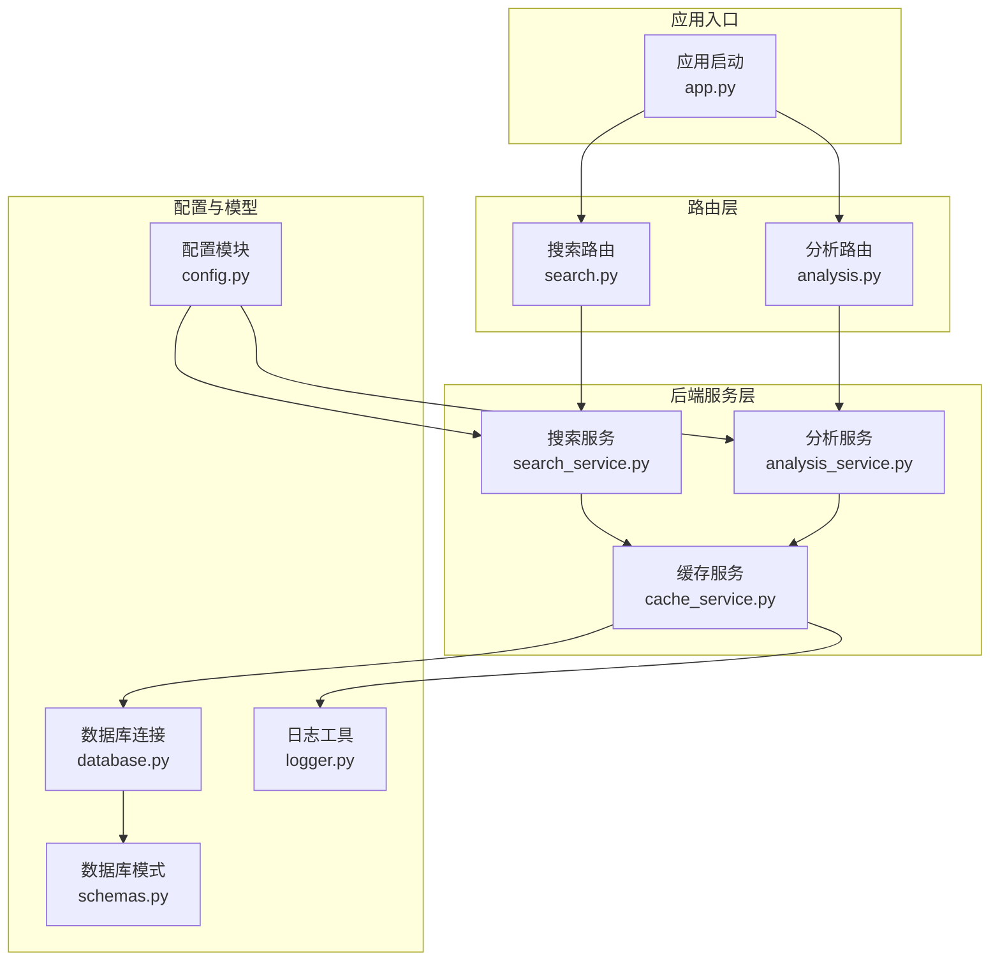
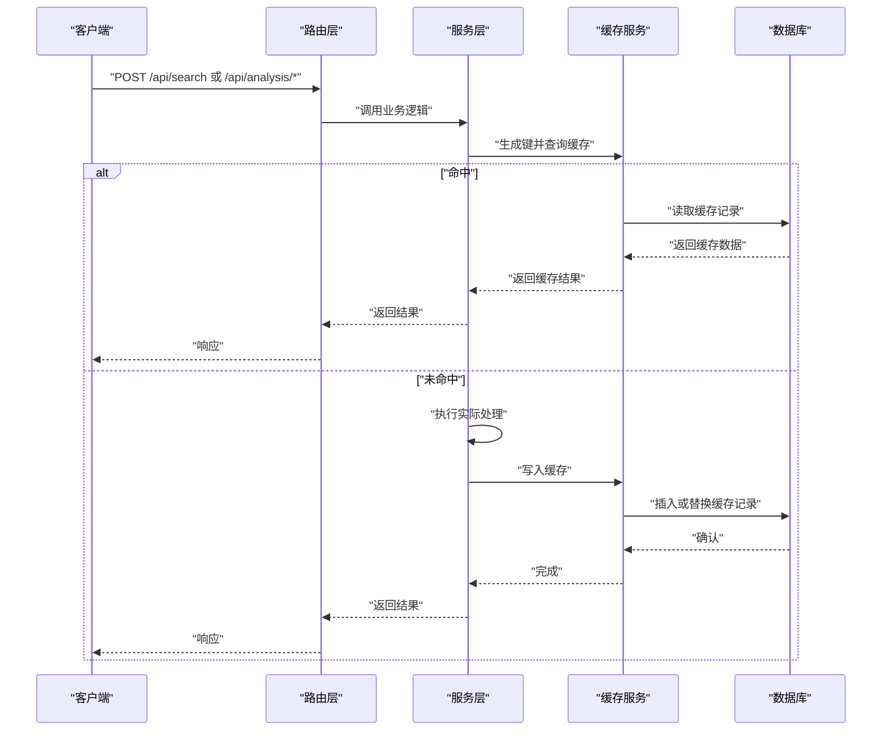
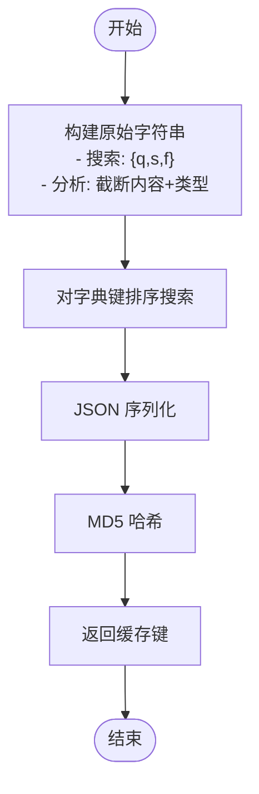
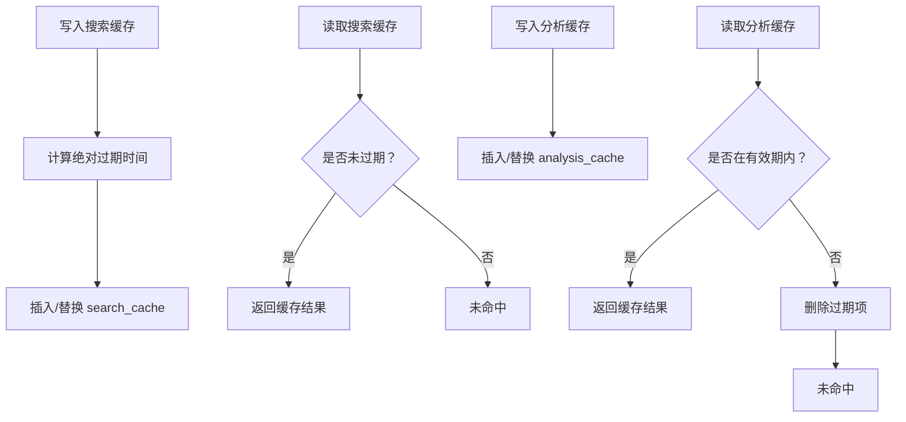
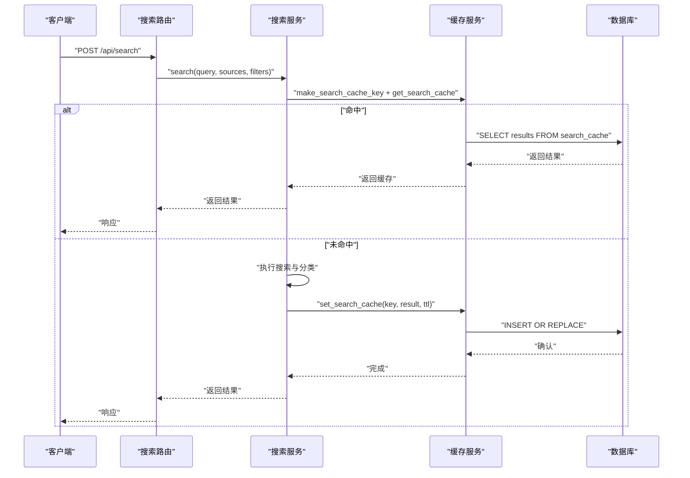
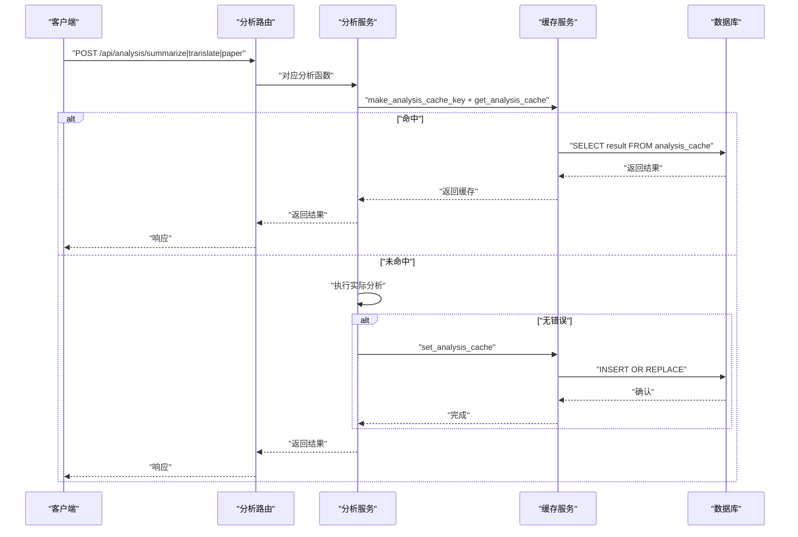
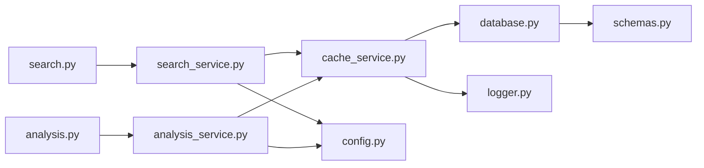

# 缓存服务

<cite>
**本文引用的文件**
- [cache_service.py](file://backend/services/cache_service.py)
- [config.py](file://backend/config.py)
- [schemas.py](file://backend/models/schemas.py)
- [database.py](file://backend/models/database.py)
- [search_service.py](file://backend/services/search_service.py)
- [analysis_service.py](file://backend/services/analysis_service.py)
- [search.py](file://backend/routes/search.py)
- [analysis.py](file://backend/routes/analysis.py)
- [.qoder/config.json](file://.qoder/config.json)
- [logger.py](file://backend/utils/logger.py)
- [app.py](file://backend/app.py)
</cite>

## 目录
1. [简介](#简介)
2. [项目结构](#项目结构)
3. [核心组件](#核心组件)
4. [架构总览](#架构总览)
5. [详细组件分析](#详细组件分析)
6. [依赖关系分析](#依赖关系分析)
7. [性能考量](#性能考量)
8. [故障排查指南](#故障排查指南)
9. [结论](#结论)
10. [附录](#附录)

## 简介
本文件系统性阐述后端缓存服务的设计与实现，重点覆盖以下方面：
- 缓存在系统中的作用：降低重复计算成本、提升响应速度、减轻上游服务压力
- 缓存策略设计：搜索结果缓存、分析结果缓存、配置缓存（由配置文件驱动）
- 缓存键生成算法：基于参数序列化与哈希，确保语义等价输入得到相同键
- TTL 管理机制：搜索缓存使用绝对过期时间，分析缓存使用相对过期时间
- 命中率优化：通过键规范化、内容截断、分类标签增强复用
- 内存管理策略：SQLite 存储、索引优化、定期清理
- 不同类型缓存的实现：搜索结果缓存、分析结果缓存
- 性能监控与可观测性：日志记录命中/设置/清理事件
- 失效与清理策略：主动清理过期条目、按类型设定不同 TTL
- 配置示例与最佳实践：基于 .qoder/config.json 的可调参数

## 项目结构
缓存服务位于后端服务层，围绕数据库表进行读写，并与配置模块、路由层、服务层协同工作。

图表来源
- [cache_service.py](file://backend/services/cache_service.py#L1-L104)
- [search_service.py](file://backend/services/search_service.py#L1-L98)
- [analysis_service.py](file://backend/services/analysis_service.py#L1-L91)
- [config.py](file://backend/config.py#L1-L85)
- [schemas.py](file://backend/models/schemas.py#L1-L38)
- [database.py](file://backend/models/database.py#L1-L51)
- [search.py](file://backend/routes/search.py#L1-L28)
- [analysis.py](file://backend/routes/analysis.py#L1-L66)
- [logger.py](file://backend/utils/logger.py#L1-L23)
- [app.py](file://backend/app.py#L1-L78)

章节来源
- [cache_service.py](file://backend/services/cache_service.py#L1-L104)
- [config.py](file://backend/config.py#L1-L85)
- [schemas.py](file://backend/models/schemas.py#L1-L38)
- [database.py](file://backend/models/database.py#L1-L51)
- [search_service.py](file://backend/services/search_service.py#L1-L98)
- [analysis_service.py](file://backend/services/analysis_service.py#L1-L91)
- [search.py](file://backend/routes/search.py#L1-L28)
- [analysis.py](file://backend/routes/analysis.py#L1-L66)
- [logger.py](file://backend/utils/logger.py#L1-L23)
- [app.py](file://backend/app.py#L1-L78)

## 核心组件
- 缓存键生成器：为搜索与分析分别提供稳定、可复现的键
- 搜索缓存：以查询参数为键，存储搜索结果；支持绝对 TTL
- 分析缓存：以内容与任务类型为键，存储分析结果；支持相对 TTL
- 清理器：定期删除过期条目，释放存储空间
- 配置驱动：从 .qoder/config.json 读取 TTL、默认源、最大长度等参数

章节来源
- [cache_service.py](file://backend/services/cache_service.py#L11-L26)
- [cache_service.py](file://backend/services/cache_service.py#L30-L52)
- [cache_service.py](file://backend/services/cache_service.py#L57-L86)
- [cache_service.py](file://backend/services/cache_service.py#L91-L103)
- [.qoder/config.json](file://.qoder/config.json#L8-L13)
- [.qoder/config.json](file://.qoder/config.json#L22-L29)

## 架构总览
缓存服务通过统一的数据库接口访问 SQLite 表，路由层调用服务层，服务层调用缓存服务，配置模块提供 TTL 等参数。

图表来源
- [search.py](file://backend/routes/search.py#L10-L27)
- [analysis.py](file://backend/routes/analysis.py#L10-L65)
- [search_service.py](file://backend/services/search_service.py#L28-L67)
- [analysis_service.py](file://backend/services/analysis_service.py#L25-L90)
- [cache_service.py](file://backend/services/cache_service.py#L30-L86)
- [database.py](file://backend/models/database.py#L24-L34)

## 详细组件分析

### 缓存键生成算法
- 搜索键：对查询、排序后的来源列表、过滤器字典进行 JSON 序列化并排序键值，再做哈希，保证语义等价输入得到相同键
- 分析键：对内容进行截断（前若干字符），拼接分析类型后做哈希，避免长文本导致键过长

图表来源
- [cache_service.py](file://backend/services/cache_service.py#L16-L25)

章节来源
- [cache_service.py](file://backend/services/cache_service.py#L11-L26)

### TTL 管理机制
- 搜索缓存：绝对过期时间，写入时根据配置计算过期时间，查询时仅返回未过期记录
- 分析缓存：相对过期时间，按创建时间与当前时间差判断是否过期，超过阈值自动清理

图表来源
- [cache_service.py](file://backend/services/cache_service.py#L43-L52)
- [cache_service.py](file://backend/services/cache_service.py#L30-L40)
- [cache_service.py](file://backend/services/cache_service.py#L57-L86)
- [cache_service.py](file://backend/services/cache_service.py#L65-L74)

章节来源
- [cache_service.py](file://backend/services/cache_service.py#L30-L86)
- [config.py](file://backend/config.py#L54-L59)
- [config.py](file://backend/config.py#L67-L73)

### 缓存命中率优化
- 键规范化：搜索来源列表排序、字典键排序，减少“等价但顺序不同”的键冲突
- 内容截断：分析键对长内容进行截断，避免键过长且提升复用概率
- 结果分类：搜索结果在缓存前附加分类标签，提高后续检索相关性的命中率
- 配置驱动：通过配置文件控制 TTL、默认来源、最大内容长度等，平衡命中率与新鲜度

章节来源
- [cache_service.py](file://backend/services/cache_service.py#L16-L25)
- [search_service.py](file://backend/services/search_service.py#L55-L58)
- [config.py](file://backend/config.py#L54-L59)
- [config.py](file://backend/config.py#L67-L73)

### 内存管理策略
- 存储介质：SQLite 文件数据库，线程本地连接，WAL 模式、超时与外键约束
- 索引优化：为搜索与分析缓存表建立唯一索引，加速键查找
- 定期清理：按绝对/相对 TTL 删除过期条目，降低表膨胀

章节来源
- [database.py](file://backend/models/database.py#L11-L21)
- [schemas.py](file://backend/models/schemas.py#L10-L26)
- [cache_service.py](file://backend/services/cache_service.py#L91-L103)

### 搜索结果缓存
- 路由层接收请求，服务层生成缓存键并查询缓存，命中则直接返回；未命中则执行搜索与分类，随后写入缓存并返回
- TTL 来自配置，默认 24 小时

图表来源
- [search.py](file://backend/routes/search.py#L10-L27)
- [search_service.py](file://backend/services/search_service.py#L28-L67)
- [cache_service.py](file://backend/services/cache_service.py#L16-L25)
- [cache_service.py](file://backend/services/cache_service.py#L30-L52)
- [config.py](file://backend/config.py#L54-L59)

章节来源
- [search.py](file://backend/routes/search.py#L10-L27)
- [search_service.py](file://backend/services/search_service.py#L28-L67)
- [cache_service.py](file://backend/services/cache_service.py#L16-L52)
- [config.py](file://backend/config.py#L54-L59)

### 分析结果缓存
- 支持摘要、翻译、论文分析三类任务，每类均以“内容+任务类型”作为键
- TTL 默认 7 天，过期自动清理
- 成功结果写入缓存，失败不写入

图表来源
- [analysis.py](file://backend/routes/analysis.py#L10-L65)
- [analysis_service.py](file://backend/services/analysis_service.py#L25-L90)
- [cache_service.py](file://backend/services/cache_service.py#L22-L25)
- [cache_service.py](file://backend/services/cache_service.py#L57-L86)
- [config.py](file://backend/config.py#L67-L73)

章节来源
- [analysis.py](file://backend/routes/analysis.py#L10-L65)
- [analysis_service.py](file://backend/services/analysis_service.py#L25-L90)
- [cache_service.py](file://backend/services/cache_service.py#L22-L86)
- [config.py](file://backend/config.py#L67-L73)

### 配置缓存
- 配置缓存并非数据库表形式，而是通过 .qoder/config.json 提供的静态配置，包括：
  - 搜索默认参数：最大结果数、超时、TTL（小时）、默认来源
  - 下载设置：并发下载数、镜像地址
  - 分析设置：模型、最大内容长度、温度、分析缓存 TTL（天）

章节来源
- [.qoder/config.json](file://.qoder/config.json#L8-L13)
- [.qoder/config.json](file://.qoder/config.json#L14-L21)
- [.qoder/config.json](file://.qoder/config.json#L22-L29)
- [config.py](file://backend/config.py#L54-L73)

## 依赖关系分析
- 缓存服务依赖数据库连接与日志工具
- 服务层依赖缓存服务与配置模块
- 路由层依赖服务层
- 数据库模式定义了缓存表结构与索引

图表来源
- [search.py](file://backend/routes/search.py#L1-L28)
- [analysis.py](file://backend/routes/analysis.py#L1-L66)
- [search_service.py](file://backend/services/search_service.py#L1-L98)
- [analysis_service.py](file://backend/services/analysis_service.py#L1-L91)
- [cache_service.py](file://backend/services/cache_service.py#L1-L104)
- [database.py](file://backend/models/database.py#L1-L51)
- [schemas.py](file://backend/models/schemas.py#L1-L38)
- [config.py](file://backend/config.py#L1-L85)
- [logger.py](file://backend/utils/logger.py#L1-L23)

章节来源
- [search.py](file://backend/routes/search.py#L1-L28)
- [analysis.py](file://backend/routes/analysis.py#L1-L66)
- [search_service.py](file://backend/services/search_service.py#L1-L98)
- [analysis_service.py](file://backend/services/analysis_service.py#L1-L91)
- [cache_service.py](file://backend/services/cache_service.py#L1-L104)
- [database.py](file://backend/models/database.py#L1-L51)
- [schemas.py](file://backend/models/schemas.py#L1-L38)
- [config.py](file://backend/config.py#L1-L85)
- [logger.py](file://backend/utils/logger.py#L1-L23)

## 性能考量
- 查询路径优化
  - 使用唯一索引加速键查找
  - 绝对/相对 TTL 查询条件明确，避免全表扫描
- 写入路径优化
  - INSERT OR REPLACE 减少重复写入开销
  - 批量清理一次性删除多条过期记录
- 内存与 IO
  - SQLite WAL 模式提升并发读写
  - 线程本地连接减少锁竞争
- 命中率提升
  - 规范化键、截断长内容、分类标签增强复用
  - 合理 TTL 平衡新鲜度与命中率

[本节为通用性能讨论，无需列出具体文件来源]

## 故障排查指南
- 缓存未命中
  - 检查键生成是否一致（来源排序、过滤器键排序）
  - 确认 TTL 是否过短或过期
- 缓存命中但结果异常
  - 检查内容截断是否影响分析键
  - 确认分析类型拼接是否一致
- 数据库问题
  - 确认数据库初始化与表结构
  - 检查连接池与事务提交/回滚
- 日志定位
  - 查看缓存命中/设置/清理日志，定位问题阶段

章节来源
- [cache_service.py](file://backend/services/cache_service.py#L30-L86)
- [cache_service.py](file://backend/services/cache_service.py#L91-L103)
- [database.py](file://backend/models/database.py#L36-L43)
- [logger.py](file://backend/utils/logger.py#L5-L22)

## 结论
该缓存服务通过简洁的键生成、明确的 TTL 策略与定期清理机制，在 SQLite 中实现了高效稳定的搜索与分析结果缓存。配合配置模块与日志工具，具备良好的可维护性与可观测性。建议在生产环境中结合监控指标进一步评估命中率与清理效果，并根据业务特征调整 TTL 与内容截断策略。

[本节为总结性内容，无需列出具体文件来源]

## 附录

### 缓存配置示例
- 搜索缓存 TTL（小时）
  - 来源：配置文件中的搜索默认参数
  - 参考路径：[config.py](file://backend/config.py#L54-L59)，[.qoder/config.json](file://.qoder/config.json#L8-L13)
- 分析缓存 TTL（天）
  - 来源：分析设置
  - 参考路径：[config.py](file://backend/config.py#L67-L73)，[.qoder/config.json](file://.qoder/config.json#L22-L29)

### 最佳实践建议
- 键生成
  - 对输入进行标准化（排序、去重、裁剪），确保等价输入得到相同键
- TTL 设定
  - 搜索：根据结果更新频率选择合适 TTL（如 24 小时）
  - 分析：根据模型成本与结果稳定性选择 TTL（如 7 天）
- 内容截断
  - 在不影响语义的前提下截断长文本，提升命中率
- 清理策略
  - 定期执行清理，避免表过大影响性能
- 监控与告警
  - 记录缓存命中率、清理数量、异常事件，及时发现异常

[本节为通用建议，无需列出具体文件来源]