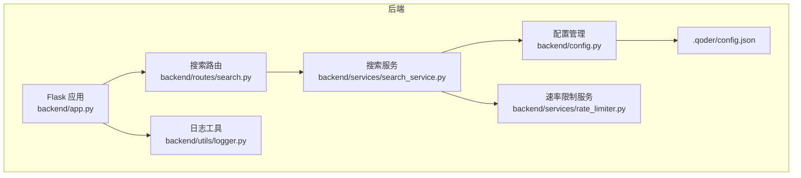
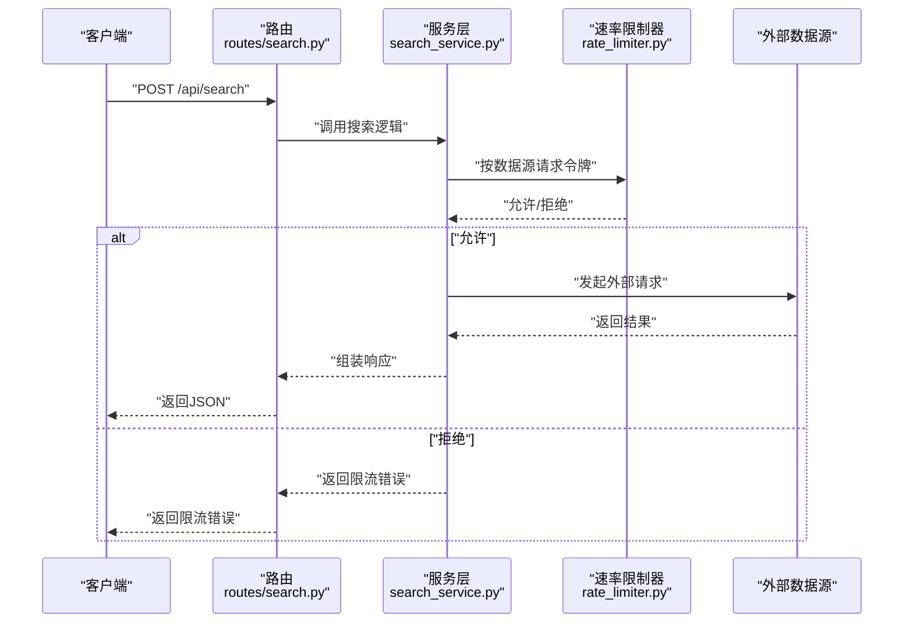
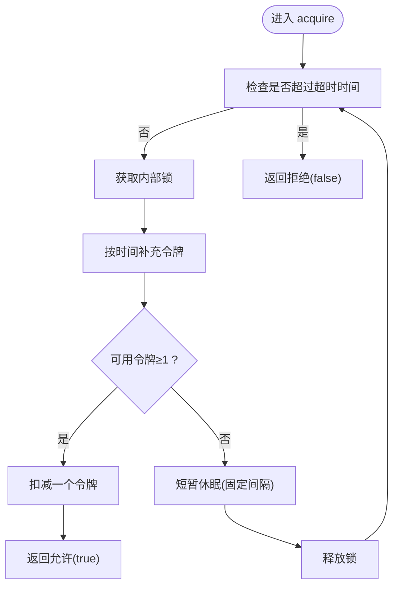
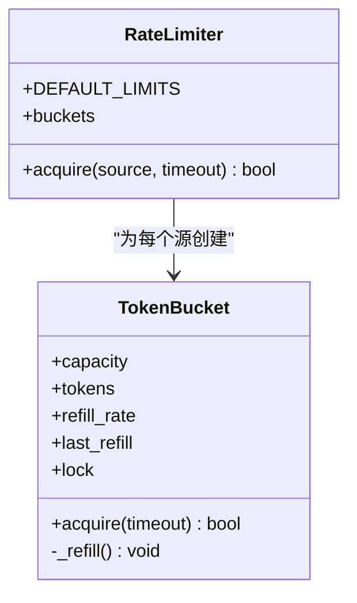
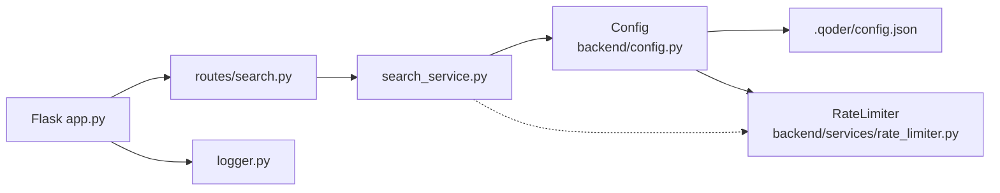

# 速率限制服务

<cite>
**本文引用的文件**
- [backend/services/rate_limiter.py](file://backend/services/rate_limiter.py)
- [backend/config.py](file://backend/config.py)
- [.qoder/config.json](file://.qoder/config.json)
- [README.md](file://README.md)
- [backend/routes/search.py](file://backend/routes/search.py)
- [backend/services/search_service.py](file://backend/services/search_service.py)
- [backend/app.py](file://backend/app.py)
- [backend/utils/logger.py](file://backend/utils/logger.py)
</cite>

## 目录
1. [简介](#简介)
2. [项目结构](#项目结构)
3. [核心组件](#核心组件)
4. [架构总览](#架构总览)
5. [详细组件分析](#详细组件分析)
6. [依赖关系分析](#依赖关系分析)
7. [性能考量](#性能考量)
8. [故障排查指南](#故障排查指南)
9. [结论](#结论)
10. [附录](#附录)

## 简介
本文件系统性阐述本项目的速率限制服务，重点覆盖以下方面：
- 速率限制在API保护与资源控制中的作用
- 令牌桶算法的实现原理、配置参数与动态调整机制
- 多源速率控制策略、突发流量处理与限流策略优化
- 速率限制配置、监控指标与告警机制
- 不同场景下的配置示例与性能调优建议

## 项目结构
本项目采用前后端分离架构，后端基于Flask，前端基于React/Vite。速率限制服务位于后端的独立模块中，并通过配置文件进行集中管理。

图表来源
- [backend/app.py](file://backend/app.py#L21-L78)
- [backend/routes/search.py](file://backend/routes/search.py#L10-L28)
- [backend/services/search_service.py](file://backend/services/search_service.py#L28-L67)
- [backend/services/rate_limiter.py](file://backend/services/rate_limiter.py#L45-L74)
- [backend/config.py](file://backend/config.py#L50-L51)
- [.qoder/config.json](file://.qoder/config.json#L1-L31)

章节来源
- [backend/app.py](file://backend/app.py#L21-L78)
- [backend/routes/search.py](file://backend/routes/search.py#L10-L28)
- [backend/services/search_service.py](file://backend/services/search_service.py#L28-L67)
- [backend/services/rate_limiter.py](file://backend/services/rate_limiter.py#L45-L74)
- [backend/config.py](file://backend/config.py#L50-L51)
- [.qoder/config.json](file://.qoder/config.json#L1-L31)

## 核心组件
- 令牌桶(TokenBucket)：线程安全的单源限流单元，负责按时间补充令牌并在请求时扣减令牌。
- 速率限制器(RateLimiter)：管理多个数据源的令牌桶实例，提供按源获取令牌的能力。
- 配置(Config)：从运行时配置文件读取速率限制参数，作为速率限制器初始化的依据。
- 搜索服务(search_service)：对外暴露的搜索流程，当前未直接调用速率限制器；如需启用限流，应在该层或路由层接入。

章节来源
- [backend/services/rate_limiter.py](file://backend/services/rate_limiter.py#L5-L43)
- [backend/services/rate_limiter.py](file://backend/services/rate_limiter.py#L45-L74)
- [backend/config.py](file://backend/config.py#L50-L51)
- [.qoder/config.json](file://.qoder/config.json#L2-L7)
- [backend/services/search_service.py](file://backend/services/search_service.py#L28-L67)

## 架构总览
速率限制服务的调用链路如下：客户端请求到达Flask路由，路由交由服务层处理；服务层根据配置加载速率限制参数，构建速率限制器；随后在执行外部数据源请求前调用acquire进行限流判断。

图表来源
- [backend/routes/search.py](file://backend/routes/search.py#L10-L28)
- [backend/services/search_service.py](file://backend/services/search_service.py#L28-L67)
- [backend/services/rate_limiter.py](file://backend/services/rate_limiter.py#L64-L74)

## 详细组件分析

### 令牌桶算法实现
- 补充机制：基于单调时钟计算自上次补充以来的时间差，按补充速率累加令牌，上限不超过容量。
- 获取机制：在锁保护下先补充令牌，若可用令牌数≥1则扣减并返回成功；否则等待固定周期后重试，直至超时。
- 并发安全：使用互斥锁保证补充与消费过程的原子性。

图表来源
- [backend/services/rate_limiter.py](file://backend/services/rate_limiter.py#L27-L42)

章节来源
- [backend/services/rate_limiter.py](file://backend/services/rate_limiter.py#L5-L43)

### 速率限制器与多源控制
- 多源管理：为每个数据源维护独立的令牌桶，彼此独立计数与补充。
- 默认配置：内置默认速率限制参数，便于开箱即用。
- 未配置源放行：当某数据源未在配置中声明时，默认视为无限制。

图表来源
- [backend/services/rate_limiter.py](file://backend/services/rate_limiter.py#L5-L43)
- [backend/services/rate_limiter.py](file://backend/services/rate_limiter.py#L45-L74)

章节来源
- [backend/services/rate_limiter.py](file://backend/services/rate_limiter.py#L45-L74)

### 配置与动态调整
- 配置来源：运行时配置文件(.qoder/config.json)中的“rate_limits”键提供各数据源的容量与补充速率。
- 参数含义：
  - 容量(capacity)：桶的最大令牌数，决定突发额度
  - 补充速率(refill_rate)：每秒新增令牌数，决定稳定吞吐
- 动态调整：通过修改配置文件即可在线调整各数据源的限流策略，无需重启服务。

章节来源
- [backend/config.py](file://backend/config.py#L50-L51)
- [.qoder/config.json](file://.qoder/config.json#L2-L7)
- [README.md](file://README.md#L299-L312)

### 当前集成现状与改进建议
- 现状：搜索服务未直接调用速率限制器，限流尚未生效。
- 建议：在服务层或路由层对每次外部数据源请求前调用acquire(source)，根据返回值决定是否继续请求或返回限流错误。

章节来源
- [backend/services/search_service.py](file://backend/services/search_service.py#L28-L67)
- [backend/routes/search.py](file://backend/routes/search.py#L10-L28)
- [backend/services/rate_limiter.py](file://backend/services/rate_limiter.py#L64-L74)

## 依赖关系分析
- 速率限制器依赖于配置模块提供的速率限制参数。
- 搜索服务依赖配置模块与日志模块，当前未直接依赖速率限制器。
- Flask应用负责注册蓝图与全局异常处理，不直接参与限流逻辑。

图表来源
- [backend/config.py](file://backend/config.py#L50-L51)
- [.qoder/config.json](file://.qoder/config.json#L2-L7)
- [backend/services/rate_limiter.py](file://backend/services/rate_limiter.py#L55-L62)
- [backend/services/search_service.py](file://backend/services/search_service.py#L40-L41)
- [backend/routes/search.py](file://backend/routes/search.py#L10-L28)
- [backend/app.py](file://backend/app.py#L10-L18)
- [backend/utils/logger.py](file://backend/utils/logger.py#L5-L22)

章节来源
- [backend/config.py](file://backend/config.py#L50-L51)
- [backend/services/rate_limiter.py](file://backend/services/rate_limiter.py#L55-L62)
- [backend/services/search_service.py](file://backend/services/search_service.py#L40-L41)
- [backend/routes/search.py](file://backend/routes/search.py#L10-L28)
- [backend/app.py](file://backend/app.py#L10-L18)
- [backend/utils/logger.py](file://backend/utils/logger.py#L5-L22)

## 性能考量
- 令牌补充精度：使用单调时钟计算时间差，避免系统时钟回拨影响。
- 等待粒度：固定休眠间隔平衡CPU占用与响应延迟，可根据场景调整。
- 并发模型：单源令牌桶内部加锁，避免竞争；多源之间相互独立，降低锁争用。
- 扩展性：支持按数据源独立配置，便于针对不同外部API的配额与稳定性进行差异化限流。

章节来源
- [backend/services/rate_limiter.py](file://backend/services/rate_limiter.py#L20-L25)
- [backend/services/rate_limiter.py](file://backend/services/rate_limiter.py#L34-L42)

## 故障排查指南
- 限流未生效
  - 检查是否在服务层或路由层调用了acquire
  - 确认配置文件中的“rate_limits”键存在且格式正确
- 日志定位
  - 使用统一的日志工具输出错误与调试信息，便于定位限流触发点
- 常见问题
  - 配置项缺失：未配置的数据源默认视为无限制
  - 超时设置过短：可能导致频繁拒绝，应结合外部API响应时间调整

章节来源
- [backend/services/rate_limiter.py](file://backend/services/rate_limiter.py#L71-L73)
- [backend/utils/logger.py](file://backend/utils/logger.py#L5-L22)

## 结论
本项目的速率限制服务以令牌桶为核心，提供了线程安全、可扩展的多源限流能力。通过运行时配置文件即可灵活调整各数据源的限流策略。当前搜索服务尚未接入限流逻辑，建议在服务层或路由层增加acquire调用，以实现对多源API的保护与资源控制。

## 附录

### 速率限制配置示例
- 在运行时配置文件中添加或修改“rate_limits”键，为各数据源设置容量与补充速率
- 示例键位与含义参考：README中的“速率限制配置”章节

章节来源
- [README.md](file://README.md#L299-L312)
- [.qoder/config.json](file://.qoder/config.json#L2-L7)

### 监控指标与告警建议
- 指标建议
  - 各数据源的请求总量、被拒绝次数、平均等待时间
  - 令牌桶剩余容量与补充速率偏差
- 告警建议
  - 拒绝率持续升高时触发告警
  - 令牌桶长期处于低容量状态时提示扩容

[本节为通用实践建议，不直接分析具体文件]