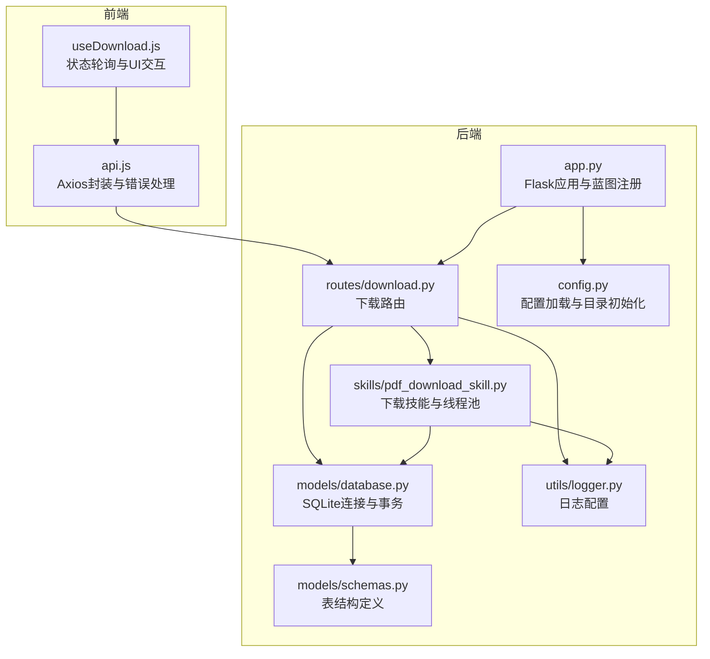
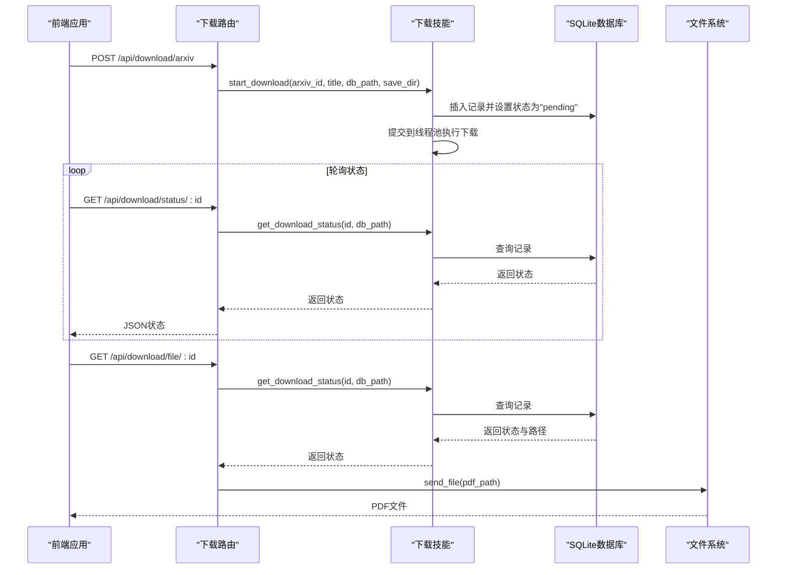
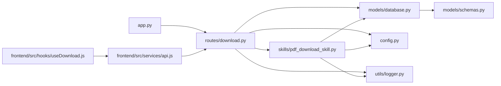
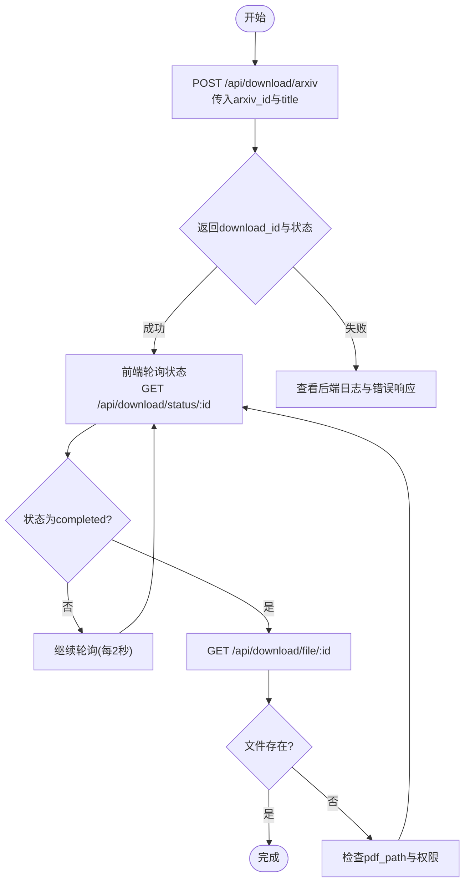

# 下载蓝图

<cite>
**本文引用的文件**
- [backend/routes/download.py](file://backend/routes/download.py)
- [.qoder/skills/pdf_download_skill.py](file://.qoder/skills/pdf_download_skill.py)
- [backend/config.py](file://backend/config.py)
- [backend/models/database.py](file://backend/models/database.py)
- [backend/models/schemas.py](file://backend/models/schemas.py)
- [backend/app.py](file://backend/app.py)
- [frontend/src/hooks/useDownload.js](file://frontend/src/hooks/useDownload.js)
- [frontend/src/services/api.js](file://frontend/src/services/api.js)
- [backend/utils/logger.py](file://backend/utils/logger.py)
- [.qoder/config.json](file://.qoder/config.json)
</cite>

## 目录
1. [简介](#简介)
2. [项目结构](#项目结构)
3. [核心组件](#核心组件)
4. [架构总览](#架构总览)
5. [详细组件分析](#详细组件分析)
6. [依赖关系分析](#依赖关系分析)
7. [性能与并发特性](#性能与并发特性)
8. [故障排除指南](#故障排除指南)
9. [结论](#结论)
10. [附录：完整下载流程示例](#附录完整下载流程示例)

## 简介
本文件系统性地文档化“下载蓝图”的实现，覆盖以下方面：
- PDF下载管理相关的路由实现：/api/download/arxiv 启动下载、/api/download/status/<id> 查询状态、/api/download/file/<id> 获取文件、/api/download/history 历史记录
- 下载队列管理、并发控制机制与文件状态跟踪
- 下载服务实现细节、缓存策略（搜索与分析）与错误恢复机制
- 下载进度监控、文件完整性验证与用户反馈机制
- 完整的下载流程示例与故障排除指南

## 项目结构
后端采用Flask蓝图组织API，前端使用React Hook与Axios进行交互。下载相关逻辑由后端路由调用技能模块执行，并通过SQLite数据库持久化下载记录与状态。

图表来源
- [backend/app.py](file://backend/app.py#L1-L78)
- [backend/routes/download.py](file://backend/routes/download.py#L1-L98)
- [.qoder/skills/pdf_download_skill.py](file://.qoder/skills/pdf_download_skill.py#L1-L146)
- [backend/models/database.py](file://backend/models/database.py#L1-L51)
- [backend/models/schemas.py](file://backend/models/schemas.py#L1-L38)
- [backend/config.py](file://backend/config.py#L1-L85)
- [backend/utils/logger.py](file://backend/utils/logger.py#L1-L23)

章节来源
- [backend/app.py](file://backend/app.py#L1-L78)
- [backend/routes/download.py](file://backend/routes/download.py#L1-L98)
- [backend/config.py](file://backend/config.py#L1-L85)

## 核心组件
- 路由层：提供下载启动、状态查询、文件获取与历史查询四个端点
- 技能层：负责后台下载任务调度、镜像回退、文件校验与状态更新
- 数据层：SQLite数据库存储下载记录，支持并发安全与自动提交/回滚
- 配置层：集中管理下载目录、并发数、镜像源等参数
- 前端Hook：发起下载、轮询状态、清理轮询、移除记录

章节来源
- [backend/routes/download.py](file://backend/routes/download.py#L14-L98)
- [.qoder/skills/pdf_download_skill.py](file://.qoder/skills/pdf_download_skill.py#L21-L146)
- [backend/models/database.py](file://backend/models/database.py#L24-L51)
- [backend/config.py](file://backend/config.py#L47-L66)
- [frontend/src/hooks/useDownload.js](file://frontend/src/hooks/useDownload.js#L1-L78)

## 架构总览
下载蓝图的端到端流程如下：

图表来源
- [backend/routes/download.py](file://backend/routes/download.py#L14-L98)
- [.qoder/skills/pdf_download_skill.py](file://.qoder/skills/pdf_download_skill.py#L21-L146)
- [backend/models/database.py](file://backend/models/database.py#L24-L51)

## 详细组件分析

### 路由层：下载API
- /api/download/arxiv
  - 接收arxiv_id与title，校验必填项
  - 调用技能模块启动下载，返回download_id与初始状态
  - 异常统一记录日志并返回错误信息
- /api/download/status/<int:download_id>
  - 查询指定下载记录的状态
  - 若不存在返回404；异常返回500
- /api/download/file/<int:download_id>
  - 校验记录存在且状态为completed
  - 校验文件存在，否则返回404
  - 使用Flask send_file返回PDF文件
- /api/download/history
  - 查询所有下载记录并返回列表

章节来源
- [backend/routes/download.py](file://backend/routes/download.py#L14-L98)

### 技能层：下载执行器
- 线程池并发控制
  - 全局ThreadPoolExecutor，最大工作线程数固定
  - 每个下载任务独立线程，避免阻塞主线程
- 下载流程
  - 初始化记录状态为pending
  - 依次尝试多个arXiv镜像地址，支持回退
  - 流式写入文件，边下边写
  - 文件完整性校验（PDF头检查）
  - 成功则更新状态为completed并记录文件路径与大小
  - 失败则标记为failed
- 状态查询与历史
  - 提供按id查询与全量查询接口
  - 返回标准化字典，便于路由层序列化

章节来源
- [.qoder/skills/pdf_download_skill.py](file://.qoder/skills/pdf_download_skill.py#L12-L146)

### 数据层：SQLite与表结构
- 连接模型
  - 线程本地连接，WAL模式，超时与外键约束开启
  - 上下文管理器自动提交/回滚
- 表结构
  - download_records：保存下载标题、URL、PDF路径、状态、文件大小与时间戳
  - 用于持久化下载状态与结果，支撑前端轮询与文件获取
- 初始化
  - 应用启动时创建缺失表

章节来源
- [backend/models/database.py](file://backend/models/database.py#L11-L51)
- [backend/models/schemas.py](file://backend/models/schemas.py#L28-L37)

### 配置层：下载参数与目录
- 下载目录
  - DOWNLOAD_DIR：默认data/downloads，确保存在
- 并发与镜像
  - max_concurrent_downloads：线程池最大工作数
  - arxiv_mirrors：镜像地址列表，支持回退
- 其他
  - DATABASE_PATH：SQLite数据库路径
  - SECRET_KEY、FLASK_PORT、DEBUG等

章节来源
- [backend/config.py](file://backend/config.py#L47-L66)
- [.qoder/config.json](file://.qoder/config.json#L14-L21)

### 前端集成：下载Hook与API封装
- useDownload.js
  - 发起下载：POST /api/download/arxiv
  - 轮询状态：GET /api/download/status/:id，每2秒一次
  - 自动停止轮询：当没有pending或downloading的任务时
  - 移除记录：从列表中剔除已完成或失败的条目
- api.js
  - Axios实例，统一拦截响应错误
  - 对429、5xx、400等场景给出用户提示

章节来源
- [frontend/src/hooks/useDownload.js](file://frontend/src/hooks/useDownload.js#L9-L78)
- [frontend/src/services/api.js](file://frontend/src/services/api.js#L1-L32)

### 日志与错误处理
- 统一日志
  - 各模块通过get_logger获取命名日志器，格式一致
- 路由层错误
  - 捕获异常并记录，返回JSON错误信息
- 技能层错误
  - 请求异常、文件无效、磁盘IO失败均被记录并进入回退或失败流程

章节来源
- [backend/utils/logger.py](file://backend/utils/logger.py#L5-L23)
- [backend/routes/download.py](file://backend/routes/download.py#L37-L56)
- [.qoder/skills/pdf_download_skill.py](file://.qoder/skills/pdf_download_skill.py#L58-L88)

## 依赖关系分析

图表来源
- [backend/routes/download.py](file://backend/routes/download.py#L1-L98)
- [.qoder/skills/pdf_download_skill.py](file://.qoder/skills/pdf_download_skill.py#L1-L146)
- [backend/models/database.py](file://backend/models/database.py#L1-L51)
- [backend/models/schemas.py](file://backend/models/schemas.py#L1-L38)
- [backend/config.py](file://backend/config.py#L1-L85)
- [backend/app.py](file://backend/app.py#L1-L78)
- [frontend/src/hooks/useDownload.js](file://frontend/src/hooks/useDownload.js#L1-L78)
- [frontend/src/services/api.js](file://frontend/src/services/api.js#L1-L32)
- [backend/utils/logger.py](file://backend/utils/logger.py#L1-L23)

## 性能与并发特性
- 并发控制
  - 技能层使用固定大小线程池，限制同时下载数量
  - 防止资源争用与网络拥塞
- I/O与内存
  - 流式下载，分块写入，降低内存峰值
- 数据库并发
  - 线程本地连接+WAL模式，减少锁竞争
- 轮询策略
  - 前端每2秒轮询一次，平衡实时性与服务器压力
- 缓存策略
  - 搜索与分析缓存：独立于下载，提升整体响应速度
  - 下载记录缓存：不适用，因为状态实时性强

章节来源
- [.qoder/skills/pdf_download_skill.py](file://.qoder/skills/pdf_download_skill.py#L12-L14)
- [backend/models/database.py](file://backend/models/database.py#L11-L21)
- [frontend/src/hooks/useDownload.js](file://frontend/src/hooks/useDownload.js#L50-L64)
- [backend/services/cache_service.py](file://backend/services/cache_service.py#L28-L104)

## 故障排除指南
- 下载启动失败
  - 检查arxiv_id是否为空
  - 查看后端日志中的错误堆栈
  - 确认DOWNLOAD_DIR可写
- 状态查询返回404
  - download_id是否正确
  - 记录是否被清理或数据库异常
- 文件获取返回404
  - 确认状态为completed
  - 确认pdf_path存在且可读
- 下载失败或卡住
  - 检查网络连通性与镜像可用性
  - 查看技能层日志中的回退与异常
- 前端无进度更新
  - 确认轮询定时器已启动
  - 检查API拦截器对4xx/5xx的提示
- 性能问题
  - 适当降低max_concurrent_downloads
  - 检查磁盘IO与网络带宽

章节来源
- [backend/routes/download.py](file://backend/routes/download.py#L22-L39)
- [backend/routes/download.py](file://backend/routes/download.py#L69-L78)
- [.qoder/skills/pdf_download_skill.py](file://.qoder/skills/pdf_download_skill.py#L56-L88)
- [frontend/src/hooks/useDownload.js](file://frontend/src/hooks/useDownload.js#L50-L64)
- [frontend/src/services/api.js](file://frontend/src/services/api.js#L10-L29)

## 结论
下载蓝图以清晰的分层设计实现了从请求到文件交付的完整闭环：
- 路由层提供简洁稳定的API
- 技能层负责高可靠性的异步下载与状态维护
- 数据层保障状态持久化与并发安全
- 前端通过轮询与反馈提升用户体验
- 配置中心统一管理关键参数，便于运维与扩展

## 附录：完整下载流程示例

图表来源
- [backend/routes/download.py](file://backend/routes/download.py#L14-L98)
- [.qoder/skills/pdf_download_skill.py](file://.qoder/skills/pdf_download_skill.py#L122-L146)
- [frontend/src/hooks/useDownload.js](file://frontend/src/hooks/useDownload.js#L26-L48)