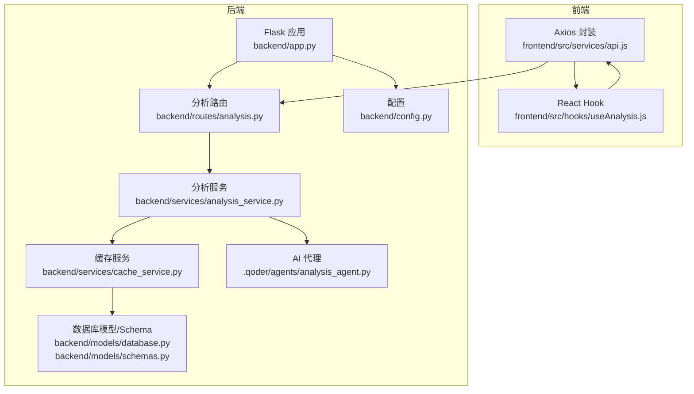
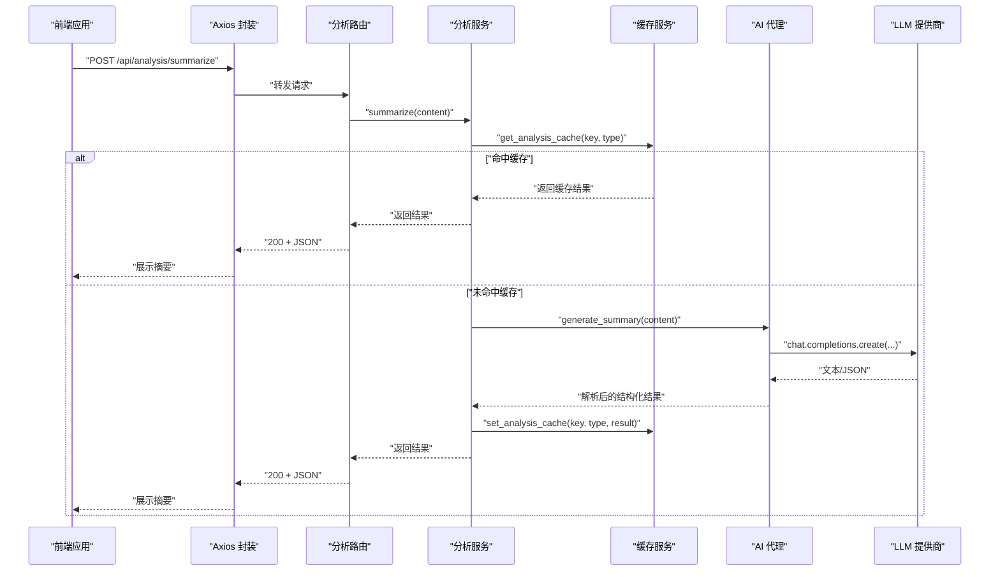
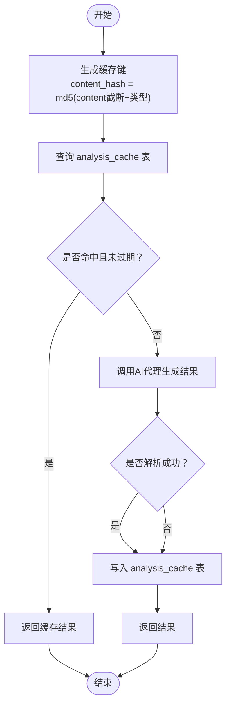
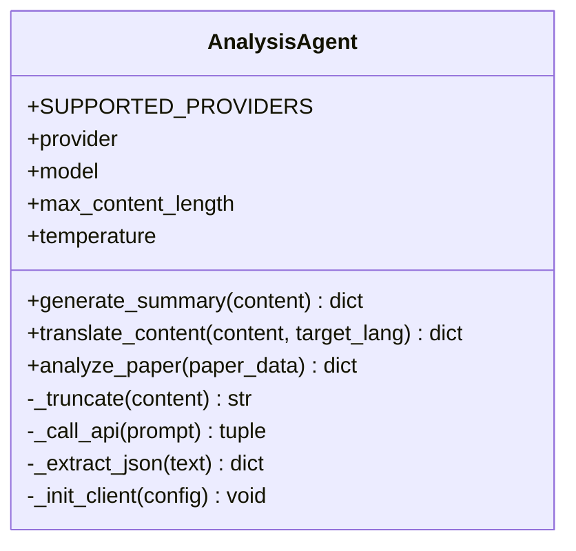
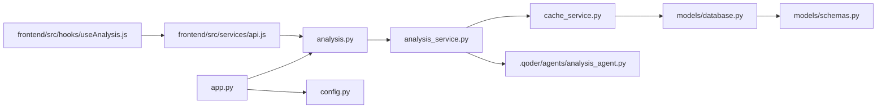

# 分析蓝图

<cite>
**本文引用的文件**
- [backend/routes/analysis.py](file://backend/routes/analysis.py)
- [backend/services/analysis_service.py](file://backend/services/analysis_service.py)
- [backend/services/cache_service.py](file://backend/services/cache_service.py)
- [.qoder/agents/analysis_agent.py](file://.qoder/agents/analysis_agent.py)
- [backend/models/schemas.py](file://backend/models/schemas.py)
- [backend/models/database.py](file://backend/models/database.py)
- [backend/app.py](file://backend/app.py)
- [backend/config.py](file://backend/config.py)
- [frontend/src/services/api.js](file://frontend/src/services/api.js)
- [frontend/src/hooks/useAnalysis.js](file://frontend/src/hooks/useAnalysis.js)
- [README.md](file://README.md)
</cite>

## 目录
1. [简介](#简介)
2. [项目结构](#项目结构)
3. [核心组件](#核心组件)
4. [架构总览](#架构总览)
5. [详细组件分析](#详细组件分析)
6. [依赖分析](#依赖分析)
7. [性能考量](#性能考量)
8. [故障排查指南](#故障排查指南)
9. [结论](#结论)
10. [附录](#附录)

## 简介
本文件系统化梳理“AI内容分析”相关路由与服务实现，覆盖摘要生成、文本翻译、论文分析三大功能端点；阐明分析服务的调用机制、AI代理系统的集成方式、结果缓存策略；并给出请求格式、参数要求、响应结构与错误处理机制。文档还提供实际API调用示例与最佳实践，帮助开发者与使用者高效、稳定地使用分析能力。

## 项目结构
后端采用Flask微服务架构，API路由集中在analysis蓝图中，业务逻辑由analysis_service封装，AI代理位于.qoder/agents目录，数据库表结构由models/schemas定义，SQLite连接通过models/database统一管理。前端通过Axios封装的api.js调用后端分析接口。

图表来源
- [backend/app.py](file://backend/app.py#L21-L78)
- [backend/routes/analysis.py](file://backend/routes/analysis.py#L1-L66)
- [backend/services/analysis_service.py](file://backend/services/analysis_service.py#L1-L91)
- [backend/services/cache_service.py](file://backend/services/cache_service.py#L1-L104)
- [backend/models/database.py](file://backend/models/database.py#L1-L51)
- [backend/models/schemas.py](file://backend/models/schemas.py#L1-L38)
- [.qoder/agents/analysis_agent.py](file://.qoder/agents/analysis_agent.py#L1-L211)
- [frontend/src/services/api.js](file://frontend/src/services/api.js#L1-L32)
- [frontend/src/hooks/useAnalysis.js](file://frontend/src/hooks/useAnalysis.js#L1-L86)

章节来源
- [backend/app.py](file://backend/app.py#L21-L78)
- [backend/routes/analysis.py](file://backend/routes/analysis.py#L1-L66)
- [backend/services/analysis_service.py](file://backend/services/analysis_service.py#L1-L91)
- [backend/services/cache_service.py](file://backend/services/cache_service.py#L1-L104)
- [backend/models/database.py](file://backend/models/database.py#L1-L51)
- [backend/models/schemas.py](file://backend/models/schemas.py#L1-L38)
- [.qoder/agents/analysis_agent.py](file://.qoder/agents/analysis_agent.py#L1-L211)
- [frontend/src/services/api.js](file://frontend/src/services/api.js#L1-L32)
- [frontend/src/hooks/useAnalysis.js](file://frontend/src/hooks/useAnalysis.js#L1-L86)

## 核心组件
- 分析路由层：提供三个端点，分别处理摘要、翻译与论文分析，负责参数校验、异常捕获与日志记录。
- 分析服务层：封装缓存键生成、缓存读取/写入、AI代理懒加载与调用，统一返回结构。
- 缓存服务层：基于SQLite的分析缓存表，支持内容哈希键与类型维度的缓存，带过期清理。
- AI代理：封装ZhipuAI与DeepSeek客户端初始化、内容截断、提示词构造与LLM调用，支持JSON抽取。
- 数据库与Schema：定义search_cache与analysis_cache表及索引，确保查询效率与一致性。
- 前端API与Hook：统一拦截器处理错误码，封装分析调用方法，管理UI状态。

章节来源
- [backend/routes/analysis.py](file://backend/routes/analysis.py#L10-L66)
- [backend/services/analysis_service.py](file://backend/services/analysis_service.py#L25-L91)
- [backend/services/cache_service.py](file://backend/services/cache_service.py#L22-L87)
- [.qoder/agents/analysis_agent.py](file://.qoder/agents/analysis_agent.py#L18-L85)
- [backend/models/schemas.py](file://backend/models/schemas.py#L1-L38)
- [backend/models/database.py](file://backend/models/database.py#L36-L43)
- [frontend/src/services/api.js](file://frontend/src/services/api.js#L10-L29)
- [frontend/src/hooks/useAnalysis.js](file://frontend/src/hooks/useAnalysis.js#L11-L57)

## 架构总览
分析流程从HTTP请求进入，经路由层参数校验，交由分析服务进行缓存命中判断，未命中则通过AI代理调用LLM完成分析，并将结果写入缓存。前端通过Axios统一发送请求并处理错误。

图表来源
- [backend/routes/analysis.py](file://backend/routes/analysis.py#L10-L24)
- [backend/services/analysis_service.py](file://backend/services/analysis_service.py#L25-L44)
- [backend/services/cache_service.py](file://backend/services/cache_service.py#L57-L87)
- [.qoder/agents/analysis_agent.py](file://.qoder/agents/analysis_agent.py#L86-L115)

## 详细组件分析

### 路由层：分析端点
- 摘要生成：/api/analysis/summarize
  - 请求体：{"content": "..." }
  - 参数校验：content非空
  - 返回：成功返回结构化摘要与关键点；失败返回错误信息
- 文本翻译：/api/analysis/translate
  - 请求体：{"content": "...", "target_lang": "zh"|其它语言码}
  - 参数校验：content非空；target_lang默认"zh"
  - 返回：成功返回翻译文本与源语言；失败返回错误信息
- 论文分析：/api/analysis/paper
  - 请求体：{"title": "...", "abstract": "...", "snippet": "..."}
  - 参数校验：至少提供title或abstract/snippet之一
  - 返回：成功返回摘要概述、方法、创新点、结果、结论；失败返回错误信息

章节来源
- [backend/routes/analysis.py](file://backend/routes/analysis.py#L10-L66)

### 服务层：分析服务
- 摘要生成
  - 缓存键：基于content前缀与"summary"类型
  - 流程：先查缓存，命中则直接返回；未命中则调用AI代理生成摘要与关键点，再写入缓存
- 文本翻译
  - 缓存键：基于content前缀与"translate_{target_lang}"类型
  - 流程：同摘要，但返回翻译文本与源语言字段
- 论文分析
  - 缓存键：基于标题与摘要/片段拼接后的前缀与"paper_analysis"类型
  - 流程：同上，返回论文五要素

章节来源
- [backend/services/analysis_service.py](file://backend/services/analysis_service.py#L25-L91)

### 缓存层：分析缓存策略
- 缓存键生成
  - content前2000字符截断后与分析类型拼接，MD5哈希作为content_hash
- 读取与写入
  - 读取：根据content_hash与analysis_type查询，若存在且未过期则返回
  - 写入：将结果JSON序列化后写入analysis_cache表
- 过期策略
  - 分析缓存7天有效期，过期自动清理
- 清理任务
  - 提供清理过期缓存的函数，定期调用可维护数据库整洁

图表来源
- [backend/services/cache_service.py](file://backend/services/cache_service.py#L22-L87)

章节来源
- [backend/services/cache_service.py](file://backend/services/cache_service.py#L11-L104)
- [backend/models/schemas.py](file://backend/models/schemas.py#L19-L26)

### AI代理：LLM集成与提示词
- 支持提供商：zhipu（默认）、deepseek
- 模型选择：根据provider读取对应模型名
- 初始化：依据配置加载API Key，初始化对应SDK客户端
- 内容截断：默认最大长度4000字符，避免超出上下文
- 提示词设计：
  - 摘要：要求输出JSON，包含summary与key_points
  - 翻译：要求准确翻译，保留专业术语并在括号中标注英文原文
  - 论文：要求输出JSON，包含abstract_summary、method、innovation、results、conclusion
- JSON抽取：支持直接JSON、代码块包裹JSON与裸JSON三种形式的抽取

图表来源
- [.qoder/agents/analysis_agent.py](file://.qoder/agents/analysis_agent.py#L13-L211)

章节来源
- [.qoder/agents/analysis_agent.py](file://.qoder/agents/analysis_agent.py#L18-L85)
- [.qoder/agents/analysis_agent.py](file://.qoder/agents/analysis_agent.py#L86-L185)

### 数据库与Schema
- 表结构
  - analysis_cache：content_hash、analysis_type、result、timestamp
  - 索引：idx_analysis_cache_hash(content_hash)
- 初始化：应用启动时创建表与索引
- 连接管理：线程本地连接、WAL模式、超时与外键开启

章节来源
- [backend/models/schemas.py](file://backend/models/schemas.py#L19-L26)
- [backend/models/database.py](file://backend/models/database.py#L36-L43)

### 前端集成：API调用与错误处理
- Axios拦截器：统一处理429、5xx、400等错误码，超时与网络错误提示
- useAnalysis Hook：封装三个分析方法（summarize、translate、analyzePaper），管理loading、可见性与结果合并
- 调用示例：详见“附录”的“API调用示例”

章节来源
- [frontend/src/services/api.js](file://frontend/src/services/api.js#L10-L29)
- [frontend/src/hooks/useAnalysis.js](file://frontend/src/hooks/useAnalysis.js#L11-L57)

## 依赖分析
- 路由依赖分析服务，分析服务依赖缓存服务与AI代理；缓存服务依赖数据库连接；AI代理依赖配置；应用注册蓝图并初始化数据库。

图表来源
- [backend/routes/analysis.py](file://backend/routes/analysis.py#L1-L7)
- [backend/services/analysis_service.py](file://backend/services/analysis_service.py#L1-L10)
- [backend/services/cache_service.py](file://backend/services/cache_service.py#L1-L8)
- [backend/models/database.py](file://backend/models/database.py#L1-L6)
- [backend/models/schemas.py](file://backend/models/schemas.py#L1-L38)
- [backend/app.py](file://backend/app.py#L12-L39)
- [backend/config.py](file://backend/config.py#L15-L84)
- [frontend/src/services/api.js](file://frontend/src/services/api.js#L1-L8)
- [frontend/src/hooks/useAnalysis.js](file://frontend/src/hooks/useAnalysis.js#L1-L3)

章节来源
- [backend/routes/analysis.py](file://backend/routes/analysis.py#L1-L7)
- [backend/services/analysis_service.py](file://backend/services/analysis_service.py#L1-L10)
- [backend/services/cache_service.py](file://backend/services/cache_service.py#L1-L8)
- [backend/models/database.py](file://backend/models/database.py#L1-L6)
- [backend/models/schemas.py](file://backend/models/schemas.py#L1-L38)
- [backend/app.py](file://backend/app.py#L12-L39)
- [backend/config.py](file://backend/config.py#L15-L84)
- [frontend/src/services/api.js](file://frontend/src/services/api.js#L1-L8)
- [frontend/src/hooks/useAnalysis.js](file://frontend/src/hooks/useAnalysis.js#L1-L3)

## 性能考量
- 缓存命中率：通过内容哈希+类型维度的缓存键提升复用率；分析缓存7天有效期，降低重复调用LLM成本。
- 内容截断：默认最大长度4000字符，避免超长输入导致延迟与费用增加。
- 并发与连接：数据库使用线程本地连接与WAL模式，减少锁竞争；前端请求超时60秒，避免长时间占用。
- 代理与重试：README中提到搜索侧具备重试机制，分析侧建议在调用方或网关层补充指数退避重试，避免瞬时失败放大。
- 日志与可观测：全局错误处理器与各模块日志记录，便于定位性能瓶颈与异常。

## 故障排查指南
- AI代理初始化失败
  - 现象：返回“API key not configured or client initialization failed”
  - 排查：确认.env中的ZHIPU_API_KEY或DEEPSEEK_API_KEY已正确设置；检查provider与model配置
- LLM调用异常
  - 现象：返回“API call failed: ...”
  - 排查：检查网络连通性、代理配置；查看后端日志；必要时启用更宽松的超时
- 缓存未生效
  - 现象：相同输入重复请求均未命中缓存
  - 排查：确认content_hash生成一致（截断长度与类型）；检查analysis_cache表是否存在；确认时间戳未过期
- 前端错误提示
  - 429：请求过于频繁，建议前端做节流或重试退避
  - 5xx：服务器内部错误，查看后端日志
  - 400：请求参数错误，检查content/target_lang/title/abstract/snippet是否满足要求

章节来源
- [.qoder/agents/analysis_agent.py](file://.qoder/agents/analysis_agent.py#L34-L61)
- [.qoder/agents/analysis_agent.py](file://.qoder/agents/analysis_agent.py#L68-L84)
- [backend/services/cache_service.py](file://backend/services/cache_service.py#L57-L87)
- [frontend/src/services/api.js](file://frontend/src/services/api.js#L10-L29)

## 结论
该分析蓝图以清晰的分层架构实现了摘要、翻译与论文分析三大能力：路由层负责契约与异常，服务层负责缓存与代理编排，缓存层与数据库层保障性能与持久化，前端通过统一拦截器与Hook提升可用性。通过合理的缓存策略与LLM集成，系统在准确性与稳定性之间取得平衡，适合在学术与内容场景中规模化使用。

## 附录

### API定义与调用示例
- 摘要生成
  - 方法与路径：POST /api/analysis/summarize
  - 请求体
    - content: 字符串，必填
  - 成功响应
    - summary: 字符串
    - key_points: 字符串数组
    - error: null或错误描述
  - 示例
    - curl -X POST /api/analysis/summarize -d '{"content":"示例文本..."}'
- 文本翻译
  - 方法与路径：POST /api/analysis/translate
  - 请求体
    - content: 字符串，必填
    - target_lang: 字符串，默认"zh"
  - 成功响应
    - translated_text: 字符串
    - source_lang: 字符串
    - error: null或错误描述
  - 示例
    - curl -X POST /api/analysis/translate -d '{"content":"Example text...","target_lang":"de"}'
- 论文分析
  - 方法与路径：POST /api/analysis/paper
  - 请求体
    - title: 字符串
    - abstract: 字符串
    - snippet: 字符串
  - 至少提供title或abstract/snippet之一
  - 成功响应
    - abstract_summary: 字符串
    - method: 字符串
    - innovation: 字符串
    - results: 字符串
    - conclusion: 字符串
    - error: null或错误描述
  - 示例
    - curl -X POST /api/analysis/paper -d '{"title":"Transformer","abstract":"We introduce..."}'

章节来源
- [backend/routes/analysis.py](file://backend/routes/analysis.py#L10-L66)
- [README.md](file://README.md#L250-L258)

### 最佳实践
- 控制输入长度：尽量将content控制在4000字符以内，避免截断与成本上升
- 复用缓存：对相同内容的多次分析应利用缓存，减少LLM调用
- 错误降级：在网络不稳定时，优先返回缓存或简化提示词
- 参数校验：前端与后端均需校验必填字段，避免无效请求
- 日志与监控：结合后端日志与前端消息提示，持续优化用户体验