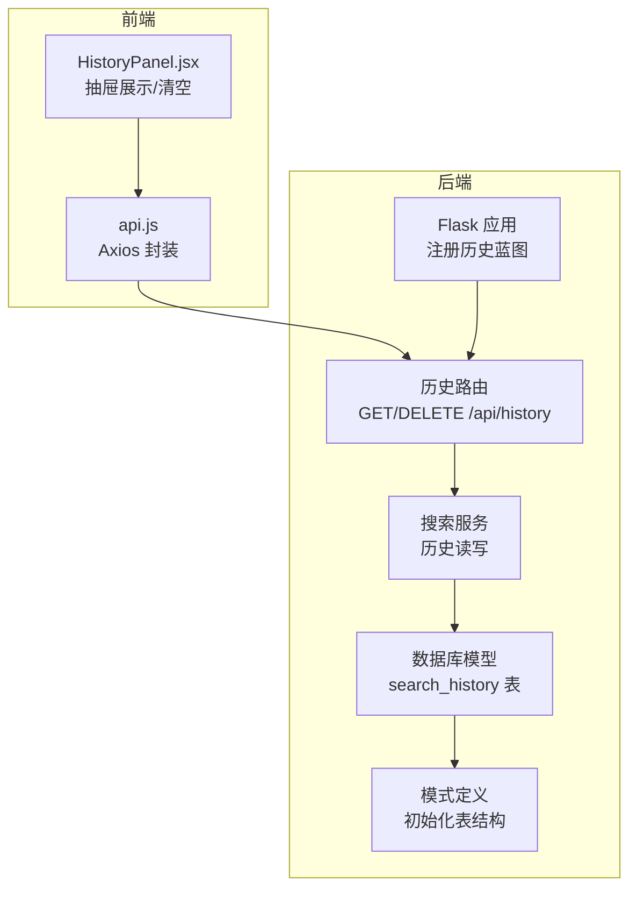
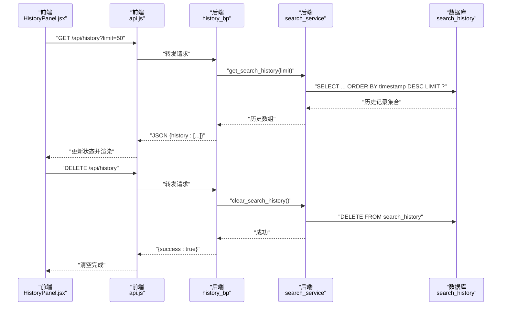
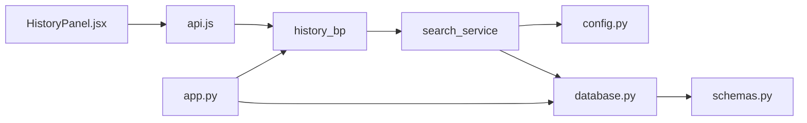

# 历史蓝图

<cite>
**本文引用的文件**
- [backend/routes/history.py](file://backend/routes/history.py)
- [backend/services/search_service.py](file://backend/services/search_service.py)
- [backend/models/schemas.py](file://backend/models/schemas.py)
- [backend/models/database.py](file://backend/models/database.py)
- [backend/app.py](file://backend/app.py)
- [backend/config.py](file://backend/config.py)
- [backend/utils/logger.py](file://backend/utils/logger.py)
- [frontend/src/components/HistoryPanel.jsx](file://frontend/src/components/HistoryPanel.jsx)
- [frontend/src/services/api.js](file://frontend/src/services/api.js)
- [README.md](file://README.md)
</cite>

## 目录
1. [简介](#简介)
2. [项目结构](#项目结构)
3. [核心组件](#核心组件)
4. [架构总览](#架构总览)
5. [详细组件分析](#详细组件分析)
6. [依赖关系分析](#依赖关系分析)
7. [性能考量](#性能考量)
8. [故障排查指南](#故障排查指南)
9. [结论](#结论)
10. [附录](#附录)

## 简介
“历史蓝图”聚焦于搜索历史管理的完整实现，涵盖历史记录的查询、清空、持久化与前端展示，以及与缓存系统的协同工作。本文档将系统性阐述：
- 历史记录的数据结构与存储机制
- 查询与清空的历史接口与前端交互流程
- 历史数据的生命周期、清理策略与隐私保护
- 批量处理能力与性能优化方案
- 历史数据迁移与备份恢复实践

## 项目结构
后端采用 Flask 蓝图组织 API，历史相关逻辑集中在 history 蓝图；历史记录持久化依赖 SQLite 表 search_history；前端通过 HistoryPanel 展示与交互。

图表来源
- [backend/app.py](file://backend/app.py#L35-L39)
- [backend/routes/history.py](file://backend/routes/history.py#L1-L32)
- [backend/services/search_service.py](file://backend/services/search_service.py#L82-L97)
- [backend/models/schemas.py](file://backend/models/schemas.py#L1-L37)
- [frontend/src/components/HistoryPanel.jsx](file://frontend/src/components/HistoryPanel.jsx#L1-L90)
- [frontend/src/services/api.js](file://frontend/src/services/api.js#L1-L32)

章节来源
- [backend/app.py](file://backend/app.py#L21-L67)
- [backend/routes/history.py](file://backend/routes/history.py#L1-L32)
- [backend/services/search_service.py](file://backend/services/search_service.py#L82-L97)
- [backend/models/schemas.py](file://backend/models/schemas.py#L1-L37)
- [frontend/src/components/HistoryPanel.jsx](file://frontend/src/components/HistoryPanel.jsx#L1-L90)
- [frontend/src/services/api.js](file://frontend/src/services/api.js#L1-L32)

## 核心组件
- 历史路由层：提供 GET /api/history（分页/限制）、DELETE /api/history（清空）两个接口，负责参数校验与异常处理。
- 搜索服务层：封装历史读取与清空逻辑，并在每次搜索完成后写入历史记录。
- 数据库层：SQLite 表 search_history 存储历史记录；数据库连接采用线程局部连接与 WAL 模式提升并发与可靠性。
- 前端组件：HistoryPanel.jsx 展示历史列表、加载状态、清空确认与点击回放搜索。

章节来源
- [backend/routes/history.py](file://backend/routes/history.py#L10-L32)
- [backend/services/search_service.py](file://backend/services/search_service.py#L82-L97)
- [backend/models/database.py](file://backend/models/database.py#L11-L50)
- [backend/models/schemas.py](file://backend/models/schemas.py#L1-L8)
- [frontend/src/components/HistoryPanel.jsx](file://frontend/src/components/HistoryPanel.jsx#L8-L40)

## 架构总览
历史蓝图的端到端流程如下：
- 前端点击“历史”按钮，打开抽屉并拉取历史。
- 前端通过 api.js 发起 GET /api/history，携带 limit 参数。
- 后端路由 history_bp 调用搜索服务 get_search_history(limit)，从 search_history 表按时间倒序查询。
- 搜索服务通过数据库连接执行 SQL 并返回 JSON。
- 前端渲染历史列表；用户可点击某条记录进行二次搜索。
- 用户可清空历史，前端发起 DELETE /api/history，后端调用 clear_search_history 删除表中全部记录。

图表来源
- [frontend/src/components/HistoryPanel.jsx](file://frontend/src/components/HistoryPanel.jsx#L12-L35)
- [frontend/src/services/api.js](file://frontend/src/services/api.js#L4-L8)
- [backend/routes/history.py](file://backend/routes/history.py#L10-L32)
- [backend/services/search_service.py](file://backend/services/search_service.py#L82-L97)

## 详细组件分析

### 历史路由与接口
- GET /api/history
  - 参数：limit（默认 20，最小 1，最大 100）
  - 返回：JSON 对象包含历史数组
  - 异常：捕获并记录错误，返回 500
- DELETE /api/history
  - 行为：清空 search_history 表
  - 返回：JSON 对象包含 success 字段
  - 异常：捕获并记录错误，返回 500

章节来源
- [backend/routes/history.py](file://backend/routes/history.py#L10-L32)

### 搜索服务中的历史读写
- get_search_history(limit)
  - 使用数据库连接执行 SQL，按时间倒序取前 N 条
  - 返回字典列表，便于序列化
- clear_search_history()
  - 删除 search_history 表全部记录
  - 记录日志
- 搜索完成后写入历史
  - 在搜索主流程中调用 _save_history，插入 query、filters、result_count
  - 过滤异常不影响主流程

章节来源
- [backend/services/search_service.py](file://backend/services/search_service.py#L82-L97)
- [backend/services/search_service.py](file://backend/services/search_service.py#L70-L80)

### 数据模型与存储机制
- 表结构：search_history
  - 字段：id（自增主键）、query（文本）、filters（JSON，默认 {}）、result_count（整数）、timestamp（时间戳，默认当前时间）
- 初始化：应用启动时执行 init_db，创建表与索引
- 连接管理：线程局部连接、WAL 模式、超时与外键开启
- 前端展示：前端组件按时间字符串截断显示，展示查询词与结果数量

章节来源
- [backend/models/schemas.py](file://backend/models/schemas.py#L1-L8)
- [backend/models/database.py](file://backend/models/database.py#L36-L43)
- [backend/models/database.py](file://backend/models/database.py#L11-L21)
- [frontend/src/components/HistoryPanel.jsx](file://frontend/src/components/HistoryPanel.jsx#L78-L82)

### 前端交互与用户体验
- 抽屉组件：宽度 360，标题“搜索历史”，空状态“暂无搜索历史”
- 加载状态：拉取历史时显示加载
- 清空确认：弹出确认对话框，确认后删除并刷新列表
- 回放搜索：点击历史项触发 onSearch 回调并关闭抽屉

章节来源
- [frontend/src/components/HistoryPanel.jsx](file://frontend/src/components/HistoryPanel.jsx#L42-L90)

### 日志与错误处理
- 路由层与服务层均使用统一 logger，输出格式包含时间、级别、名称与消息
- 路由层对异常进行捕获并返回 JSON 错误信息
- 服务层对历史写入异常进行告警但不中断搜索流程

章节来源
- [backend/utils/logger.py](file://backend/utils/logger.py#L5-L22)
- [backend/routes/history.py](file://backend/routes/history.py#L19-L21)
- [backend/services/search_service.py](file://backend/services/search_service.py#L78-L79)

## 依赖关系分析
历史蓝图涉及的关键依赖链路如下：
- 前端组件依赖 api.js 的 Axios 实例
- api.js 依赖 baseURL 为 /api 的配置
- 历史路由依赖搜索服务提供的 get_search_history/clear_search_history
- 搜索服务依赖数据库连接与配置
- 应用启动时初始化数据库并注册蓝图

图表来源
- [frontend/src/components/HistoryPanel.jsx](file://frontend/src/components/HistoryPanel.jsx#L1-L90)
- [frontend/src/services/api.js](file://frontend/src/services/api.js#L4-L8)
- [backend/routes/history.py](file://backend/routes/history.py#L1-L32)
- [backend/services/search_service.py](file://backend/services/search_service.py#L1-L13)
- [backend/config.py](file://backend/config.py#L80-L84)
- [backend/models/database.py](file://backend/models/database.py#L36-L43)
- [backend/models/schemas.py](file://backend/models/schemas.py#L1-L37)
- [backend/app.py](file://backend/app.py#L35-L39)

章节来源
- [backend/app.py](file://backend/app.py#L21-L67)
- [backend/routes/history.py](file://backend/routes/history.py#L1-L32)
- [backend/services/search_service.py](file://backend/services/search_service.py#L1-L13)
- [backend/models/database.py](file://backend/models/database.py#L36-L43)
- [backend/models/schemas.py](file://backend/models/schemas.py#L1-L37)
- [frontend/src/services/api.js](file://frontend/src/services/api.js#L4-L8)
- [frontend/src/components/HistoryPanel.jsx](file://frontend/src/components/HistoryPanel.jsx#L1-L90)

## 性能考量
- 查询限制
  - limit 默认 20，范围限制在 1~100，避免一次性返回大量历史导致前端卡顿与网络压力
- 数据库优化
  - 使用线程局部连接与 WAL 模式，提升并发读写稳定性
  - 历史表未显式创建索引，按时间倒序查询通常依赖主键索引；如历史规模增长，可考虑在 timestamp 上增加索引以优化排序
- 前端体验
  - 抽屉宽度固定，列表懒加载与空状态提示，减少不必要的 DOM 渲染
- 缓存协同
  - 历史查询与搜索缓存相互独立，历史查询走数据库直连，避免缓存污染

章节来源
- [backend/routes/history.py](file://backend/routes/history.py#L13-L14)
- [backend/models/database.py](file://backend/models/database.py#L11-L21)
- [frontend/src/components/HistoryPanel.jsx](file://frontend/src/components/HistoryPanel.jsx#L42-L90)

## 故障排查指南
- 历史查询失败
  - 检查后端日志是否出现异常堆栈
  - 确认数据库连接可用与表存在
- 清空历史无效
  - 确认前端是否正确发送 DELETE 请求
  - 检查后端日志是否记录“Search history cleared”
- 前端无法显示历史
  - 检查 /api 基础路径与跨域设置
  - 确认前端组件是否正确接收并渲染数据
- 数据库路径与权限
  - 确认 DATABASE_PATH 指向可写目录
  - 启动时 init_db 是否成功创建表

章节来源
- [backend/routes/history.py](file://backend/routes/history.py#L19-L21)
- [backend/services/search_service.py](file://backend/services/search_service.py#L96-L97)
- [backend/models/database.py](file://backend/models/database.py#L36-L43)
- [backend/app.py](file://backend/app.py#L32-L33)
- [frontend/src/services/api.js](file://frontend/src/services/api.js#L4-L8)
- [frontend/src/components/HistoryPanel.jsx](file://frontend/src/components/HistoryPanel.jsx#L12-L22)

## 结论
历史蓝图以简洁清晰的方式实现了搜索历史的查询与清空，结合 SQLite 的轻量特性与前端抽屉交互，提供了良好的用户体验。未来可在历史规模扩大时引入更精细的索引与分页策略，并考虑定期清理过期历史以维持系统性能与隐私合规。

## 附录

### 历史数据结构与字段说明
- 表名：search_history
- 字段
  - id：自增主键
  - query：搜索关键词
  - filters：过滤条件（JSON，默认空对象）
  - result_count：本次搜索结果总数
  - timestamp：记录时间（默认当前时间）

章节来源
- [backend/models/schemas.py](file://backend/models/schemas.py#L2-L8)

### 查询与清空接口定义
- GET /api/history
  - 查询参数：limit（整数，默认 20，范围 1~100）
  - 返回：包含历史数组的 JSON 对象
- DELETE /api/history
  - 行为：清空历史记录
  - 返回：包含 success 字段的 JSON 对象

章节来源
- [backend/routes/history.py](file://backend/routes/history.py#L10-L32)
- [README.md](file://README.md#L269-L274)

### 生命周期与清理策略
- 生命周期
  - 写入：每次搜索完成后写入历史
  - 查询：按时间倒序取前 limit 条
  - 清理：支持一次性清空
- 清理策略
  - 当前实现为全表删除
  - 建议：可扩展为基于时间窗口的清理（例如保留最近 30 天）

章节来源
- [backend/services/search_service.py](file://backend/services/search_service.py#L63-L64)
- [backend/services/search_service.py](file://backend/services/search_service.py#L82-L97)

### 隐私保护措施
- 历史记录仅包含关键词、过滤条件与结果数量，不包含具体结果详情
- 建议：如需进一步增强隐私，可在前端或后端对 query 进行脱敏处理或提供用户开关

章节来源
- [backend/models/schemas.py](file://backend/models/schemas.py#L2-L8)

### 批量处理与性能优化
- 批量处理
  - 历史查询支持 limit 控制单次返回量
  - 清空为单次事务删除
- 性能优化
  - 建议：为 timestamp 增加索引以优化排序
  - 建议：前端分页加载或虚拟滚动以降低渲染压力

章节来源
- [backend/routes/history.py](file://backend/routes/history.py#L13-L14)
- [backend/models/schemas.py](file://backend/models/schemas.py#L1-L8)
- [frontend/src/components/HistoryPanel.jsx](file://frontend/src/components/HistoryPanel.jsx#L62-L86)

### 历史数据迁移与备份恢复
- 备份
  - 备份 SQLite 数据库文件（默认 data/search.db）
- 恢复
  - 停止服务，替换数据库文件，重启服务
- 迁移
  - 若需变更表结构，先导出旧数据，再创建新表，最后导入数据
  - 建议：在迁移前后记录版本号与迁移脚本，确保可回滚

章节来源
- [backend/config.py](file://backend/config.py#L35-L36)
- [backend/models/database.py](file://backend/models/database.py#L36-L43)