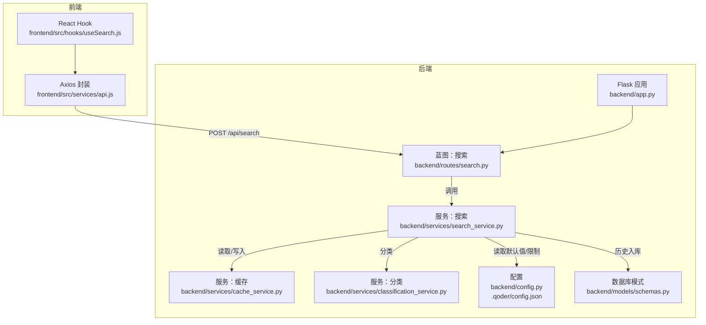
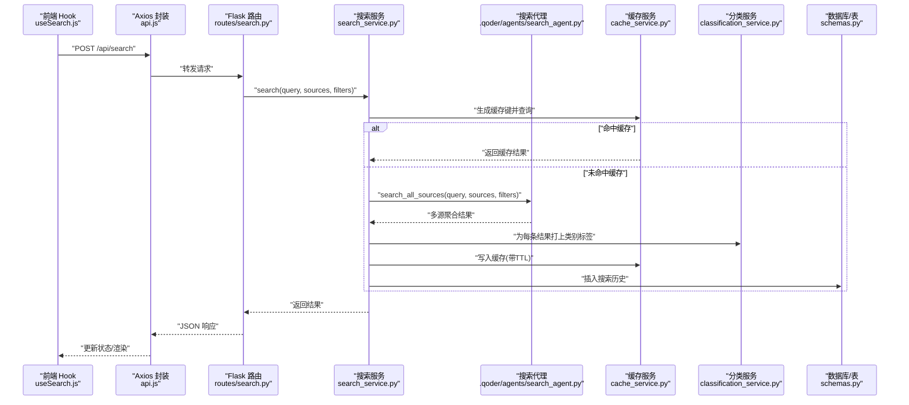
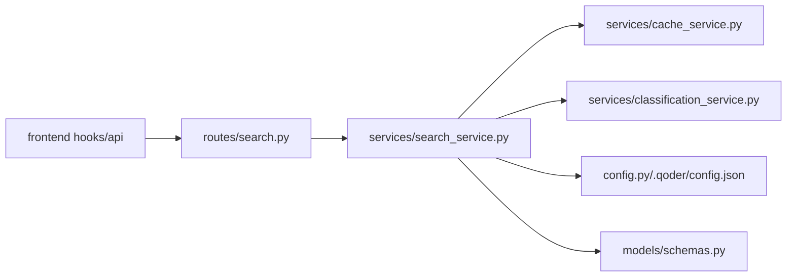

# 搜索蓝图

<cite>
**本文引用的文件**
- [backend/routes/search.py](file://backend/routes/search.py)
- [backend/services/search_service.py](file://backend/services/search_service.py)
- [backend/services/cache_service.py](file://backend/services/cache_service.py)
- [backend/services/classification_service.py](file://backend/services/classification_service.py)
- [backend/config.py](file://backend/config.py)
- [backend/models/schemas.py](file://backend/models/schemas.py)
- [backend/app.py](file://backend/app.py)
- [.qoder/config.json](file://.qoder/config.json)
- [frontend/src/hooks/useSearch.js](file://frontend/src/hooks/useSearch.js)
- [frontend/src/services/api.js](file://frontend/src/services/api.js)
</cite>

## 目录
1. [简介](#简介)
2. [项目结构](#项目结构)
3. [核心组件](#核心组件)
4. [架构总览](#架构总览)
5. [详细组件分析](#详细组件分析)
6. [依赖关系分析](#依赖关系分析)
7. [性能考虑](#性能考虑)
8. [故障排查指南](#故障排查指南)
9. [结论](#结论)
10. [附录：API 使用示例与规范](#附录api-使用示例与规范)

## 简介
本文件围绕后端“搜索蓝图”进行系统化文档化，重点覆盖以下方面：
- /api/search 路由的实现机制：POST 请求处理、JSON 参数解析、查询校验与错误处理
- 多源搜索服务的集成：数据源选择、参数传递、结果聚合与分类
- 搜索服务调用流程、异常处理策略与性能优化（缓存、分类、历史记录）
- 完整的 API 使用示例：请求参数、响应结构、常见错误场景

## 项目结构
后端采用 Flask 蓝图组织路由，搜索相关逻辑集中在 routes/search.py 与 services/search_service.py；前端通过 React Hook 与 Axios 封装的 API 客户端发起请求。

图表来源
- [backend/app.py](file://backend/app.py#L21-L67)
- [backend/routes/search.py](file://backend/routes/search.py#L1-L28)
- [backend/services/search_service.py](file://backend/services/search_service.py#L1-L98)
- [backend/services/cache_service.py](file://backend/services/cache_service.py#L1-L104)
- [backend/services/classification_service.py](file://backend/services/classification_service.py#L1-L64)
- [backend/config.py](file://backend/config.py#L1-L85)
- [backend/models/schemas.py](file://backend/models/schemas.py#L1-L38)
- [frontend/src/hooks/useSearch.js](file://frontend/src/hooks/useSearch.js#L1-L74)
- [frontend/src/services/api.js](file://frontend/src/services/api.js#L1-L32)

章节来源
- [backend/app.py](file://backend/app.py#L21-L67)
- [backend/routes/search.py](file://backend/routes/search.py#L1-L28)
- [backend/services/search_service.py](file://backend/services/search_service.py#L1-L98)
- [backend/services/cache_service.py](file://backend/services/cache_service.py#L1-L104)
- [backend/services/classification_service.py](file://backend/services/classification_service.py#L1-L64)
- [backend/config.py](file://backend/config.py#L1-L85)
- [backend/models/schemas.py](file://backend/models/schemas.py#L1-L38)
- [frontend/src/hooks/useSearch.js](file://frontend/src/hooks/useSearch.js#L1-L74)
- [frontend/src/services/api.js](file://frontend/src/services/api.js#L1-L32)

## 核心组件
- 路由层：负责接收 /api/search 的 POST 请求，解析 JSON，执行基本校验，并将请求委派给服务层。
- 服务层：统一协调缓存、多源搜索、结果分类、历史记录与缓存写入。
- 缓存层：基于 SQLite 的简单键值缓存，支持 TTL 过期控制与清理。
- 分类层：根据 URL 或来源对结果进行内容类别标注。
- 配置层：集中管理搜索默认值、限流、下载与分析设置等。
- 前端 Hook：封装搜索调用、状态管理与客户端过滤。

章节来源
- [backend/routes/search.py](file://backend/routes/search.py#L10-L27)
- [backend/services/search_service.py](file://backend/services/search_service.py#L28-L67)
- [backend/services/cache_service.py](file://backend/services/cache_service.py#L30-L52)
- [backend/services/classification_service.py](file://backend/services/classification_service.py#L30-L63)
- [backend/config.py](file://backend/config.py#L53-L59)
- [.qoder/config.json](file://.qoder/config.json#L8-L13)
- [frontend/src/hooks/useSearch.js](file://frontend/src/hooks/useSearch.js#L19-L50)

## 架构总览
下图展示从浏览器到后端服务的整体调用链路与职责分工。

图表来源
- [frontend/src/hooks/useSearch.js](file://frontend/src/hooks/useSearch.js#L19-L50)
- [frontend/src/services/api.js](file://frontend/src/services/api.js#L4-L8)
- [backend/routes/search.py](file://backend/routes/search.py#L10-L27)
- [backend/services/search_service.py](file://backend/services/search_service.py#L28-L67)
- [backend/services/cache_service.py](file://backend/services/cache_service.py#L16-L52)
- [backend/services/classification_service.py](file://backend/services/classification_service.py#L30-L63)
- [backend/models/schemas.py](file://backend/models/schemas.py#L1-L38)

## 详细组件分析

### 路由层：/api/search
- 责任边界
  - 接收 POST 请求，解析 JSON
  - 基本参数校验（如 query 必填）
  - 统一异常捕获与错误响应
- 关键点
  - 若 query 缺失或为空，直接返回 400
  - 将 sources 与 filters 透传至服务层
  - 捕获异常并记录日志，返回 500

章节来源
- [backend/routes/search.py](file://backend/routes/search.py#L10-L27)

### 服务层：搜索服务
- 职责
  - 合并默认配置与用户输入
  - 缓存命中优先
  - 调用搜索代理执行多源搜索
  - 对每条结果进行分类标注
  - 写入缓存与搜索历史
- 数据结构
  - 返回结构包含：results 列表、total 总数、sources_status 状态字典
- 默认值来源
  - 来自配置模块 SEARCH_DEFAULTS，默认数据源、最大结果数、超时与缓存过期时间

章节来源
- [backend/services/search_service.py](file://backend/services/search_service.py#L28-L67)
- [backend/config.py](file://backend/config.py#L53-L59)
- [.qoder/config.json](file://.qoder/config.json#L8-L13)

### 缓存服务
- 缓存键生成
  - 基于 query、sources、filters 的序列化与哈希
- 查询与写入
  - 查询时检查过期时间
  - 写入时计算过期时间（小时级）
- 清理策略
  - 提供清理过期缓存的函数（用于后台任务）

章节来源
- [backend/services/cache_service.py](file://backend/services/cache_service.py#L16-L52)
- [backend/services/cache_service.py](file://backend/services/cache_service.py#L91-L103)

### 分类服务
- 规则
  - 优先按来源映射（如 arxiv → academic）
  - 其次按域名匹配规则集（学术、问答、博客、论坛）
  - 默认归类为 webpage
- 输出
  - 单条结果的 category 字段

章节来源
- [backend/services/classification_service.py](file://backend/services/classification_service.py#L30-L63)

### 配置与默认值
- 搜索默认值
  - max_results_per_source、timeout_seconds、cache_expire_hours、default_sources
- 限流与下载/分析设置
  - rate_limits、download_settings、analysis_settings
- 配置来源
  - .qoder/config.json 与 .env

章节来源
- [backend/config.py](file://backend/config.py#L53-L73)
- [.qoder/config.json](file://.qoder/config.json#L2-L30)

### 历史记录与数据库
- 表结构
  - search_history：id、query、filters、result_count、timestamp
  - search_cache：id、query_hash、results、timestamp、expire_at
- 写入时机
  - 每次成功搜索后写入历史记录
- 读取与清理
  - 提供查询最近历史与清空历史的接口

章节来源
- [backend/models/schemas.py](file://backend/models/schemas.py#L1-L38)
- [backend/services/search_service.py](file://backend/services/search_service.py#L70-L97)

### 前端集成
- Hook 行为
  - 维护 results、total、sourcesStatus、loading、error、query、filters
  - 发起 POST /api/search，接收并应用分类过滤
- 错误处理
  - 统一拦截器中处理 429、5xx、400、超时与网络错误

章节来源
- [frontend/src/hooks/useSearch.js](file://frontend/src/hooks/useSearch.js#L19-L50)
- [frontend/src/services/api.js](file://frontend/src/services/api.js#L10-L29)

## 依赖关系分析
- 路由依赖服务层
- 服务层依赖缓存、分类、配置与数据库
- 前端依赖路由与服务层

图表来源
- [backend/routes/search.py](file://backend/routes/search.py#L1-L28)
- [backend/services/search_service.py](file://backend/services/search_service.py#L1-L98)
- [backend/services/cache_service.py](file://backend/services/cache_service.py#L1-L104)
- [backend/services/classification_service.py](file://backend/services/classification_service.py#L1-L64)
- [backend/config.py](file://backend/config.py#L1-L85)
- [backend/models/schemas.py](file://backend/models/schemas.py#L1-L38)
- [frontend/src/hooks/useSearch.js](file://frontend/src/hooks/useSearch.js#L1-L74)
- [frontend/src/services/api.js](file://frontend/src/services/api.js#L1-L32)

## 性能考虑
- 缓存命中优先：通过缓存键避免重复请求
- 结果分类在服务层完成，减少前端重复计算
- 搜索历史写入采用轻量事务，避免阻塞主流程
- 可选的后台清理任务用于回收过期缓存
- 前端可做客户端二次过滤以降低渲染压力

章节来源
- [backend/services/search_service.py](file://backend/services/search_service.py#L44-L61)
- [backend/services/cache_service.py](file://backend/services/cache_service.py#L30-L52)
- [backend/services/search_service.py](file://backend/services/search_service.py#L70-L79)

## 故障排查指南
- 常见错误与处理
  - 400：缺少 query 或参数非法，检查请求体字段
  - 500：服务内部异常，查看后端日志定位具体环节
  - 429/500：前端拦截器已提示，注意限流与服务可用性
- 日志与可观测性
  - 路由层与服务层均记录错误上下文
  - 建议结合 Flask 全局错误处理器统一输出
- 数据一致性
  - 缓存写入与历史记录写入均在 try/except 中，失败仅记录告警

章节来源
- [backend/routes/search.py](file://backend/routes/search.py#L16-L27)
- [backend/services/search_service.py](file://backend/services/search_service.py#L70-L79)
- [frontend/src/services/api.js](file://frontend/src/services/api.js#L10-L29)

## 结论
该搜索蓝图以清晰的分层设计实现了“多源搜索 + 缓存 + 分类 + 历史”的完整闭环。路由层负责契约与校验，服务层承担编排与优化，前端负责交互与二次过滤。整体具备良好的扩展性与可维护性，适合进一步引入并发控制、更细粒度的限流与监控。

## 附录：API 使用示例与规范

### 请求
- 方法：POST
- 路径：/api/search
- Content-Type：application/json

请求体字段
- query: string，必填，搜索关键词
- sources: string[]，可选，目标数据源列表，默认来自配置
- filters: object，可选，过滤条件对象（当前服务层透传，前端示例中为空）

示例
- 基础请求
  - body: {"query":"机器学习","sources":["duckduckgo","arxiv"],"filters":{}}
- 仅关键词
  - body: {"query":"深度学习"}

章节来源
- [backend/routes/search.py](file://backend/routes/search.py#L13-L20)
- [frontend/src/hooks/useSearch.js](file://frontend/src/hooks/useSearch.js#L28-L32)

### 响应
- 成功：200，返回
  - results: array，搜索结果列表
  - total: number，总结果数
  - sources_status: object，各数据源状态统计
- 失败：400/500，返回
  - {"error": string, "detail"?: string}

示例
- 成功响应
  - {"results":[...],"total":123,"sources_status":{"duckduckgo":15,"arxiv":12}}
- 参数缺失
  - {"error":"query is required"}
- 服务异常
  - {"error":"Search failed","detail":"...异常信息..."}

章节来源
- [backend/routes/search.py](file://backend/routes/search.py#L22-L27)
- [backend/services/search_service.py](file://backend/services/search_service.py#L55-L57)

### 前端调用与过滤
- 调用方式：通过封装的 Axios 客户端发送 POST /api/search
- 客户端过滤：可按 category 在前端再次筛选
- 状态管理：loading、error、results、total、sourcesStatus

章节来源
- [frontend/src/hooks/useSearch.js](file://frontend/src/hooks/useSearch.js#L19-L50)
- [frontend/src/services/api.js](file://frontend/src/services/api.js#L4-L8)