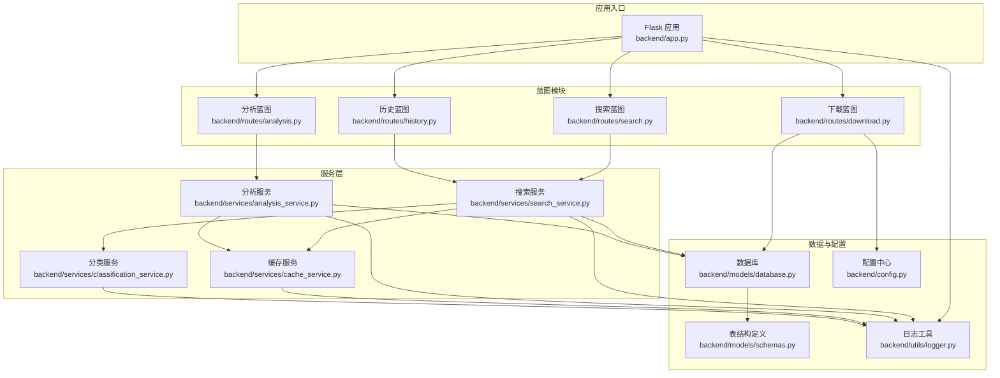
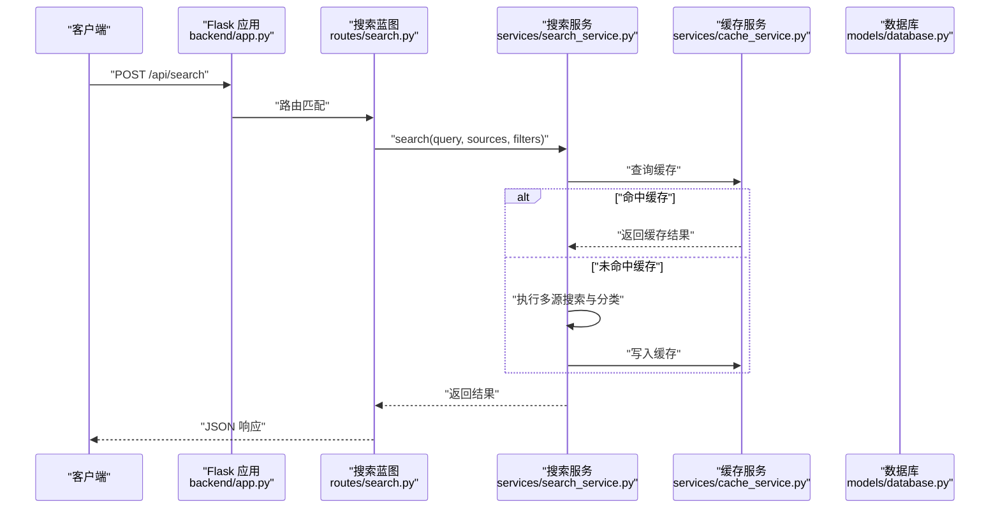
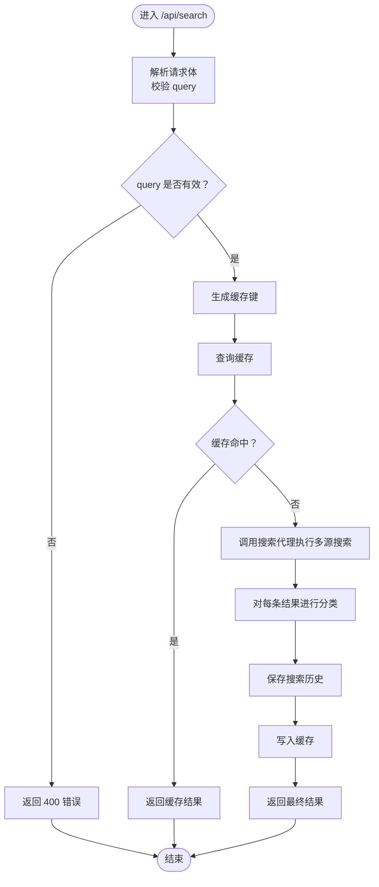
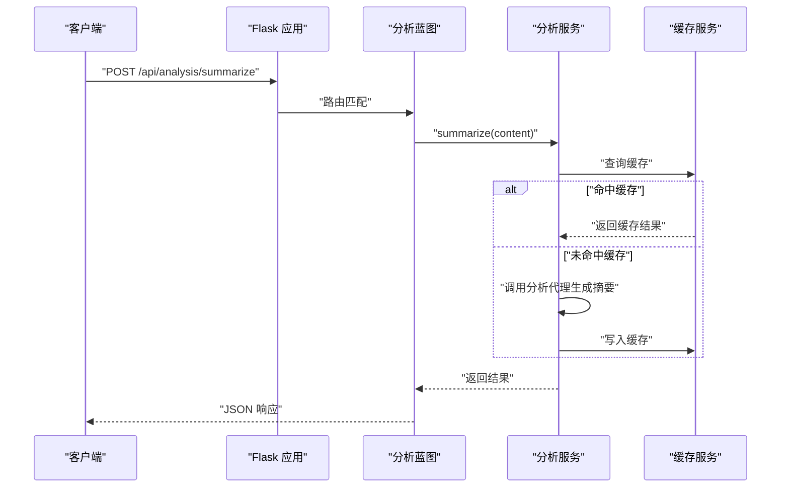
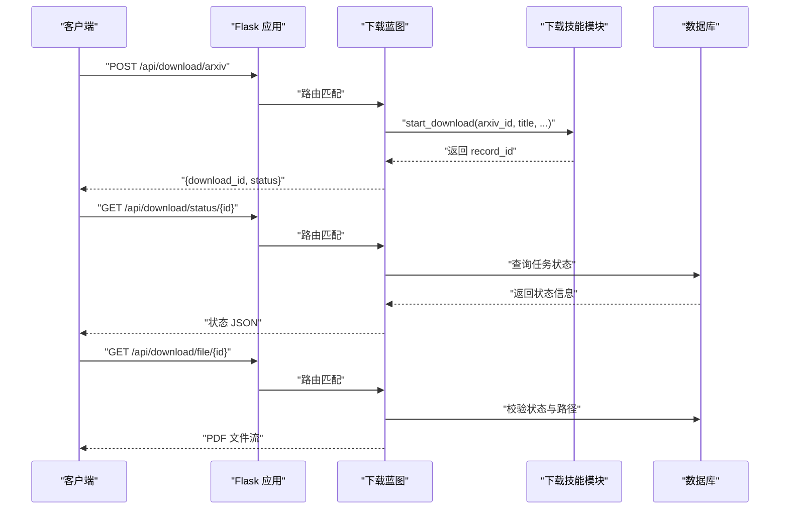
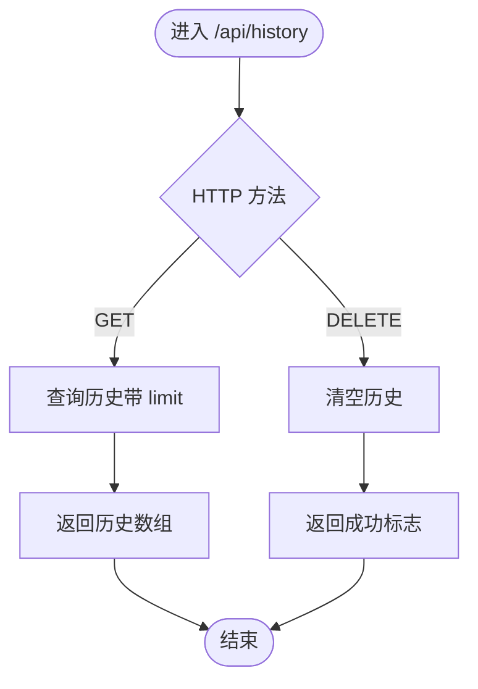
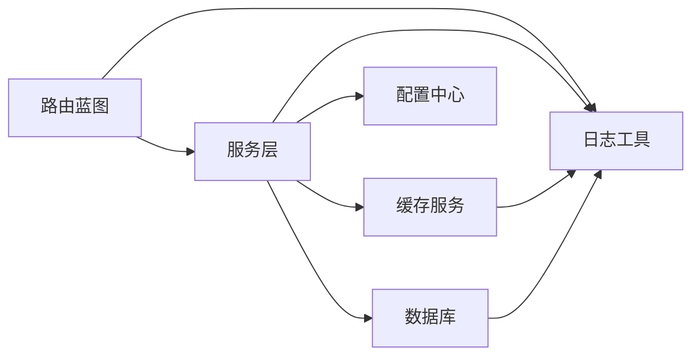

# 蓝图路由系统

<cite>
**本文档引用的文件**
- [backend/app.py](file://backend/app.py)
- [backend/routes/__init__.py](file://backend/routes/__init__.py)
- [backend/routes/search.py](file://backend/routes/search.py)
- [backend/routes/analysis.py](file://backend/routes/analysis.py)
- [backend/routes/download.py](file://backend/routes/download.py)
- [backend/routes/history.py](file://backend/routes/history.py)
- [backend/services/search_service.py](file://backend/services/search_service.py)
- [backend/services/analysis_service.py](file://backend/services/analysis_service.py)
- [backend/services/cache_service.py](file://backend/services/cache_service.py)
- [backend/services/classification_service.py](file://backend/services/classification_service.py)
- [backend/models/database.py](file://backend/models/database.py)
- [backend/models/schemas.py](file://backend/models/schemas.py)
- [backend/config.py](file://backend/config.py)
- [backend/utils/logger.py](file://backend/utils/logger.py)
- [.qoder/config.json](file://.qoder/config.json)
</cite>

## 目录
1. [简介](#简介)
2. [项目结构](#项目结构)
3. [核心组件](#核心组件)
4. [架构总览](#架构总览)
5. [详细组件分析](#详细组件分析)
6. [依赖关系分析](#依赖关系分析)
7. [性能考虑](#性能考虑)
8. [故障排除指南](#故障排除指南)
9. [结论](#结论)

## 简介
本项目采用 Flask 蓝图（Blueprint）对后端 API 进行模块化组织，围绕四大功能域构建路由体系：
- 搜索（search）：多源聚合搜索与结果分类
- 分析（analysis）：AI 内容处理（摘要、翻译、论文深度分析）
- 下载（download）：arXiv 论文下载任务的异步管理与文件分发
- 历史（history）：搜索历史的查询与清理

蓝图注册机制通过应用工厂模式集中初始化，统一设置 CORS、静态资源托管与全局异常处理；路由前缀统一为 /api/{domain}，便于前端调用与未来扩展。

## 项目结构
后端采用按功能域划分的模块化目录结构，蓝图位于 routes 子包中，业务逻辑在 services 子包中实现，数据模型与数据库初始化在 models 子包中定义，配置与日志工具分别在 config 与 utils 子包中。

图表来源
- [backend/app.py](file://backend/app.py#L21-L78)
- [backend/routes/search.py](file://backend/routes/search.py#L1-L28)
- [backend/routes/analysis.py](file://backend/routes/analysis.py#L1-L66)
- [backend/routes/download.py](file://backend/routes/download.py#L1-L98)
- [backend/routes/history.py](file://backend/routes/history.py#L1-L33)
- [backend/services/search_service.py](file://backend/services/search_service.py#L1-L98)
- [backend/services/analysis_service.py](file://backend/services/analysis_service.py#L1-L91)
- [backend/services/cache_service.py](file://backend/services/cache_service.py#L1-L104)
- [backend/services/classification_service.py](file://backend/services/classification_service.py#L1-L64)
- [backend/models/database.py](file://backend/models/database.py#L1-L51)
- [backend/models/schemas.py](file://backend/models/schemas.py#L1-L38)
- [backend/config.py](file://backend/config.py#L1-L85)
- [backend/utils/logger.py](file://backend/utils/logger.py#L1-L23)

章节来源
- [backend/app.py](file://backend/app.py#L21-L78)
- [backend/routes/__init__.py](file://backend/routes/__init__.py#L1-L1)

## 核心组件
- 应用工厂与蓝图注册：应用工厂负责创建 Flask 实例、加载配置、注册 CORS、注册四大蓝图，并提供 SPA 静态资源回退与全局异常处理。
- 路由蓝图：每个蓝图独立定义 /api/{endpoint}，职责清晰，便于扩展与测试。
- 服务层：封装业务逻辑，包括搜索聚合、AI 分析、缓存与分类等。
- 数据与缓存：SQLite 初始化与表结构定义，缓存键生成与过期控制。
- 配置中心：从 .env 与 .qoder/config.json 合并配置，支持搜索、下载、分析等默认参数。

章节来源
- [backend/app.py](file://backend/app.py#L21-L78)
- [backend/config.py](file://backend/config.py#L15-L85)
- [backend/models/schemas.py](file://backend/models/schemas.py#L1-L38)
- [backend/services/cache_service.py](file://backend/services/cache_service.py#L16-L87)

## 架构总览
蓝图路由系统采用“应用工厂 + 蓝图 + 服务层”的分层架构。应用启动时完成数据库初始化与蓝图注册，各蓝图通过服务层访问缓存与数据库，实现高内聚低耦合。

图表来源
- [backend/app.py](file://backend/app.py#L35-L39)
- [backend/routes/search.py](file://backend/routes/search.py#L10-L27)
- [backend/services/search_service.py](file://backend/services/search_service.py#L28-L67)
- [backend/services/cache_service.py](file://backend/services/cache_service.py#L30-L52)
- [backend/models/database.py](file://backend/models/database.py#L24-L34)

## 详细组件分析

### 搜索蓝图（search）
- 设计理念：统一入口处理多源聚合搜索，支持来源过滤与结果分类，结合缓存提升响应速度。
- 路由职责：
  - POST /api/search：接收查询词、来源列表与过滤器，调用搜索服务执行聚合搜索，返回结果与来源状态。
- 处理流程：
  - 参数校验与日志记录
  - 缓存命中检查
  - 多源搜索与结果分类
  - 缓存写入与历史记录保存
- 错误处理：捕获异常并记录日志，返回统一错误格式。

图表来源
- [backend/routes/search.py](file://backend/routes/search.py#L10-L27)
- [backend/services/search_service.py](file://backend/services/search_service.py#L28-L67)
- [backend/services/cache_service.py](file://backend/services/cache_service.py#L16-L52)
- [backend/services/classification_service.py](file://backend/services/classification_service.py#L30-L63)

章节来源
- [backend/routes/search.py](file://backend/routes/search.py#L1-L28)
- [backend/services/search_service.py](file://backend/services/search_service.py#L28-L67)
- [backend/services/classification_service.py](file://backend/services/classification_service.py#L30-L63)
- [backend/services/cache_service.py](file://backend/services/cache_service.py#L16-L52)

### 分析蓝图（analysis）
- 设计理念：提供内容摘要、翻译与学术论文深度分析三项 AI 能力，统一缓存策略与错误处理。
- 路由职责：
  - POST /api/analysis/summarize：生成摘要与关键要点
  - POST /api/analysis/translate：内容翻译到目标语言
  - POST /api/analysis/paper：基于标题/摘要/片段的论文分析
- 处理流程：
  - 参数校验与日志记录
  - 缓存命中检查
  - 调用分析代理生成结果
  - 缓存写入（若无错误）

图表来源
- [backend/routes/analysis.py](file://backend/routes/analysis.py#L10-L24)
- [backend/services/analysis_service.py](file://backend/services/analysis_service.py#L25-L43)
- [backend/services/cache_service.py](file://backend/services/cache_service.py#L57-L86)

章节来源
- [backend/routes/analysis.py](file://backend/routes/analysis.py#L1-L66)
- [backend/services/analysis_service.py](file://backend/services/analysis_service.py#L25-L90)
- [backend/services/cache_service.py](file://backend/services/cache_service.py#L57-L86)

### 下载蓝图（download）
- 设计理念：以任务驱动的方式管理 arXiv 论文下载，提供任务提交、状态查询与文件分发。
- 路由职责：
  - POST /api/download/arxiv：提交下载任务，返回任务 ID 与初始状态
  - GET /api/download/status/{id}：查询任务状态
  - GET /api/download/file/{id}：分发已下载 PDF 文件
  - GET /api/download/history：列出所有下载记录
- 处理流程：
  - 任务提交：校验参数，调用技能模块启动下载，持久化记录
  - 状态查询：读取数据库中的任务状态
  - 文件分发：校验状态与文件存在性后返回文件流

图表来源
- [backend/routes/download.py](file://backend/routes/download.py#L14-L97)
- [backend/models/schemas.py](file://backend/models/schemas.py#L28-L36)
- [backend/config.py](file://backend/config.py#L47-L65)

章节来源
- [backend/routes/download.py](file://backend/routes/download.py#L1-L98)
- [backend/models/schemas.py](file://backend/models/schemas.py#L28-L36)
- [backend/config.py](file://backend/config.py#L47-L65)

### 历史蓝图（history）
- 设计理念：提供搜索历史的查询与清理能力，支持限制返回数量与一次性清空。
- 路由职责：
  - GET /api/history：查询最近的历史记录（支持 limit 参数）
  - DELETE /api/history：清空所有历史记录
- 处理流程：直接调用搜索服务提供的历史查询与清理方法，保证与搜索服务一致的数据一致性。

图表来源
- [backend/routes/history.py](file://backend/routes/history.py#L10-L32)
- [backend/services/search_service.py](file://backend/services/search_service.py#L82-L97)

章节来源
- [backend/routes/history.py](file://backend/routes/history.py#L1-L33)
- [backend/services/search_service.py](file://backend/services/search_service.py#L82-L97)

## 依赖关系分析
- 蓝图到服务层：搜索蓝图依赖搜索服务；分析蓝图依赖分析服务；历史蓝图依赖搜索服务中的历史接口。
- 服务层到数据与缓存：搜索服务依赖缓存服务与分类服务，并通过数据库上下文管理事务；分析服务依赖缓存服务；缓存服务依赖数据库连接。
- 配置与日志：所有模块通过配置中心获取运行参数，使用统一日志工具输出运行信息。

图表来源
- [backend/routes/search.py](file://backend/routes/search.py#L1-L28)
- [backend/routes/analysis.py](file://backend/routes/analysis.py#L1-L66)
- [backend/routes/history.py](file://backend/routes/history.py#L1-L33)
- [backend/services/search_service.py](file://backend/services/search_service.py#L1-L98)
- [backend/services/analysis_service.py](file://backend/services/analysis_service.py#L1-L91)
- [backend/services/cache_service.py](file://backend/services/cache_service.py#L1-L104)
- [backend/models/database.py](file://backend/models/database.py#L1-L51)
- [backend/config.py](file://backend/config.py#L1-L85)
- [backend/utils/logger.py](file://backend/utils/logger.py#L1-L23)

章节来源
- [backend/app.py](file://backend/app.py#L12-L39)
- [backend/config.py](file://backend/config.py#L15-L85)
- [backend/models/database.py](file://backend/models/database.py#L24-L34)
- [backend/services/cache_service.py](file://backend/services/cache_service.py#L1-L104)

## 性能考虑
- 缓存策略：搜索与分析均实现缓存键生成与过期控制，减少重复计算与外部调用开销；缓存清理定时任务避免存储膨胀。
- 数据库优化：线程本地连接、WAL 模式、超时与外键约束配置提升并发与稳定性。
- 配置优先级：.env 与 .qoder/config.json 双重配置合并，支持运行时调整默认行为（如搜索来源、缓存时长、下载并发数等）。
- 日志与监控：统一日志格式，便于问题定位与性能观测。

章节来源
- [backend/services/cache_service.py](file://backend/services/cache_service.py#L16-L103)
- [backend/models/database.py](file://backend/models/database.py#L11-L21)
- [backend/config.py](file://backend/config.py#L50-L78)
- [backend/utils/logger.py](file://backend/utils/logger.py#L5-L22)

## 故障排除指南
- 全局异常处理：应用工厂注册全局异常处理器，捕获未处理异常并返回统一错误响应，同时记录详细日志。
- 路由级错误处理：各蓝图在路由函数内部捕获业务异常，记录日志并返回结构化错误信息，避免泄露内部细节。
- 数据库连接问题：数据库模块提供上下文管理器与自动回滚，确保异常时事务安全；可通过日志定位锁等待与超时问题。
- 配置缺失：配置中心会尝试加载 .env 与 .qoder/config.json，若缺少必要键值（如 API 密钥或下载目录），请检查对应环境变量与配置文件。

章节来源
- [backend/app.py](file://backend/app.py#L61-L65)
- [backend/routes/search.py](file://backend/routes/search.py#L22-L27)
- [backend/routes/analysis.py](file://backend/routes/analysis.py#L19-L24)
- [backend/routes/download.py](file://backend/routes/download.py#L37-L39)
- [backend/routes/history.py](file://backend/routes/history.py#L16-L21)
- [backend/models/database.py](file://backend/models/database.py#L24-L34)
- [backend/config.py](file://backend/config.py#L11-L28)

## 结论
该蓝图路由系统通过清晰的模块划分与统一的应用工厂注册机制，实现了搜索、分析、下载与历史四大功能域的解耦与可扩展性。配合缓存、数据库与配置中心，系统在性能与可维护性之间取得良好平衡。建议后续持续完善缓存清理策略与监控告警，进一步提升生产环境稳定性。