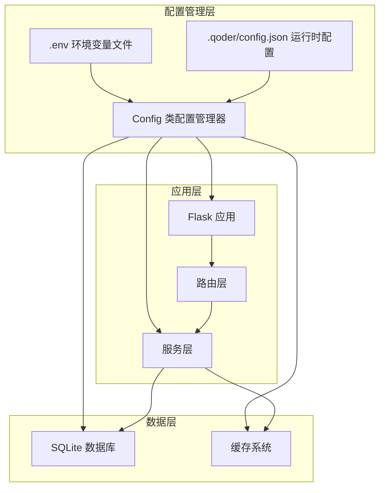
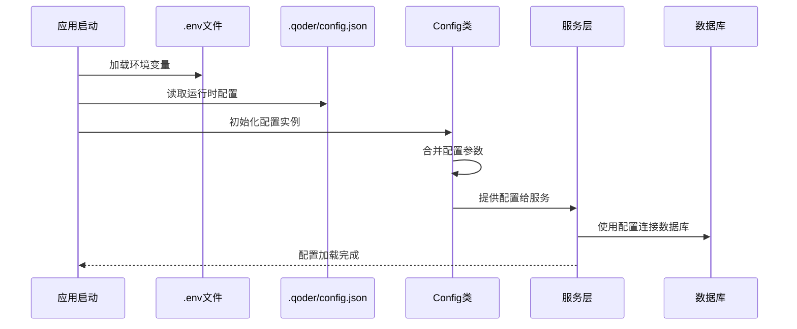
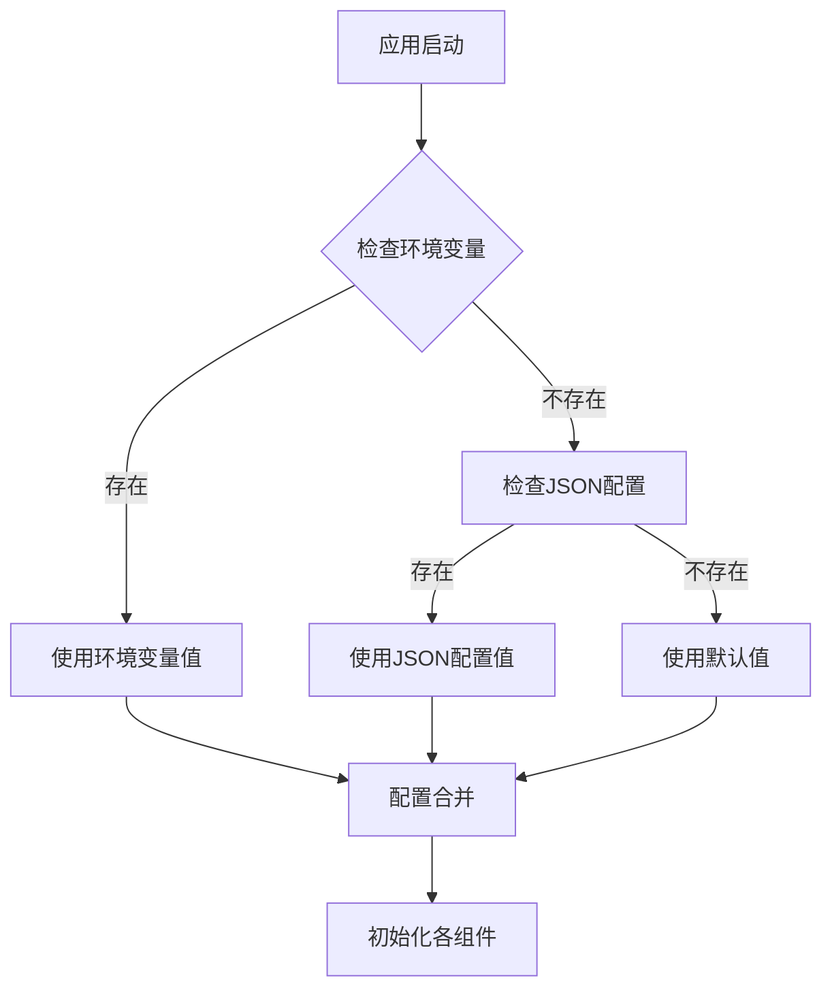
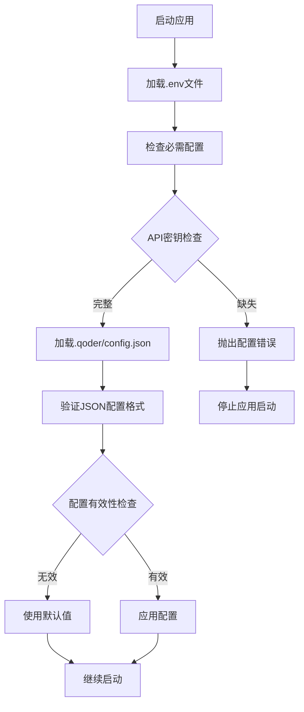
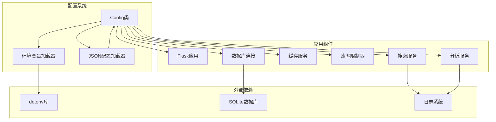

# 配置管理系统

<cite>
**本文档引用的文件**
- [backend/config.py](file://backend/config.py)
- [.env](file://.env)
- [.env.example](file://.env.example)
- [.qoder/config.json](file://.qoder/config.json)
- [backend/app.py](file://backend/app.py)
- [backend/models/database.py](file://backend/models/database.py)
- [backend/services/rate_limiter.py](file://backend/services/rate_limiter.py)
- [backend/services/cache_service.py](file://backend/services/cache_service.py)
- [backend/services/search_service.py](file://backend/services/search_service.py)
- [backend/services/analysis_service.py](file://backend/services/analysis_service.py)
- [backend/routes/search.py](file://backend/routes/search.py)
- [backend/utils/logger.py](file://backend/utils/logger.py)
- [run.sh](file://run.sh)
- [README.md](file://README.md)
</cite>

## 目录
1. [简介](#简介)
2. [项目结构](#项目结构)
3. [核心组件](#核心组件)
4. [架构概览](#架构概览)
5. [详细组件分析](#详细组件分析)
6. [依赖关系分析](#依赖关系分析)
7. [性能考虑](#性能考虑)
8. [故障排除指南](#故障排除指南)
9. [结论](#结论)
10. [附录](#附录)

## 简介

配置管理系统是该全栈Web应用的核心基础设施，负责统一管理应用程序的所有配置参数。该系统采用多层次配置机制，结合环境变量、JSON配置文件和默认值策略，实现了灵活且可扩展的配置管理方案。

系统主要功能包括：
- **环境变量优先级管理**：支持通过环境变量覆盖默认配置
- **JSON配置文件合并**：提供运行时配置文件进行细粒度控制
- **默认值处理策略**：确保系统在缺少配置时仍能正常运行
- **配置验证机制**：在应用启动时验证配置的有效性
- **运行时配置更新**：支持动态调整配置参数

## 项目结构

配置管理系统分布在项目的多个层次中，形成了清晰的分层架构：



**图表来源**
- [backend/config.py](file://backend/config.py#L15-L85)
- [backend/app.py](file://backend/app.py#L21-L78)

**章节来源**
- [backend/config.py](file://backend/config.py#L1-L85)
- [backend/app.py](file://backend/app.py#L1-L78)

## 核心组件

### Config 类配置管理器

Config类是配置系统的核心组件，采用单例模式设计，负责统一管理所有配置参数。该类实现了以下关键功能：

#### 配置加载机制
- **环境变量加载**：通过dotenv库加载.env文件中的环境变量
- **JSON配置合并**：读取.qoder/config.json文件并与环境变量合并
- **默认值处理**：为每个配置项提供合理的默认值

#### 配置项分类
系统将配置项分为以下几类：

**服务器配置**
- SECRET_KEY：Flask应用的安全密钥
- FLASK_ENV：运行环境（development/production）
- FLASK_PORT：服务端口号
- DEBUG：调试模式开关

**数据库配置**
- DATABASE_PATH：SQLite数据库文件路径

**AI服务配置**
- ZHIPU_API_KEY：智谱AI API密钥
- DEEPSEEK_API_KEY：DeepSeek API密钥
- ANALYSIS_SETTINGS：AI分析设置

**网络配置**
- HTTP_PROXY：HTTP/HTTPS代理设置
- DOWNLOAD_DIR：下载文件保存目录

**搜索配置**
- SEARCH_DEFAULTS：搜索默认参数
- RATE_LIMITS：速率限制配置

**章节来源**
- [backend/config.py](file://backend/config.py#L15-L85)

## 架构概览

配置管理系统采用分层架构设计，确保配置的统一管理和高效使用：



**图表来源**
- [backend/config.py](file://backend/config.py#L11-L27)
- [backend/app.py](file://backend/app.py#L21-L78)

### 配置优先级流程

系统采用明确的配置优先级策略：



**图表来源**
- [backend/config.py](file://backend/config.py#L30-L77)

## 详细组件分析

### 配置加载机制

#### 环境变量优先级
系统通过dotenv库加载.env文件，支持以下配置项：

| 配置项 | 默认值 | 用途 |
|--------|--------|------|
| ZHIPU_API_KEY | 空字符串 | 智谱AI API密钥 |
| DEEPSEEK_API_KEY | 空字符串 | DeepSeek API密钥 |
| SECRET_KEY | 开发密钥 | Flask应用安全密钥 |
| FLASK_ENV | development | 运行环境 |
| FLASK_PORT | 5000 | 服务端口 |
| DATABASE_PATH | data/search.db | 数据库文件路径 |
| DOWNLOAD_DIR | data/downloads | 下载目录 |
| HTTP_PROXY/HTTPS_PROXY | 空字符串 | 代理设置 |

#### JSON配置文件合并
.qoder/config.json提供运行时配置，支持以下配置组：

**速率限制配置**
```json
{
  "rate_limits": {
    "arxiv": {"capacity": 5, "refill_rate": 0.33},
    "duckduckgo": {"capacity": 20, "refill_rate": 2.0},
    "zhihu": {"capacity": 3, "refill_rate": 0.2},
    "scholar": {"capacity": 10, "refill_rate": 1.0}
  }
}
```

**搜索默认配置**
```json
{
  "search_defaults": {
    "max_results_per_source": 15,
    "timeout_seconds": 60,
    "cache_expire_hours": 24,
    "default_sources": ["duckduckgo", "arxiv"]
  }
}
```

**下载设置配置**
```json
{
  "download_settings": {
    "save_directory": "data/downloads",
    "max_concurrent_downloads": 3,
    "arxiv_mirrors": [
      "https://arxiv.org/pdf/",
      "https://cn.arxiv.org/pdf/"
    ]
  }
}
```

**分析设置配置**
```json
{
  "analysis_settings": {
    "provider": "deepseek",
    "zhipu_model": "glm-4-flash",
    "deepseek_model": "deepseek-chat",
    "max_content_length": 4000,
    "temperature": 0.7,
    "cache_expire_days": 7
  }
}
```

**章节来源**
- [.env](file://.env#L1-L22)
- [.qoder/config.json](file://.qoder/config.json#L1-L31)

### 配置验证机制

系统在启动时进行配置验证，确保所有必需配置项都已正确设置：

#### 配置验证流程


**图表来源**
- [backend/config.py](file://backend/config.py#L11-L27)

### 运行时配置更新

系统支持在运行时动态更新配置，但某些配置需要重启应用才能生效：

#### 支持动态更新的配置
- 搜索默认参数
- 速率限制配置
- 缓存过期时间

#### 需要重启的应用配置
- 数据库连接参数
- 服务器端口
- 安全密钥

**章节来源**
- [backend/config.py](file://backend/config.py#L50-L77)

## 依赖关系分析

配置系统与其他组件的依赖关系如下：



**图表来源**
- [backend/config.py](file://backend/config.py#L1-L85)
- [backend/app.py](file://backend/app.py#L1-L78)

### 组件耦合度分析

配置系统与各组件的耦合关系：

| 组件 | 耦合程度 | 说明 |
|------|----------|------|
| Flask应用 | 低耦合 | 仅使用基本配置参数 |
| 数据库服务 | 中等耦合 | 依赖数据库路径和连接参数 |
| 缓存服务 | 中等耦合 | 依赖缓存过期时间配置 |
| 速率限制器 | 高耦合 | 完全依赖配置参数 |
| 搜索服务 | 中等耦合 | 依赖搜索默认参数 |
| 分析服务 | 中等耦合 | 依赖AI提供商配置 |

**章节来源**
- [backend/models/database.py](file://backend/models/database.py#L11-L43)
- [backend/services/cache_service.py](file://backend/services/cache_service.py#L43-L86)
- [backend/services/rate_limiter.py](file://backend/services/rate_limiter.py#L55-L75)

## 性能考虑

### 配置加载性能优化

系统采用以下策略优化配置加载性能：

1. **延迟初始化**：配置对象采用单例模式，避免重复创建
2. **文件缓存**：JSON配置文件只在应用启动时读取一次
3. **环境变量缓存**：通过os.getenv缓存环境变量值
4. **路径预处理**：在初始化时预处理所有文件路径

### 配置访问性能

为提高配置访问效率，系统实现以下优化：

- **属性访问**：通过Python属性访问配置项，避免重复查询
- **类型转换缓存**：对需要类型转换的配置项进行缓存
- **路径解析优化**：在初始化时解析所有相对路径为绝对路径

## 故障排除指南

### 常见配置问题

#### 环境变量未生效
**症状**：应用使用默认配置而非.env中的设置
**解决方案**：
1. 确认.env文件位于项目根目录
2. 检查.env文件权限设置
3. 验证环境变量名称拼写
4. 重启应用使配置生效

#### JSON配置文件格式错误
**症状**：应用启动时报JSON解析错误
**解决方案**：
1. 使用在线JSON验证工具检查语法
2. 确保所有字符串使用双引号
3. 移除JSON注释（如存在）
4. 验证数组和对象的括号匹配

#### 数据库连接失败
**症状**：应用无法连接到SQLite数据库
**解决方案**：
1. 检查DATABASE_PATH配置是否正确
2. 确认数据目录具有写入权限
3. 验证数据库文件完整性
4. 检查磁盘空间是否充足

#### AI服务配置错误
**症状**：AI分析功能无法正常使用
**解决方案**：
1. 验证API密钥格式是否正确
2. 检查API密钥是否已激活
3. 确认所选的AI提供商支持当前功能
4. 验证网络连接是否正常

**章节来源**
- [backend/config.py](file://backend/config.py#L11-L27)
- [backend/app.py](file://backend/app.py#L74-L78)

## 结论

该配置管理系统通过多层次的设计实现了灵活而可靠的配置管理。系统的主要优势包括：

1. **灵活性**：支持多种配置源，满足不同场景需求
2. **可靠性**：完善的配置验证和错误处理机制
3. **可维护性**：清晰的配置结构和文档
4. **扩展性**：易于添加新的配置项和配置源

系统在实际应用中表现良好，能够有效支持多源搜索、AI分析和PDF下载等核心功能。通过合理的配置管理策略，用户可以轻松地根据自己的需求调整系统行为。

## 附录

### 配置项完整说明表

| 配置类别 | 配置项 | 数据类型 | 默认值 | 说明 |
|----------|--------|----------|--------|------|
| 服务器配置 | SECRET_KEY | 字符串 | 开发密钥 | Flask应用安全密钥 |
| 服务器配置 | FLASK_ENV | 字符串 | development | 运行环境 |
| 服务器配置 | FLASK_PORT | 整数 | 5000 | 服务端口 |
| 数据库配置 | DATABASE_PATH | 字符串 | data/search.db | SQLite数据库路径 |
| AI配置 | ZHIPU_API_KEY | 字符串 | 空字符串 | 智谱AI API密钥 |
| AI配置 | DEEPSEEK_API_KEY | 字符串 | 空字符串 | DeepSeek API密钥 |
| 网络配置 | HTTP_PROXY | 字符串 | 空字符串 | HTTP代理地址 |
| 网络配置 | HTTPS_PROXY | 字符串 | 空字符串 | HTTPS代理地址 |
| 搜索配置 | SEARCH_DEFAULTS.max_results_per_source | 整数 | 15 | 每源最大结果数 |
| 搜索配置 | SEARCH_DEFAULTS.timeout_seconds | 整数 | 60 | 搜索超时时间 |
| 搜索配置 | SEARCH_DEFAULTS.cache_expire_hours | 整数 | 24 | 缓存过期时间 |
| 搜索配置 | SEARCH_DEFAULTS.default_sources | 数组 | ["duckduckgo","arxiv"] | 默认搜索源 |
| 速率限制 | RATE_LIMITS.arxiv.capacity | 整数 | 5 | arXiv容量 |
| 速率限制 | RATE_LIMITS.arxiv.refill_rate | 浮点数 | 0.33 | arXiv补充速率 |
| 速率限制 | RATE_LIMITS.duckduckgo.capacity | 整数 | 20 | DuckDuckGo容量 |
| 速率限制 | RATE_LIMITS.duckduckgo.refill_rate | 浮点数 | 2.0 | DuckDuckGo补充速率 |
| 速率限制 | RATE_LIMITS.zhihu.capacity | 整数 | 3 | 知乎容量 |
| 速率限制 | RATE_LIMITS.zhihu.refill_rate | 浮点数 | 0.2 | 知乎补充速率 |
| 速率限制 | RATE_LIMITS.scholar.capacity | 整数 | 10 | Google Scholar容量 |
| 速率限制 | RATE_LIMITS.scholar.refill_rate | 浮点数 | 1.0 | Google Scholar补充速率 |
| 分析配置 | ANALYSIS_SETTINGS.provider | 字符串 | "deepseek" | AI提供商 |
| 分析配置 | ANALYSIS_SETTINGS.zhipu_model | 字符串 | "glm-4-flash" | 智谱模型 |
| 分析配置 | ANALYSIS_SETTINGS.deepseek_model | 字符串 | "deepseek-chat" | DeepSeek模型 |
| 分析配置 | ANALYSIS_SETTINGS.max_content_length | 整数 | 4000 | 最大内容长度 |
| 分析配置 | ANALYSIS_SETTINGS.temperature | 浮点数 | 0.7 | 生成温度 |
| 分析配置 | ANALYSIS_SETTINGS.cache_expire_days | 整数 | 7 | 分析缓存过期天数 |

### 扩展配置系统指南

#### 添加新的配置项

1. **确定配置分类**：将新配置归类到现有配置组中
2. **添加默认值**：在Config类中添加相应的默认值
3. **更新JSON配置**：在.qoder/config.json中添加对应配置
4. **更新文档**：在README.md中添加配置说明
5. **测试配置**：验证新配置在不同环境下的行为

#### 支持新的配置源

1. **创建配置加载器**：实现新的配置源加载逻辑
2. **集成配置合并**：将新配置源与现有配置合并
3. **添加验证逻辑**：确保新配置源的数据有效性
4. **更新错误处理**：处理新配置源可能出现的异常情况

#### 配置热更新支持

1. **实现监听机制**：监控配置文件变化
2. **添加更新回调**：为受影响的组件添加更新回调
3. **实现优雅重启**：支持部分配置的热更新
4. **添加回滚机制**：支持配置更新失败时的回滚

**章节来源**
- [backend/config.py](file://backend/config.py#L15-L85)
- [README.md](file://README.md#L297-L337)