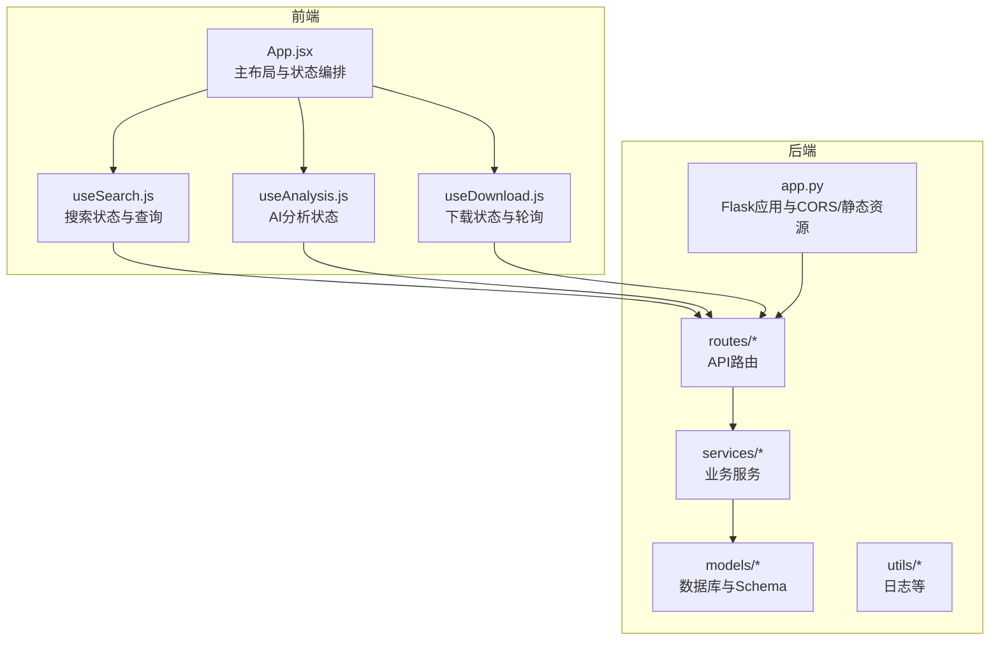
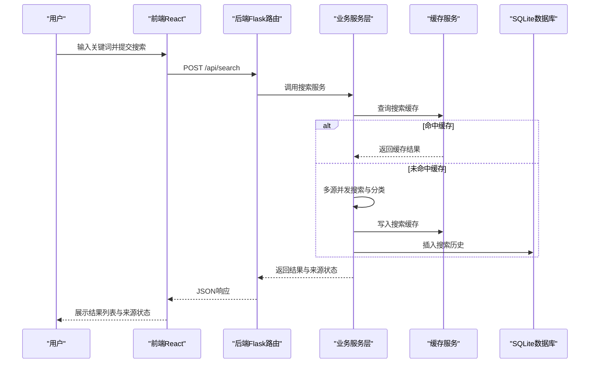
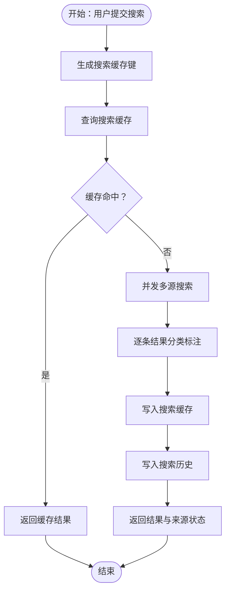
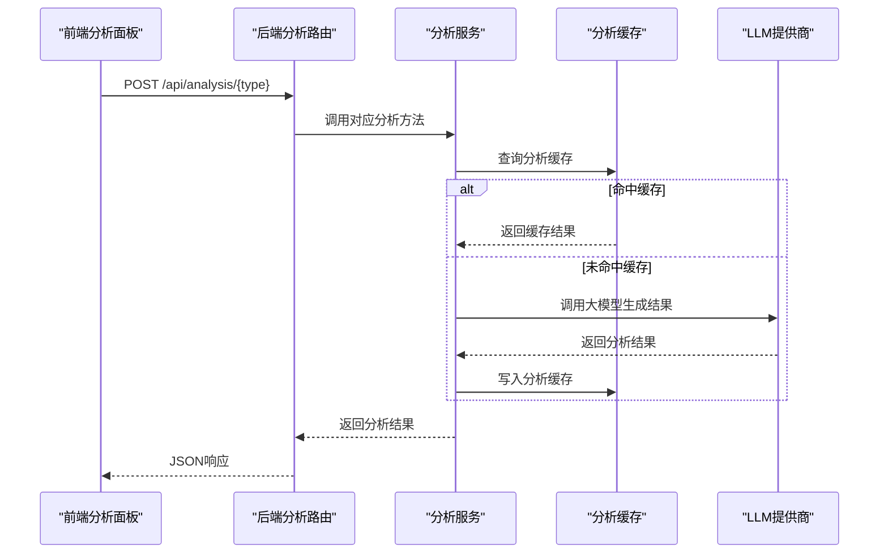
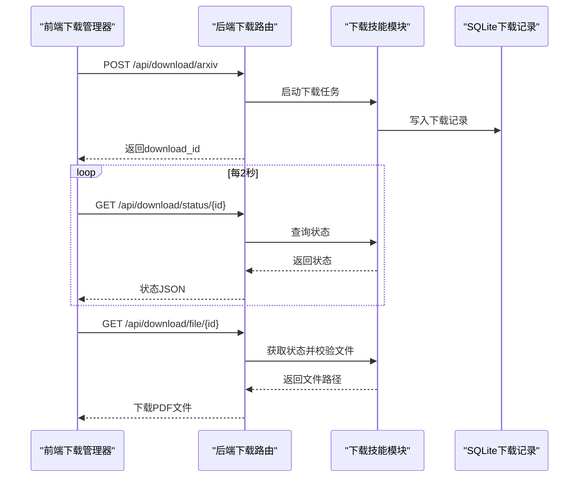
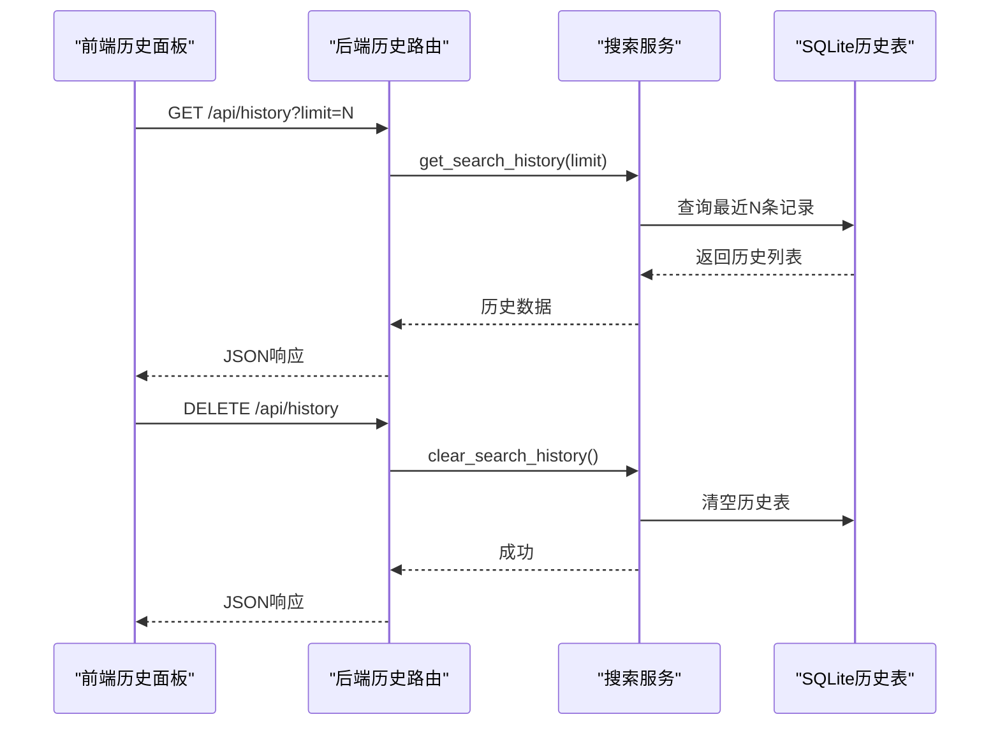
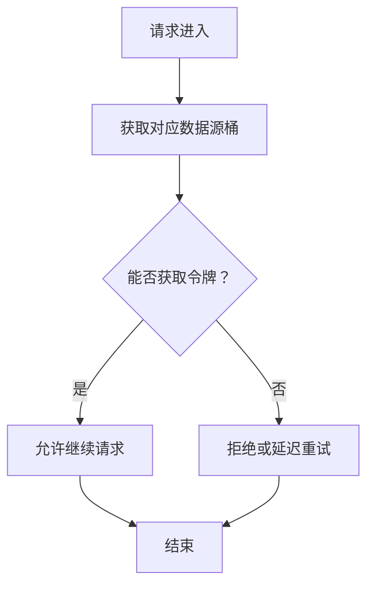
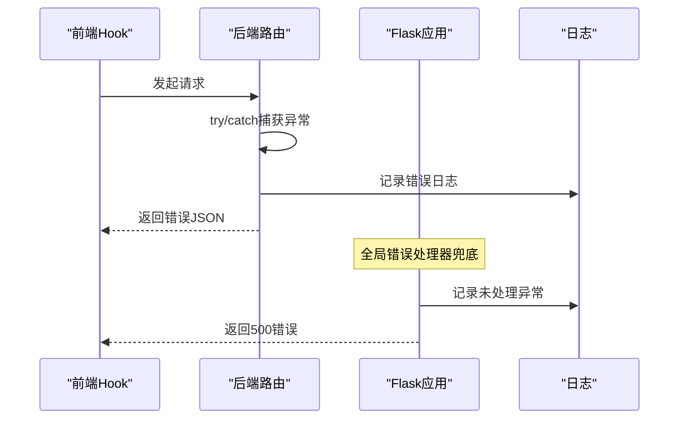
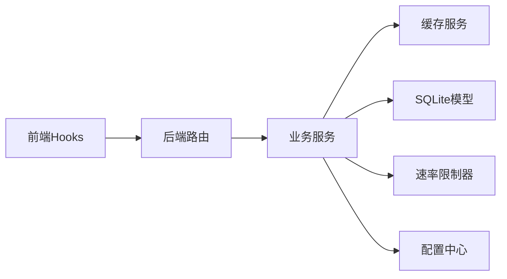

# 数据流设计

<cite>
**本文引用的文件**
- [README.md](file://README.md)
- [backend/app.py](file://backend/app.py)
- [backend/config.py](file://backend/config.py)
- [backend/routes/search.py](file://backend/routes/search.py)
- [backend/routes/analysis.py](file://backend/routes/analysis.py)
- [backend/routes/download.py](file://backend/routes/download.py)
- [backend/routes/history.py](file://backend/routes/history.py)
- [backend/services/search_service.py](file://backend/services/search_service.py)
- [backend/services/cache_service.py](file://backend/services/cache_service.py)
- [backend/services/rate_limiter.py](file://backend/services/rate_limiter.py)
- [backend/models/database.py](file://backend/models/database.py)
- [backend/models/schemas.py](file://backend/models/schemas.py)
- [frontend/src/App.jsx](file://frontend/src/App.jsx)
- [frontend/src/hooks/useSearch.js](file://frontend/src/hooks/useSearch.js)
- [frontend/src/hooks/useAnalysis.js](file://frontend/src/hooks/useAnalysis.js)
- [frontend/src/hooks/useDownload.js](file://frontend/src/hooks/useDownload.js)
</cite>

## 目录
1. [简介](#简介)
2. [项目结构](#项目结构)
3. [核心组件](#核心组件)
4. [架构总览](#架构总览)
5. [详细组件分析](#详细组件分析)
6. [依赖关系分析](#依赖关系分析)
7. [性能考虑](#性能考虑)
8. [故障排查指南](#故障排查指南)
9. [结论](#结论)
10. [附录](#附录)

## 简介
本文件面向“Search Is All You Need”项目，系统化梳理从用户输入到最终结果展示的完整数据流，覆盖搜索请求处理、多源数据聚合、AI分析处理、结果缓存机制、前端状态管理、后端服务调用链以及数据库操作流程。文档还解释了缓存策略的数据流向、速率限制的数据传递、错误处理的数据回退机制，并给出数据流图、状态转换图与错误传播路径图，最后总结数据一致性保障与性能优化策略。

## 项目结构
项目采用前后端分离架构，后端以 Flask 提供 RESTful API，前端基于 React/Vite 构建单页应用。后端通过蓝图组织路由，服务层封装业务逻辑，模型层负责数据库初始化与连接，工具层提供日志等辅助能力；前端通过自定义 Hook 管理状态并通过统一 API 服务与后端交互。

图表来源
- [backend/app.py](file://backend/app.py#L21-L78)
- [backend/routes/search.py](file://backend/routes/search.py#L1-L28)
- [backend/routes/analysis.py](file://backend/routes/analysis.py#L1-L66)
- [backend/routes/download.py](file://backend/routes/download.py#L1-L98)
- [backend/routes/history.py](file://backend/routes/history.py#L1-L33)
- [backend/services/search_service.py](file://backend/services/search_service.py#L1-L98)
- [backend/models/database.py](file://backend/models/database.py#L1-L51)
- [frontend/src/App.jsx](file://frontend/src/App.jsx#L1-L149)
- [frontend/src/hooks/useSearch.js](file://frontend/src/hooks/useSearch.js#L1-L74)
- [frontend/src/hooks/useAnalysis.js](file://frontend/src/hooks/useAnalysis.js#L1-L86)
- [frontend/src/hooks/useDownload.js](file://frontend/src/hooks/useDownload.js#L1-L78)

章节来源
- [README.md](file://README.md#L1-L409)
- [backend/app.py](file://backend/app.py#L1-L78)
- [frontend/src/App.jsx](file://frontend/src/App.jsx#L1-L149)

## 核心组件
- 前端组件与状态管理
  - App.jsx：整合搜索栏、结果列表、筛选面板、分析面板、下载管理器与历史面板，协调各 Hook 的状态。
  - useSearch.js：维护查询词、过滤条件、结果集、总数、来源状态与加载状态，发起搜索请求并进行客户端侧过滤。
  - useAnalysis.js：维护分析面板可见性、选中项、活动标签页与分析结果，封装摘要、翻译、论文分析的调用。
  - useDownload.js：维护下载队列、可见性与轮询刷新，定时拉取下载状态并更新 UI。
- 后端服务与路由
  - routes/search.py：接收查询参数，调用搜索服务并返回聚合结果与来源状态。
  - routes/analysis.py：提供摘要、翻译、论文分析接口，转发至分析服务。
  - routes/download.py：提供 arXiv 下载启动、状态查询、文件下发与历史查询。
  - routes/history.py：提供搜索历史查询与清空。
  - services/search_service.py：多源搜索、分类标注、缓存读写、历史持久化。
  - services/cache_service.py：搜索与分析缓存键生成、读取、写入与过期清理。
  - services/rate_limiter.py：基于令牌桶的多源速率限制。
  - models/database.py 与 models/schemas.py：SQLite 初始化、连接与表结构定义。
  - config.py：合并 .env 与 .qoder/config.json，提供全局配置。
  - app.py：Flask 应用创建、CORS、蓝图注册、静态资源与全局错误处理。

章节来源
- [frontend/src/App.jsx](file://frontend/src/App.jsx#L1-L149)
- [frontend/src/hooks/useSearch.js](file://frontend/src/hooks/useSearch.js#L1-L74)
- [frontend/src/hooks/useAnalysis.js](file://frontend/src/hooks/useAnalysis.js#L1-L86)
- [frontend/src/hooks/useDownload.js](file://frontend/src/hooks/useDownload.js#L1-L78)
- [backend/routes/search.py](file://backend/routes/search.py#L1-L28)
- [backend/routes/analysis.py](file://backend/routes/analysis.py#L1-L66)
- [backend/routes/download.py](file://backend/routes/download.py#L1-L98)
- [backend/routes/history.py](file://backend/routes/history.py#L1-L33)
- [backend/services/search_service.py](file://backend/services/search_service.py#L1-L98)
- [backend/services/cache_service.py](file://backend/services/cache_service.py#L1-L104)
- [backend/services/rate_limiter.py](file://backend/services/rate_limiter.py#L1-L75)
- [backend/models/database.py](file://backend/models/database.py#L1-L51)
- [backend/models/schemas.py](file://backend/models/schemas.py#L1-L38)
- [backend/config.py](file://backend/config.py#L1-L85)
- [backend/app.py](file://backend/app.py#L1-L78)

## 架构总览
系统采用“前端单页应用 + 后端 Flask 微服务”的分层架构。前端通过 Axios 发起 REST 请求，后端路由根据请求类型分派到对应服务层，服务层协调缓存、数据库与外部数据源，最终返回 JSON 响应。数据库采用 SQLite（WAL 模式），配合索引提升查询性能。

图表来源
- [backend/routes/search.py](file://backend/routes/search.py#L10-L28)
- [backend/services/search_service.py](file://backend/services/search_service.py#L28-L68)
- [backend/services/cache_service.py](file://backend/services/cache_service.py#L30-L53)
- [backend/models/database.py](file://backend/models/database.py#L24-L34)

## 详细组件分析

### 搜索数据流（从用户输入到结果展示）
- 前端状态管理
  - useSearch.js 维护查询词、过滤器（来源、类别、语言）、结果集、总数与加载状态；发起搜索请求并进行客户端侧类别过滤。
- 后端处理链
  - routes/search.py 校验请求体并调用 search_service.search。
  - search_service.search
    - 生成缓存键并查询缓存；命中则直接返回。
    - 未命中则通过 SearchAgent 并发多源搜索，随后对每条结果进行分类标注。
    - 写入搜索缓存并持久化搜索历史。
- 数据库与缓存
  - 缓存键由查询词、来源与过滤器组成，搜索缓存按小时过期；分析缓存按天过期。
  - 数据库表包含搜索历史、搜索缓存、分析缓存与下载记录，均设置必要索引。

图表来源
- [backend/services/search_service.py](file://backend/services/search_service.py#L28-L68)
- [backend/services/cache_service.py](file://backend/services/cache_service.py#L16-L53)
- [backend/models/schemas.py](file://backend/models/schemas.py#L1-L38)

章节来源
- [frontend/src/hooks/useSearch.js](file://frontend/src/hooks/useSearch.js#L19-L50)
- [backend/routes/search.py](file://backend/routes/search.py#L10-L28)
- [backend/services/search_service.py](file://backend/services/search_service.py#L28-L68)
- [backend/services/cache_service.py](file://backend/services/cache_service.py#L30-L53)
- [backend/models/schemas.py](file://backend/models/schemas.py#L1-L38)

### AI分析数据流（摘要/翻译/论文分析）
- 前端状态管理
  - useAnalysis.js 维护分析面板可见性、选中项、活动标签页与分析结果；分别调用摘要、翻译与论文分析接口。
- 后端处理链
  - routes/analysis.py 根据不同分析类型调用 analysis_service 对应方法。
  - 缓存策略：analysis_service 在调用 LLM 前后检查分析缓存，命中则直接返回，未命中则写入缓存（7天过期）。
- 数据一致性
  - 分析缓存键由内容截断与分析类型共同决定，避免长文本导致键过长与缓存碎片化。

图表来源
- [backend/routes/analysis.py](file://backend/routes/analysis.py#L10-L66)
- [backend/services/cache_service.py](file://backend/services/cache_service.py#L57-L87)

章节来源
- [frontend/src/hooks/useAnalysis.js](file://frontend/src/hooks/useAnalysis.js#L11-L57)
- [backend/routes/analysis.py](file://backend/routes/analysis.py#L10-L66)
- [backend/services/cache_service.py](file://backend/services/cache_service.py#L57-L87)

### 下载管理数据流（arXiv PDF 下载）
- 前端状态管理
  - useDownload.js 维护下载队列、可见性与轮询刷新；定时轮询下载状态，完成后支持文件下载。
- 后端处理链
  - routes/download.py 提供启动下载、查询状态、文件下发与历史查询接口；内部通过技能模块调用实际下载逻辑。
- 数据一致性
  - 下载记录持久化到数据库，状态字段支持 pending/downloading/completed 等状态；文件存在性校验后再下发。

图表来源
- [backend/routes/download.py](file://backend/routes/download.py#L14-L98)
- [frontend/src/hooks/useDownload.js](file://frontend/src/hooks/useDownload.js#L9-L64)

章节来源
- [frontend/src/hooks/useDownload.js](file://frontend/src/hooks/useDownload.js#L1-L78)
- [backend/routes/download.py](file://backend/routes/download.py#L14-L98)

### 搜索历史数据流
- 前端：HistoryPanel 通过 useSearch.js 触发历史查询与清空。
- 后端：routes/history.py 调用 search_service 的历史查询与清空方法；search_service 通过数据库连接执行 SQL。

图表来源
- [backend/routes/history.py](file://backend/routes/history.py#L10-L33)
- [backend/services/search_service.py](file://backend/services/search_service.py#L82-L98)
- [backend/models/schemas.py](file://backend/models/schemas.py#L1-L8)

章节来源
- [frontend/src/hooks/useSearch.js](file://frontend/src/hooks/useSearch.js#L1-L74)
- [backend/routes/history.py](file://backend/routes/history.py#L10-L33)
- [backend/services/search_service.py](file://backend/services/search_service.py#L82-L98)

### 速率限制数据流
- 速率限制器基于令牌桶实现，每个数据源独立桶，按容量与补充速率动态放行请求。
- 服务层在调用外部数据源前先申请令牌，超时则拒绝或降级处理。

图表来源
- [backend/services/rate_limiter.py](file://backend/services/rate_limiter.py#L5-L75)

章节来源
- [backend/services/rate_limiter.py](file://backend/services/rate_limiter.py#L1-L75)

### 错误传播路径
- 全局异常处理：app.py 注册全局错误处理器，捕获未处理异常并返回统一错误响应。
- 路由层：各路由在 try/catch 中捕获服务层异常，记录日志并返回错误信息。
- 前端：各 Hook 在 try/catch 中处理请求异常，设置错误状态并清空结果。

图表来源
- [backend/app.py](file://backend/app.py#L62-L65)
- [backend/routes/search.py](file://backend/routes/search.py#L25-L27)
- [frontend/src/hooks/useSearch.js](file://frontend/src/hooks/useSearch.js#L43-L47)

章节来源
- [backend/app.py](file://backend/app.py#L62-L65)
- [backend/routes/search.py](file://backend/routes/search.py#L25-L27)
- [frontend/src/hooks/useSearch.js](file://frontend/src/hooks/useSearch.js#L43-L47)

## 依赖关系分析
- 组件耦合与职责
  - routes 层仅负责参数校验与错误包装，不包含业务逻辑。
  - services 层封装业务规则、缓存与数据库交互。
  - models 层抽象数据库连接与 Schema，提供上下文管理。
  - 前端 Hook 仅负责状态与副作用，不关心后端实现细节。
- 外部依赖
  - LLM 提供商（智谱/DeepSeek）通过配置切换；HTTP 代理通过环境变量配置。
  - 多数据源（arXiv、Bing、Semantic Scholar、知乎）通过速率限制器与缓存策略协同。

图表来源
- [backend/routes/search.py](file://backend/routes/search.py#L1-L28)
- [backend/services/search_service.py](file://backend/services/search_service.py#L1-L98)
- [backend/services/cache_service.py](file://backend/services/cache_service.py#L1-L104)
- [backend/models/database.py](file://backend/models/database.py#L1-L51)
- [backend/services/rate_limiter.py](file://backend/services/rate_limiter.py#L1-L75)
- [backend/config.py](file://backend/config.py#L1-L85)

章节来源
- [backend/config.py](file://backend/config.py#L1-L85)
- [backend/models/schemas.py](file://backend/models/schemas.py#L1-L38)

## 性能考虑
- 缓存策略
  - 搜索缓存：按小时过期，命中后直接返回，显著降低外部 API 调用与数据库写入压力。
  - 分析缓存：按天过期，避免频繁调用 LLM，节省成本与时间。
  - 缓存键设计：搜索键包含查询词、来源与过滤器；分析键包含内容截断与类型，兼顾准确性与性能。
- 数据库优化
  - WAL 模式提升并发读写性能；为缓存表建立索引加速查询。
  - 事务上下文管理确保一致性与原子性。
- 前端优化
  - 客户端侧类别过滤减少渲染负担；下载轮询间隔 2 秒，避免过度请求。
- 速率限制
  - 不同数据源独立令牌桶，避免热点源阻塞其他源；超时拒绝保护后端稳定性。

## 故障排查指南
- 搜索无结果
  - 检查 arXiv 仅支持英文关键词；Semantic Scholar API 有速率限制，系统会自动重试。
  - 查看后端日志定位具体错误。
- AI 分析不可用
  - 确认已配置有效 API 密钥；检查分析提供商与模型配置。
- PDF 下载失败
  - arXiv 服务器可能临时不可用；系统会尝试国内镜像；确认下载记录状态与文件是否存在。
- 缓存异常
  - 检查缓存键是否正确生成；确认过期时间与清理任务是否正常运行。
- 速率限制
  - 调整 .qoder/config.json 中对应数据源的容量与补充速率；观察来源状态反馈。

章节来源
- [README.md](file://README.md#L361-L375)
- [backend/services/cache_service.py](file://backend/services/cache_service.py#L91-L104)
- [backend/services/rate_limiter.py](file://backend/services/rate_limiter.py#L45-L75)

## 结论
本项目通过清晰的前后端分层、完善的缓存与速率限制策略、严格的错误处理与日志记录，实现了从用户输入到结果展示的高效数据流。搜索、分析与下载三大核心流程均具备可扩展性与可观测性，适合在生产环境中持续演进与优化。

## 附录
- 关键配置项
  - 速率限制：见 .qoder/config.json 中 rate_limits。
  - 搜索默认值：见 .qoder/config.json 中 search_defaults。
  - 分析设置：见 .qoder/config.json 中 analysis_settings。
  - 环境变量：见 .env 示例文件。
- API 接口概览
  - 搜索：POST /api/search
  - 分析：POST /api/analysis/summarize、POST /api/analysis/translate、POST /api/analysis/paper
  - 下载：POST /api/download/arxiv、GET /api/download/status/{id}、GET /api/download/file/{id}、GET /api/download/history
  - 历史：GET /api/history、DELETE /api/history

章节来源
- [README.md](file://README.md#L229-L274)
- [backend/config.py](file://backend/config.py#L50-L78)