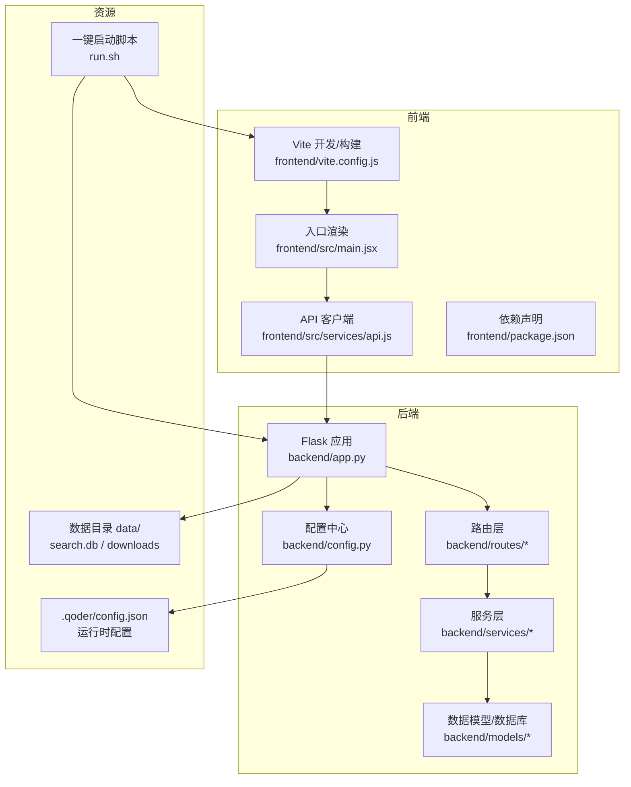
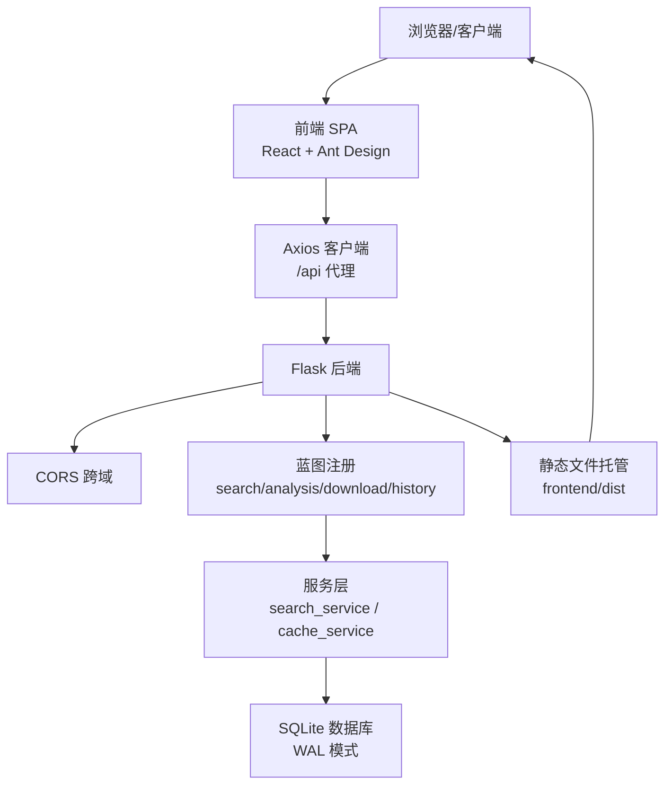
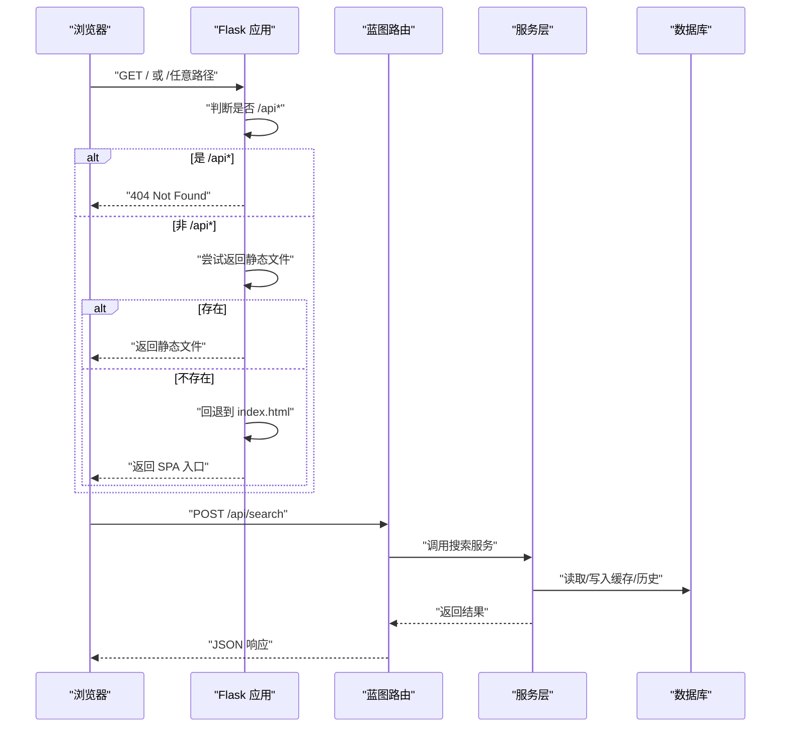
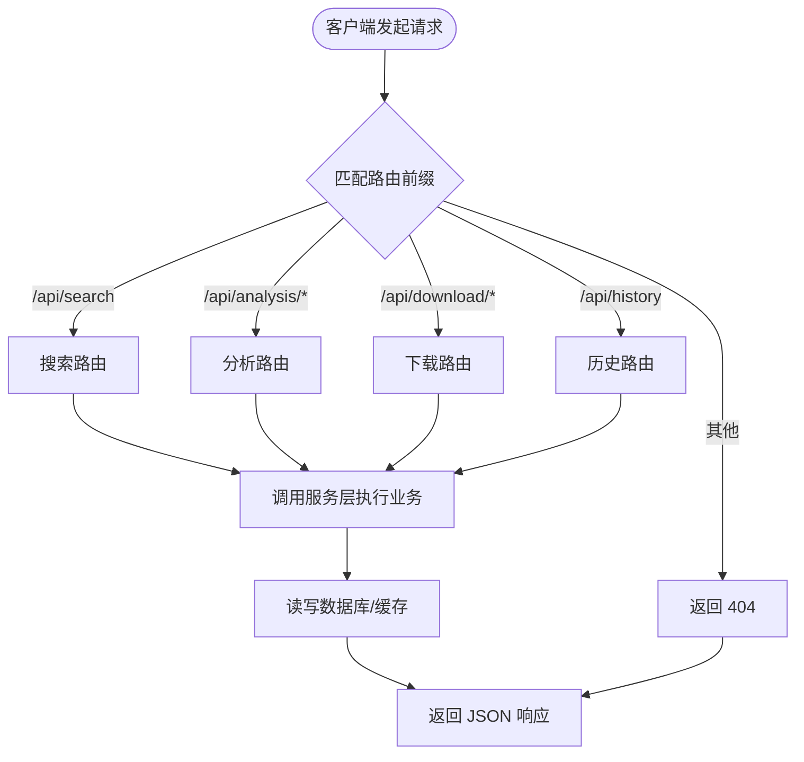
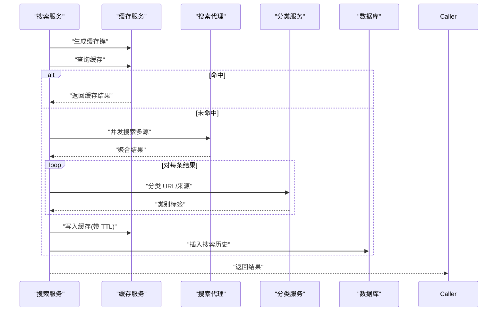
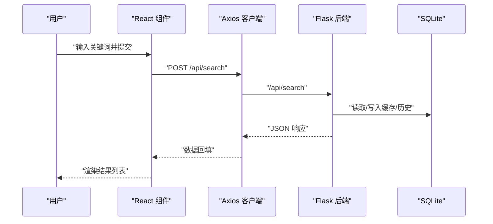
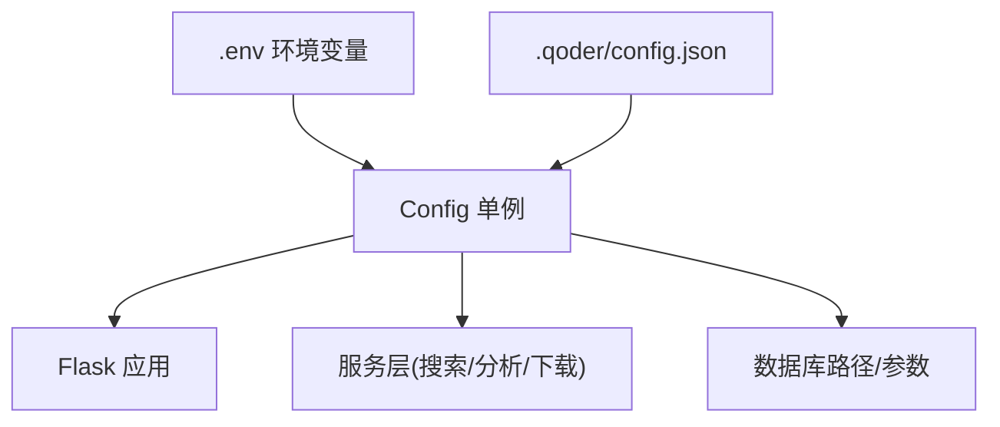
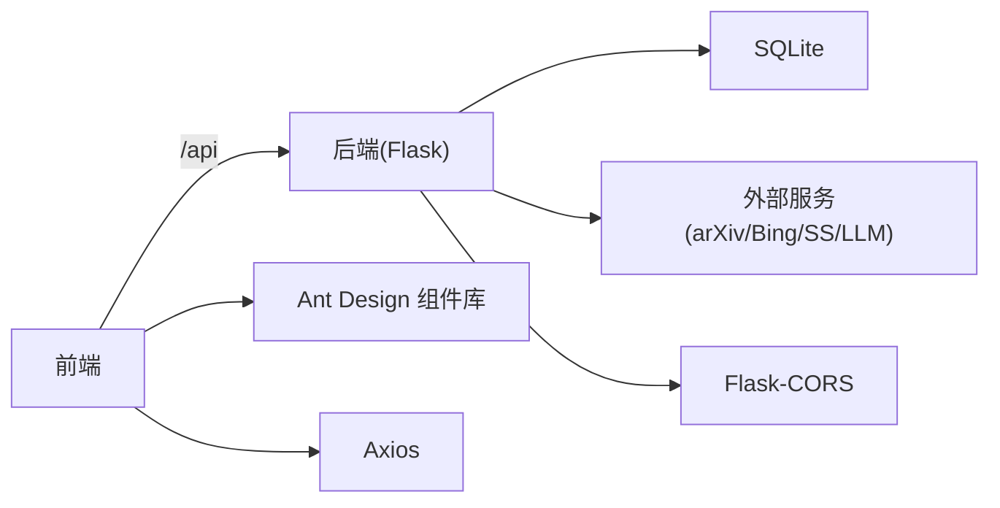

# 整体架构概览

<cite>
**本文引用的文件**   
- [README.md](file://README.md)
- [backend/app.py](file://backend/app.py)
- [backend/config.py](file://backend/config.py)
- [backend/routes/search.py](file://backend/routes/search.py)
- [backend/services/search_service.py](file://backend/services/search_service.py)
- [backend/services/cache_service.py](file://backend/services/cache_service.py)
- [backend/models/database.py](file://backend/models/database.py)
- [frontend/vite.config.js](file://frontend/vite.config.js)
- [frontend/src/main.jsx](file://frontend/src/main.jsx)
- [frontend/src/services/api.js](file://frontend/src/services/api.js)
- [frontend/package.json](file://frontend/package.json)
- [frontend/index.html](file://frontend/index.html)
- [run.sh](file://run.sh)
- [.qoder/config.json](file://.qoder/config.json)
- [backend/requirements.txt](file://backend/requirements.txt)
</cite>

## 目录
1. [引言](#引言)
2. [项目结构](#项目结构)
3. [核心组件](#核心组件)
4. [架构总览](#架构总览)
5. [详细组件分析](#详细组件分析)
6. [依赖分析](#依赖分析)
7. [性能考量](#性能考量)
8. [故障排查指南](#故障排查指南)
9. [结论](#结论)
10. [附录](#附录)

## 引言
本项目采用前后端分离架构，后端基于 Flask 提供 RESTful API，前端基于 React/Vite 构建 SPA。系统围绕“多源聚合搜索、智能内容分类、AI 内容分析、PDF 下载管理、搜索历史记录”等核心能力展开，强调可扩展性与生产可用性。本文面向项目管理者与架构师，给出系统边界、组件交互与数据流的全景视图，并解释技术选型与权衡。

## 项目结构
项目采用“根目录 + backend + frontend + data + .qoder”分层组织：
- backend：Flask 应用、路由、服务层、数据模型与缓存、配置与日志工具
- frontend：React 应用、Ant Design 组件、Axios 客户端、Vite 构建与开发代理
- data：SQLite 数据库与下载目录（git 忽略）
- .qoder：运行时配置与 AI 代理/技能模块（项目内部）

图表来源
- [backend/app.py](file://backend/app.py#L21-L67)
- [backend/config.py](file://backend/config.py#L15-L78)
- [frontend/vite.config.js](file://frontend/vite.config.js#L1-L20)
- [frontend/src/main.jsx](file://frontend/src/main.jsx#L1-L15)
- [frontend/src/services/api.js](file://frontend/src/services/api.js#L1-L32)
- [frontend/package.json](file://frontend/package.json#L1-L24)
- [run.sh](file://run.sh#L1-L50)
- [.qoder/config.json](file://.qoder/config.json#L1-L31)

章节来源
- [README.md](file://README.md#L376-L404)
- [backend/app.py](file://backend/app.py#L21-L67)
- [frontend/vite.config.js](file://frontend/vite.config.js#L1-L20)
- [run.sh](file://run.sh#L1-L50)

## 核心组件
- Flask 应用与静态文件托管：负责注册蓝图、CORS、全局异常处理与 SPA 静态文件回退
- 路由层：统一暴露 /api/* RESTful 接口，如搜索、分析、下载、历史
- 服务层：封装搜索、分析、缓存、速率限制、分类等业务逻辑
- 数据模型与数据库：SQLite（WAL 模式）+ 表结构初始化 + 线程本地连接
- 前端应用：React + Ant Design + Axios；开发时通过 Vite 代理到后端
- 配置体系：.env 环境变量 + .qoder/config.json 运行时配置 + 单例 Config 类
- 一键启动：run.sh 自动创建虚拟环境、安装依赖、构建前端、启动后端

章节来源
- [backend/app.py](file://backend/app.py#L21-L67)
- [backend/routes/search.py](file://backend/routes/search.py#L1-L28)
- [backend/services/search_service.py](file://backend/services/search_service.py#L1-L98)
- [backend/models/database.py](file://backend/models/database.py#L1-L51)
- [frontend/src/services/api.js](file://frontend/src/services/api.js#L1-L32)
- [backend/config.py](file://backend/config.py#L15-L78)
- [run.sh](file://run.sh#L1-L50)

## 架构总览
系统采用“前后端分离 + SPA + RESTful API”的经典架构模式：
- 前端：React SPA，开发时通过 Vite 代理 /api* 到后端；生产时由后端托管静态资源
- 后端：Flask 提供 RESTful API，注册多个蓝图；全局异常处理保证稳定性
- 数据：SQLite 存储搜索历史与缓存；WAL 模式提升并发写入性能
- 配置：.env 与 .qoder/config.json 双通道配置，集中化管理
- 扩展：.qoder 目录承载 AI 代理与技能模块，便于替换与扩展

图表来源
- [backend/app.py](file://backend/app.py#L29-L59)
- [frontend/vite.config.js](file://frontend/vite.config.js#L6-L14)
- [frontend/src/services/api.js](file://frontend/src/services/api.js#L4-L8)
- [backend/services/search_service.py](file://backend/services/search_service.py#L28-L67)
- [backend/models/database.py](file://backend/models/database.py#L11-L21)

章节来源
- [README.md](file://README.md#L17-L23)
- [backend/app.py](file://backend/app.py#L29-L59)
- [frontend/vite.config.js](file://frontend/vite.config.js#L6-L14)
- [frontend/src/services/api.js](file://frontend/src/services/api.js#L4-L8)

## 详细组件分析

### 后端应用与静态文件托管
- 应用创建：设置静态目录为 frontend/dist，注册 CORS（开发时允许 Vite 本地服务）
- 蓝图注册：search、analysis、download、history 四个蓝图
- SPA 回退：对非 /api* 的路径尝试返回静态文件，否则回退到 index.html
- 全局异常处理：捕获未处理异常并返回统一错误响应
- 初始化：启动前完成数据库初始化

图表来源
- [backend/app.py](file://backend/app.py#L42-L59)
- [backend/routes/search.py](file://backend/routes/search.py#L10-L27)
- [backend/services/search_service.py](file://backend/services/search_service.py#L28-L67)
- [backend/models/database.py](file://backend/models/database.py#L24-L34)

章节来源
- [backend/app.py](file://backend/app.py#L21-L67)

### RESTful API 设计与路由职责
- 搜索接口：POST /api/search，接收查询词、数据源与过滤条件，返回聚合结果与各源状态
- 分析接口：POST /api/analysis/*（摘要/翻译/论文分析）
- 下载接口：POST /api/download/arxiv、GET /api/download/status/<id>、GET /api/download/file/<id>、GET /api/download/history
- 历史接口：GET /api/history、DELETE /api/history

图表来源
- [backend/routes/search.py](file://backend/routes/search.py#L10-L27)
- [README.md](file://README.md#L229-L274)

章节来源
- [README.md](file://README.md#L229-L274)
- [backend/routes/search.py](file://backend/routes/search.py#L1-L28)

### 服务层与数据流
- 搜索服务：构建缓存键、查询缓存、调用搜索代理、分类结果、写入缓存、记录历史
- 缓存服务：统一的搜索与分析缓存键生成、过期时间控制、清理过期条目
- 数据库：线程本地连接、WAL 模式、外键约束、上下文管理自动提交/回滚

图表来源
- [backend/services/search_service.py](file://backend/services/search_service.py#L28-L67)
- [backend/services/cache_service.py](file://backend/services/cache_service.py#L16-L53)
- [backend/models/database.py](file://backend/models/database.py#L24-L34)

章节来源
- [backend/services/search_service.py](file://backend/services/search_service.py#L1-L98)
- [backend/services/cache_service.py](file://backend/services/cache_service.py#L1-L104)
- [backend/models/database.py](file://backend/models/database.py#L1-L51)

### 前端集成与协作机制
- 开发代理：Vite 将 /api* 代理到后端，避免跨域与本地联调
- API 客户端：Axios 默认 baseURL=/api，拦截器统一处理 429/5xx/400 与超时
- 应用入口：Ant Design 国际化配置，StrictMode 包裹，挂载根节点
- 构建产物：dist 目录交由后端托管，实现 SPA 静态文件服务

图表来源
- [frontend/vite.config.js](file://frontend/vite.config.js#L8-L13)
- [frontend/src/services/api.js](file://frontend/src/services/api.js#L4-L8)
- [backend/routes/search.py](file://backend/routes/search.py#L10-L27)
- [backend/models/database.py](file://backend/models/database.py#L24-L34)

章节来源
- [frontend/vite.config.js](file://frontend/vite.config.js#L1-L20)
- [frontend/src/services/api.js](file://frontend/src/services/api.js#L1-L32)
- [frontend/src/main.jsx](file://frontend/src/main.jsx#L1-L15)
- [frontend/package.json](file://frontend/package.json#L1-L24)

### 配置与运行时参数
- 环境变量：.env 控制 Flask、数据库、LLM 密钥、下载目录、代理等
- 运行时配置：.qoder/config.json 控制速率限制、搜索默认值、下载设置、分析设置
- 单例配置：Config 类统一加载与合并，确保后端/服务层一致读取

图表来源
- [backend/config.py](file://backend/config.py#L15-L78)
- [.qoder/config.json](file://.qoder/config.json#L1-L31)

章节来源
- [backend/config.py](file://backend/config.py#L15-L78)
- [.qoder/config.json](file://.qoder/config.json#L1-L31)
- [backend/requirements.txt](file://backend/requirements.txt#L1-L11)

## 依赖分析
- 技术栈依赖：Flask、Flask-CORS、SQLite、第三方搜索与 LLM SDK、Vite、React、Ant Design、Axios
- 前后端耦合点：/api 前缀约定、CORS 放行、静态文件回退策略
- 外部依赖：arXiv、Semantic Scholar、Bing、智谱/DeepSeek 等外部服务

图表来源
- [backend/requirements.txt](file://backend/requirements.txt#L1-L11)
- [frontend/package.json](file://frontend/package.json#L11-L18)
- [frontend/vite.config.js](file://frontend/vite.config.js#L8-L13)
- [backend/app.py](file://backend/app.py#L32-L33)

章节来源
- [backend/requirements.txt](file://backend/requirements.txt#L1-L11)
- [frontend/package.json](file://frontend/package.json#L1-L24)

## 性能考量
- 缓存策略：搜索与分析双通道缓存，TTL 控制与定期清理，显著降低重复请求与外部依赖压力
- 并发与超时：搜索代理并发拉取多源，合理设置超时与重试；速率限制防止外部 API 滥用
- 数据库优化：WAL 模式提升写入吞吐，线程本地连接减少锁竞争
- 前端静态化：生产环境由后端托管静态资源，避免额外 Nginx/CDN 部署复杂度

章节来源
- [backend/services/cache_service.py](file://backend/services/cache_service.py#L28-L104)
- [backend/models/database.py](file://backend/models/database.py#L11-L21)
- [backend/app.py](file://backend/app.py#L25-L27)

## 故障排查指南
- 429 频控：前端拦截器提示“请求过于频繁”，检查 .qoder/config.json 中速率限制配置
- 500 内部错误：后端全局异常处理器统一返回，查看日志定位具体异常
- 404 静态资源：确认前端已构建 dist，后端静态目录正确；非 /api* 路由回退到 index.html
- LLM 密钥：确认 .env 中 ZHIPU_API_KEY 或 DEEPSEEK_API_KEY 已配置
- 数据库连接：检查 DATABASE_PATH 权限与 WAL 模式初始化

章节来源
- [frontend/src/services/api.js](file://frontend/src/services/api.js#L10-L29)
- [backend/app.py](file://backend/app.py#L61-L65)
- [backend/config.py](file://backend/config.py#L35-L48)

## 结论
该系统以 Flask + React 为核心，结合 SQLite 与多级缓存，实现了高内聚、低耦合的前后端分离架构。通过 RESTful API 与 SPA 静态文件托管，兼顾开发效率与生产稳定性。.qoder 目录为未来扩展 AI 能力提供了清晰的模块边界。建议在生产环境中配合反向代理与监控告警，进一步增强可用性与可观测性。

## 附录
- 一键启动流程：run.sh 自动完成虚拟环境、依赖安装、前端构建与后端启动
- 前端入口与模板：index.html 与 main.jsx 确保 Ant Design 与 StrictMode 正常工作
- API 文档：参考 README 的接口说明与示例

章节来源
- [run.sh](file://run.sh#L1-L50)
- [frontend/index.html](file://frontend/index.html#L1-L14)
- [frontend/src/main.jsx](file://frontend/src/main.jsx#L1-L15)
- [README.md](file://README.md#L229-L274)