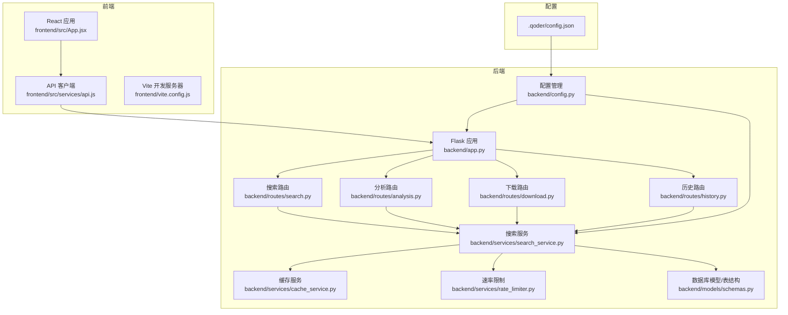
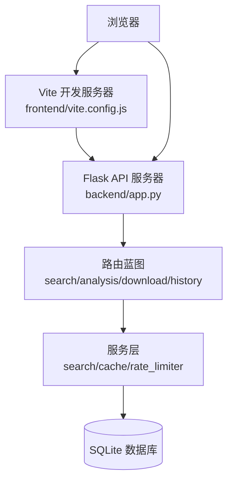
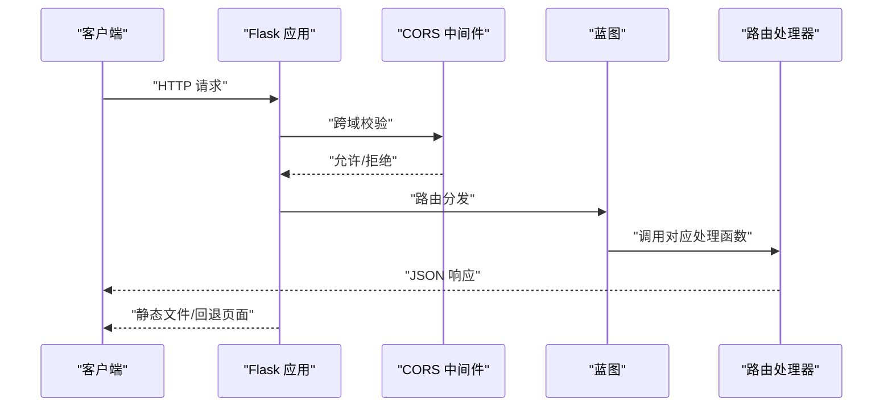
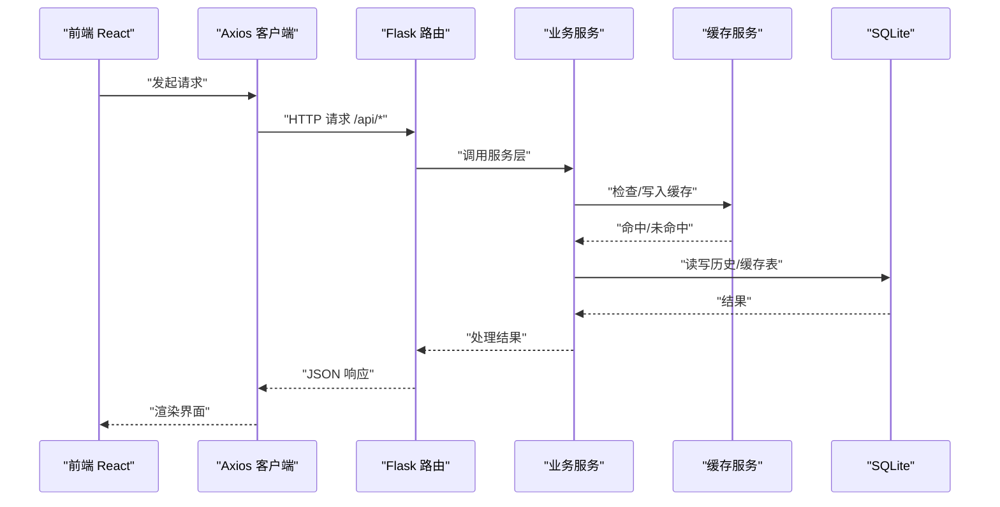
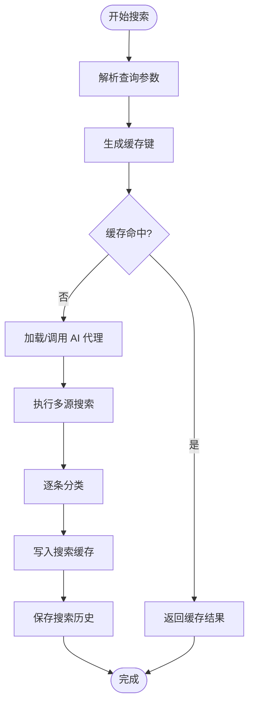
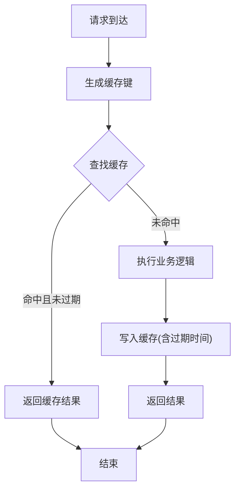
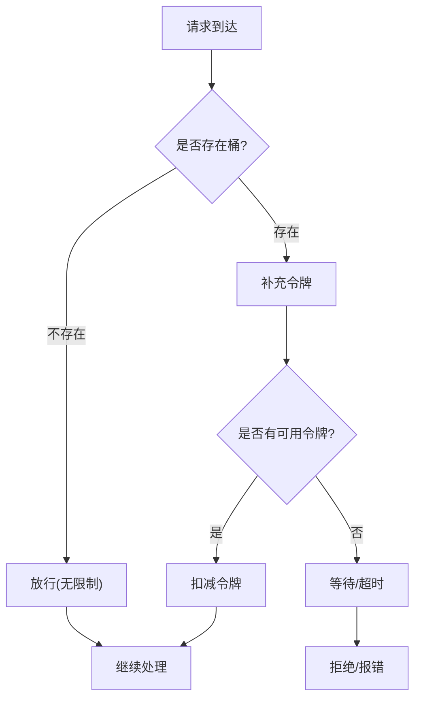
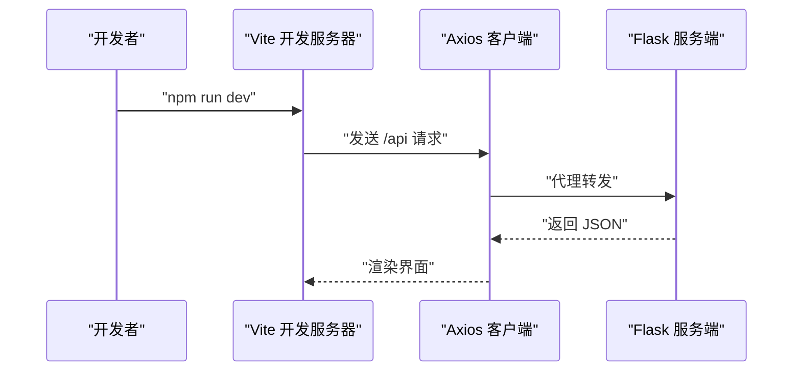
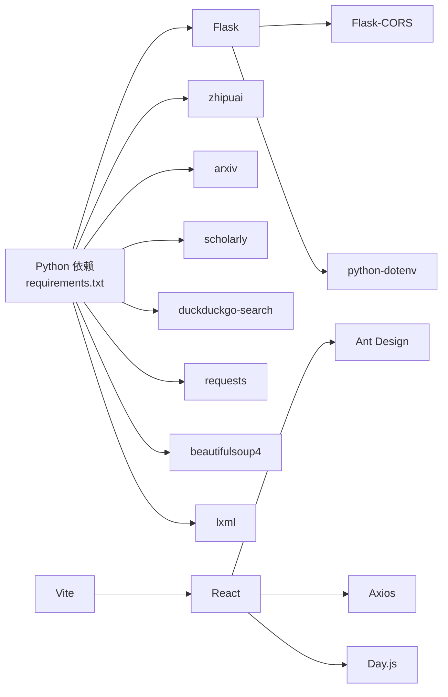

# 系统架构设计

<cite>
**本文档引用的文件**
- [README.md](file://README.md)
- [backend/app.py](file://backend/app.py)
- [backend/config.py](file://backend/config.py)
- [backend/routes/search.py](file://backend/routes/search.py)
- [backend/routes/analysis.py](file://backend/routes/analysis.py)
- [backend/routes/download.py](file://backend/routes/download.py)
- [backend/routes/history.py](file://backend/routes/history.py)
- [backend/services/search_service.py](file://backend/services/search_service.py)
- [backend/services/cache_service.py](file://backend/services/cache_service.py)
- [backend/services/rate_limiter.py](file://backend/services/rate_limiter.py)
- [backend/models/schemas.py](file://backend/models/schemas.py)
- [.qoder/config.json](file://.qoder/config.json)
- [frontend/src/App.jsx](file://frontend/src/App.jsx)
- [frontend/src/services/api.js](file://frontend/src/services/api.js)
- [frontend/package.json](file://frontend/package.json)
- [frontend/vite.config.js](file://frontend/vite.config.js)
- [backend/requirements.txt](file://backend/requirements.txt)
- [run.sh](file://run.sh)
</cite>

## 目录
1. [引言](#引言)
2. [项目结构](#项目结构)
3. [核心组件](#核心组件)
4. [架构总览](#架构总览)
5. [详细组件分析](#详细组件分析)
6. [依赖关系分析](#依赖关系分析)
7. [性能考量](#性能考量)
8. [故障排查指南](#故障排查指南)
9. [结论](#结论)
10. [附录](#附录)

## 引言
本项目是一个前后端分离的全栈 Web 应用，提供多源内容检索与 AI 智能分析能力。系统采用 Flask 作为后端框架，React 作为前端框架，通过 RESTful API 进行通信；后端以服务化组件划分实现微服务化风格的模块化设计；前端通过 Vite 构建并使用 Axios 发起 API 请求。系统具备 AI 代理系统、多级缓存策略、速率限制、SQLite 数据持久化等核心架构组件。

## 项目结构
项目采用清晰的分层与功能模块组织：
- 后端 backend：包含应用入口、配置管理、路由蓝图、服务层、数据模型与工具
- 前端 frontend：包含 React 组件、自定义 Hooks、API 服务与构建配置
- 配置 .qoder：运行时配置（速率限制、搜索默认值、下载设置、分析设置）
- 数据 data：SQLite 数据库与下载目录
- 运维 run.sh：一键安装与启动脚本

**图表来源**
- [backend/app.py](file://backend/app.py#L21-L67)
- [backend/config.py](file://backend/config.py#L15-L84)
- [backend/routes/search.py](file://backend/routes/search.py#L1-L28)
- [backend/routes/analysis.py](file://backend/routes/analysis.py#L1-L66)
- [backend/routes/download.py](file://backend/routes/download.py#L1-L98)
- [backend/routes/history.py](file://backend/routes/history.py#L1-L33)
- [backend/services/search_service.py](file://backend/services/search_service.py#L1-L98)
- [backend/services/cache_service.py](file://backend/services/cache_service.py#L1-L104)
- [backend/services/rate_limiter.py](file://backend/services/rate_limiter.py#L1-L75)
- [backend/models/schemas.py](file://backend/models/schemas.py#L1-L38)
- [.qoder/config.json](file://.qoder/config.json#L1-L31)
- [frontend/src/App.jsx](file://frontend/src/App.jsx#L1-L149)
- [frontend/src/services/api.js](file://frontend/src/services/api.js#L1-L32)
- [frontend/vite.config.js](file://frontend/vite.config.js#L1-L20)

**章节来源**
- [README.md](file://README.md#L376-L404)
- [backend/app.py](file://backend/app.py#L21-L67)
- [frontend/src/App.jsx](file://frontend/src/App.jsx#L16-L148)

## 核心组件
- Flask 应用与蓝图：统一注册搜索、分析、下载、历史四个蓝图，提供静态资源托管与全局异常处理
- 配置中心：合并 .env 与 .qoder/config.json，集中管理 API 密钥、数据库路径、下载目录、速率限制、搜索默认值、分析设置等
- 服务层：搜索服务负责多源聚合、分类、缓存与历史持久化；缓存服务提供搜索与分析两级缓存；速率限制器基于令牌桶算法
- 数据模型：SQLite 表结构包括搜索历史、搜索缓存、分析缓存、下载记录
- 前端应用：React 组件树，Axios 作为 API 客户端，Vite 提供开发代理与构建

**章节来源**
- [backend/config.py](file://backend/config.py#L15-L84)
- [backend/services/search_service.py](file://backend/services/search_service.py#L28-L98)
- [backend/services/cache_service.py](file://backend/services/cache_service.py#L16-L104)
- [backend/services/rate_limiter.py](file://backend/services/rate_limiter.py#L45-L75)
- [backend/models/schemas.py](file://backend/models/schemas.py#L1-L38)
- [frontend/src/services/api.js](file://frontend/src/services/api.js#L4-L31)

## 架构总览
系统采用前后端分离与 RESTful API 设计，后端以服务化组件实现微服务化风格的模块划分。前端通过 Vite 开发服务器代理 /api 请求至 Flask 后端，生产模式下由 Flask 托管前端静态资源。

**图表来源**
- [frontend/vite.config.js](file://frontend/vite.config.js#L6-L14)
- [backend/app.py](file://backend/app.py#L29-L59)
- [backend/routes/search.py](file://backend/routes/search.py#L10-L27)
- [backend/routes/analysis.py](file://backend/routes/analysis.py#L10-L65)
- [backend/routes/download.py](file://backend/routes/download.py#L14-L97)
- [backend/routes/history.py](file://backend/routes/history.py#L10-L32)
- [backend/services/search_service.py](file://backend/services/search_service.py#L28-L98)
- [backend/services/cache_service.py](file://backend/services/cache_service.py#L30-L103)
- [backend/services/rate_limiter.py](file://backend/services/rate_limiter.py#L45-L75)
- [backend/models/schemas.py](file://backend/models/schemas.py#L1-L38)

## 详细组件分析

### Flask 应用与静态资源托管
- 应用创建：读取配置、启用 CORS、注册蓝图、SPA 资源回退
- 静态资源：生产模式下由 Flask 托管前端 dist 目录，未命中 API 的路径回退到 index.html
- 全局异常处理：捕获未处理异常并返回统一错误响应

**图表来源**
- [backend/app.py](file://backend/app.py#L21-L67)

**章节来源**
- [backend/app.py](file://backend/app.py#L21-L78)

### RESTful API 设计
- 搜索接口：POST /api/search，接收查询词、数据源与过滤条件，返回结果集与各数据源状态
- 分析接口：POST /api/analysis/summarize、/api/analysis/translate、/api/analysis/paper
- 下载接口：POST /api/download/arxiv、GET /api/download/status/<id>、GET /api/download/file/<id>、GET /api/download/history
- 历史接口：GET /api/history、DELETE /api/history

**图表来源**
- [backend/routes/search.py](file://backend/routes/search.py#L10-L27)
- [backend/routes/analysis.py](file://backend/routes/analysis.py#L10-L65)
- [backend/routes/download.py](file://backend/routes/download.py#L14-L97)
- [backend/routes/history.py](file://backend/routes/history.py#L10-L32)
- [backend/services/search_service.py](file://backend/services/search_service.py#L28-L98)
- [backend/services/cache_service.py](file://backend/services/cache_service.py#L30-L103)
- [backend/models/schemas.py](file://backend/models/schemas.py#L1-L38)

**章节来源**
- [README.md](file://README.md#L229-L274)
- [backend/routes/search.py](file://backend/routes/search.py#L10-L27)
- [backend/routes/analysis.py](file://backend/routes/analysis.py#L10-L65)
- [backend/routes/download.py](file://backend/routes/download.py#L14-L97)
- [backend/routes/history.py](file://backend/routes/history.py#L10-L32)

### 搜索服务与 AI 代理系统
- 多源聚合：延迟初始化 AI 代理，调用代理执行多数据源搜索
- 结果分类：对每个结果进行内容分类（学术论文、博客、问答、论坛、网页）
- 缓存与历史：生成缓存键、写入搜索缓存、保存搜索历史

**图表来源**
- [backend/services/search_service.py](file://backend/services/search_service.py#L28-L98)

**章节来源**
- [backend/services/search_service.py](file://backend/services/search_service.py#L19-L67)

### 缓存策略
- 搜索缓存：基于查询参数哈希，带过期时间，定期清理过期项
- 分析缓存：基于内容与分析类型哈希，7 天过期，自动清理过期项
- 缓存键生成：对查询参数排序序列化后取 MD5，保证键一致性

**图表来源**
- [backend/services/cache_service.py](file://backend/services/cache_service.py#L16-L103)

**章节来源**
- [backend/services/cache_service.py](file://backend/services/cache_service.py#L16-L104)
- [.qoder/config.json](file://.qoder/config.json#L8-L13)

### 速率限制
- 令牌桶算法：为不同数据源配置容量与补充速率
- 线程安全：使用锁与定时补充，避免并发竞争
- 超时控制：获取令牌支持超时等待，超时则拒绝请求

**图表来源**
- [backend/services/rate_limiter.py](file://backend/services/rate_limiter.py#L5-L75)

**章节来源**
- [backend/services/rate_limiter.py](file://backend/services/rate_limiter.py#L45-L75)
- [.qoder/config.json](file://.qoder/config.json#L2-L7)

### 前端集成与开发体验
- Axios 客户端：统一基础路径、超时与错误拦截
- Vite 开发代理：将 /api 请求转发至 Flask 服务端口
- 组件化架构：App.jsx 整合搜索、过滤、分析、下载、历史等组件

**图表来源**
- [frontend/vite.config.js](file://frontend/vite.config.js#L6-L14)
- [frontend/src/services/api.js](file://frontend/src/services/api.js#L4-L31)
- [frontend/src/App.jsx](file://frontend/src/App.jsx#L16-L148)

**章节来源**
- [frontend/package.json](file://frontend/package.json#L1-L24)
- [frontend/vite.config.js](file://frontend/vite.config.js#L1-L20)
- [frontend/src/services/api.js](file://frontend/src/services/api.js#L1-L32)
- [frontend/src/App.jsx](file://frontend/src/App.jsx#L16-L148)

## 依赖关系分析
- 后端依赖：Flask、Flask-CORS、zhipuai、arxiv、scholarly、duckduckgo-search、requests、beautifulsoup4、lxml、python-dotenv
- 前端依赖：React、Ant Design、Axios、Day.js、Vite
- 运维：一键启动脚本自动创建虚拟环境、安装依赖、构建前端、启动服务

**图表来源**
- [backend/requirements.txt](file://backend/requirements.txt#L1-L11)
- [frontend/package.json](file://frontend/package.json#L11-L22)

**章节来源**
- [backend/requirements.txt](file://backend/requirements.txt#L1-L11)
- [frontend/package.json](file://frontend/package.json#L1-L24)
- [run.sh](file://run.sh#L9-L49)

## 性能考量
- 并发与异步：多数据源并发搜索，结合线程池与异步执行提升吞吐
- 缓存优化：搜索与分析双层缓存，降低重复请求与 LLM 调用成本
- 速率限制：针对不同外部 API 的令牌桶限流，避免被封禁或触发 429
- 数据库 WAL：SQLite 使用 WAL 模式提升并发读写性能
- 前端构建：Vite 快速冷启动与热更新，生产构建优化资源体积

## 故障排查指南
- 搜索为空：确认关键词是否符合数据源要求（如 arXiv 仅支持英文），查看后端日志定位错误
- AI 分析不可用：检查 .env 中 API 密钥配置与 .qoder/config.json 中 provider 设置
- PDF 下载失败：检查下载目录权限、arXiv 镜像可用性与下载记录状态
- 429 错误：调整 .qoder/config.json 中速率限制参数或降低并发
- 前端无法访问 API：确认 Vite 代理配置与 Flask CORS 允许的来源

**章节来源**
- [README.md](file://README.md#L361-L375)
- [frontend/vite.config.js](file://frontend/vite.config.js#L8-L13)
- [backend/app.py](file://backend/app.py#L32-L33)

## 结论
本系统通过前后端分离与 RESTful API 实现清晰的职责边界，后端以服务化组件实现微服务化风格的模块化设计，结合 AI 代理系统、多级缓存与速率限制，形成高可用、可扩展的检索与分析平台。前端采用 React + Vite 提供优秀的开发体验与用户体验。整体架构在易用性、可维护性与扩展性之间取得良好平衡，适合进一步演进为更复杂的分布式系统。

## 附录
- 环境变量与配置：参考 .env.example 与 .qoder/config.json 的键值说明
- 一键启动：run.sh 自动完成虚拟环境、依赖安装、前端构建与服务启动
- API 文档：参考 README.md 的接口定义与示例

**章节来源**
- [README.md](file://README.md#L48-L111)
- [run.sh](file://run.sh#L1-L50)