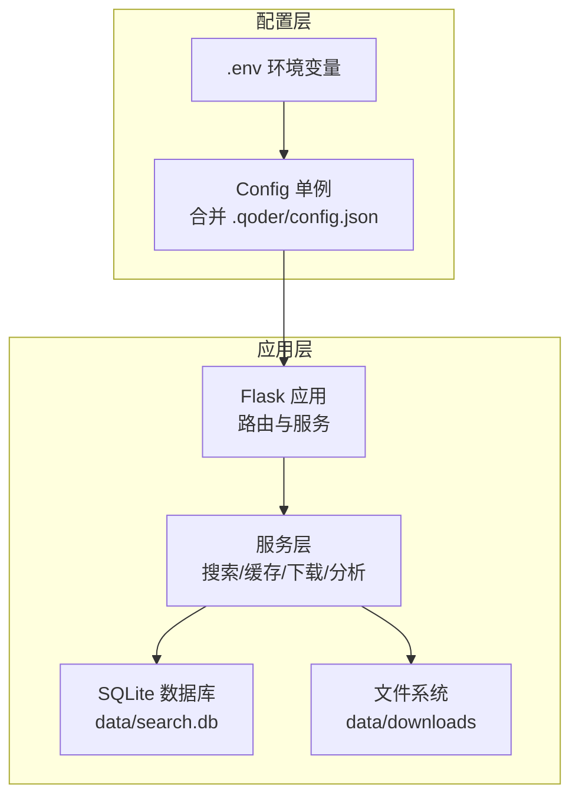
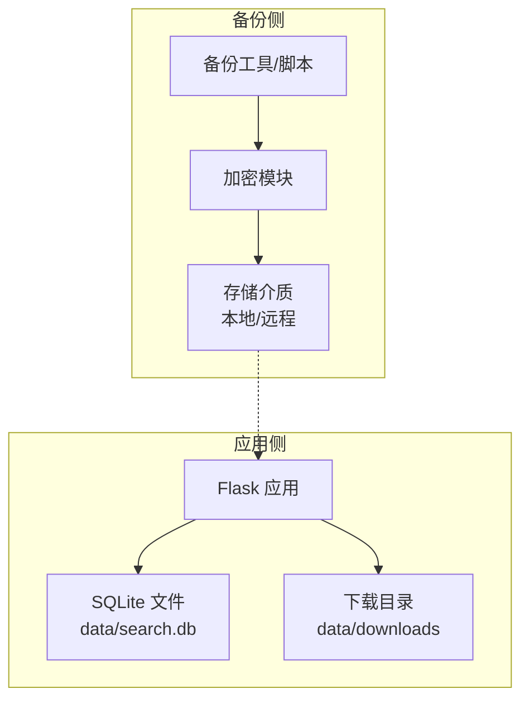
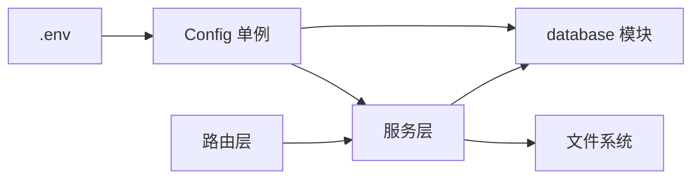

# 备份与恢复

<cite>
**本文引用的文件**
- [backend/models/database.py](file://backend/models/database.py)
- [backend/config.py](file://backend/config.py)
- [backend/models/schemas.py](file://backend/models/schemas.py)
- [backend/services/cache_service.py](file://backend/services/cache_service.py)
- [backend/services/search_service.py](file://backend/services/search_service.py)
- [backend/routes/history.py](file://backend/routes/history.py)
- [backend/routes/download.py](file://backend/routes/download.py)
- [.env](file://.env)
- [run.sh](file://run.sh)
- [backend/utils/logger.py](file://backend/utils/logger.py)
</cite>

## 目录
1. [简介](#简介)
2. [项目结构](#项目结构)
3. [核心组件](#核心组件)
4. [架构总览](#架构总览)
5. [详细组件分析](#详细组件分析)
6. [依赖关系分析](#依赖关系分析)
7. [性能考量](#性能考量)
8. [故障排查指南](#故障排查指南)
9. [结论](#结论)
10. [附录](#附录)

## 简介
本文件面向 Search Is All You Need 的运维与平台工程团队，系统化阐述数据备份与灾难恢复策略。重点覆盖以下方面：
- SQLite 数据库的备份方法：在线备份、离线备份与增量备份策略
- 搜索历史、下载记录与缓存数据的备份方案
- 自动化备份脚本与定时任务配置建议
- 数据恢复流程：完整恢复、部分恢复与数据修复
- 备份验证、备份加密与异地备份策略
- 故障转移与高可用部署方案
- 备份监控与告警配置
- RTO/RPO 指标与业务连续性计划

## 项目结构
项目采用后端（Flask）+ 前端（Vite 构建产物）的单体式部署形态，数据持久化依赖 SQLite 文件。核心数据目录与配置如下：
- 数据库文件：data/search.db
- 下载目录：data/downloads
- 配置来源：.env 与 .qoder/config.json 合并加载
- 运行入口：run.sh 负责虚拟环境、依赖安装与启动

图表来源
- [backend/config.py](file://backend/config.py#L15-L84)
- [backend/models/database.py](file://backend/models/database.py#L11-L21)
- [.env](file://.env#L13-L17)
- [run.sh](file://run.sh#L46-L49)

章节来源
- [backend/config.py](file://backend/config.py#L15-L84)
- [backend/models/database.py](file://backend/models/database.py#L11-L21)
- [.env](file://.env#L13-L17)
- [run.sh](file://run.sh#L46-L49)

## 核心组件
- 数据库连接与初始化
  - 线程本地连接、WAL 日志模式、超时与外键约束设置
  - 初始化时执行建表脚本
- 缓存服务
  - 搜索结果缓存与分析结果缓存，含 TTL 清理
- 搜索服务
  - 查询缓存命中优先、分类标注、历史记录落库
- 路由与数据对象
  - 历史查询接口、下载任务接口与状态查询、文件分发
- 配置与运行
  - Config 单例合并 .env 与 .qoder/config.json；run.sh 提供一键安装与启动

章节来源
- [backend/models/database.py](file://backend/models/database.py#L11-L50)
- [backend/models/schemas.py](file://backend/models/schemas.py#L1-L37)
- [backend/services/cache_service.py](file://backend/services/cache_service.py#L28-L103)
- [backend/services/search_service.py](file://backend/services/search_service.py#L28-L97)
- [backend/routes/history.py](file://backend/routes/history.py#L10-L32)
- [backend/routes/download.py](file://backend/routes/download.py#L14-L97)
- [backend/config.py](file://backend/config.py#L15-L84)
- [run.sh](file://run.sh#L10-L49)

## 架构总览
下图展示备份与恢复在系统中的位置与交互：

图表来源
- [backend/models/database.py](file://backend/models/database.py#L11-L21)
- [backend/config.py](file://backend/config.py#L35-L48)
- [run.sh](file://run.sh#L46-L49)

## 详细组件分析

### 数据库备份策略
- 在线备份（WAL 模式）
  - 当前数据库已启用 WAL 模式，支持读写并发，适合在线热备
  - 建议使用 SQLite 官方在线备份 API 或 sqlite3 online backup 命令进行一致性复制
  - 备份窗口应避开高峰写入时段，或在只读副本上执行
- 离线备份（停机备份）
  - 停止应用后复制 data/search.db，确保无进程占用
  - 适用于需要快照级一致性且可接受停机时间的场景
- 增量备份策略
  - 基于 WAL 日志的增量：结合 SQLite WAL 增量日志与归档策略
  - 基于时间点：每日全备 + 每小时增量，保留多版本以便快速回滚
  - 建议对 data/search.db 与 data/downloads 目录分别制定备份策略

章节来源
- [backend/models/database.py](file://backend/models/database.py#L17-L18)
- [backend/config.py](file://backend/config.py#L35-L48)

### 搜索历史、下载记录与缓存数据备份方案
- 搜索历史（search_history）
  - 结构：包含查询文本、过滤器、结果数量与时间戳
  - 备份：随数据库全量备份一并保护
- 搜索缓存（search_cache）
  - 结构：查询哈希、结果 JSON、过期时间
  - 备份：随数据库全量备份；可按需在恢复后重建缓存
- 分析缓存（analysis_cache）
  - 结构：内容哈希、分析类型、结果 JSON、时间戳
  - 备份：随数据库全量备份；可按需在恢复后重建缓存
- 下载记录（download_records）
  - 结构：标题、URL、PDF 路径、状态、文件大小与时间戳
  - 备份：数据库全量备份 + data/downloads 目录的文件级备份

章节来源
- [backend/models/schemas.py](file://backend/models/schemas.py#L1-L37)
- [backend/services/cache_service.py](file://backend/services/cache_service.py#L28-L103)
- [backend/routes/download.py](file://backend/routes/download.py#L14-L97)

### 自动化备份脚本与定时任务配置
- 备份脚本建议
  - 全量备份：停止应用后复制 data/search.db，并打包 data/downloads
  - 在线备份：使用 sqlite3 在线备份命令生成一致快照
  - 增量备份：基于 WAL 的增量归档
- 加密与传输
  - 备份完成后使用对称加密（如 GPG/openssl）加密
  - 通过 SFTP/SCP/云存储 SDK 上传至远端存储
- 定时任务
  - 使用 cron 每日/每小时触发备份脚本
  - 失败告警：通过邮件/IM 推送失败信息

（本节为通用实践建议，不直接分析具体文件）

### 数据恢复流程
- 完整恢复
  - 停机或切换到只读副本
  - 恢复 data/search.db 与 data/downloads
  - 启动应用，验证数据库连通性与关键接口
- 部分恢复
  - 仅恢复 search_history 或 download_records 表，保持其他数据不变
  - 使用 SQL 导入/替换目标表数据
- 数据修复
  - 对比校验和：对 data/downloads 中的文件计算校验和，修复缺失或损坏文件
  - 数据库修复：使用 sqlite3 VACUUM/REINDEX 修复索引与碎片

（本节为通用实践建议，不直接分析具体文件）

### 备份验证、备份加密与异地备份
- 备份验证
  - 校验和：对备份文件与原始文件分别计算校验和并比对
  - 抽样恢复：定期进行抽样恢复演练，验证备份可用性
- 备份加密
  - 使用对称加密算法对备份文件加密，密钥安全存储于密管系统
- 异地备份
  - 将加密后的备份上传至对象存储（如 OSS/COS/S3），跨地域冗余

（本节为通用实践建议，不直接分析具体文件）

### 故障转移与高可用部署
- 主从架构
  - 一主多从：主节点负责写入，从节点提供只读服务与备份源
  - 切换策略：自动/手动切换，确保最小停机时间
- 读写分离
  - 读请求路由到从节点，写请求路由到主节点
- 存储高可用
  - 使用共享存储或分布式文件系统，保障 data/downloads 与数据库文件的高可用

（本节为通用实践建议，不直接分析具体文件）

### 备份监控与告警配置
- 监控项
  - 备份任务执行状态、备份文件大小、加密完整性、远端传输成功率
- 告警
  - 失败即告警；对延迟/容量/错误率设置阈值告警
- 日志
  - 统一日志格式，便于审计与问题定位

章节来源
- [backend/utils/logger.py](file://backend/utils/logger.py#L5-L22)

## 依赖关系分析
- 配置依赖
  - Config 单例从 .env 与 .qoder/config.json 合并加载，决定 DATABASE_PATH 与 DOWNLOAD_DIR
- 数据库依赖
  - database 模块提供线程本地连接与初始化；search_service 与 cache_service 通过 get_connection 访问数据库
- 路由依赖
  - history 与 download 路由调用服务层以访问数据库与文件系统

图表来源
- [backend/config.py](file://backend/config.py#L15-L84)
- [backend/models/database.py](file://backend/models/database.py#L11-L50)
- [backend/services/search_service.py](file://backend/services/search_service.py#L70-L97)
- [backend/routes/history.py](file://backend/routes/history.py#L10-L32)
- [backend/routes/download.py](file://backend/routes/download.py#L14-L97)

章节来源
- [backend/config.py](file://backend/config.py#L15-L84)
- [backend/models/database.py](file://backend/models/database.py#L11-L50)
- [backend/services/search_service.py](file://backend/services/search_service.py#L70-L97)
- [backend/routes/history.py](file://backend/routes/history.py#L10-L32)
- [backend/routes/download.py](file://backend/routes/download.py#L14-L97)

## 性能考量
- WAL 模式提升并发读写能力，降低锁竞争
- 缓存 TTL 与清理策略减少数据库压力
- 备份窗口规划避免与高峰期冲突
- 增量备份与压缩减少存储与网络开销

章节来源
- [backend/models/database.py](file://backend/models/database.py#L17-L18)
- [backend/services/cache_service.py](file://backend/services/cache_service.py#L91-L103)

## 故障排查指南
- 数据库连接异常
  - 检查 DATABASE_PATH 是否存在且可写
  - 确认线程本地连接未泄漏，必要时调用关闭函数
- 备份失败
  - 校验磁盘空间、权限与网络连通性
  - 查看备份日志与告警
- 恢复后数据不一致
  - 对比校验和，必要时重新导入或修复索引
- 缓存异常
  - 检查 TTL 设置与清理任务是否正常执行

章节来源
- [backend/models/database.py](file://backend/models/database.py#L36-L50)
- [backend/utils/logger.py](file://backend/utils/logger.py#L5-L22)

## 结论
通过 WAL 模式、分层备份策略与自动化流程，Search Is All You Need 可实现稳定可靠的数据保护。建议结合实际业务负载与合规要求，细化备份窗口、保留周期与恢复演练频率，持续优化 RTO/RPO 指标。

## 附录
- 关键路径参考
  - 数据库初始化与连接：[backend/models/database.py](file://backend/models/database.py#L11-L50)
  - 配置加载与路径：[backend/config.py](file://backend/config.py#L35-L48)、[.env](file://.env#L13-L17)
  - 搜索历史与缓存：[backend/services/search_service.py](file://backend/services/search_service.py#L70-L97)、[backend/services/cache_service.py](file://backend/services/cache_service.py#L28-L103)
  - 下载与文件：[backend/routes/download.py](file://backend/routes/download.py#L14-L97)
  - 日志输出：[backend/utils/logger.py](file://backend/utils/logger.py#L5-L22)
  - 启动流程：[run.sh](file://run.sh#L46-L49)