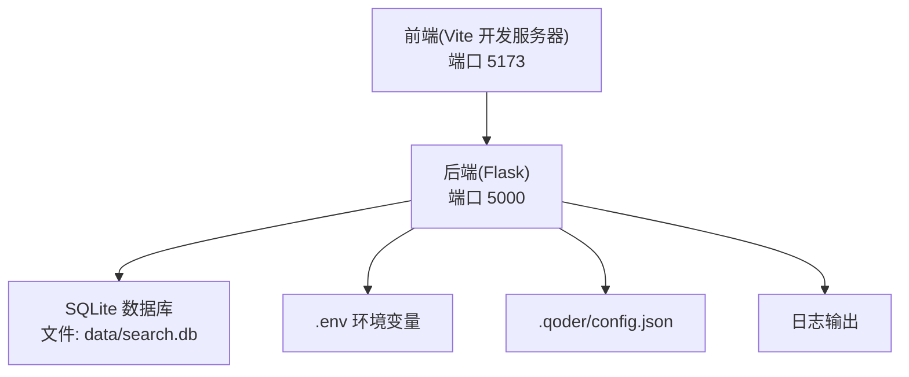
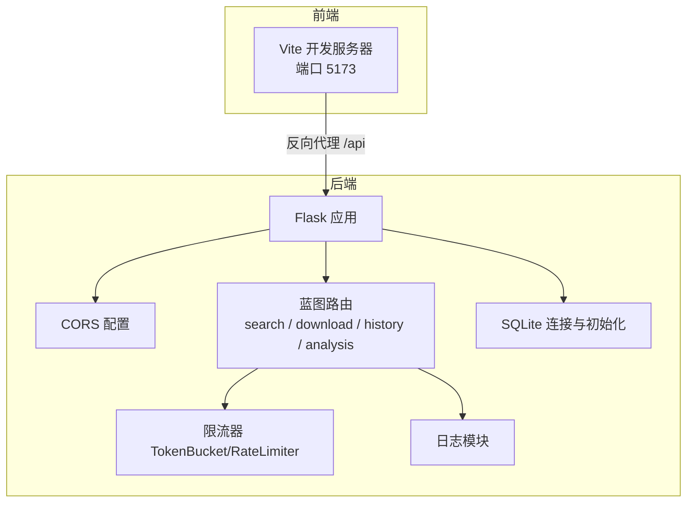
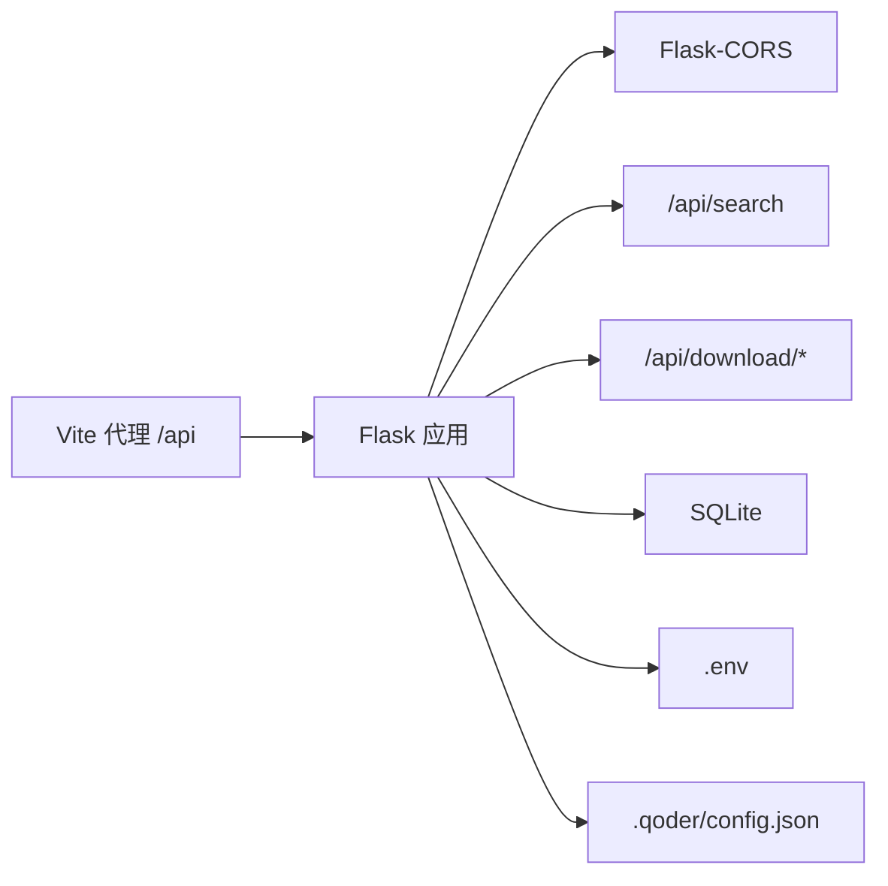

# 安全加固

<cite>
**本文引用的文件**
- [backend/app.py](file://backend/app.py)
- [backend/config.py](file://backend/config.py)
- [backend/utils/logger.py](file://backend/utils/logger.py)
- [backend/services/rate_limiter.py](file://backend/services/rate_limiter.py)
- [.env](file://.env)
- [.qoder/config.json](file://.qoder/config.json)
- [backend/models/database.py](file://backend/models/database.py)
- [backend/routes/search.py](file://backend/routes/search.py)
- [backend/routes/download.py](file://backend/routes/download.py)
- [run.sh](file://run.sh)
- [backend/requirements.txt](file://backend/requirements.txt)
- [frontend/vite.config.js](file://frontend/vite.config.js)
</cite>

## 目录
1. [简介](#简介)
2. [项目结构](#项目结构)
3. [核心组件](#核心组件)
4. [架构总览](#架构总览)
5. [详细组件分析](#详细组件分析)
6. [依赖关系分析](#依赖关系分析)
7. [性能与安全特性](#性能与安全特性)
8. [故障排查指南](#故障排查指南)
9. [结论](#结论)
10. [附录](#附录)

## 简介
本文件面向“Search Is All You Need”项目，提供系统性的安全加固建议与实施要点，覆盖跨域配置、API安全防护（限流、请求校验）、敏感信息保护（环境变量与密钥管理、日志脱敏）、数据库安全（访问控制与SQL相关风险防护）、文件上传与下载安全、XSS与CSRF防护、安全审计与入侵检测、以及安全扫描与渗透测试实践。本文所有建议均基于当前仓库中的实现与配置进行评估，并给出可操作的改进方向。

## 项目结构
后端采用Flask应用，前端通过Vite开发服务器运行在本地端口，开发模式下通过反向代理将/api前缀转发到后端。后端负责API路由、限流、日志与数据库初始化；配置由环境变量与.qoder配置文件共同决定；数据库为SQLite，使用线程局部连接与WAL模式提升并发与可靠性。

图表来源
- [backend/app.py](file://backend/app.py#L21-L78)
- [frontend/vite.config.js](file://frontend/vite.config.js#L6-L14)
- [backend/config.py](file://backend/config.py#L35-L37)
- [backend/models/database.py](file://backend/models/database.py#L36-L43)
- [.env](file://.env#L13-L14)

章节来源
- [backend/app.py](file://backend/app.py#L21-L78)
- [frontend/vite.config.js](file://frontend/vite.config.js#L1-L20)
- [backend/config.py](file://backend/config.py#L1-L85)
- [backend/models/database.py](file://backend/models/database.py#L1-L51)
- [.env](file://.env#L1-L22)

## 核心组件
- 应用入口与CORS：应用创建函数中配置CORS，仅允许本地开发源；生产部署需根据实际域名调整。
- 配置体系：环境变量与.qoder配置文件合并，集中管理密钥、端口、限流、搜索默认参数等。
- 日志模块：统一格式化日志输出，便于审计与问题定位。
- 限流模块：基于令牌桶算法的多来源限流器，支持按来源动态配置。
- 数据库：SQLite连接池式封装，启用WAL与超时、外键约束等安全与稳定性参数。
- 路由层：搜索与下载接口对输入进行基础校验，异常统一处理并记录日志。

章节来源
- [backend/app.py](file://backend/app.py#L21-L78)
- [backend/config.py](file://backend/config.py#L15-L85)
- [backend/utils/logger.py](file://backend/utils/logger.py#L1-L23)
- [backend/services/rate_limiter.py](file://backend/services/rate_limiter.py#L1-L75)
- [backend/models/database.py](file://backend/models/database.py#L1-L51)
- [backend/routes/search.py](file://backend/routes/search.py#L1-L28)
- [backend/routes/download.py](file://backend/routes/download.py#L1-L98)

## 架构总览
下图展示前后端交互、CORS策略、API路由、限流与日志的关键节点。

图表来源
- [backend/app.py](file://backend/app.py#L21-L78)
- [frontend/vite.config.js](file://frontend/vite.config.js#L6-L14)
- [backend/services/rate_limiter.py](file://backend/services/rate_limiter.py#L45-L75)
- [backend/utils/logger.py](file://backend/utils/logger.py#L5-L23)
- [backend/models/database.py](file://backend/models/database.py#L36-L43)

## 详细组件分析

### CORS 跨域配置与安全设置
- 当前实现：开发环境下允许本地Vite开发服务器源。
- 建议与注意事项：
  - 生产环境必须显式限定允许的源列表，避免通配符或宽松策略。
  - 明确允许的方法与头部，避免默认暴露过多能力。
  - 若存在Cookie或自定义头部认证，需同步配置相应选项。
  - 反向代理与CORS策略应保持一致，避免绕过。

章节来源
- [backend/app.py](file://backend/app.py#L32-L33)
- [frontend/vite.config.js](file://frontend/vite.config.js#L6-L14)

### API 安全防护：请求频率限制、IP白名单与请求验证
- 请求频率限制：
  - 已实现基于令牌桶的多来源限流器，默认针对不同搜索源设定容量与补充速率。
  - 建议：将限流阈值纳入配置文件，结合来源维度精细化控制；对异常来源可临时降级或阻断。
- IP白名单：
  - 当前未实现IP白名单功能，建议在网关或中间件层增加来源IP校验。
- 请求验证：
  - 搜索接口对查询字段进行基本校验；建议扩展到所有入参字段的类型、长度与格式校验，并引入Schema校验库。
  - 对外部调用的参数进行严格过滤与转义，避免注入类风险。

章节来源
- [backend/services/rate_limiter.py](file://backend/services/rate_limiter.py#L45-L75)
- [.qoder/config.json](file://.qoder/config.json#L2-L7)
- [backend/routes/search.py](file://backend/routes/search.py#L10-L28)

### 敏感信息保护：环境变量加密、API密钥管理与日志脱敏
- 环境变量与密钥：
  - 使用dotenv加载密钥，建议在生产环境使用更安全的密钥管理服务或硬件安全模块。
  - 密钥应定期轮换，最小权限原则分配至各服务。
- 日志脱敏：
  - 日志模块为统一格式化输出，建议在日志中避免直接打印敏感字段（如密钥、完整请求体）。
  - 可在日志处理器中对特定字段进行掩码或替换。
- 配置文件：
  - .qoder/config.json包含限流与默认参数，建议对配置文件进行访问权限控制与完整性校验。

章节来源
- [.env](file://.env#L1-L22)
- [backend/config.py](file://backend/config.py#L11-L12)
- [backend/utils/logger.py](file://backend/utils/logger.py#L15-L22)
- [.qoder/config.json](file://.qoder/config.json#L1-L31)

### 数据库安全配置：访问权限控制与SQL相关风险防护
- 访问权限控制：
  - 数据库文件位于data/search.db，建议限制文件系统访问权限，仅授予运行用户读写。
- SQL相关风险：
  - 当前使用上下文管理器自动提交/回滚，有助于一致性；但未见参数化查询的显式使用。
  - 建议：对所有用户输入进行参数化绑定，避免字符串拼接；对DDL/DML执行进行白名单与审计。
- 其他：
  - 启用WAL模式、超时与外键约束，有助于并发与数据完整性。

章节来源
- [backend/models/database.py](file://backend/models/database.py#L11-L21)
- [backend/models/database.py](file://backend/models/database.py#L24-L34)
- [backend/models/database.py](file://backend/models/database.py#L36-L43)
- [backend/config.py](file://backend/config.py#L35-L37)

### 文件上传与下载安全
- 下载流程：
  - 启动下载、查询状态、返回文件三步，均对下载ID与状态进行检查。
  - 建议：对下载ID进行强随机性生成与唯一索引；对文件路径进行严格校验，防止目录穿越。
- 上传：
  - 当前未发现通用文件上传接口，若后续新增，需限制文件类型、大小与存储位置，并进行病毒扫描与内容检测。

章节来源
- [backend/routes/download.py](file://backend/routes/download.py#L14-L98)

### XSS 与 CSRF 防护
- XSS：
  - 建议：前端渲染时避免内联事件与DOM操作；后端响应头设置Content-Security-Policy，限制脚本来源。
- CSRF：
  - 建议：对有状态修改的POST/PUT/DELETE接口启用CSRF Token，或使用SameSite Cookie策略。

章节来源
- [backend/app.py](file://backend/app.py#L30-L31)

### 安全审计日志与入侵检测
- 审计日志：
  - 统一日志格式，建议增加请求ID、用户标识、时间戳、来源IP、请求路径与状态码等字段。
  - 对异常与高危行为（如频繁失败、异常参数）进行告警。
- 入侵检测：
  - 建议：在网关层集成WAF，对常见攻击模式（如SQL注入、XSS、CC攻击）进行识别与阻断。

章节来源
- [backend/utils/logger.py](file://backend/utils/logger.py#L15-L22)
- [backend/app.py](file://backend/app.py#L62-L65)

### 安全漏洞扫描与渗透测试指南
- 扫描范围：
  - 后端API端点、静态资源、CORS策略、Cookie与会话机制。
- 工具建议：
  - 使用OWASP ZAP/ Burp Suite进行自动化扫描与手工测试。
  - 对CORS、CSRF、XSS、敏感信息泄露、不安全的反向代理等专项测试。
- 流程建议：
  - 制定测试计划与修复优先级；修复后回归测试；上线前进行最终验证。

章节来源
- [backend/requirements.txt](file://backend/requirements.txt#L1-L11)
- [run.sh](file://run.sh#L1-L50)

## 依赖关系分析
后端依赖Flask与Flask-CORS，前端通过Vite代理/api到后端。整体耦合度较低，便于独立演进与加固。

图表来源
- [frontend/vite.config.js](file://frontend/vite.config.js#L8-L12)
- [backend/app.py](file://backend/app.py#L10-L16)
- [backend/requirements.txt](file://backend/requirements.txt#L1-L2)

章节来源
- [backend/requirements.txt](file://backend/requirements.txt#L1-L11)
- [frontend/vite.config.js](file://frontend/vite.config.js#L1-L20)
- [backend/app.py](file://backend/app.py#L1-L18)

## 性能与安全特性
- 限流策略：令牌桶算法具备平滑突发的能力，适合对外部搜索源的访问节流。
- 数据库并发：WAL模式与超时设置提升并发与稳定性。
- 日志可观测性：统一格式化日志，便于问题定位与审计。

章节来源
- [backend/services/rate_limiter.py](file://backend/services/rate_limiter.py#L5-L43)
- [backend/models/database.py](file://backend/models/database.py#L17-L18)

## 故障排查指南
- CORS错误：
  - 确认CORS允许的源是否包含当前前端地址；生产环境需明确域名。
- 限流触发：
  - 检查来源配置与容量/速率参数；必要时临时放宽以定位问题。
- 数据库连接：
  - 关注busy_timeout与WAL模式设置；排查并发过高导致的锁等待。
- 日志与异常：
  - 查看统一日志格式中的错误堆栈；确认全局异常处理器是否生效。

章节来源
- [backend/app.py](file://backend/app.py#L32-L33)
- [backend/services/rate_limiter.py](file://backend/services/rate_limiter.py#L55-L75)
- [backend/models/database.py](file://backend/models/database.py#L17-L18)
- [backend/utils/logger.py](file://backend/utils/logger.py#L15-L22)

## 结论
本项目已具备基础的安全能力（CORS限制、统一日志、限流与数据库基础配置）。建议在生产环境中进一步完善CORS策略、引入IP白名单、增强请求校验与参数化查询、强化密钥与日志管理、完善XSS与CSRF防护，并建立持续的安全扫描与渗透测试流程，以满足更高标准的安全要求。

## 附录
- 开发启动流程：虚拟环境创建、依赖安装、前端构建、.env初始化与后端启动。
- 前端代理配置：将/api前缀代理至后端端口，确保开发体验与生产一致。

章节来源
- [run.sh](file://run.sh#L9-L49)
- [frontend/vite.config.js](file://frontend/vite.config.js#L6-L14)