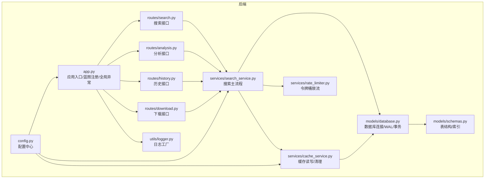
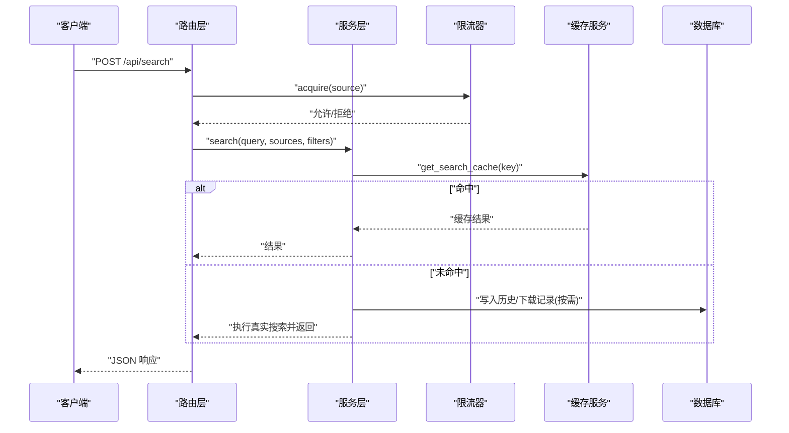
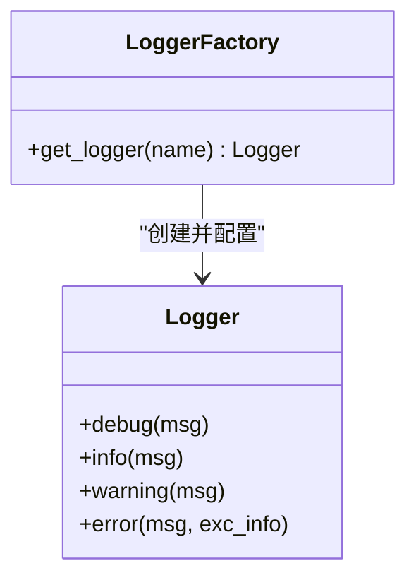
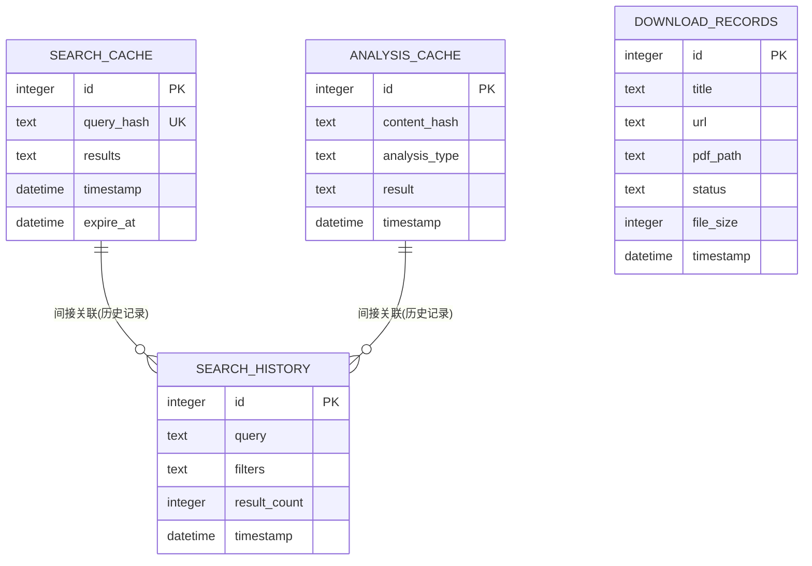
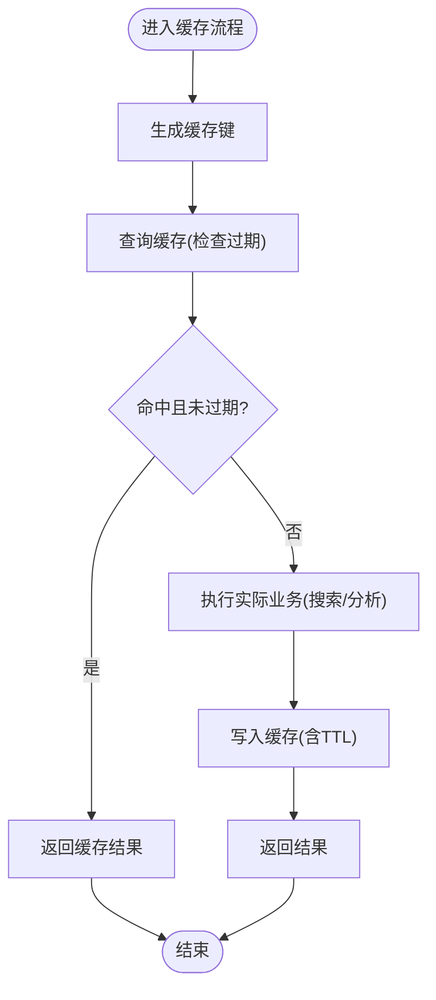
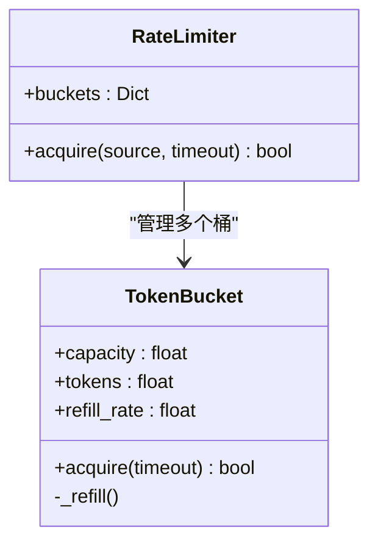
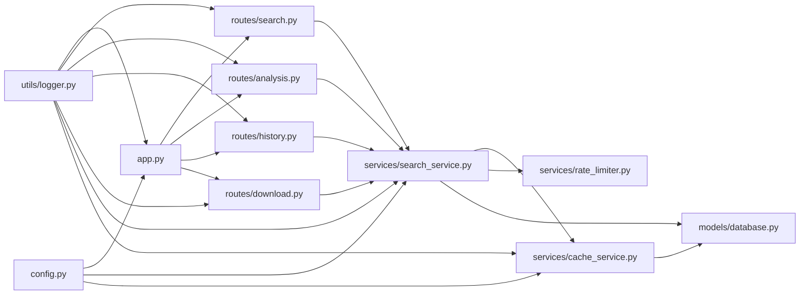

# 监控与维护

<cite>
**本文引用的文件**
- [backend/utils/logger.py](file://backend/utils/logger.py)
- [backend/config.py](file://backend/config.py)
- [backend/models/database.py](file://backend/models/database.py)
- [backend/models/schemas.py](file://backend/models/schemas.py)
- [backend/services/cache_service.py](file://backend/services/cache_service.py)
- [backend/services/rate_limiter.py](file://backend/services/rate_limiter.py)
- [backend/services/search_service.py](file://backend/services/search_service.py)
- [backend/routes/search.py](file://backend/routes/search.py)
- [backend/routes/analysis.py](file://backend/routes/analysis.py)
- [backend/routes/history.py](file://backend/routes/history.py)
- [backend/routes/download.py](file://backend/routes/download.py)
- [backend/app.py](file://backend/app.py)
- [.env.example](file://.env.example)
- [run.sh](file://run.sh)
- [README.md](file://README.md)
</cite>

## 目录
1. [简介](#简介)
2. [项目结构](#项目结构)
3. [核心组件](#核心组件)
4. [架构总览](#架构总览)
5. [详细组件分析](#详细组件分析)
6. [依赖关系分析](#依赖关系分析)
7. [性能监控与指标](#性能监控与指标)
8. [日志系统配置与使用](#日志系统配置与使用)
9. [数据库维护与优化](#数据库维护与优化)
10. [缓存管理策略](#缓存管理策略)
11. [系统资源监控与告警](#系统资源监控与告警)
12. [故障自动恢复机制](#故障自动恢复机制)
13. [定期维护任务清单](#定期维护任务清单)
14. [性能调优建议](#性能调优建议)
15. [结论](#结论)

## 简介
本文件面向运维与开发人员，系统性阐述“Search Is All You Need”的运行监控与日常维护实践。内容覆盖日志系统配置与使用、性能监控指标、数据库维护、缓存管理策略、系统资源监控与告警、故障自动恢复机制以及定期维护任务与性能调优建议。文档以仓库现有实现为基础，结合可扩展的运维建议，帮助保障系统稳定、可观测与可持续演进。

## 项目结构
后端采用 Flask 应用，按功能分层组织：应用入口负责路由注册与全局异常处理；路由层承接 API 请求；服务层封装业务逻辑；模型层负责数据库初始化与连接；工具层提供通用能力（如日志）。配置中心统一读取环境变量与本地 JSON 配置，形成可插拔的运行参数体系。

图表来源
- [backend/app.py](file://backend/app.py#L1-L78)
- [backend/config.py](file://backend/config.py#L1-L85)
- [backend/models/database.py](file://backend/models/database.py#L1-L51)
- [backend/models/schemas.py](file://backend/models/schemas.py#L1-L38)
- [backend/utils/logger.py](file://backend/utils/logger.py#L1-L23)
- [backend/services/search_service.py](file://backend/services/search_service.py#L1-L98)
- [backend/services/cache_service.py](file://backend/services/cache_service.py#L1-L104)
- [backend/services/rate_limiter.py](file://backend/services/rate_limiter.py#L1-L75)
- [backend/routes/search.py](file://backend/routes/search.py#L1-L28)
- [backend/routes/analysis.py](file://backend/routes/analysis.py#L1-L66)
- [backend/routes/history.py](file://backend/routes/history.py#L1-L33)
- [backend/routes/download.py](file://backend/routes/download.py#L1-L98)

章节来源
- [backend/app.py](file://backend/app.py#L1-L78)
- [backend/config.py](file://backend/config.py#L1-L85)
- [backend/models/database.py](file://backend/models/database.py#L1-L51)
- [backend/models/schemas.py](file://backend/models/schemas.py#L1-L38)
- [backend/utils/logger.py](file://backend/utils/logger.py#L1-L23)

## 核心组件
- 日志系统：集中式日志工厂，统一输出格式与级别，便于集中采集与分析。
- 配置中心：融合 .env 与 .qoder/config.json，提供运行期可调参数（如缓存 TTL、限流策略、下载并发等）。
- 数据库层：SQLite（WAL 模式），提供连接复用、事务与外键约束；初始化脚本创建表与索引。
- 缓存服务：基于 SQLite 的两级缓存（搜索结果与分析结果），带过期控制与清理。
- 限流服务：令牌桶算法，按数据源维度进行速率限制。
- 路由与服务：各 API 路由负责参数校验与异常记录，服务层负责业务编排与持久化。

章节来源
- [backend/utils/logger.py](file://backend/utils/logger.py#L1-L23)
- [backend/config.py](file://backend/config.py#L1-L85)
- [backend/models/database.py](file://backend/models/database.py#L1-L51)
- [backend/models/schemas.py](file://backend/models/schemas.py#L1-L38)
- [backend/services/cache_service.py](file://backend/services/cache_service.py#L1-L104)
- [backend/services/rate_limiter.py](file://backend/services/rate_limiter.py#L1-L75)
- [backend/routes/search.py](file://backend/routes/search.py#L1-L28)
- [backend/routes/analysis.py](file://backend/routes/analysis.py#L1-L66)
- [backend/routes/history.py](file://backend/routes/history.py#L1-L33)
- [backend/routes/download.py](file://backend/routes/download.py#L1-L98)

## 架构总览
系统采用前后端分离，后端以 Flask 承载 REST API，静态资源由 Flask 在生产模式下托管。核心业务链路为：路由接收请求 → 参数校验与限流 → 服务层执行搜索/分析/下载 → 缓存命中则返回，否则执行实际逻辑并写入缓存 → 持久化历史/下载记录 → 返回响应。异常统一由全局处理器捕获并记录。

图表来源
- [backend/routes/search.py](file://backend/routes/search.py#L10-L27)
- [backend/services/search_service.py](file://backend/services/search_service.py#L28-L67)
- [backend/services/cache_service.py](file://backend/services/cache_service.py#L30-L52)
- [backend/services/rate_limiter.py](file://backend/services/rate_limiter.py#L64-L74)

## 详细组件分析

### 日志系统
- 日志工厂：创建并配置 StreamHandler，输出到标准输出，格式包含时间戳、级别、模块名与消息体。
- 使用方式：各模块通过 get_logger 获取命名日志器，避免硬编码格式，便于统一管控。
- 输出目标：当前为 stdout，建议在容器/生产环境接入日志收集系统（如 stdout→fluent/flume/promtail→ES/Loki）。

图表来源
- [backend/utils/logger.py](file://backend/utils/logger.py#L5-L22)

章节来源
- [backend/utils/logger.py](file://backend/utils/logger.py#L1-L23)

### 配置中心
- 合并来源：.env 环境变量与 .qoder/config.json，形成单一配置对象。
- 关键项：数据库路径、下载目录、LLM 密钥、速率限制、搜索默认值（含缓存 TTL）、分析设置（含缓存 TTL）。
- 作用域：应用启动、服务层读取、缓存 TTL、限流桶容量与补充速率。

章节来源
- [backend/config.py](file://backend/config.py#L15-L85)
- [.env.example](file://.env.example#L1-L21)

### 数据库层
- 连接模型：线程局部连接，WAL 模式、超时与外键开启，上下文管理器自动提交/回滚。
- 初始化：首次启动创建表与索引，确保 schema 一致性。
- 表与索引：搜索历史、搜索缓存（含过期字段与索引）、分析缓存（含类型与索引）、下载记录。

图表来源
- [backend/models/schemas.py](file://backend/models/schemas.py#L1-L38)
- [backend/models/database.py](file://backend/models/database.py#L36-L43)

章节来源
- [backend/models/database.py](file://backend/models/database.py#L11-L51)
- [backend/models/schemas.py](file://backend/models/schemas.py#L1-L38)

### 缓存服务
- 搜索缓存：以查询参数组合生成哈希键，存储结果与 UTC 过期时间；读取时比较过期时间。
- 分析缓存：以内容片段与类型生成哈希键，存储结果与时间戳；7 天有效期，过期自动清理。
- 清理策略：定时清理过期条目，分别针对搜索缓存（expire_at）与分析缓存（timestamp 截止）。

图表来源
- [backend/services/cache_service.py](file://backend/services/cache_service.py#L30-L86)

章节来源
- [backend/services/cache_service.py](file://backend/services/cache_service.py#L1-L104)

### 限流服务
- 令牌桶：每个数据源独立桶，容量与补充速率可配置；线程安全，支持超时阻塞获取。
- 默认策略：不同数据源设定不同容量与补充速率，避免对上游服务造成冲击。
- 使用位置：路由层在执行外部调用前进行 acquire，未获取到令牌则拒绝请求或降级。

图表来源
- [backend/services/rate_limiter.py](file://backend/services/rate_limiter.py#L5-L74)

章节来源
- [backend/services/rate_limiter.py](file://backend/services/rate_limiter.py#L1-L75)

### 路由与服务交互
- 搜索路由：接收查询参数，校验必填项，调用服务层执行搜索，异常统一记录。
- 分析路由：摘要/翻译/论文分析三类接口，参数校验与异常处理一致。
- 历史路由：查询与清空历史，异常统一记录。
- 下载路由：发起下载、查询状态、提供文件、查询历史，异常统一记录。

章节来源
- [backend/routes/search.py](file://backend/routes/search.py#L10-L27)
- [backend/routes/analysis.py](file://backend/routes/analysis.py#L10-L65)
- [backend/routes/history.py](file://backend/routes/history.py#L10-L32)
- [backend/routes/download.py](file://backend/routes/download.py#L14-L97)

## 依赖关系分析
- 路由依赖服务层，服务层依赖缓存与数据库；缓存依赖数据库；服务层可选依赖限流器。
- 配置中心贯穿应用与服务层，决定缓存 TTL、限流策略、下载并发等行为。
- 日志工厂被各模块依赖，形成统一输出。

图表来源
- [backend/app.py](file://backend/app.py#L12-L39)
- [backend/routes/search.py](file://backend/routes/search.py#L3-L6)
- [backend/routes/analysis.py](file://backend/routes/analysis.py#L3-L6)
- [backend/routes/history.py](file://backend/routes/history.py#L3-L6)
- [backend/routes/download.py](file://backend/routes/download.py#L7-L10)
- [backend/services/search_service.py](file://backend/services/search_service.py#L7-L13)
- [backend/services/cache_service.py](file://backend/services/cache_service.py#L5-L8)
- [backend/services/rate_limiter.py](file://backend/services/rate_limiter.py#L1-L3)
- [backend/config.py](file://backend/config.py#L80-L84)
- [backend/utils/logger.py](file://backend/utils/logger.py#L5-L22)

章节来源
- [backend/app.py](file://backend/app.py#L1-L78)
- [backend/routes/search.py](file://backend/routes/search.py#L1-L28)
- [backend/routes/analysis.py](file://backend/routes/analysis.py#L1-L66)
- [backend/routes/history.py](file://backend/routes/history.py#L1-L33)
- [backend/routes/download.py](file://backend/routes/download.py#L1-L98)
- [backend/services/search_service.py](file://backend/services/search_service.py#L1-L98)
- [backend/services/cache_service.py](file://backend/services/cache_service.py#L1-L104)
- [backend/services/rate_limiter.py](file://backend/services/rate_limiter.py#L1-L75)
- [backend/config.py](file://backend/config.py#L1-L85)
- [backend/utils/logger.py](file://backend/utils/logger.py#L1-L23)

## 性能监控与指标
以下指标建议结合日志与外部监控系统采集（如 Prometheus/Grafana）：

- 响应时间
  - 指标：P50/P90/P95 响应时间（搜索/分析/下载）。
  - 来源：路由层记录请求开始与结束时间，结合日志时间戳计算；或在反向代理/网关层统计。
  - 采集建议：每分钟统计一次，按端点分组。

- 并发连接数
  - 指标：活跃连接数、峰值连接数。
  - 来源：数据库层线程局部连接，可通过 SQLite PRAGMA 或系统级监控采集。
  - 采集建议：每 10 秒采样一次。

- 内存使用
  - 指标：进程 RSS、堆内存（Python GC）。
  - 采集建议：使用系统工具或 Python 监控库，按 15 秒采样。

- 缓存命中率
  - 指标：搜索缓存命中次数 / 总请求数；分析缓存命中次数 / 总请求数。
  - 来源：缓存服务日志中“命中”记录；或在服务层埋点计数。
  - 采集建议：每分钟汇总一次。

- 速率限制触发率
  - 指标：acquire 返回 False 的比例。
  - 来源：限流器日志或埋点。
  - 采集建议：每分钟统计。

- 数据库指标
  - 指标：表大小、索引使用率、锁等待、慢查询。
  - 来源：SQLite PRAGMA 与 EXPLAIN QUERY PLAN。
  - 采集建议：每 5 分钟一次。

章节来源
- [backend/services/cache_service.py](file://backend/services/cache_service.py#L30-L86)
- [backend/services/rate_limiter.py](file://backend/services/rate_limiter.py#L27-L42)
- [backend/models/database.py](file://backend/models/database.py#L11-L21)

## 日志系统配置与使用
- 日志级别
  - 当前：统一 DEBUG 级别，便于开发调试；生产建议根据环境变量切换 INFO/ERROR。
- 输出格式
  - 当前：包含时间戳、级别、模块名与消息体；建议增加请求 ID、用户标识等上下文字段。
- 日志轮转策略
  - 当前：stdout 输出；建议接入 logrotate 或容器日志驱动（如 journald/fluentd）实现按大小/时间轮转。
- 建议
  - 引入结构化日志（JSON），便于机器解析与检索。
  - 为关键路径（搜索、分析、下载）增加采样日志与慢日志告警。

章节来源
- [backend/utils/logger.py](file://backend/utils/logger.py#L15-L18)
- [backend/app.py](file://backend/app.py#L62-L65)
- [backend/routes/search.py](file://backend/routes/search.py#L22-L27)
- [backend/routes/analysis.py](file://backend/routes/analysis.py#L19-L24)
- [backend/routes/history.py](file://backend/routes/history.py#L16-L21)
- [backend/routes/download.py](file://backend/routes/download.py#L37-L39)

## 数据库维护与优化
- 初始化与迁移
  - 首次启动自动创建表与索引；建议在升级时增加版本号与迁移脚本。
- WAL 模式与锁
  - WAL 模式提升并发读写；注意磁盘空间与检查点频率。
- 索引与查询
  - 已创建关键索引（搜索缓存哈希、分析缓存哈希）；建议定期分析查询计划，必要时添加复合索引。
- 清理与压缩
  - 定期清理过期缓存条目；可执行 VACUUM（生产需谨慎，建议在维护窗口）。
- 备份策略
  - 建议每日增量备份，保留最近 N 天全量备份；验证恢复流程。

章节来源
- [backend/models/database.py](file://backend/models/database.py#L17-L18)
- [backend/models/schemas.py](file://backend/models/schemas.py#L17-L26)
- [backend/services/cache_service.py](file://backend/services/cache_service.py#L91-L103)

## 缓存管理策略
- TTL 策略
  - 搜索缓存：由配置中心提供小时级 TTL，默认 24 小时。
  - 分析缓存：固定 7 天 TTL。
- 清理策略
  - 定时清理过期条目；清理日志可用于审计与容量评估。
- 健康检查
  - 建议增加缓存可用性探针（读写测试），失败时告警并降级。
- 调整建议
  - 根据业务热点动态调整 TTL；对长尾内容适当延长分析缓存 TTL。

章节来源
- [backend/config.py](file://backend/config.py#L54-L73)
- [backend/services/cache_service.py](file://backend/services/cache_service.py#L43-L52)
- [backend/services/cache_service.py](file://backend/services/cache_service.py#L65-L75)
- [backend/services/cache_service.py](file://backend/services/cache_service.py#L91-L103)

## 系统资源监控与告警
- CPU/内存/IO
  - 建议使用系统监控工具（如 cAdvisor/Node Exporter）采集进程级指标。
- 网络与外部依赖
  - 监控外部 API 调用成功率、延迟与错误码分布；结合限流器触发率进行联动告警。
- 存储
  - 监控 SQLite 文件大小、磁盘使用率与 inode 使用情况。
- 告警阈值
  - 建议：P95 响应时间超过阈值、错误率上升、缓存命中率骤降、数据库锁等待、磁盘空间不足。

章节来源
- [backend/services/rate_limiter.py](file://backend/services/rate_limiter.py#L48-L53)
- [backend/models/database.py](file://backend/models/database.py#L17-L18)

## 故障自动恢复机制
- 全局异常处理
  - 应用层统一捕获异常并记录，返回标准化错误响应，避免泄露内部细节。
- 限流保护
  - 令牌桶在高并发下可平滑削峰，防止下游雪崩。
- 缓存降级
  - 缓存失效或异常时，服务层可选择返回部分结果或提示稍后再试。
- 数据库连接
  - 线程局部连接具备自动提交/回滚能力，异常时回滚保证一致性。

章节来源
- [backend/app.py](file://backend/app.py#L62-L65)
- [backend/models/database.py](file://backend/models/database.py#L24-L34)
- [backend/services/cache_service.py](file://backend/services/cache_service.py#L30-L52)

## 定期维护任务清单
- 每日
  - 检查日志与错误率，确认缓存命中率与数据库健康。
  - 清理过期缓存条目，核对清理日志。
- 每周
  - 分析慢查询与热点接口，评估索引有效性。
  - 备份数据库，验证恢复流程。
- 每月
  - 评估磁盘空间与增长趋势，规划扩容。
  - 回顾配置变更与限流策略，按业务变化调整。

章节来源
- [backend/services/cache_service.py](file://backend/services/cache_service.py#L91-L103)
- [backend/models/database.py](file://backend/models/database.py#L36-L43)

## 性能调优建议
- 搜索与分析
  - 控制默认数据源数量，避免过度并发导致外部 API 限流。
  - 对热点查询启用更长 TTL，降低外部依赖压力。
- 数据库
  - 根据查询模式增加复合索引；定期分析慢查询。
  - 调整 WAL 检查点与缓冲区参数（视硬件与负载）。
- 缓存
  - 基于命中率与延迟曲线动态调整 TTL；对长文本分析适当延长 TTL。
- 限流
  - 结合外部 API 限流配额与系统承载能力，动态调整桶容量与补充速率。
- 日志
  - 生产环境降低日志级别，启用结构化日志与采样，减少 I/O 压力。

章节来源
- [backend/config.py](file://backend/config.py#L50-L73)
- [backend/services/rate_limiter.py](file://backend/services/rate_limiter.py#L48-L53)
- [backend/models/schemas.py](file://backend/models/schemas.py#L17-L26)

## 结论
本项目在日志、配置、数据库、缓存与限流方面具备清晰的实现与良好的可维护性。建议在生产环境中引入结构化日志、外部监控与告警、定期数据库维护与缓存治理，并结合业务变化持续优化 TTL 与限流策略，以获得更稳健的运行表现与更好的用户体验。