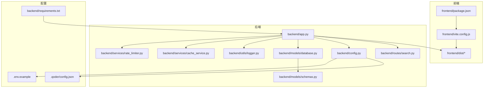
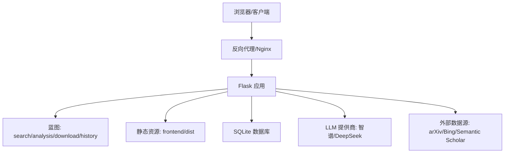
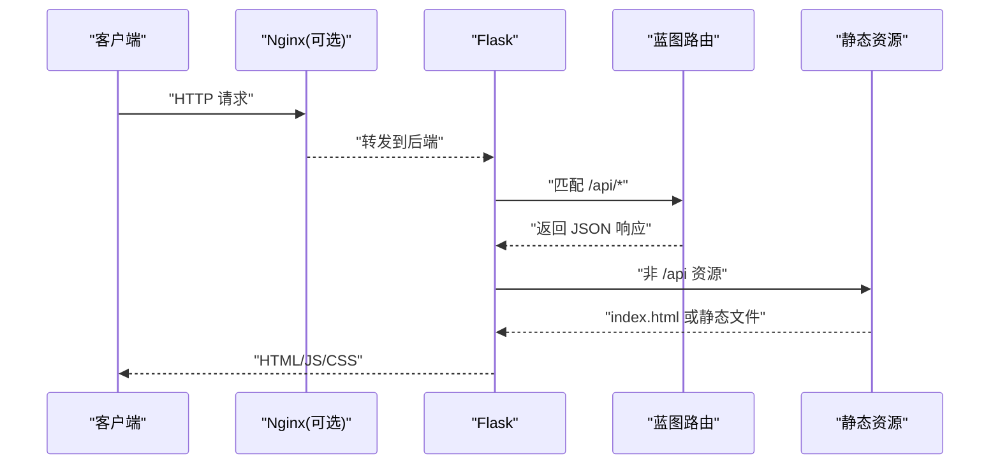
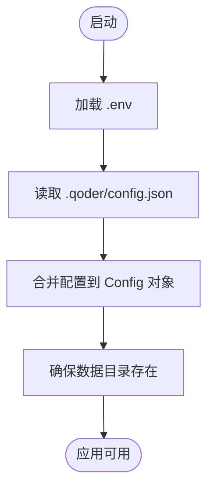
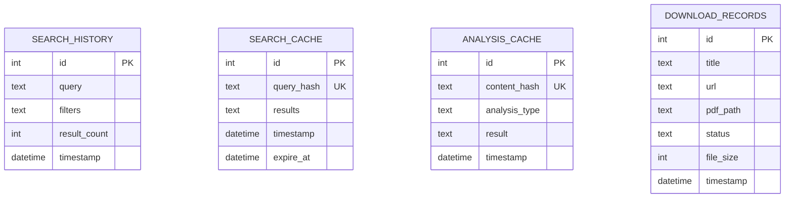
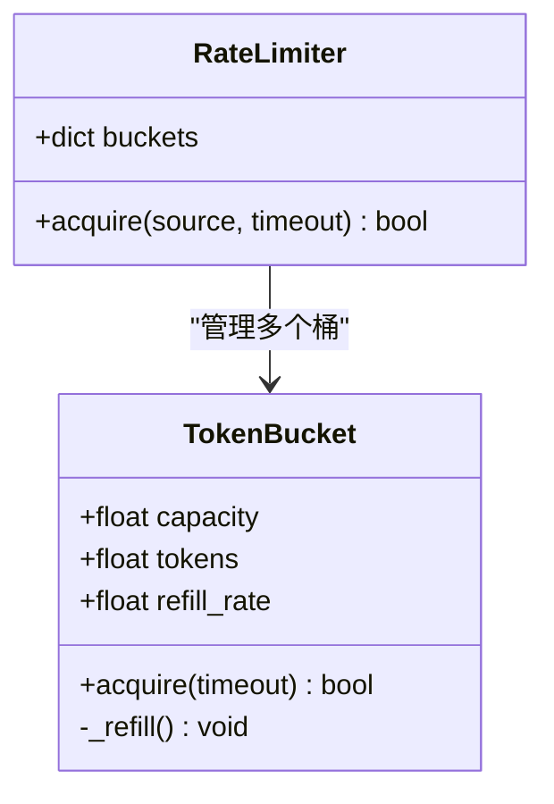
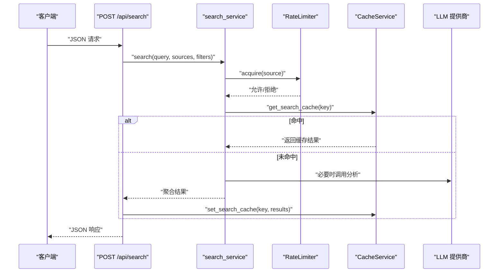
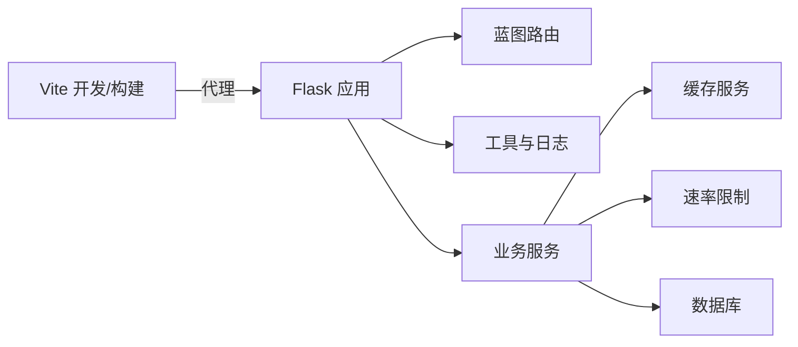

# 部署与运维

<cite>
**本文引用的文件**
- [README.md](file://README.md)
- [run.sh](file://run.sh)
- [.env.example](file://.env.example)
- [backend/app.py](file://backend/app.py)
- [backend/config.py](file://backend/config.py)
- [backend/utils/logger.py](file://backend/utils/logger.py)
- [backend/models/database.py](file://backend/models/database.py)
- [backend/models/schemas.py](file://backend/models/schemas.py)
- [backend/routes/search.py](file://backend/routes/search.py)
- [backend/services/cache_service.py](file://backend/services/cache_service.py)
- [backend/services/rate_limiter.py](file://backend/services/rate_limiter.py)
- [frontend/package.json](file://frontend/package.json)
- [frontend/vite.config.js](file://frontend/vite.config.js)
- [backend/requirements.txt](file://backend/requirements.txt)
- [.qoder/config.json](file://.qoder/config.json)
</cite>

## 目录
1. [简介](#简介)
2. [项目结构](#项目结构)
3. [核心组件](#核心组件)
4. [架构总览](#架构总览)
5. [详细组件分析](#详细组件分析)
6. [依赖关系分析](#依赖关系分析)
7. [性能考虑](#性能考虑)
8. [故障排查指南](#故障排查指南)
9. [结论](#结论)
10. [附录](#附录)

## 简介
本项目为“Search Is All You Need”全栈应用，提供多源内容检索、智能内容分析与论文下载管理能力。本文档面向DevOps工程师与系统管理员，覆盖生产环境部署、反向代理与SSL配置、容器化方案、日志与监控、性能优化、备份恢复、安全加固与升级维护等运维主题，并配套自动化部署脚本与应急响应建议。

## 项目结构
项目采用前后端分离架构，后端基于Flask提供REST API并静态托管前端产物；前端使用Vite构建，开发时通过代理转发API请求至后端。配置通过环境变量与运行时JSON合并，数据库采用SQLite并启用WAL模式以提升并发读写性能。

图表来源
- [backend/app.py](file://backend/app.py#L1-L78)
- [backend/config.py](file://backend/config.py#L1-L85)
- [backend/utils/logger.py](file://backend/utils/logger.py#L1-L23)
- [backend/models/database.py](file://backend/models/database.py#L1-L51)
- [backend/models/schemas.py](file://backend/models/schemas.py#L1-L38)
- [backend/routes/search.py](file://backend/routes/search.py#L1-L28)
- [backend/services/cache_service.py](file://backend/services/cache_service.py#L1-L104)
- [backend/services/rate_limiter.py](file://backend/services/rate_limiter.py#L1-L75)
- [frontend/package.json](file://frontend/package.json#L1-L24)
- [frontend/vite.config.js](file://frontend/vite.config.js#L1-L20)
- [backend/requirements.txt](file://backend/requirements.txt#L1-L11)
- [.qoder/config.json](file://.qoder/config.json#L1-L31)
- [.env.example](file://.env.example#L1-L21)

章节来源
- [README.md](file://README.md#L376-L404)
- [backend/app.py](file://backend/app.py#L1-L78)
- [backend/config.py](file://backend/config.py#L1-L85)
- [frontend/vite.config.js](file://frontend/vite.config.js#L1-L20)

## 核心组件
- 应用入口与静态资源托管：后端通过Flask注册蓝图并提供SPA回退，静态资源由后端统一托管，开发时通过Vite代理转发API。
- 配置体系：结合.env与.qoder/config.json，集中管理LLM提供商、速率限制、搜索默认参数、下载设置与分析设置。
- 数据层：SQLite数据库，启用WAL、超时与外键约束，配合缓存表实现搜索与分析结果缓存。
- 日志：统一的流式日志格式，便于容器与系统日志收集。
- 速率限制：基于令牌桶算法的多源并发控制，避免外部API限流。
- 缓存：基于SQLite的二级缓存（搜索与分析），降低重复请求与LLM调用成本。

章节来源
- [backend/app.py](file://backend/app.py#L21-L67)
- [backend/config.py](file://backend/config.py#L15-L78)
- [backend/models/database.py](file://backend/models/database.py#L11-L43)
- [backend/models/schemas.py](file://backend/models/schemas.py#L1-L38)
- [backend/utils/logger.py](file://backend/utils/logger.py#L5-L22)
- [backend/services/rate_limiter.py](file://backend/services/rate_limiter.py#L45-L75)
- [backend/services/cache_service.py](file://backend/services/cache_service.py#L28-L87)
- [.qoder/config.json](file://.qoder/config.json#L1-L31)

## 架构总览
后端作为统一入口，负责API路由、静态资源分发、全局异常处理、数据库初始化与配置加载。前端通过Vite开发服务器进行本地联调，生产构建产物由后端静态托管。外部数据源通过各SDK与HTTP客户端访问，LLM分析通过智谱或DeepSeek接口完成。

图表来源
- [backend/app.py](file://backend/app.py#L21-L67)
- [backend/routes/search.py](file://backend/routes/search.py#L10-L27)
- [backend/config.py](file://backend/config.py#L38-L48)
- [backend/requirements.txt](file://backend/requirements.txt#L1-L11)

## 详细组件分析

### 应用入口与静态资源
- 入口逻辑：创建Flask应用、加载配置、注册蓝图、CORS允许开发源、全局异常处理。
- 静态资源：生产环境下由后端统一托管，根路径与任意非/api路径均回退到index.html，确保单页应用路由正常工作。
- 开发代理：前端Vite开发服务器将/api前缀代理到后端5000端口，便于联调。

图表来源
- [backend/app.py](file://backend/app.py#L42-L59)
- [frontend/vite.config.js](file://frontend/vite.config.js#L8-L13)

章节来源
- [backend/app.py](file://backend/app.py#L21-L67)
- [frontend/vite.config.js](file://frontend/vite.config.js#L1-L20)

### 配置与环境变量
- 配置来源：优先读取.env中的环境变量，再合并.qoder/config.json中的运行时配置（速率限制、搜索默认值、下载设置、分析设置）。
- 关键项：数据库路径、下载目录、LLM密钥、HTTP代理、运行端口与环境。
- 目录准备：启动时确保数据目录存在。

图表来源
- [backend/config.py](file://backend/config.py#L15-L78)
- [.qoder/config.json](file://.qoder/config.json#L1-L31)
- [.env.example](file://.env.example#L1-L21)

章节来源
- [backend/config.py](file://backend/config.py#L15-L78)
- [.qoder/config.json](file://.qoder/config.json#L1-L31)
- [.env.example](file://.env.example#L1-L21)

### 数据库与缓存
- 数据库：SQLite，WAL模式、超时与外键开启，保证高并发下的稳定性。
- 模式：包含搜索历史、搜索缓存、分析缓存与下载记录四张表。
- 缓存：搜索与分析分别使用独立表与索引，支持过期清理与命中日志。

图表来源
- [backend/models/schemas.py](file://backend/models/schemas.py#L1-L38)
- [backend/models/database.py](file://backend/models/database.py#L11-L21)

章节来源
- [backend/models/database.py](file://backend/models/database.py#L11-L43)
- [backend/models/schemas.py](file://backend/models/schemas.py#L1-L38)
- [backend/services/cache_service.py](file://backend/services/cache_service.py#L28-L87)

### 速率限制与并发控制
- 令牌桶：每个数据源独立桶，容量与补充速率可配置，默认覆盖arXiv、知乎、Scholar、DuckDuckGo。
- 并发保护：acquire阻塞等待，超时控制，避免瞬时洪峰导致外部API限流。

图表来源
- [backend/services/rate_limiter.py](file://backend/services/rate_limiter.py#L5-L75)
- [.qoder/config.json](file://.qoder/config.json#L2-L7)

章节来源
- [backend/services/rate_limiter.py](file://backend/services/rate_limiter.py#L45-L75)
- [.qoder/config.json](file://.qoder/config.json#L1-L31)

### 搜索与分析流程
- 搜索：接收查询、来源与过滤器，调用服务层执行多源并发搜索，返回结果与各源状态。
- 分析：根据内容与类型生成缓存键，命中则返回缓存，否则调用LLM生成摘要/翻译/论文分析并写入缓存。

图表来源
- [backend/routes/search.py](file://backend/routes/search.py#L10-L27)
- [backend/services/cache_service.py](file://backend/services/cache_service.py#L30-L52)
- [backend/services/rate_limiter.py](file://backend/services/rate_limiter.py#L64-L74)

章节来源
- [backend/routes/search.py](file://backend/routes/search.py#L10-L27)
- [backend/services/cache_service.py](file://backend/services/cache_service.py#L28-L87)
- [backend/services/rate_limiter.py](file://backend/services/rate_limiter.py#L45-L75)

## 依赖关系分析
- 运行时依赖：Flask、CORS、LLM SDK、arXiv、requests、BeautifulSoup4、lxml、dotenv等。
- 前端依赖：React、Ant Design、Axios、Day.js、Vite等。
- 代理与开发：Vite开发服务器通过代理将/api转发至后端，便于前后端联调。

图表来源
- [backend/requirements.txt](file://backend/requirements.txt#L1-L11)
- [frontend/package.json](file://frontend/package.json#L1-L24)
- [frontend/vite.config.js](file://frontend/vite.config.js#L8-L13)
- [backend/app.py](file://backend/app.py#L12-L39)

章节来源
- [backend/requirements.txt](file://backend/requirements.txt#L1-L11)
- [frontend/package.json](file://frontend/package.json#L1-L24)
- [frontend/vite.config.js](file://frontend/vite.config.js#L1-L20)
- [backend/app.py](file://backend/app.py#L12-L39)

## 性能考虑
- 数据库：启用WAL模式、设置busy_timeout、开启外键，减少锁竞争；定期清理过期缓存。
- 缓存：搜索与分析分别设置TTL与7天过期策略，命中率显著降低外部调用与LLM成本。
- 并发：令牌桶限制外部API调用频率，避免429与重试风暴。
- 前端：生产构建产物由后端静态托管，减少额外CDN开销；开发代理仅用于本地联调。
- I/O：下载目录与数据库目录提前创建，避免运行时I/O错误。

章节来源
- [backend/models/database.py](file://backend/models/database.py#L17-L19)
- [backend/services/cache_service.py](file://backend/services/cache_service.py#L43-L52)
- [backend/services/cache_service.py](file://backend/services/cache_service.py#L57-L75)
- [backend/services/rate_limiter.py](file://backend/services/rate_limiter.py#L20-L42)
- [backend/config.py](file://backend/config.py#L75-L77)

## 故障排查指南
- 启动失败
  - 检查Python虚拟环境与依赖是否安装成功。
  - 确认端口占用与防火墙放行。
- API 500错误
  - 查看后端日志定位异常堆栈；检查LLM密钥、外部API可达性与代理配置。
- 搜索为空或限流
  - 检查速率限制配置与acquire是否被拒绝；确认外部数据源状态与网络代理。
- 缓存异常
  - 检查缓存表结构与索引是否存在；确认过期清理任务是否执行。
- 前端无法访问
  - 确认生产构建产物已生成；检查静态资源回退逻辑；核对CORS白名单。

章节来源
- [backend/app.py](file://backend/app.py#L62-L65)
- [backend/utils/logger.py](file://backend/utils/logger.py#L5-L22)
- [backend/services/rate_limiter.py](file://backend/services/rate_limiter.py#L64-L74)
- [backend/models/schemas.py](file://backend/models/schemas.py#L1-L38)
- [frontend/vite.config.js](file://frontend/vite.config.js#L8-L13)

## 结论
本项目通过清晰的配置体系、完善的日志与缓存机制、令牌桶限流与SQLite WAL优化，提供了稳定可靠的生产部署基础。结合反向代理与SSL配置、容器化方案与监控告警，可进一步提升可用性与可观测性。

## 附录

### 生产环境部署与运维实践
- 环境变量与密钥
  - 在生产环境使用环境变量或密钥管理服务注入密钥，避免硬编码与版本控制泄露。
  - 参考：[环境变量模板](file://.env.example#L1-L21)
- 反向代理与SSL
  - 使用Nginx/Traefik等反向代理，开启HTTP/2与TLS终止，配置证书轮换与HSTS。
  - 将/api前缀转发至后端5000端口，静态资源由后端统一托管。
- 容器化部署
  - 建议使用多阶段构建：构建阶段安装Node与Python依赖，运行阶段仅包含最小运行时。
  - 挂载持久卷至数据目录与下载目录，确保重启不丢失。
  - 使用健康检查探测后端存活与数据库连通性。
- 日志与监控
  - 后端日志输出到stdout/stderr，结合容器编排平台采集；建议接入结构化日志与分布式追踪。
  - 指标建议：QPS、P95/P99延迟、缓存命中率、外部API成功率、错误码分布、数据库连接数与队列长度。
- 性能分析
  - 使用火焰图与慢查询分析定位瓶颈；关注外部API超时与重试策略。
- 备份与恢复
  - 定期备份SQLite数据库文件与下载目录；验证恢复流程与数据一致性。
- 安全加固
  - 强制HTTPS、最小权限原则、输入校验与CORS白名单；定期轮换密钥与证书。
- 升级维护
  - 采用蓝绿/滚动发布，灰度流量；升级前备份数据库与配置；回滚策略与紧急修复流程明确。
- 自动化脚本与工具
  - 一键启动脚本：[run.sh](file://run.sh#L1-L50)
  - 前端构建与开发代理：[package.json](file://frontend/package.json#L6-L9)、[vite.config.js](file://frontend/vite.config.js#L1-L20)
  - 后端依赖清单：[requirements.txt](file://backend/requirements.txt#L1-L11)
- 应急响应预案
  - 快速降级：关闭高成本功能（如分析）、启用只读模式、切换备用镜像。
  - 限流与熔断：动态调整令牌桶参数，对外部依赖实施熔断与快速失败。
  - 事件升级：建立值班与沟通渠道，标准化事件报告与复盘流程。

章节来源
- [.env.example](file://.env.example#L1-L21)
- [run.sh](file://run.sh#L1-L50)
- [frontend/package.json](file://frontend/package.json#L6-L9)
- [frontend/vite.config.js](file://frontend/vite.config.js#L1-L20)
- [backend/requirements.txt](file://backend/requirements.txt#L1-L11)
- [backend/app.py](file://backend/app.py#L32-L33)
- [backend/config.py](file://backend/config.py#L38-L48)