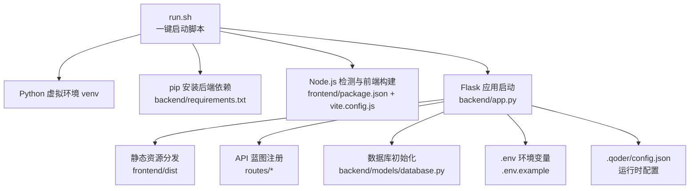
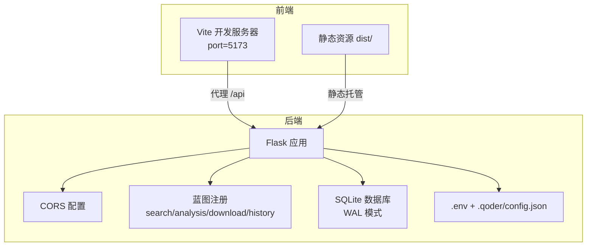
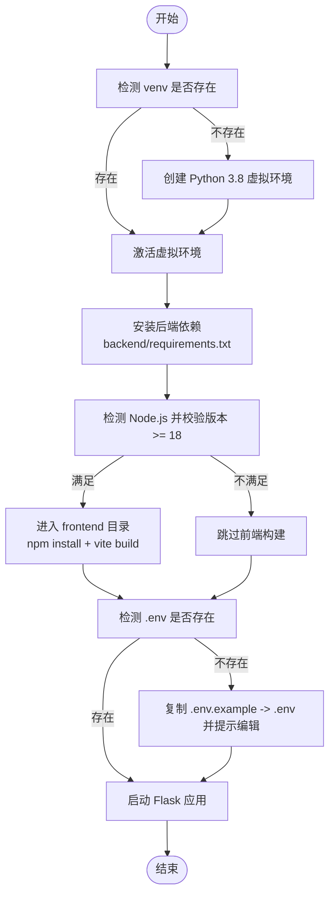
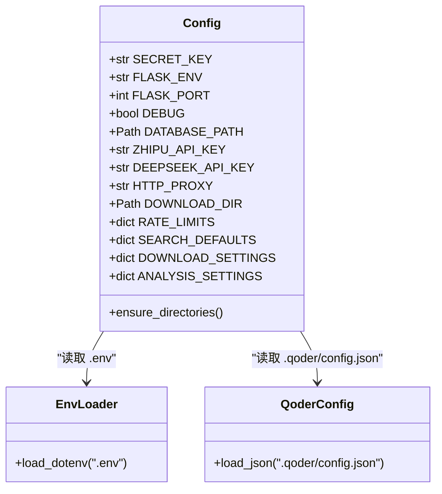
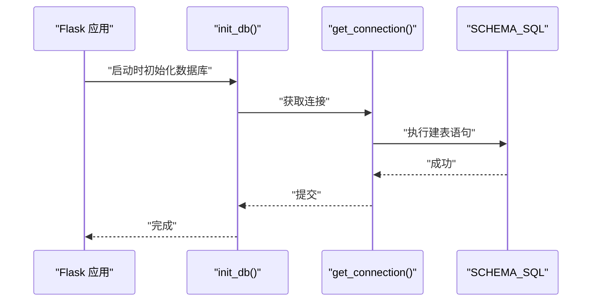
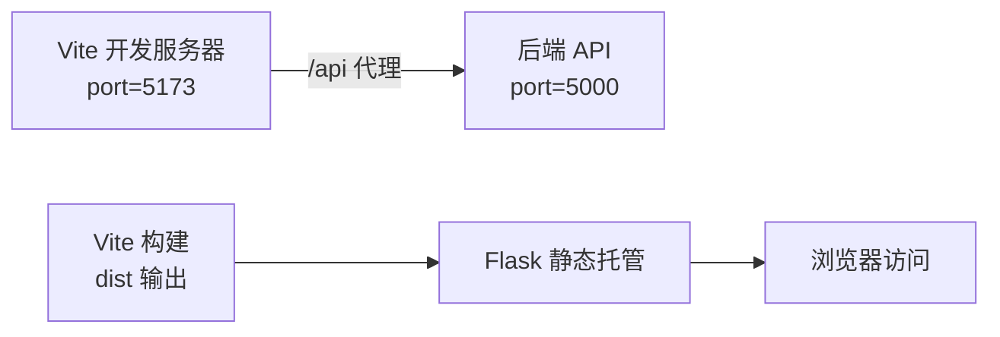
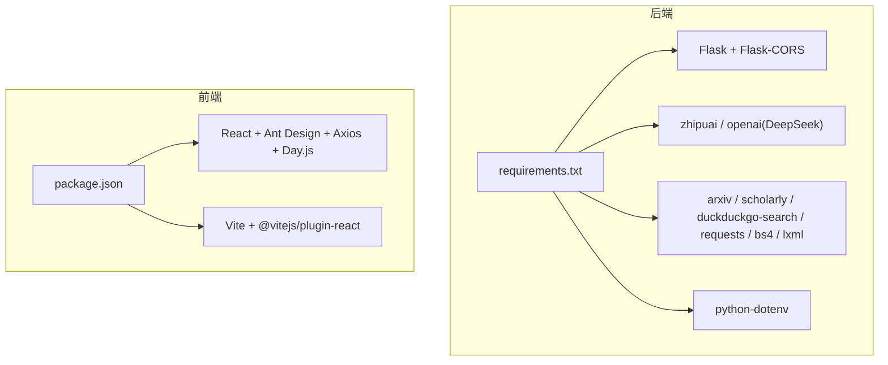
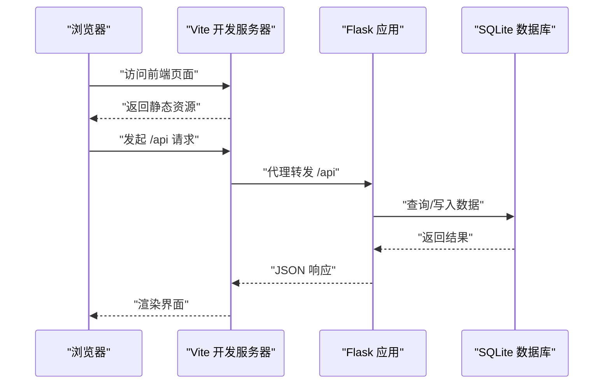

# 部署配置

<cite>
**本文引用的文件**
- [run.sh](file://run.sh)
- [.env.example](file://.env.example)
- [backend/requirements.txt](file://backend/requirements.txt)
- [frontend/package.json](file://frontend/package.json)
- [README.md](file://README.md)
- [backend/config.py](file://backend/config.py)
- [backend/app.py](file://backend/app.py)
- [.qoder/config.json](file://.qoder/config.json)
- [frontend/vite.config.js](file://frontend/vite.config.js)
- [backend/models/database.py](file://backend/models/database.py)
</cite>

## 目录
1. [简介](#简介)
2. [项目结构](#项目结构)
3. [核心组件](#核心组件)
4. [架构总览](#架构总览)
5. [详细组件分析](#详细组件分析)
6. [依赖关系分析](#依赖关系分析)
7. [性能考虑](#性能考虑)
8. [故障排查指南](#故障排查指南)
9. [结论](#结论)
10. [附录](#附录)

## 简介
本文件面向运维与开发人员，提供 Search Is All You Need 的完整部署配置说明。内容涵盖一键启动脚本 run.sh 的工作原理、生产环境版本要求、环境变量配置、手动部署步骤、以及前端构建与后端启动流程。由于仓库未包含 Dockerfile 或云平台部署清单，本文不提供容器化与云平台部署的具体实现细节，但给出可扩展的实践建议。

## 项目结构
项目采用前后端分离架构，后端基于 Flask，前端基于 React/Vite。一键启动脚本负责虚拟环境创建、依赖安装、前端构建与后端启动；运行时通过 .env 与 .qoder/config.json 合并配置，SQLite 作为本地数据库。

图表来源
- [run.sh](file://run.sh#L1-L50)
- [backend/requirements.txt](file://backend/requirements.txt#L1-L11)
- [frontend/package.json](file://frontend/package.json#L1-L24)
- [frontend/vite.config.js](file://frontend/vite.config.js#L1-L20)
- [backend/app.py](file://backend/app.py#L1-L78)
- [backend/models/database.py](file://backend/models/database.py#L1-L51)
- [.env.example](file://.env.example#L1-L21)
- [.qoder/config.json](file://.qoder/config.json#L1-L31)

章节来源
- [README.md](file://README.md#L376-L404)

## 核心组件
- 一键启动脚本：负责虚拟环境创建、依赖安装、前端构建（若满足 Node.js 版本要求）、.env 初始化与 Flask 启动。
- 后端配置：通过 Config 类合并 .env 与 .qoder/config.json，统一管理 Flask、数据库、LLM 提供商、代理、下载与分析等配置。
- 数据库：SQLite，WAL 模式，线程局部连接，自动初始化表结构。
- 前端构建：Vite 构建产物输出至 dist，开发服务器端口 5173，生产静态资源由 Flask 托管。
- 运行时配置：.qoder/config.json 控制速率限制、搜索默认值、下载设置与分析设置。

章节来源
- [run.sh](file://run.sh#L1-L50)
- [backend/config.py](file://backend/config.py#L1-L85)
- [backend/models/database.py](file://backend/models/database.py#L1-L51)
- [frontend/vite.config.js](file://frontend/vite.config.js#L1-L20)
- [.qoder/config.json](file://.qoder/config.json#L1-L31)

## 架构总览
后端以 Flask 为核心，注册多个蓝图提供搜索、分析、下载与历史接口；前端通过 Vite 开发服务器进行联调，生产环境由 Flask 托管静态资源。数据库初始化在应用启动前完成，确保表结构存在。

图表来源
- [backend/app.py](file://backend/app.py#L1-L78)
- [frontend/vite.config.js](file://frontend/vite.config.js#L1-L20)
- [backend/models/database.py](file://backend/models/database.py#L1-L51)
- [backend/config.py](file://backend/config.py#L1-L85)

## 详细组件分析

### 一键启动脚本 run.sh 工作流
该脚本按阶段执行：虚拟环境准备、依赖安装、前端构建（条件满足时）、.env 初始化与 Flask 启动。其核心逻辑如下：

图表来源
- [run.sh](file://run.sh#L1-L50)

章节来源
- [run.sh](file://run.sh#L1-L50)

### 环境变量与配置合并机制
后端通过 Config 类加载 .env，并读取 .qoder/config.json 的运行时配置，最终形成完整的应用配置。关键点：
- Flask 环境与端口、调试开关来自 .env。
- 数据库路径、下载目录来自 .env，且会在启动前确保目录存在。
- LLM 提供商密钥（智谱/DeepSeek）来自 .env。
- 代理配置来自 .env 的 HTTP_PROXY/HTTPS_PROXY。
- 速率限制、搜索默认值、下载设置、分析设置来自 .qoder/config.json。

图表来源
- [backend/config.py](file://backend/config.py#L1-L85)
- [.env.example](file://.env.example#L1-L21)
- [.qoder/config.json](file://.qoder/config.json#L1-L31)

章节来源
- [backend/config.py](file://backend/config.py#L1-L85)
- [.env.example](file://.env.example#L1-L21)
- [.qoder/config.json](file://.qoder/config.json#L1-L31)

### 数据库初始化与连接
- 初始化：应用启动前调用 init_db，确保数据目录存在并创建表结构。
- 连接：使用线程局部连接，启用 WAL 模式、超时与外键约束，提供上下文管理器保证事务一致性。

图表来源
- [backend/models/database.py](file://backend/models/database.py#L1-L51)

章节来源
- [backend/models/database.py](file://backend/models/database.py#L1-L51)

### 前端构建与开发服务器
- 构建：Vite 将 React 代码打包至 dist，开发服务器端口 5173。
- 代理：开发时通过 /api 代理到后端 5000 端口，便于联调。
- 生产：Flask 从 dist 目录托管静态资源，SPA 回退至 index.html。

图表来源
- [frontend/vite.config.js](file://frontend/vite.config.js#L1-L20)
- [backend/app.py](file://backend/app.py#L42-L59)

章节来源
- [frontend/vite.config.js](file://frontend/vite.config.js#L1-L20)
- [backend/app.py](file://backend/app.py#L42-L59)

## 依赖关系分析
- 后端依赖：Flask、Flask-CORS、zhipuai、arxiv、scholarly、duckduckgo-search、requests、beautifulsoup4、lxml、python-dotenv。
- 前端依赖：React、Ant Design、Axios、Day.js、Vite、@vitejs/plugin-react。
- 运行时配置：.qoder/config.json 提供速率限制、搜索默认值、下载设置与分析设置。

图表来源
- [backend/requirements.txt](file://backend/requirements.txt#L1-L11)
- [frontend/package.json](file://frontend/package.json#L1-L24)

章节来源
- [backend/requirements.txt](file://backend/requirements.txt#L1-L11)
- [frontend/package.json](file://frontend/package.json#L1-L24)

## 性能考虑
- 首次搜索可能较慢，后续利用缓存提升响应速度。
- 建议避免同时勾选过多数据源，降低并发压力。
- AI 分析功能会消耗 LLM API 额度，合理设置分析参数与缓存周期。
- 数据库使用 WAL 模式与超时设置，有助于提升并发与稳定性。

## 故障排查指南
- 搜索为空或异常：确认数据源限制与网络可达性；查看后端日志定位错误。
- AI 分析不可用：检查 .env 中提供商密钥是否正确，确认 .qoder/config.json provider 设置。
- PDF 下载失败：arXiv 服务器可能临时不可用，系统会尝试国内镜像；检查下载目录权限与磁盘空间。
- 前端无法访问 /api：确认 Vite 开发代理配置与后端端口一致。
- 数据库连接问题：检查 DATABASE_PATH 权限与 SQLite 版本兼容性。

章节来源
- [README.md](file://README.md#L361-L375)
- [backend/app.py](file://backend/app.py#L62-L66)
- [backend/models/database.py](file://backend/models/database.py#L11-L21)

## 结论
本项目提供了简洁的一键启动流程与清晰的配置体系。生产部署建议明确环境变量与运行时配置，确保数据库与下载目录可用，并根据实际流量调整速率限制与并发设置。如需容器化与云平台部署，可在现有脚本与配置基础上扩展 Dockerfile 与编排文件。

## 附录

### 环境与版本要求
- Python：3.8+
- Node.js：18+（用于前端构建）
- 系统依赖：SQLite（随 Python 标准库 sqlite3 使用）

章节来源
- [README.md](file://README.md#L24-L47)
- [run.sh](file://run.sh#L24-L37)

### 环境变量配置（.env）
- LLM 提供商密钥：ZHIPU_API_KEY、DEEPSEEK_API_KEY（任选其一）
- Flask 配置：SECRET_KEY、FLASK_ENV、FLASK_PORT
- 数据库路径：DATABASE_PATH
- 下载目录：DOWNLOAD_DIR
- HTTP 代理（可选）：HTTP_PROXY、HTTPS_PROXY

章节来源
- [.env.example](file://.env.example#L1-L21)
- [backend/config.py](file://backend/config.py#L29-L48)

### 运行时配置（.qoder/config.json）
- 速率限制：arXiv、zhihu、scholar、duckduckgo 的容量与补充速率
- 搜索默认值：每源最大结果数、超时秒数、缓存小时数、默认数据源
- 下载设置：保存目录、最大并发下载数、arXiv 镜像地址
- 分析设置：提供商、模型名称、最大内容长度、温度、缓存天数

章节来源
- [.qoder/config.json](file://.qoder/config.json#L1-L31)
- [backend/config.py](file://backend/config.py#L50-L73)

### 手动部署步骤
- 后端
  - 创建并激活 Python 3.8 虚拟环境
  - 安装后端依赖
  - 如需 DeepSeek 支持，安装兼容的 openai 包
- 前端
  - 安装 Node.js >= 18
  - 在 frontend 目录执行安装与构建
- 运行
  - 复制并编辑 .env
  - 启动 Flask 应用（生产模式需先构建前端）

章节来源
- [README.md](file://README.md#L130-L181)

### 一键启动脚本使用
- 准备：克隆仓库、复制 .env.example 为 .env 并填写密钥
- 执行：运行 bash run.sh
- 行为：自动创建 venv、安装依赖、前端构建（满足版本要求时）、初始化 .env、启动 Flask

章节来源
- [README.md](file://README.md#L113-L128)
- [run.sh](file://run.sh#L1-L50)

### 前后端交互序列

图表来源
- [frontend/vite.config.js](file://frontend/vite.config.js#L6-L14)
- [backend/app.py](file://backend/app.py#L35-L59)
- [backend/models/database.py](file://backend/models/database.py#L24-L34)