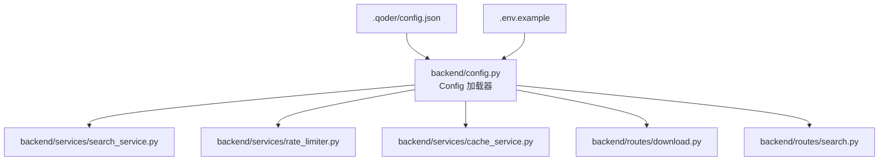
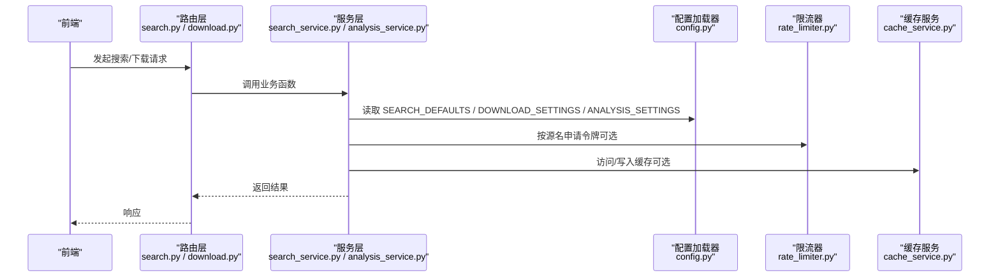
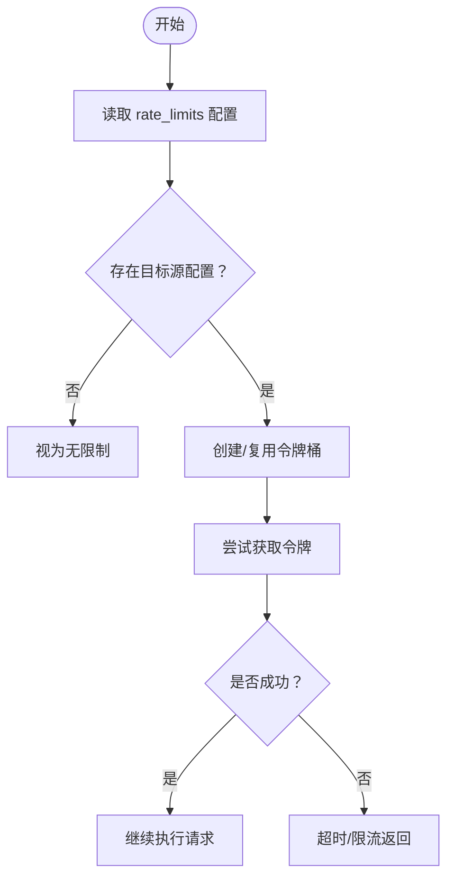
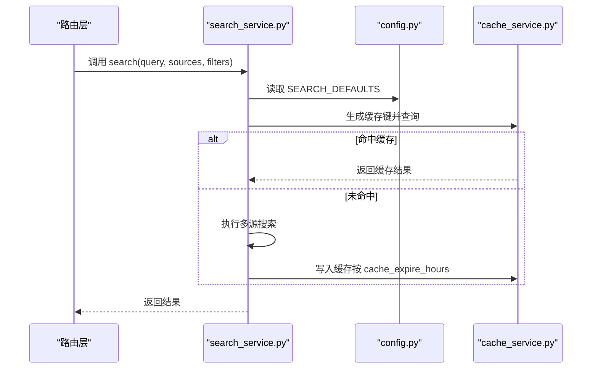
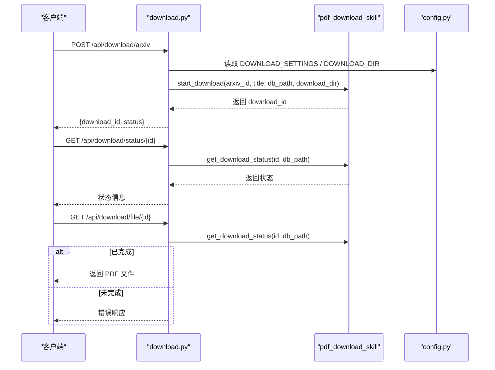
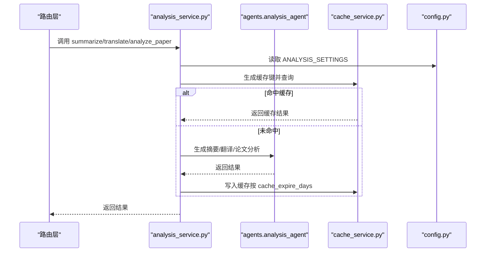
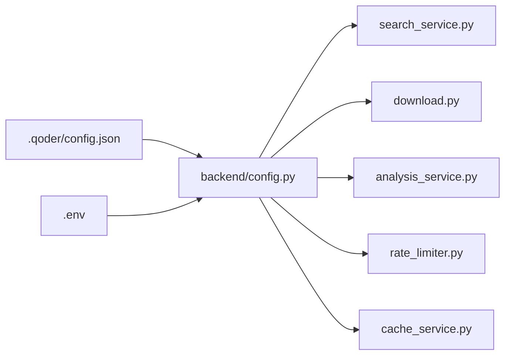

# JSON配置文件

<cite>
**本文引用的文件**
- [.qoder/config.json](file://.qoder/config.json)
- [backend/config.py](file://backend/config.py)
- [backend/services/rate_limiter.py](file://backend/services/rate_limiter.py)
- [backend/services/cache_service.py](file://backend/services/cache_service.py)
- [backend/services/search_service.py](file://backend/services/search_service.py)
- [backend/routes/search.py](file://backend/routes/search.py)
- [backend/routes/download.py](file://backend/routes/download.py)
- [.env.example](file://.env.example)
</cite>

## 目录
1. [简介](#简介)
2. [项目结构](#项目结构)
3. [核心组件](#核心组件)
4. [架构总览](#架构总览)
5. [详细组件分析](#详细组件分析)
6. [依赖关系分析](#依赖关系分析)
7. [性能考量](#性能考量)
8. [故障排查指南](#故障排查指南)
9. [结论](#结论)
10. [附录](#附录)

## 简介
本文件面向系统管理员与开发者，全面说明 .qoder/config.json 的结构、字段含义、默认值处理、配置继承规则以及在不同使用场景下的配置示例，并提供备份、迁移与版本管理建议，以及维护与故障排查手册。

## 项目结构
.qoder/config.json 是应用的主配置入口之一，配合后端配置加载器与各服务模块共同工作：
- 配置文件位置：.qoder/config.json
- 后端配置加载：backend/config.py 将 .qoder/config.json 与 .env 环境变量合并为运行时配置
- 服务层使用：搜索、下载、缓存、限流等服务从配置中读取参数
- 路由层调用：API 路由通过服务层执行业务逻辑

图表来源
- [.qoder/config.json](file://.qoder/config.json#L1-L31)
- [backend/config.py](file://backend/config.py#L15-L78)
- [backend/services/search_service.py](file://backend/services/search_service.py#L28-L67)
- [backend/services/rate_limiter.py](file://backend/services/rate_limiter.py#L45-L74)
- [backend/services/cache_service.py](file://backend/services/cache_service.py#L16-L86)
- [backend/routes/search.py](file://backend/routes/search.py#L10-L27)
- [backend/routes/download.py](file://backend/routes/download.py#L14-L97)
- [.env.example](file://.env.example#L1-L21)

章节来源
- [backend/config.py](file://backend/config.py#L15-L78)
- [.qoder/config.json](file://.qoder/config.json#L1-L31)

## 核心组件
本节逐项解析 .qoder/config.json 的四大配置段落及其在系统中的作用与默认值处理。

- 速率限制配置（rate_limits）
  - 作用：为不同数据源设置令牌桶限速参数，控制请求频率，避免触发上游限流或被封禁。
  - 结构要点：每个源包含 capacity（容量）与 refill_rate（每秒补充速率），单位为“次/秒”。
  - 默认值：若未在配置中提供该段，后端会回退到内置默认集（见后文“默认值与回退规则”）。
  - 使用点：后端限流器按源名查找对应桶；未配置的源视为无限制。

- 搜索默认参数（search_defaults）
  - 作用：定义多源搜索的默认行为，包括最大结果数、超时时间、缓存过期时长与默认数据源列表。
  - 关键字段：
    - max_results_per_source：单源返回条目上限
    - timeout_seconds：请求超时秒数
    - cache_expire_hours：搜索结果缓存小时数
    - default_sources：默认启用的数据源数组
  - 默认值：若未提供该段，后端会回退到内置默认集（见后文“默认值与回退规则”）。

- 下载设置（download_settings）
  - 作用：控制 PDF 下载行为，包括保存目录、并发数与 arXiv 镜像地址列表。
  - 关键字段：
    - save_directory：下载文件存放目录
    - max_concurrent_downloads：并发下载任务数
    - arxiv_mirrors：arXiv PDF 获取镜像地址数组
  - 默认值：若未提供该段，后端会回退到内置默认集（见后文“默认值与回退规则”）。

- AI分析设置（analysis_settings）
  - 作用：控制内容摘要、翻译与论文分析等 AI 分析功能的模型选择、上下文长度、温度与缓存策略。
  - 关键字段：
    - provider：AI 提供商（如 deepseek、zhipu）
    - zhipu_model / deepseek_model：对应提供商的模型名称
    - max_content_length：输入内容截断长度
    - temperature：采样温度
    - cache_expire_days：分析结果缓存天数
  - 默认值：若未提供该段，后端会回退到内置默认集（见后文“默认值与回退规则”）。

章节来源
- [.qoder/config.json](file://.qoder/config.json#L2-L29)
- [backend/config.py](file://backend/config.py#L50-L73)

## 架构总览
下图展示配置在系统中的流转与使用路径：前端请求经路由进入服务层，服务层读取配置并执行业务逻辑，同时利用缓存与限流保障性能与稳定性。

图表来源
- [backend/routes/search.py](file://backend/routes/search.py#L10-L27)
- [backend/routes/download.py](file://backend/routes/download.py#L14-L97)
- [backend/services/search_service.py](file://backend/services/search_service.py#L28-L67)
- [backend/services/cache_service.py](file://backend/services/cache_service.py#L16-L86)
- [backend/services/rate_limiter.py](file://backend/services/rate_limiter.py#L45-L74)
- [backend/config.py](file://backend/config.py#L50-L73)

## 详细组件分析

### 速率限制配置（rate_limits）
- 字段说明
  - capacity：桶容量，即允许的最大令牌数
  - refill_rate：每秒补充速率（次/秒）
- 行为特征
  - 采用线程安全的令牌桶算法，按时间自动补充
  - 超时时间内无法获得令牌则返回失败
  - 未配置某源时，默认视为无限制
- 默认值与回退规则
  - 若 .qoder/config.json 缺失该段，后端仍会初始化内置默认集，但实际生效以 .qoder/config.json 为准
- 典型场景
  - 学术研究：适度降低 arxiv/scholar 的 refill_rate，避免触发上游限流
  - 企业部署：根据供应商配额与 SLA 调整 capacity/refill_rate
  - 高并发：适当提高 capacity 与 refill_rate，确保吞吐

图表来源
- [backend/services/rate_limiter.py](file://backend/services/rate_limiter.py#L45-L74)

章节来源
- [backend/services/rate_limiter.py](file://backend/services/rate_limiter.py#L5-L74)
- [backend/config.py](file://backend/config.py#L50-L51)

### 搜索默认参数（search_defaults）
- 字段说明
  - max_results_per_source：单源最大返回条目
  - timeout_seconds：请求超时秒数
  - cache_expire_hours：搜索结果缓存小时数
  - default_sources：默认启用的数据源列表
- 默认值与回退规则
  - 若 .qoder/config.json 缺失该段，后端会回退到内置默认集（含默认源、超时与缓存时长）
- 使用流程
  - 服务层优先使用配置中的 default_sources，未指定时采用配置默认
  - 搜索结果命中缓存则直接返回，否则执行搜索并写入缓存

图表来源
- [backend/services/search_service.py](file://backend/services/search_service.py#L28-L67)
- [backend/services/cache_service.py](file://backend/services/cache_service.py#L16-L52)
- [backend/config.py](file://backend/config.py#L53-L59)

章节来源
- [backend/services/search_service.py](file://backend/services/search_service.py#L28-L67)
- [backend/services/cache_service.py](file://backend/services/cache_service.py#L16-L52)
- [backend/config.py](file://backend/config.py#L53-L59)

### 下载设置（download_settings）
- 字段说明
  - save_directory：下载文件保存目录
  - max_concurrent_downloads：并发下载任务数
  - arxiv_mirrors：arXiv PDF 获取镜像地址列表
- 默认值与回退规则
  - 若 .qoder/config.json 缺失该段，后端会回退到内置默认集（含默认并发与镜像列表）
- 使用流程
  - 路由层接收下载请求，读取配置并调用技能模块执行下载
  - 支持状态查询与文件分发

图表来源
- [backend/routes/download.py](file://backend/routes/download.py#L14-L97)
- [backend/config.py](file://backend/config.py#L61-L65)

章节来源
- [backend/routes/download.py](file://backend/routes/download.py#L14-L97)
- [backend/config.py](file://backend/config.py#L61-L65)

### AI分析设置（analysis_settings）
- 字段说明
  - provider：AI 提供商（如 deepseek、zhipu）
  - zhipu_model / deepseek_model：对应提供商的模型名称
  - max_content_length：输入内容截断长度
  - temperature：采样温度
  - cache_expire_days：分析结果缓存天数
- 默认值与回退规则
  - 若 .qoder/config.json 缺失该段，后端会回退到内置默认集（含默认模型、温度与缓存天数）
- 使用流程
  - 服务层生成缓存键并查询；命中则直接返回；未命中则调用分析代理生成结果并写入缓存

图表来源
- [backend/services/analysis_service.py](file://backend/services/analysis_service.py#L25-L90)
- [backend/services/cache_service.py](file://backend/services/cache_service.py#L57-L86)
- [backend/config.py](file://backend/config.py#L67-L73)

章节来源
- [backend/services/analysis_service.py](file://backend/services/analysis_service.py#L25-L90)
- [backend/services/cache_service.py](file://backend/services/cache_service.py#L57-L86)
- [backend/config.py](file://backend/config.py#L67-L73)

## 依赖关系分析
- 配置加载器（backend/config.py）负责：
  - 读取 .qoder/config.json 并合并环境变量（.env）
  - 提供 RATE_LIMITS、SEARCH_DEFAULTS、DOWNLOAD_SETTINGS、ANALYSIS_SETTINGS 四个配置对象
- 服务层依赖：
  - 搜索服务：读取 SEARCH_DEFAULTS 的默认源、超时与缓存策略
  - 下载服务：读取 DOWNLOAD_SETTINGS 的并发与镜像列表
  - 分析服务：读取 ANALYSIS_SETTINGS 的模型与缓存策略
- 限流器与缓存服务：
  - 限流器按源名映射到令牌桶；未配置的源视为无限制
  - 缓存服务按配置的 TTL 或天数进行过期控制

图表来源
- [backend/config.py](file://backend/config.py#L15-L78)
- [.qoder/config.json](file://.qoder/config.json#L1-L31)
- [.env.example](file://.env.example#L1-L21)

章节来源
- [backend/config.py](file://backend/config.py#L15-L78)

## 性能考量
- 速率限制
  - 合理设置 capacity 与 refill_rate，避免频繁超时或触发上游限流
  - 对高并发场景可适度提高 capacity 与 refill_rate，但需结合上游配额
- 缓存策略
  - 搜索结果缓存按小时控制，分析结果缓存按天控制，减少重复计算
  - 定期清理过期缓存，释放存储空间
- 并发与资源
  - 下载并发数应与磁盘 I/O 与网络带宽匹配，避免拥塞
  - AI 分析的 max_content_length 与 temperature 影响响应时间与成本

[本节为通用指导，不直接分析具体文件]

## 故障排查指南
- 配置未生效
  - 确认 .qoder/config.json 是否存在且格式正确
  - 检查后端是否加载到配置（可通过日志或调试输出确认）
- 限流导致请求失败
  - 检查对应源的 capacity 与 refill_rate 设置是否过低
  - 观察限流器日志，确认是否命中令牌桶
- 缓存异常
  - 检查数据库表 search_cache/analysis_cache 是否存在且可写
  - 确认缓存键生成逻辑与过期时间是否符合预期
- 下载失败
  - 检查 save_directory 权限与磁盘空间
  - 确认 arxiv_mirrors 可达性与镜像地址正确
- AI 分析错误
  - 检查 provider 与模型名称是否匹配
  - 确认 API 密钥已通过 .env 正确配置

章节来源
- [backend/config.py](file://backend/config.py#L21-L27)
- [backend/services/cache_service.py](file://backend/services/cache_service.py#L91-L103)
- [backend/routes/download.py](file://backend/routes/download.py#L14-L97)

## 结论
.qoder/config.json 提供了速率限制、搜索默认参数、下载设置与 AI 分析设置的集中化配置。通过合理的参数设计与默认值回退机制，可在不同场景下平衡性能、稳定性与成本。建议在生产环境中结合监控与日志持续优化配置，并建立完善的备份与迁移流程。

[本节为总结，不直接分析具体文件]

## 附录

### 配置验证机制与默认值处理
- 验证机制
  - 配置文件加载时不做严格字段校验，仅做基本的 JSON 解析
  - 未提供的段落将回退到后端内置默认集
- 默认值与回退规则
  - rate_limits：若缺失，后端仍会初始化内置默认集，但以 .qoder/config.json 为准
  - search_defaults：若缺失，回退到内置默认集（含默认源、超时与缓存时长）
  - download_settings：若缺失，回退到内置默认集（含默认并发与镜像列表）
  - analysis_settings：若缺失，回退到内置默认集（含默认模型、温度与缓存天数）

章节来源
- [backend/config.py](file://backend/config.py#L50-L73)

### 配置继承规则
- .qoder/config.json 与 .env 并行存在，后端将两者合并为最终配置
- .qoder/config.json 中的字段覆盖 .env 的同名环境变量
- 未在 .qoder/config.json 中提供的字段使用后端内置默认值

章节来源
- [backend/config.py](file://backend/config.py#L15-L78)
- [.env.example](file://.env.example#L1-L21)

### 不同使用场景下的配置示例
- 学术研究
  - 适度降低 arxiv/scholar 的 refill_rate，避免触发上游限流
  - 提高 max_results_per_source 以增加检索覆盖面
  - 合理设置 cache_expire_hours，兼顾时效与性能
- 企业部署
  - 根据供应商配额与 SLA 调整 capacity/refill_rate
  - 控制 max_concurrent_downloads，避免影响其他业务
  - 明确 provider 与模型名称，确保合规与成本可控
- 高并发场景
  - 提高 capacity 与 refill_rate，确保吞吐
  - 适当缩短 timeout_seconds，提升响应速度
  - 合理设置 max_content_length 与 temperature，平衡质量与成本

[本节为概念性示例，不直接分析具体文件]

### 备份、迁移与版本管理指南
- 备份
  - 定期备份 .qoder/config.json 与 .env
  - 记录每次变更的版本号与变更说明
- 迁移
  - 新版本发布前先在测试环境验证配置兼容性
  - 逐步替换旧配置，保留历史配置以便回滚
- 版本管理
  - 使用 Git 管理配置文件变更
  - 在分支中隔离实验性配置，合并后再上线

[本节为通用指导，不直接分析具体文件]