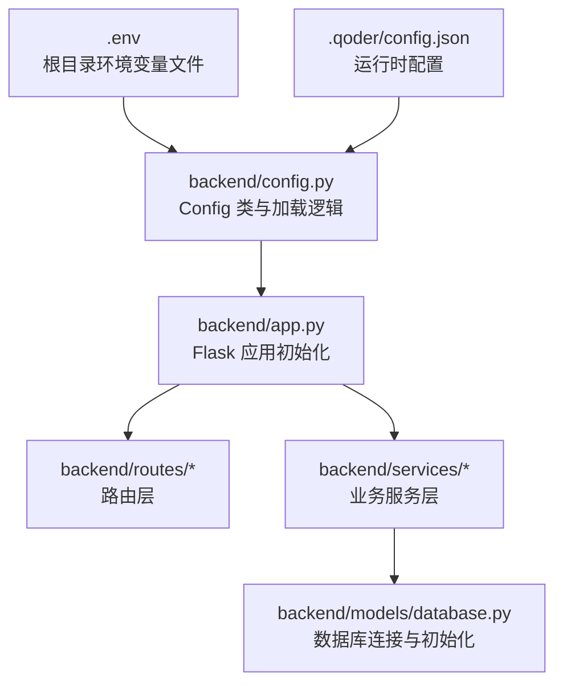
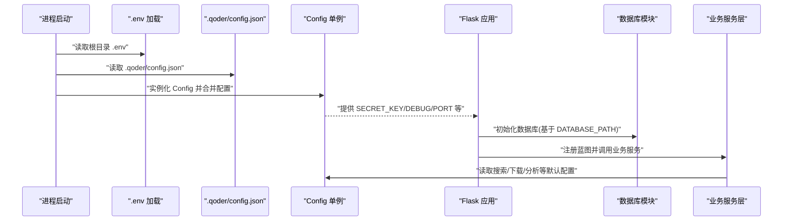
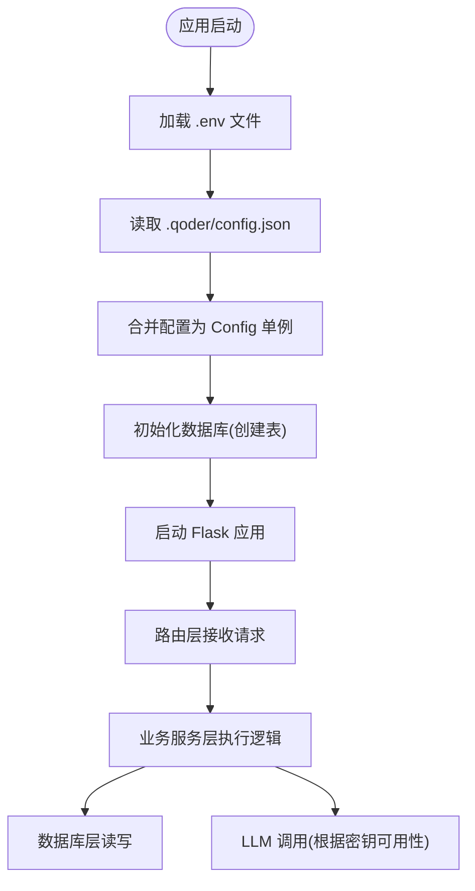

# 环境变量配置

<cite>
**本文引用的文件**
- [.env.example](file://.env.example)
- [.env](file://.env)
- [backend/config.py](file://backend/config.py)
- [backend/app.py](file://backend/app.py)
- [backend/models/database.py](file://backend/models/database.py)
- [backend/routes/search.py](file://backend/routes/search.py)
- [backend/services/search_service.py](file://backend/services/search_service.py)
- [.qoder/config.json](file://.qoder/config.json)
- [backend/requirements.txt](file://backend/requirements.txt)
</cite>

## 目录
1. [简介](#简介)
2. [项目结构](#项目结构)
3. [核心组件](#核心组件)
4. [架构总览](#架构总览)
5. [详细组件分析](#详细组件分析)
6. [依赖分析](#依赖分析)
7. [性能考虑](#性能考虑)
8. [故障排查指南](#故障排查指南)
9. [结论](#结论)
10. [附录](#附录)

## 简介
本文件系统性梳理 Search Is All You Need 项目的环境变量配置与管理方式，重点覆盖以下方面：
- 关键环境变量的定义、作用与配置方法（如 LLM API 密钥、数据库路径、下载目录、代理等）
- 环境变量的加载顺序、默认值与校验机制
- 开发、测试、生产三类环境的配置示例与差异
- 安全管理最佳实践：敏感信息保护与配置轮换策略
- 面向开发者的完整配置指南与常见问题解决方案

## 项目结构
该项目采用前后端分离架构，后端通过 Python Flask 提供 API，前端使用 Vite 构建产物作为静态资源。环境变量主要集中在根目录的 .env 文件中，并由后端配置模块统一加载与分发。

图表来源
- [backend/config.py](file://backend/config.py#L1-L85)
- [backend/app.py](file://backend/app.py#L1-L78)
- [backend/models/database.py](file://backend/models/database.py#L1-L51)
- [.qoder/config.json](file://.qoder/config.json#L1-L31)

章节来源
- [backend/config.py](file://backend/config.py#L1-L85)
- [backend/app.py](file://backend/app.py#L1-L78)

## 核心组件
- 环境变量加载与合并：后端通过 dotenv 加载根目录 .env 文件，并从 .qoder/config.json 合并运行时配置，形成最终的 Config 单例对象。
- 配置项分类：
  - Flask 运行参数：SECRET_KEY、FLASK_ENV、FLASK_PORT
  - 数据库路径：DATABASE_PATH
  - LLM API 密钥：ZHIPU_API_KEY、DEEPSEEK_API_KEY
  - 下载目录：DOWNLOAD_DIR
  - HTTP 代理：HTTP_PROXY 或 HTTPS_PROXY
  - 其他：DEBUG、搜索默认值、速率限制、下载与分析设置等

章节来源
- [backend/config.py](file://backend/config.py#L15-L85)
- [.qoder/config.json](file://.qoder/config.json#L1-L31)

## 架构总览
下图展示环境变量在应用启动时的加载与使用流程，以及各模块之间的耦合关系。

图表来源
- [backend/config.py](file://backend/config.py#L11-L12)
- [backend/config.py](file://backend/config.py#L20-L78)
- [backend/app.py](file://backend/app.py#L21-L78)
- [backend/models/database.py](file://backend/models/database.py#L36-L43)
- [backend/services/search_service.py](file://backend/services/search_service.py#L28-L67)

## 详细组件分析

### 环境变量加载与合并机制
- 加载顺序
  1) 优先加载根目录 .env 文件（dotenv）
  2) 读取 .qoder/config.json 作为运行时配置源
  3) Config 类将两者合并，形成最终配置对象
- 默认值与类型转换
  - SECRET_KEY：字符串，默认值在 Config 中定义
  - FLASK_ENV：字符串，默认 development
  - FLASK_PORT：整数，默认 5000
  - DEBUG：由 FLASK_ENV 推导
  - DATABASE_PATH：路径，默认 data/search.db
  - ZHIPU_API_KEY / DEEPSEEK_API_KEY：字符串，无默认值（空串）
  - HTTP_PROXY：字符串，若未设置则回退到 HTTPS_PROXY
  - DOWNLOAD_DIR：路径，默认 data/downloads
  - 其余复杂配置（搜索默认值、下载设置、分析设置、速率限制）来自 .qoder/config.json 的合并
- 验证机制
  - 未显式设置的 LLM API 密钥会为空串，后续业务逻辑需进行非空校验与错误处理
  - 数据库路径与下载目录会在初始化时自动创建父级目录

章节来源
- [backend/config.py](file://backend/config.py#L11-L12)
- [backend/config.py](file://backend/config.py#L20-L78)
- [.qoder/config.json](file://.qoder/config.json#L1-L31)

### 关键环境变量详解

- ZHIPU_API_KEY
  - 作用：用于调用智谱 AI 相关能力
  - 配置位置：.env 文件
  - 默认值：空串（需显式设置）
  - 使用场景：当分析或搜索涉及智谱模型时
  - 安全建议：避免硬编码在代码中；使用 .env 管理；CI/CD 中使用机密变量

- DEEPSEEK_API_KEY
  - 作用：用于调用 DeepSeek 相关能力
  - 配置位置：.env 文件
  - 默认值：空串（需显式设置）
  - 使用场景：当分析或搜索涉及 DeepSeek 模型时
  - 安全建议：同上

- DATABASE_PATH
  - 作用：SQLite 数据库存储路径
  - 配置位置：.env 文件
  - 默认值：data/search.db
  - 行为：启动时确保父目录存在，首次运行自动创建表结构

- DOWNLOAD_DIR
  - 作用：下载文件保存目录
  - 配置位置：.env 文件
  - 默认值：data/downloads
  - 行为：启动时确保父目录存在

- HTTP_PROXY / HTTPS_PROXY
  - 作用：访问国外服务（如 DuckDuckGo）时使用的 HTTP/HTTPS 代理
  - 配置位置：.env 文件
  - 默认值：空串（不使用代理）
  - 行为：HTTP_PROXY 优先，若未设置则回退到 HTTPS_PROXY

- SECRET_KEY / FLASK_ENV / FLASK_PORT
  - 作用：Flask 应用密钥、环境模式与端口
  - 配置位置：.env 文件
  - 默认值：SECRET_KEY 在 Config 中有默认值；FLASK_ENV 默认 development；FLASK_PORT 默认 5000
  - 行为：DEBUG 由 FLASK_ENV 推导；应用启动时读取

章节来源
- [.env.example](file://.env.example#L1-L21)
- [.env](file://.env#L1-L22)
- [backend/config.py](file://backend/config.py#L29-L48)
- [backend/models/database.py](file://backend/models/database.py#L36-L43)

### 配置示例与环境差异

- 开发环境
  - 特点：DEBUG=true，端口 5000，本地数据库，可选代理
  - 建议：启用本地代理以访问受限服务；保持较小的缓存过期时间以便调试
  - 参考配置位置：.env 文件中的对应键位

- 测试环境
  - 特点：隔离数据库与下载目录；可设置较低的并发与超时
  - 建议：使用独立的 .env.test 或通过 CI 环境变量覆盖；关闭不必要的代理
  - 参考配置位置：.env 文件中的对应键位

- 生产环境
  - 特点：严格的安全密钥与最小权限；稳定的数据库与下载目录；禁用调试模式
  - 建议：通过平台机密管理服务注入 API 密钥；使用只读数据库用户；限制代理访问范围
  - 参考配置位置：.env 文件中的对应键位

章节来源
- [.env.example](file://.env.example#L7-L21)
- [.env](file://.env#L8-L22)
- [backend/config.py](file://backend/config.py#L30-L33)

### 配置加载流程与数据流

图表来源
- [backend/config.py](file://backend/config.py#L11-L12)
- [backend/config.py](file://backend/config.py#L20-L78)
- [backend/models/database.py](file://backend/models/database.py#L36-L43)
- [backend/app.py](file://backend/app.py#L21-L78)

## 依赖分析
- 外部依赖对环境变量的影响
  - python-dotenv：负责从 .env 文件加载环境变量
  - zhipuai、arxiv、scholarly、duckduckgo-search、requests 等：可能受 HTTP 代理影响
  - Flask、Flask-CORS：受 SECRET_KEY、FLASK_ENV、FLASK_PORT 影响
- 内部依赖关系
  - Config 单例被 app、models、services 等模块广泛使用
  - 数据库初始化依赖 DATABASE_PATH
  - 业务服务依赖搜索/下载/分析等默认配置

章节来源
- [backend/requirements.txt](file://backend/requirements.txt#L1-L11)
- [backend/config.py](file://backend/config.py#L1-L12)
- [backend/models/database.py](file://backend/models/database.py#L36-L43)

## 性能考虑
- 缓存与过期：搜索结果缓存 TTL 来自配置，默认 24 小时；可根据业务压力调整
- 并发与限速：下载并发与各源的速率限制来自 .qoder/config.json，建议按生产负载调优
- 数据库连接：WAL 模式与超时设置已内置，建议结合监控指标调整

章节来源
- [.qoder/config.json](file://.qoder/config.json#L8-L29)
- [backend/models/database.py](file://backend/models/database.py#L11-L21)

## 故障排查指南
- 无法加载 .env
  - 检查 .env 文件是否存在且格式正确
  - 确认 dotenv 已安装并生效
  - 参考：[backend/config.py](file://backend/config.py#L11-L12)

- 数据库初始化失败
  - 检查 DATABASE_PATH 是否可写
  - 确认父目录已创建
  - 参考：[backend/models/database.py](file://backend/models/database.py#L36-L43)

- LLM API 调用失败
  - 确认 ZHIPU_API_KEY 或 DEEPSEEK_API_KEY 已设置
  - 检查网络代理是否正确配置
  - 参考：[backend/config.py](file://backend/config.py#L38-L45)

- 下载目录不可写
  - 检查 DOWNLOAD_DIR 是否存在且具备写权限
  - 参考：[backend/config.py](file://backend/config.py#L47-L48)

- 路由返回 404 或静态资源异常
  - 确认前端构建产物位于 frontend/dist
  - 参考：[backend/app.py](file://backend/app.py#L25-L59)

章节来源
- [backend/config.py](file://backend/config.py#L11-L12)
- [backend/models/database.py](file://backend/models/database.py#L36-L43)
- [backend/app.py](file://backend/app.py#L25-L59)

## 结论
本项目通过 dotenv 与 .qoder/config.json 的双通道配置机制，实现了灵活、可维护的环境变量管理。建议在不同环境中采用独立的 .env 文件或 CI/CD 机密变量，严格区分开发与生产配置，并遵循安全最佳实践以保护敏感信息。

## 附录

### 环境变量清单与默认值
- ZHIPU_API_KEY：无默认值（需显式设置）
- DEEPSEEK_API_KEY：无默认值（需显式设置）
- SECRET_KEY：Config 中提供默认值
- FLASK_ENV：development
- FLASK_PORT：5000
- DATABASE_PATH：data/search.db
- DOWNLOAD_DIR：data/downloads
- HTTP_PROXY / HTTPS_PROXY：空串（不使用代理）

章节来源
- [.env.example](file://.env.example#L1-L21)
- [.env](file://.env#L1-L22)
- [backend/config.py](file://backend/config.py#L29-L48)

### 安全管理最佳实践
- 不将 .env 提交至版本控制；使用 .gitignore 管控
- 在 CI/CD 中使用平台机密变量注入 API 密钥
- 定期轮换 API 密钥；建立密钥失效与回滚预案
- 限制数据库与下载目录的文件系统权限
- 生产环境禁用调试模式，启用 HTTPS 与 CORS 白名单

### 配置轮换策略
- 开发：本地 .env，随项目分发但不含敏感值
- 测试：通过环境变量或 CI 机密覆盖 .env
- 生产：通过容器/平台机密注入，避免硬编码