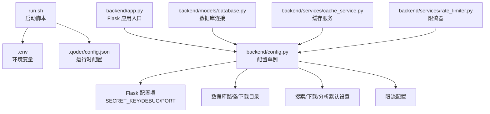
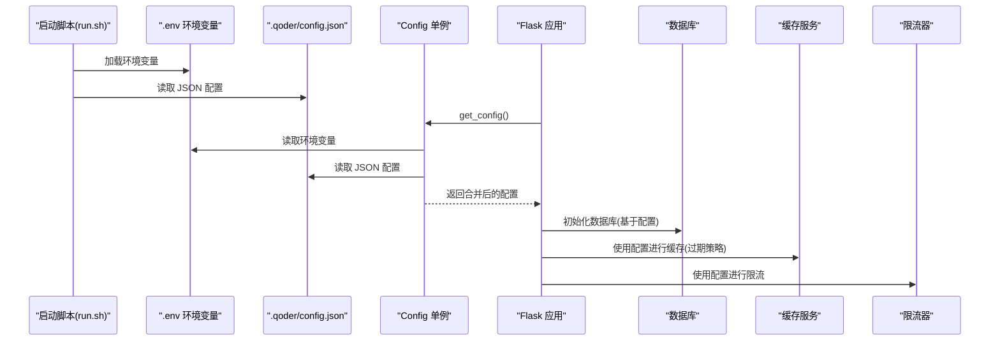
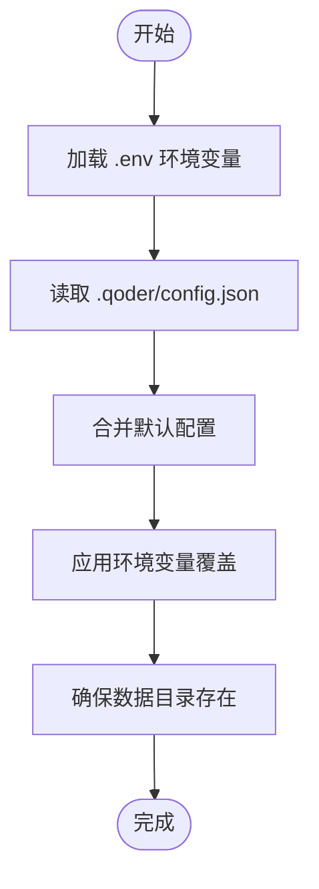
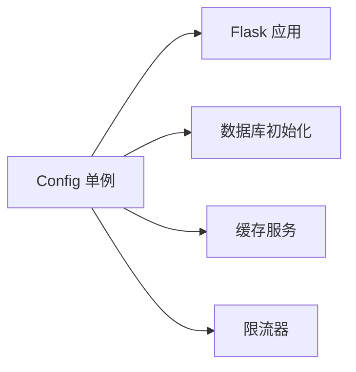
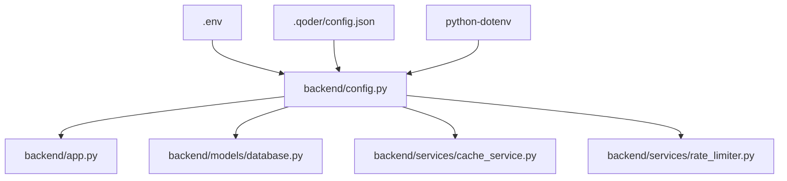

# 运行时配置管理

<cite>
**本文引用的文件**
- [backend/config.py](file://backend/config.py)
- [.qoder/config.json](file://.qoder/config.json)
- [.env](file://.env)
- [.env.example](file://.env.example)
- [backend/app.py](file://backend/app.py)
- [backend/services/rate_limiter.py](file://backend/services/rate_limiter.py)
- [backend/utils/logger.py](file://backend/utils/logger.py)
- [backend/models/database.py](file://backend/models/database.py)
- [backend/services/cache_service.py](file://backend/services/cache_service.py)
- [run.sh](file://run.sh)
- [backend/requirements.txt](file://backend/requirements.txt)
</cite>

## 目录
1. [简介](#简介)
2. [项目结构](#项目结构)
3. [核心组件](#核心组件)
4. [架构总览](#架构总览)
5. [详细组件分析](#详细组件分析)
6. [依赖关系分析](#依赖关系分析)
7. [性能考虑](#性能考虑)
8. [故障排查指南](#故障排查指南)
9. [结论](#结论)
10. [附录](#附录)

## 简介
本文件系统性阐述“Search Is All You Need”项目的运行时配置管理机制，覆盖以下主题：
- 配置来源与优先级：环境变量、JSON配置文件与默认值的合并策略
- 配置在应用中的使用方式与生命周期
- 动态更新、热重载、配置验证与回滚（当前实现现状与建议）
- 配置缓存、同步与变更追踪（当前实现现状与建议）
- 配置监控、审计与变更追踪（当前实现现状与建议）
- 扩展接口与最佳实践
- 性能优化与内存管理策略

## 项目结构
后端采用单例配置类集中管理所有运行时参数，前端通过代理访问后端API；配置文件位于项目根目录的“.env”和“.qoder/config.json”。启动脚本负责虚拟环境、依赖安装与环境变量初始化。

图表来源
- [run.sh](file://run.sh#L1-L50)
- [.env](file://.env#L1-L22)
- [.qoder/config.json](file://.qoder/config.json#L1-L31)
- [backend/app.py](file://backend/app.py#L1-L78)
- [backend/config.py](file://backend/config.py#L1-L85)
- [backend/models/database.py](file://backend/models/database.py#L1-L51)
- [backend/services/cache_service.py](file://backend/services/cache_service.py#L1-L104)
- [backend/services/rate_limiter.py](file://backend/services/rate_limiter.py#L1-L75)

章节来源
- [run.sh](file://run.sh#L1-L50)
- [.env](file://.env#L1-L22)
- [.qoder/config.json](file://.qoder/config.json#L1-L31)
- [backend/app.py](file://backend/app.py#L1-L78)
- [backend/config.py](file://backend/config.py#L1-L85)

## 核心组件
- 配置单例类：集中加载与合并环境变量与JSON配置，并确保数据目录存在
- Flask 应用：读取配置并注入到应用实例
- 数据库与缓存：通过配置访问数据库路径与缓存过期策略
- 限流器：从配置中读取限流参数，支持多源并发控制

章节来源
- [backend/config.py](file://backend/config.py#L15-L85)
- [backend/app.py](file://backend/app.py#L21-L78)
- [backend/models/database.py](file://backend/models/database.py#L11-L51)
- [backend/services/cache_service.py](file://backend/services/cache_service.py#L1-L104)
- [backend/services/rate_limiter.py](file://backend/services/rate_limiter.py#L45-L75)

## 架构总览
下图展示配置在系统中的流向与使用点：

图表来源
- [run.sh](file://run.sh#L39-L44)
- [.env](file://.env#L1-L22)
- [.qoder/config.json](file://.qoder/config.json#L1-L31)
- [backend/config.py](file://backend/config.py#L15-L85)
- [backend/app.py](file://backend/app.py#L21-L78)
- [backend/models/database.py](file://backend/models/database.py#L36-L43)
- [backend/services/cache_service.py](file://backend/services/cache_service.py#L43-L86)
- [backend/services/rate_limiter.py](file://backend/services/rate_limiter.py#L55-L75)

## 详细组件分析

### 配置加载与合并策略
- 环境变量优先级：通过环境变量覆盖默认值，未设置时使用硬编码默认
- JSON 配置优先级：从“.qoder/config.json”读取结构化配置，作为默认值的补充或覆盖
- 合并策略：对键值型配置采用“JSON优先于默认”的策略；对目录路径采用“环境变量优先于默认”的策略
- 目录保证：确保数据库与下载目录存在，避免首次运行失败

图表来源
- [backend/config.py](file://backend/config.py#L20-L78)
- [.env](file://.env#L1-L22)
- [.qoder/config.json](file://.qoder/config.json#L1-L31)

章节来源
- [backend/config.py](file://backend/config.py#L20-L78)
- [.env](file://.env#L1-L22)
- [.qoder/config.json](file://.qoder/config.json#L1-L31)

### 配置在应用中的使用
- Flask 应用：读取配置并设置 SECRET_KEY、CORS 允许域、注册蓝图
- 数据库：通过配置获取数据库路径，初始化 WAL 模式、超时与外键约束
- 缓存：根据配置生成缓存键与过期时间，执行清理任务
- 限流：从配置读取各源的容量与补充速率，实现令牌桶算法

图表来源
- [backend/app.py](file://backend/app.py#L21-L78)
- [backend/models/database.py](file://backend/models/database.py#L36-L43)
- [backend/services/cache_service.py](file://backend/services/cache_service.py#L16-L86)
- [backend/services/rate_limiter.py](file://backend/services/rate_limiter.py#L55-L75)

章节来源
- [backend/app.py](file://backend/app.py#L21-L78)
- [backend/models/database.py](file://backend/models/database.py#L11-L51)
- [backend/services/cache_service.py](file://backend/services/cache_service.py#L1-L104)
- [backend/services/rate_limiter.py](file://backend/services/rate_limiter.py#L1-L75)

### 配置验证与错误处理
- 环境变量校验：通过 python-dotenv 在启动时加载，若缺少必要键值，需在“.env”中补齐
- JSON 配置校验：当前实现未显式校验键名与类型，建议在加载时增加字段存在性与类型检查
- 错误处理：全局异常处理器统一返回错误信息，日志记录异常堆栈

章节来源
- [backend/app.py](file://backend/app.py#L62-L65)
- [backend/utils/logger.py](file://backend/utils/logger.py#L1-L23)
- [backend/requirements.txt](file://backend/requirements.txt#L1-L11)

### 动态更新、热重载与回滚
- 当前实现：配置在应用启动时一次性加载，运行时无法自动感知变更
- 建议方案：
  - 文件监控：监听“.qoder/config.json”与“.env”变更，触发重新加载
  - 热重载：对可变配置（如限流参数）在内存中替换；对数据库路径等不可变配置，建议优雅重启
  - 回滚：保留上一次有效配置快照，失败时恢复

[本节为概念性建议，不直接对应具体源码，故无章节来源]

### 配置缓存、同步与变更追踪
- 配置缓存：当前未实现配置缓存层，建议在内存中缓存解析后的配置对象
- 配置同步：建议引入配置中心或本地文件通知机制，跨进程/多实例保持一致
- 变更追踪：记录配置变更事件（时间、操作者、变更前后值），便于审计与回溯

[本节为概念性建议，不直接对应具体源码，故无章节来源]

### 配置监控、审计与变更追踪
- 日志审计：利用现有日志工具输出配置加载与异常信息
- 变更审计：建议新增配置变更事件记录模块，结合数据库或文件存储审计日志

章节来源
- [backend/utils/logger.py](file://backend/utils/logger.py#L1-L23)

### 扩展接口与最佳实践
- 扩展接口：为配置类增加“reload()”方法，支持外部触发重新加载
- 最佳实践：
  - 将敏感配置放入“.env”，非敏感配置放入“.qoder/config.json”
  - 对关键配置（如数据库路径、端口）在启动阶段做存在性与可达性检查
  - 对可变配置（如限流、缓存过期）设计最小化影响的热更新策略

[本节为通用实践建议，不直接对应具体源码，故无章节来源]

## 依赖关系分析
- 配置依赖：Flask 应用、数据库、缓存、限流器均依赖配置单例
- 外部依赖：dotenv 用于加载“.env”，sqlite3 用于数据库，日志模块用于审计

图表来源
- [backend/config.py](file://backend/config.py#L1-L85)
- [backend/app.py](file://backend/app.py#L1-L78)
- [backend/models/database.py](file://backend/models/database.py#L1-L51)
- [backend/services/cache_service.py](file://backend/services/cache_service.py#L1-L104)
- [backend/services/rate_limiter.py](file://backend/services/rate_limiter.py#L1-L75)
- [.env](file://.env#L1-L22)
- [.qoder/config.json](file://.qoder/config.json#L1-L31)
- [backend/requirements.txt](file://backend/requirements.txt#L10-L11)

章节来源
- [backend/config.py](file://backend/config.py#L1-L85)
- [backend/requirements.txt](file://backend/requirements.txt#L1-L11)

## 性能考虑
- 配置加载成本：一次性加载，常量访问开销极低
- 内存占用：配置对象常驻内存，字段数量有限，内存占用可忽略
- I/O 影响：仅在启动时读取“.env”与“.qoder/config.json”，对运行时性能无显著影响
- 并发安全：配置为只读对象，无需额外锁保护

[本节为通用性能讨论，不直接对应具体源码，故无章节来源]

## 故障排查指南
- 启动失败：检查“.env”是否完整，特别是 API 密钥与端口
- 配置未生效：确认“.qoder/config.json”键名与类型正确，且环境变量未覆盖
- 数据库问题：检查数据库路径是否存在、权限是否足够
- 缓存异常：确认缓存表已初始化，过期策略符合预期
- 限流异常：核对限流配置是否正确加载

章节来源
- [run.sh](file://run.sh#L39-L44)
- [backend/app.py](file://backend/app.py#L74-L77)
- [backend/models/database.py](file://backend/models/database.py#L36-L43)
- [backend/services/cache_service.py](file://backend/services/cache_service.py#L91-L104)
- [backend/services/rate_limiter.py](file://backend/services/rate_limiter.py#L64-L75)

## 结论
当前项目采用“环境变量 + JSON 配置 + 默认值”的三层配置体系，通过单例配置类集中管理，满足开发与生产的基本需求。对于动态更新、热重载、配置审计与变更追踪等功能，建议在现有基础上引入文件监控、配置中心与审计模块，以提升系统的可观测性与可维护性。

## 附录
- 启动流程要点：启动脚本负责创建虚拟环境、安装依赖、复制“.env”模板并启动 Flask 应用
- 关键配置键位参考：
  - Flask：SECRET_KEY、FLASK_ENV、FLASK_PORT
  - 数据库：DATABASE_PATH
  - 下载：DOWNLOAD_DIR
  - AI 服务：ZHIPU_API_KEY、DEEPSEEK_API_KEY
  - HTTP 代理：HTTP_PROXY/HTTPS_PROXY
  - 限流：rate_limits
  - 搜索默认：search_defaults
  - 下载设置：download_settings
  - 分析设置：analysis_settings

章节来源
- [run.sh](file://run.sh#L1-L50)
- [.env](file://.env#L1-L22)
- [.qoder/config.json](file://.qoder/config.json#L1-L31)
- [backend/config.py](file://backend/config.py#L30-L73)