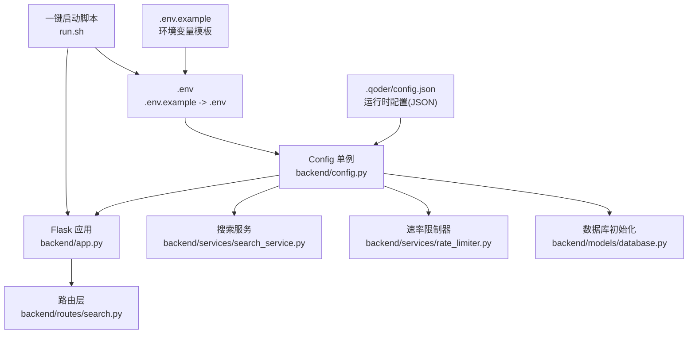
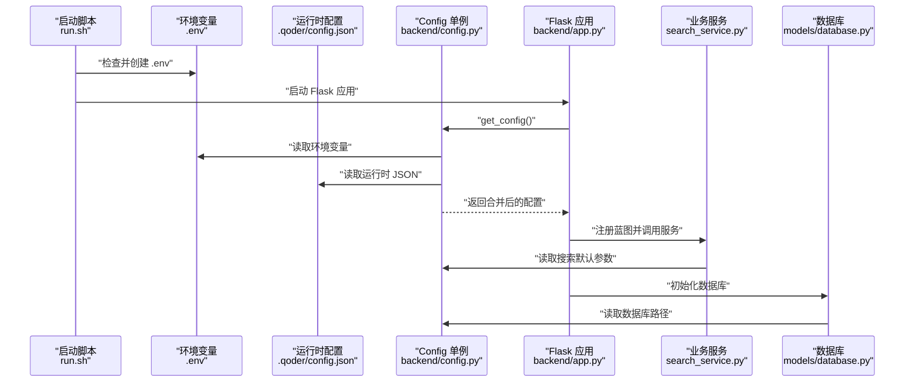
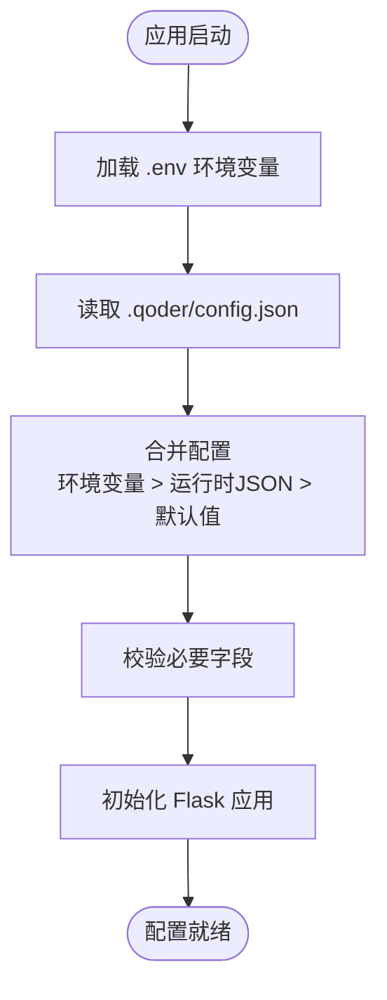
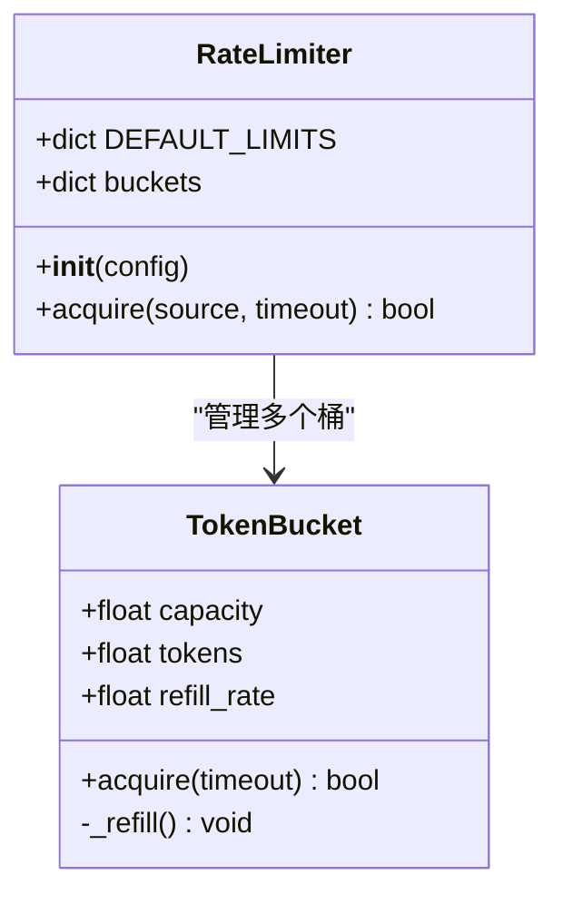
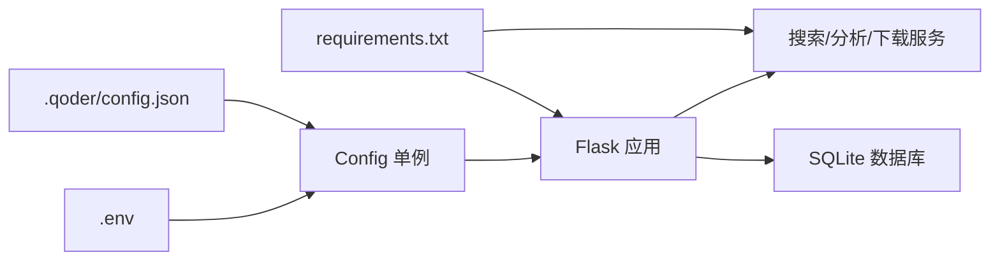

# 配置管理

<cite>
**本文引用的文件**
- [backend/config.py](file://backend/config.py)
- [.env.example](file://.env.example)
- [.env](file://.env)
- [.qoder/config.json](file://.qoder/config.json)
- [backend/app.py](file://backend/app.py)
- [backend/services/rate_limiter.py](file://backend/services/rate_limiter.py)
- [backend/services/search_service.py](file://backend/services/search_service.py)
- [backend/routes/search.py](file://backend/routes/search.py)
- [run.sh](file://run.sh)
- [README.md](file://README.md)
- [backend/models/database.py](file://backend/models/database.py)
- [backend/utils/logger.py](file://backend/utils/logger.py)
- [backend/requirements.txt](file://backend/requirements.txt)
- [frontend/package.json](file://frontend/package.json)
</cite>

## 目录
1. [简介](#简介)
2. [项目结构](#项目结构)
3. [核心组件](#核心组件)
4. [架构总览](#架构总览)
5. [详细组件分析](#详细组件分析)
6. [依赖关系分析](#依赖关系分析)
7. [性能考量](#性能考量)
8. [故障排查指南](#故障排查指南)
9. [结论](#结论)
10. [附录](#附录)

## 简介
本文件系统化阐述 Search Is All You Need 的配置管理体系，覆盖环境变量配置、JSON 运行时配置与默认值的优先级与合并机制；重点说明 LLM 提供商配置、速率限制设置、搜索默认参数、HTTP 代理配置；并提供配置验证、动态更新与安全最佳实践，以及不同部署环境的配置示例、迁移指南与故障排查方法。

## 项目结构
配置相关的关键位置与职责如下：
- 环境变量模板与示例：.env.example、.env
- 运行时 JSON 配置：.qoder/config.json
- 应用配置加载与单例：backend/config.py
- 应用入口与配置使用：backend/app.py
- 业务服务与配置读取：backend/services/search_service.py、backend/services/rate_limiter.py
- 路由层对搜索请求的处理：backend/routes/search.py
- 数据库初始化与配置使用：backend/models/database.py
- 日志与运行脚本：backend/utils/logger.py、run.sh
- 前后端技术栈与构建：README.md、frontend/package.json、backend/requirements.txt

图表来源
- [backend/config.py](file://backend/config.py#L15-L85)
- [backend/app.py](file://backend/app.py#L21-L78)
- [backend/services/search_service.py](file://backend/services/search_service.py#L28-L67)
- [backend/services/rate_limiter.py](file://backend/services/rate_limiter.py#L45-L75)
- [backend/models/database.py](file://backend/models/database.py#L36-L43)
- [backend/routes/search.py](file://backend/routes/search.py#L10-L27)
- [run.sh](file://run.sh#L39-L49)

章节来源
- [README.md](file://README.md#L48-L95)
- [backend/config.py](file://backend/config.py#L15-L85)
- [backend/app.py](file://backend/app.py#L21-L78)

## 核心组件
- 配置加载与合并
  - 环境变量优先于默认值，若未设置则采用硬编码默认。
  - 运行时 JSON 配置（.qoder/config.json）作为“运行时配置”，与环境变量共同注入 Config 单例。
  - 默认值在 Config 类中集中定义，确保未显式配置时系统仍可正常工作。
- LLM 提供商配置
  - 在运行时 JSON 中通过 provider 字段选择 zhipu 或 deepseek，并指定对应模型名称。
- 速率限制配置
  - 从运行时 JSON 的 rate_limits 字段读取，未配置时使用内置默认值。
- 搜索默认参数
  - 从运行时 JSON 的 search_defaults 字段读取，包含每源最大结果数、超时秒数、缓存过期间隔与默认数据源列表。
- HTTP 代理配置
  - 从环境变量 HTTP_PROXY/HTTPS_PROXY 读取，若未设置则为空字符串。
- 数据目录与数据库路径
  - 数据目录与数据库路径由环境变量决定，不存在时自动创建。

章节来源
- [backend/config.py](file://backend/config.py#L15-L85)
- [.qoder/config.json](file://.qoder/config.json#L1-L31)
- [.env.example](file://.env.example#L1-L22)
- [.env](file://.env#L1-L22)

## 架构总览
配置体系的总体流程：
- 启动时加载 .env（若不存在则复制示例模板）。
- 初始化 Config 单例：读取 .env 与 .qoder/config.json，合并为最终配置。
- Flask 应用读取 Config 并注册蓝图。
- 业务服务（如搜索、速率限制）按需读取配置。
- 数据库初始化使用配置中的路径并创建表结构。

图表来源
- [run.sh](file://run.sh#L39-L49)
- [backend/app.py](file://backend/app.py#L21-L78)
- [backend/config.py](file://backend/config.py#L15-L85)
- [backend/services/search_service.py](file://backend/services/search_service.py#L28-L67)
- [backend/models/database.py](file://backend/models/database.py#L36-L43)

## 详细组件分析

### 配置加载与优先级
- 优先级顺序（从高到低）
  1) 环境变量（.env）
  2) 运行时 JSON（.qoder/config.json）
  3) 硬编码默认值（Config 类中定义）
- 合并机制
  - 环境变量与运行时 JSON 分别独立生效，最终形成 Config 实例的属性集合。
  - 对于数组/对象类型的配置（如默认数据源、速率限制、分析设置），以运行时 JSON 为准；若未提供，则回退到 Config 类中的默认值。
- 关键字段说明
  - LLM 提供商：analysis_settings.provider
  - 速率限制：rate_limits
  - 搜索默认：search_defaults
  - 下载设置：download_settings
  - HTTP 代理：HTTP_PROXY/HTTPS_PROXY

图表来源
- [backend/config.py](file://backend/config.py#L15-L85)
- [run.sh](file://run.sh#L39-L49)

章节来源
- [backend/config.py](file://backend/config.py#L15-L85)
- [.qoder/config.json](file://.qoder/config.json#L1-L31)
- [.env.example](file://.env.example#L1-L22)
- [.env](file://.env#L1-L22)

### LLM 提供商配置
- 选择逻辑
  - 在运行时 JSON 的 analysis_settings.provider 中指定："zhipu" 或 "deepseek"。
  - 对应模型名称分别由 analysis_settings.zhipu_model 与 analysis_settings.deepseek_model 指定。
- 使用场景
  - 搜索服务在生成结果分类与摘要时，依据该配置选择对应的 LLM 提供商与模型。
- 安全与变更
  - API 密钥通过环境变量注入，不建议在运行时 JSON 中存放敏感信息。
  - 更改提供商或模型需重启应用以使新配置生效。

章节来源
- [.qoder/config.json](file://.qoder/config.json#L22-L29)
- [backend/services/search_service.py](file://backend/services/search_service.py#L56-L57)

### 速率限制配置
- 配置来源
  - 从运行时 JSON 的 rate_limits 字段读取，键为数据源名（如 arxiv、duckduckgo、zhihu、scholar）。
  - 若未配置某数据源，则不限流（acquire 返回 True）。
- 算法实现
  - 令牌桶算法，线程安全，支持按时间 refill。
  - 默认限流参数在速率限制器类中提供，若未传入配置则使用默认值。
- 生效方式
  - 业务层在发起外部请求前调用 acquire(source)，若返回 False 则阻塞或拒绝请求。

图表来源
- [backend/services/rate_limiter.py](file://backend/services/rate_limiter.py#L5-L75)

章节来源
- [backend/services/rate_limiter.py](file://backend/services/rate_limiter.py#L45-L75)
- [.qoder/config.json](file://.qoder/config.json#L2-L7)

### 搜索默认参数
- 配置项
  - max_results_per_source：每源最大结果数
  - timeout_seconds：请求超时秒数
  - cache_expire_hours：搜索结果缓存过期小时数
  - default_sources：默认启用的数据源列表
- 使用方式
  - 搜索服务在未显式传入 sources/filters 时，使用这些默认值。
  - 缓存键基于查询、数据源与过滤器生成，命中缓存可显著降低延迟与外部请求压力。

章节来源
- [backend/services/search_service.py](file://backend/services/search_service.py#L28-L67)
- [.qoder/config.json](file://.qoder/config.json#L8-L13)

### HTTP 代理配置
- 配置来源
  - 从环境变量 HTTP_PROXY/HTTPS_PROXY 读取，若任一存在则作为全局 HTTP 代理。
- 影响范围
  - 代理配置影响对外部服务（如 DuckDuckGo、Semantic Scholar 等）的请求。
- 注意事项
  - 当前搜索引擎在国内可直接访问，通常无需代理；若确需代理，请确保代理地址与协议正确。

章节来源
- [backend/config.py](file://backend/config.py#L44-L46)
- [.env.example](file://.env.example#L18-L21)
- [.env](file://.env#L19-L22)

### 数据库与目录配置
- 数据库路径
  - 由环境变量 DATABASE_PATH 指定，默认位于 data/search.db。
- 下载目录
  - 由环境变量 DOWNLOAD_DIR 指定，默认位于 data/downloads。
- 目录创建
  - 启动时若目录不存在会自动创建。

章节来源
- [backend/config.py](file://backend/config.py#L35-L48)
- [backend/models/database.py](file://backend/models/database.py#L36-L43)

### 配置验证与动态更新
- 验证建议
  - 启动阶段读取 .env 与 .qoder/config.json，若缺少必要字段（如 LLM API 密钥）应尽早报错。
  - 对数组/对象配置进行基本校验（如 default_sources 必须为非空数组）。
- 动态更新
  - 当前实现为一次性加载，修改 .qoder/config.json 后需重启应用以生效。
  - 建议在生产环境通过配置中心或容器编排工具进行滚动更新，避免中断服务。
- 安全最佳实践
  - 敏感信息（API 密钥）仅放入 .env，不在版本控制中提交。
  - 生产环境使用只读权限的 .env 文件与最小权限的进程账户。
  - 定期轮换 SECRET_KEY、API 密钥与数据库密码。

章节来源
- [backend/config.py](file://backend/config.py#L15-L85)
- [run.sh](file://run.sh#L39-L49)
- [README.md](file://README.md#L340-L345)

## 依赖关系分析
- 配置依赖链
  - run.sh -> .env（创建）-> backend/app.py -> backend/config.py -> 各业务模块
  - .qoder/config.json 与 .env 共同驱动 Config 单例，再被上层应用与服务使用。
- 外部依赖
  - Flask、CORS、LLM SDK、arXiv、requests、BeautifulSoup 等均在 requirements.txt 中声明。

图表来源
- [backend/config.py](file://backend/config.py#L15-L85)
- [backend/app.py](file://backend/app.py#L21-L78)
- [backend/requirements.txt](file://backend/requirements.txt#L1-L11)

章节来源
- [backend/requirements.txt](file://backend/requirements.txt#L1-L11)
- [frontend/package.json](file://frontend/package.json#L1-L24)

## 性能考量
- 速率限制
  - 通过令牌桶算法控制外部 API 的并发与频率，避免触发限流或被封禁。
- 缓存策略
  - 搜索结果与分析结果具备缓存，合理设置 cache_expire_hours 与 analysis_settings.cache_expire_days 可显著降低重复请求。
- 数据源选择
  - 默认数据源列表与每源最大结果数会影响响应时间与 LLM 调用成本，建议根据实际需求调整。
- 数据库与目录
  - 数据库存放在本地磁盘，建议在生产环境挂载高性能存储并开启 WAL 模式以提升并发写入能力。

章节来源
- [backend/services/rate_limiter.py](file://backend/services/rate_limiter.py#L45-L75)
- [backend/services/search_service.py](file://backend/services/search_service.py#L44-L67)
- [backend/models/database.py](file://backend/models/database.py#L11-L21)

## 故障排查指南
- 启动阶段
  - 若 .env 不存在，一键脚本会自动创建 .env；请填写有效的 LLM API 密钥后再启动。
  - Flask 端口与环境变量 FLASK_ENV/FLASK_PORT 需符合预期。
- LLM 相关
  - 若 AI 分析不可用，检查 .qoder/config.json 中 provider 与对应模型是否正确，确认 .env 中 API 密钥有效。
- 代理问题
  - 若访问外部服务失败，检查 HTTP_PROXY/HTTPS_PROXY 是否正确；若无需代理，保持为空。
- 速率限制
  - 若频繁遇到 429 或请求被限流，适当提高 rate_limits 中的 capacity/refill_rate，或减少并发数据源。
- 数据库与目录
  - 若数据库无法创建或写入失败，检查 DATABASE_PATH 与 DOWNLOAD_DIR 的权限与路径是否存在。
- 日志定位
  - 使用统一的日志格式输出错误堆栈，便于定位异常来源。

章节来源
- [run.sh](file://run.sh#L39-L49)
- [backend/utils/logger.py](file://backend/utils/logger.py#L5-L23)
- [README.md](file://README.md#L361-L375)

## 结论
本项目的配置体系以“环境变量 + 运行时 JSON + 默认值”的分层设计实现灵活可控的配置管理。通过明确的优先级与合并机制，结合速率限制、缓存与代理等关键参数，既满足开发调试的便捷性，也兼顾生产环境的安全与稳定性。建议在生产环境中配合配置中心与自动化部署流程，持续优化配置并加强安全审计。

## 附录

### 不同部署环境的配置示例
- 开发环境
  - 复制示例配置并填写 API 密钥与端口，使用默认数据库路径与下载目录。
- 测试/预发布环境
  - 与开发环境类似，但建议使用独立的数据库与较小的并发限制。
- 生产环境
  - 使用只读 .env、最小权限账户与持久化存储；启用 HTTPS 与反向代理；合理设置速率限制与缓存过期时间。

章节来源
- [README.md](file://README.md#L113-L183)
- [.env.example](file://.env.example#L1-L22)
- [.env](file://.env#L1-L22)

### 配置迁移指南
- 从旧版配置迁移到 .qoder/config.json
  - 将原有的硬编码默认值迁移至 search_defaults、rate_limits、download_settings、analysis_settings。
  - 保留 .env 中的敏感信息与环境相关配置。
- 迁移步骤
  - 备份现有 .env 与 .qoder/config.json。
  - 按照新增字段逐项填充，先在测试环境验证。
  - 切换流量并观察日志与指标，确认无异常后完成上线。

章节来源
- [.qoder/config.json](file://.qoder/config.json#L1-L31)
- [backend/config.py](file://backend/config.py#L50-L73)