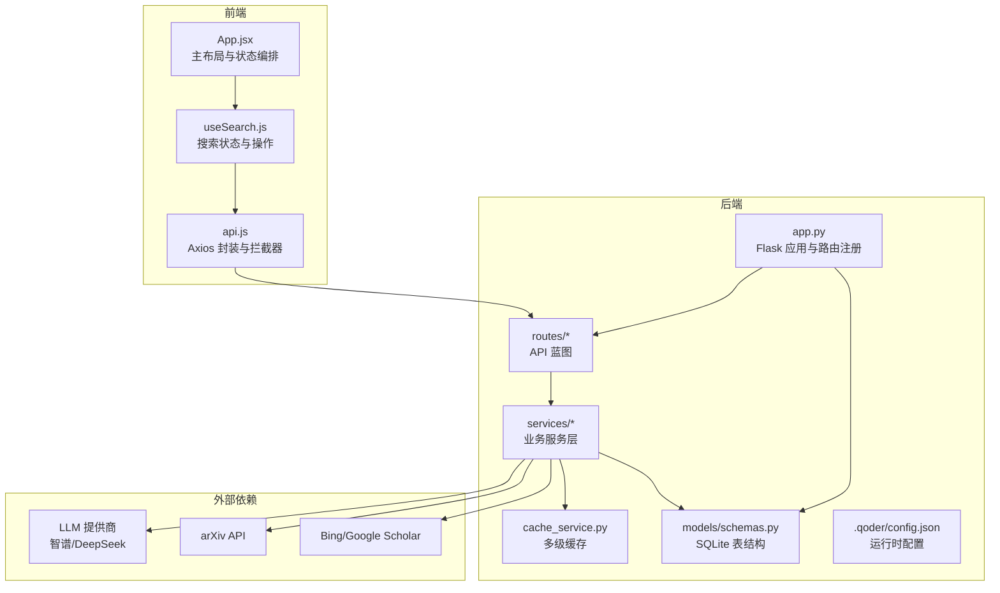
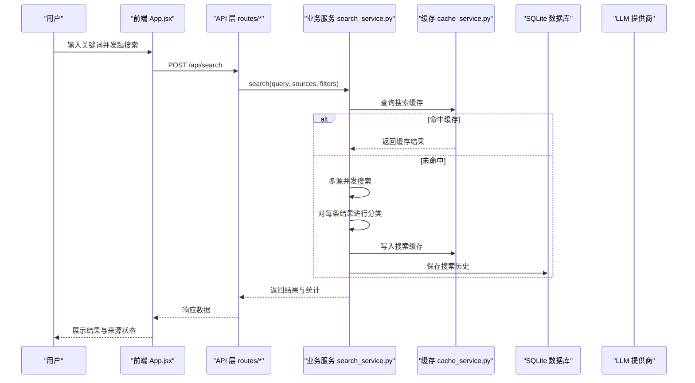
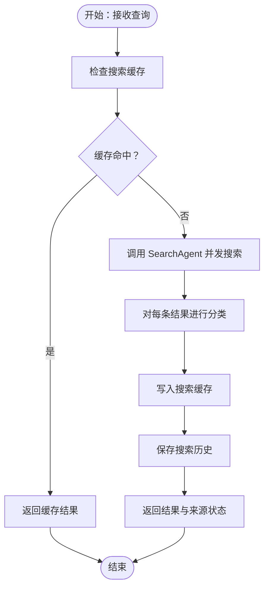
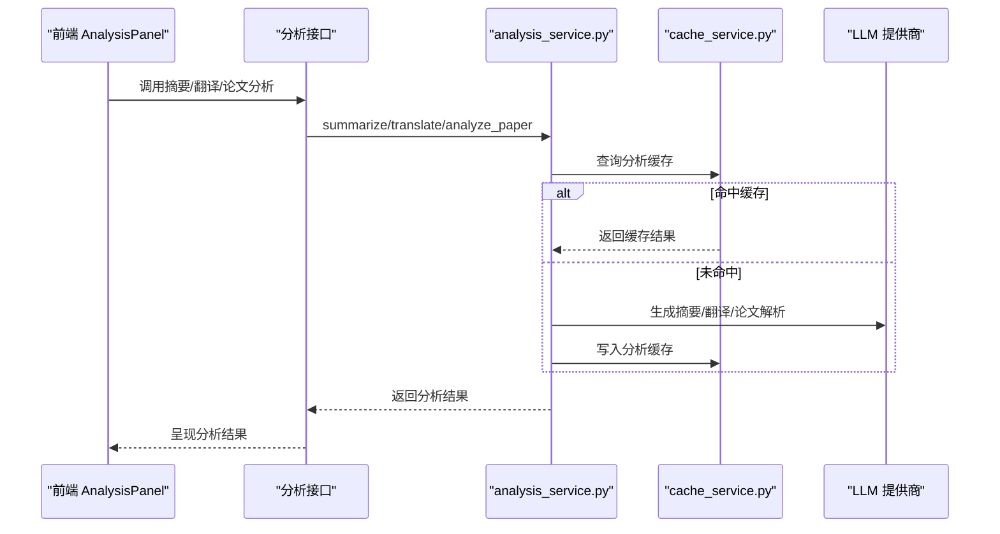
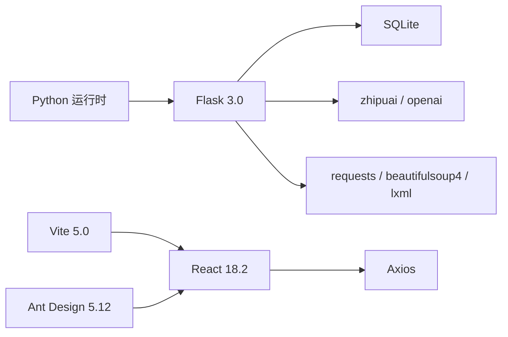

# 项目概述

<cite>
**本文引用的文件**
- [README.md](file://README.md)
- [backend/app.py](file://backend/app.py)
- [backend/config.py](file://backend/config.py)
- [backend/routes/search.py](file://backend/routes/search.py)
- [backend/services/search_service.py](file://backend/services/search_service.py)
- [backend/services/analysis_service.py](file://backend/services/analysis_service.py)
- [backend/services/cache_service.py](file://backend/services/cache_service.py)
- [backend/models/schemas.py](file://backend/models/schemas.py)
- [frontend/src/App.jsx](file://frontend/src/App.jsx)
- [frontend/src/hooks/useSearch.js](file://frontend/src/hooks/useSearch.js)
- [frontend/src/services/api.js](file://frontend/src/services/api.js)
- [.qoder/config.json](file://.qoder/config.json)
- [run.sh](file://run.sh)
- [backend/requirements.txt](file://backend/requirements.txt)
- [frontend/package.json](file://frontend/package.json)
</cite>

## 目录
1. [简介](#简介)
2. [项目结构](#项目结构)
3. [核心组件](#核心组件)
4. [架构总览](#架构总览)
5. [详细组件分析](#详细组件分析)
6. [依赖关系分析](#依赖关系分析)
7. [性能考量](#性能考量)
8. [故障排查指南](#故障排查指南)
9. [结论](#结论)
10. [附录](#附录)

## 简介
“Search Is All You Need” 是一个全栈 Web 应用，旨在为用户提供一站式的内容检索与智能分析体验。项目通过多源聚合搜索、智能内容分类、AI 内容分析以及 PDF 下载管理等能力，帮助用户高效发现、理解与整理信息。

- 核心目标
  - 在统一界面中完成跨源检索、智能分类、AI 分析与下载管理。
  - 降低信息获取与理解成本，提升研究与学习效率。
- 主要功能特性
  - 多源聚合搜索：同时从 arXiv、Bing（DuckDuckGo）、Semantic Scholar（Google Scholar）、知乎等数据源检索内容。
  - 智能内容分类：自动识别结果类型（学术论文、博客、问答、论坛、网页）。
  - AI 内容分析：基于大语言模型生成摘要、提取关键点、翻译内容；对学术论文进行深度解析。
  - PDF 下载管理：支持 arXiv 论文 PDF 下载，并提供国内镜像加速与进度展示。
  - 搜索历史记录：保存搜索记录，支持快速回溯与清空。
- 用户体验价值
  - 一体化工作流：从搜索到分析再到下载，减少切换成本。
  - 本地化优化：多级缓存与速率限制保障稳定与性能；代理与镜像适配国内网络。
  - 可扩展性：支持多家 LLM 提供商（智谱 AI / DeepSeek），便于按需切换与扩展。

**章节来源**
- file://README.md#L5-L23

## 项目结构
项目采用前后端分离架构，后端使用 Flask 提供 RESTful API 并托管静态资源，前端使用 React + Vite 构建单页应用（SPA）。配置与运行参数通过 .env 与 .qoder/config.json 管理，数据库采用 SQLite（WAL 模式）。

**图表来源**
- [backend/app.py](file://backend/app.py#L21-L67)
- [backend/routes/search.py](file://backend/routes/search.py#L10-L27)
- [backend/services/search_service.py](file://backend/services/search_service.py#L28-L67)
- [backend/services/cache_service.py](file://backend/services/cache_service.py#L30-L86)
- [backend/models/schemas.py](file://backend/models/schemas.py#L1-L37)
- [frontend/src/App.jsx](file://frontend/src/App.jsx#L16-L146)
- [frontend/src/hooks/useSearch.js](file://frontend/src/hooks/useSearch.js#L19-L50)
- [frontend/src/services/api.js](file://frontend/src/services/api.js#L4-L29)
- [.qoder/config.json](file://.qoder/config.json#L1-L31)

**章节来源**
- file://README.md#L376-L404
- file://backend/app.py#L21-L67
- file://frontend/src/App.jsx#L16-L146

## 核心组件
- 后端应用与路由
  - Flask 应用负责注册蓝图、CORS 配置、静态资源托管与全局错误处理。
  - API 蓝图包括搜索、分析、下载、历史等模块，职责清晰。
- 业务服务层
  - 搜索服务：多源并发搜索、结果分类、缓存与历史持久化。
  - 分析服务：摘要、翻译、论文解析，均带缓存与错误处理。
  - 缓存服务：搜索与分析两级缓存，支持过期清理。
- 前端组件与状态
  - 主布局整合搜索栏、结果列表、筛选面板、分析抽屉、下载管理器与历史面板。
  - 自定义 Hooks 管理搜索、分析、下载的状态与交互。
- 配置与运行
  - .env 管理密钥、端口、数据库与下载目录；.qoder/config.json 管理速率限制、搜索默认值、下载设置与分析设置。
  - 一键启动脚本自动创建虚拟环境、安装依赖、构建前端并启动后端。

**章节来源**
- file://backend/app.py#L21-L67
- file://backend/routes/search.py#L10-L27
- file://backend/services/search_service.py#L28-L67
- file://backend/services/analysis_service.py#L25-L90
- file://backend/services/cache_service.py#L30-L86
- file://frontend/src/App.jsx#L16-L146
- file://frontend/src/hooks/useSearch.js#L6-L72
- file://.qoder/config.json#L1-L31
- file://run.sh#L9-L49

## 架构总览
系统采用前后端分离设计，后端提供 RESTful API，前端通过 Axios 发起请求。搜索流程包含多源并发、结果分类、缓存命中与历史记录；分析流程通过 AI 代理生成摘要、翻译与论文解析；下载流程支持 arXiv 的镜像加速与后台任务管理。

**图表来源**
- [backend/routes/search.py](file://backend/routes/search.py#L10-L27)
- [backend/services/search_service.py](file://backend/services/search_service.py#L28-L67)
- [backend/services/cache_service.py](file://backend/services/cache_service.py#L30-L52)
- [backend/models/schemas.py](file://backend/models/schemas.py#L1-L37)
- [frontend/src/App.jsx](file://frontend/src/App.jsx#L16-L146)

## 详细组件分析

### 多源聚合搜索
- 流程要点
  - 前端通过 useSearch.js 发送查询，后端 routes/search.py 接收并调用 search_service.search。
  - 服务层先检查搜索缓存，未命中则调用 SearchAgent 执行多源并发搜索，并对每条结果进行智能分类。
  - 最终写入缓存并保存搜索历史，返回结果与各数据源状态。
- 关键实现位置
  - 搜索路由与参数校验：[backend/routes/search.py](file://backend/routes/search.py#L10-L27)
  - 搜索服务与缓存/历史逻辑：[backend/services/search_service.py](file://backend/services/search_service.py#L28-L67)
  - 搜索缓存键与过期策略：[backend/services/cache_service.py](file://backend/services/cache_service.py#L16-L52)
  - 历史表结构：[backend/models/schemas.py](file://backend/models/schemas.py#L1-L8)

**图表来源**
- [backend/services/search_service.py](file://backend/services/search_service.py#L28-L67)
- [backend/services/cache_service.py](file://backend/services/cache_service.py#L30-L52)
- [backend/models/schemas.py](file://backend/models/schemas.py#L1-L8)

**章节来源**
- file://backend/routes/search.py#L10-L27
- file://backend/services/search_service.py#L28-L67
- file://backend/services/cache_service.py#L30-L52
- file://backend/models/schemas.py#L1-L8

### 智能内容分类
- 分类依据
  - 基于结果 URL 与来源字段，由 classification_service.classify 进行类型判定（学术论文、博客、问答、论坛、网页）。
- 前端展示
  - 结果卡片带有来源标签与类别标识，筛选面板支持按类别过滤。
- 关键实现位置
  - 分类调用点：[backend/services/search_service.py](file://backend/services/search_service.py#L55-L58)
  - 前端过滤与计数：[frontend/src/App.jsx](file://frontend/src/App.jsx#L59-L73)

**章节来源**
- file://backend/services/search_service.py#L55-L58
- file://frontend/src/App.jsx#L59-L73

### AI 内容分析
- 功能范围
  - 摘要生成、关键点提取、内容翻译、学术论文解析。
- 缓存与提供商
  - 分析结果按内容哈希与类型缓存，支持 7 天过期；可在 .qoder/config.json 中选择提供商与模型。
- 关键实现位置
  - 摘要/翻译/论文分析入口与缓存：[backend/services/analysis_service.py](file://backend/services/analysis_service.py#L25-L90)
  - 分析缓存键与过期清理：[backend/services/cache_service.py](file://backend/services/cache_service.py#L57-L86)
  - LLM 配置与模型选择：[backend/config.py](file://backend/config.py#L67-L73), [.qoder/config.json](file://.qoder/config.json#L22-L28)

**图表来源**
- [backend/services/analysis_service.py](file://backend/services/analysis_service.py#L25-L90)
- [backend/services/cache_service.py](file://backend/services/cache_service.py#L57-L86)

**章节来源**
- file://backend/services/analysis_service.py#L25-L90
- file://backend/services/cache_service.py#L57-L86
- file://backend/config.py#L67-L73
- file://.qoder/config.json#L22-L28

### PDF 下载管理
- 功能特性
  - arXiv 论文 PDF 下载，支持国内镜像加速与后台任务管理；完成后可直接打开文件。
- 关键实现位置
  - 下载相关接口与历史查询：[backend/routes/download.py](file://backend/routes/download.py#L1-L200)（接口定义参考 README）
  - 下载设置与镜像配置：[backend/config.py](file://backend/config.py#L61-L65), [.qoder/config.json](file://.qoder/config.json#L14-L21)
  - 前端下载管理器与消息提示：[frontend/src/App.jsx](file://frontend/src/App.jsx#L52-L57)

**章节来源**
- file://README.md#L206-L214
- file://backend/config.py#L61-L65
- file://.qoder/config.json#L14-L21
- file://frontend/src/App.jsx#L52-L57

### 搜索历史记录
- 功能特性
  - 保存每次搜索的关键词、过滤条件与结果数量；支持查看与清空。
- 关键实现位置
  - 历史保存与查询：[backend/services/search_service.py](file://backend/services/search_service.py#L70-L90)
  - 历史表结构：[backend/models/schemas.py](file://backend/models/schemas.py#L2-L8)
  - 前端历史面板与回放：[frontend/src/App.jsx](file://frontend/src/App.jsx#L141-L145)

**章节来源**
- file://backend/services/search_service.py#L70-L90
- file://backend/models/schemas.py#L2-L8
- file://frontend/src/App.jsx#L141-L145

## 依赖关系分析
- 技术栈概览
  - 后端：Python 3.8+, Flask 3.0, SQLite, zhipuai, openai(arXiv/DeepSeek 兼容), arxiv, requests, beautifulsoup4, lxml, python-dotenv。
  - 前端：React 18.2, Vite 5.0, Ant Design 5.12, Axios 1.6, Day.js 1.11。
- 运行时依赖
  - 一键启动脚本自动创建虚拟环境、安装后端依赖、构建前端并启动后端。
- 关键依赖文件
  - 后端依赖清单：[backend/requirements.txt](file://backend/requirements.txt#L1-L11)
  - 前端依赖清单：[frontend/package.json](file://frontend/package.json#L11-L22)
  - 一键启动脚本：[run.sh](file://run.sh#L9-L49)

**图表来源**
- [backend/requirements.txt](file://backend/requirements.txt#L1-L11)
- [frontend/package.json](file://frontend/package.json#L11-L22)
- [run.sh](file://run.sh#L9-L49)

**章节来源**
- file://README.md#L24-L47
- file://backend/requirements.txt#L1-L11
- file://frontend/package.json#L11-L22
- file://run.sh#L9-L49

## 性能考量
- 多级缓存策略
  - 搜索缓存：按查询参数哈希缓存，支持按小时过期，显著降低重复请求与外部 API 压力。
  - 分析缓存：按内容哈希与类型缓存，支持 7 天过期，避免重复调用 LLM。
- 速率限制
  - 基于令牌桶算法的速率限制配置，针对不同数据源设定容量与补充速率，防止滥用与触发外部限流。
- 并发与超时
  - 多源并发搜索与合理的请求超时设置，结合前端加载状态与错误提示，提升响应体验。
- 存储与索引
  - SQLite 使用 WAL 模式，配合索引提升查询性能；缓存清理定期执行，保持数据库健康。

**章节来源**
- file://backend/services/cache_service.py#L30-L86
- file://.qoder/config.json#L2-L7
- file://README.md#L355-L359

## 故障排查指南
- 常见问题
  - 搜索返回空结果：arXiv 仅支持英文搜索；Semantic Scholar API 有速率限制，系统会自动重试；查看后端日志定位具体错误。
  - AI 分析功能不可用：确认已配置有效的 API 密钥；检查 .qoder/config.json 中 provider 设置。
  - PDF 下载失败：arXiv 服务器可能临时不可用；系统会自动尝试国内镜像。
- 错误处理
  - 后端全局异常捕获统一返回 500；前端 Axios 拦截器根据状态码提示用户（如 429、400、5xx）。
- 日志与监控
  - 后端使用统一日志器输出错误堆栈，便于定位问题。

**章节来源**
- file://README.md#L361-L375
- file://backend/app.py#L62-L65
- file://frontend/src/services/api.js#L10-L29

## 结论
“Search Is All You Need” 通过多源聚合搜索、智能分类、AI 分析与 PDF 下载管理，构建了从发现到理解再到落地的一体化信息工作流。其前后端分离、多级缓存与速率限制等架构设计，兼顾了易用性与性能稳定性。对于初学者，项目提供了清晰的使用教程与一键部署方案；对于开发者，其模块化设计与可扩展的配置体系便于二次开发与定制。

## 附录
- 快速开始
  - 一键启动：克隆仓库、复制并编辑 .env、运行 run.sh。
  - 手动安装：后端创建虚拟环境并安装依赖，前端安装并构建。
- API 接口
  - 搜索接口：POST /api/search
  - 分析接口：摘要、翻译、论文分析
  - 下载接口：arXiv 下载、状态查询、文件获取、下载历史
  - 历史接口：获取与清空历史
- 配置项
  - 速率限制、搜索默认值、下载设置、分析设置均可在 .qoder/config.json 中调整。

**章节来源**
- file://README.md#L113-L183
- file://README.md#L229-L274
- file://.qoder/config.json#L1-L31